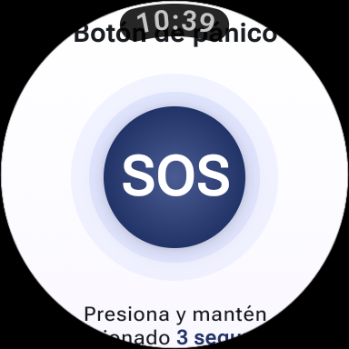
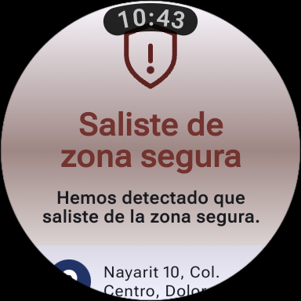

# SafeCare Wear OS

## Nombre del estudiante

Isaac Cano Hernández
Luis Manuel Ramírez Ramírez

## Grupo

GIDS6093-E

## Objetivo

Desarrollar una aplicación para dispositivos Wear OS orientada al monitoreo y seguridad de menores de edad y adultos mayores. El smartwatch permite obtener y registrar la ubicación de la persona monitoreada, detectar la salida de zonas seguras y enviar alertas ante situaciones de emergencia, facilitando una atención rápida por parte del cuidador.

## Funcionalidades

* Consulta y actualización periódica de la ubicación del usuario desde el smartwatch.
* Registro local de ubicaciones, estados y eventos de seguridad.
* Botón de pánico SOS mediante pulsación prolongada.
* Generación de alertas de emergencia desde el reloj.
* Configuración y monitoreo de zonas seguras mediante geocercas.
* Alerta al detectar que el usuario sale de una zona segura.
* Vibración y pantalla de alerta ante eventos importantes.
* Visualización del estado de conexión y batería del dispositivo.
* Servicio de ubicación en segundo plano para mantener el monitoreo activo.
* Monitoreo periódico del estado del dispositivo mediante WorkManager.

## Tecnologías utilizadas

* Kotlin.
* Android Studio.
* Wear OS.
* Jetpack Compose para Wear OS.
* Material 3 para Wear OS.
* Google Play Services Location.
* Geofencing API.
* Room Database.
* WorkManager.
* Servicios en primer plano para ubicación.
* Gradle con Kotlin DSL.
* Git y GitHub para control de versiones.

## Instrucciones de ejecución

1. Clonar el repositorio:

   ```bash
   git clone https://github.com/IsaacCanoH/SafeCare.git
   ```

2. Abrir el proyecto en Android Studio.

3. Esperar a que Gradle sincronice y descargue las dependencias necesarias.

4. Seleccionar el módulo `wearable`.

5. Iniciar un emulador Wear OS o conectar un dispositivo físico compatible.

6. Ejecutar la aplicación desde Android Studio usando la opción **Run**.

7. Al iniciar la aplicación, aceptar los permisos solicitados para ubicación, ubicación en segundo plano y notificaciones.

8. Para probar las zonas seguras, configurar una ubicación dentro y otra fuera del radio definido en el emulador Wear OS. Al salir de la zona segura, la aplicación debe generar una alerta y vibrar.

## Capturas de pantalla

<!-- Agregar aquí las capturas de la pantalla principal, botón SOS, alerta de zona segura, ubicación y ejecución en el emulador Wear OS. -->
### Pantalla principal botón SOS 



### Alerta al salir de zona segura


