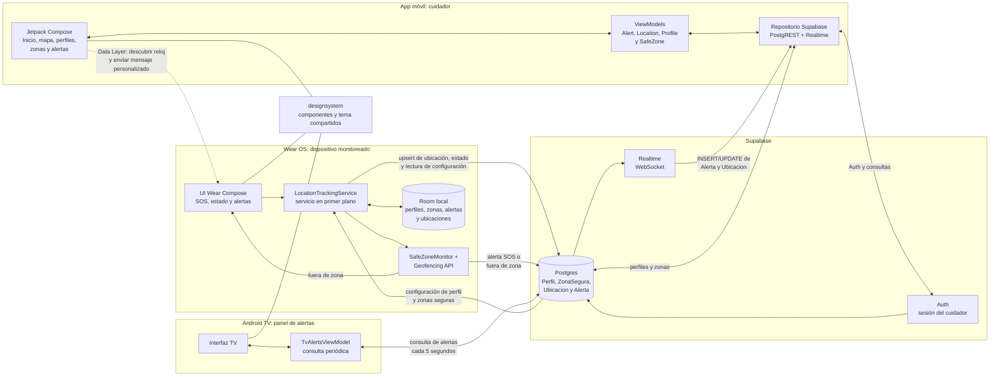

# SafeCare Wear OS

## Nombre del estudiante

- Isaac Cano Hernández
- Luis Manuel Ramírez Ramírez

## Grupo

GIDS6093-E

## Objetivo

Desarrollar una aplicación para dispositivos Wear OS orientada al monitoreo y seguridad de menores de edad y adultos mayores. El smartwatch permite obtener y registrar la ubicación de la persona monitoreada, detectar la salida de zonas seguras y enviar alertas ante situaciones de emergencia, facilitando una atención rápida por parte del cuidador.

## Funcionalidades

* Consulta y actualización periódica de la ubicación del usuario desde el smartwatch.
* Registro local de ubicaciones, estados y eventos de seguridad.
* Botón de pánico SOS mediante pulsación prolongada.
* Generación de alertas de emergencia desde el reloj.
* Configuración y monitoreo de zonas seguras mediante geocercas.
* Alerta al detectar que el usuario sale de una zona segura.
* Vibración y pantalla de alerta ante eventos importantes.
* Visualización del estado de conexión y batería del dispositivo.
* Servicio de ubicación en segundo plano para mantener el monitoreo activo.
* Monitoreo periódico del estado del dispositivo mediante WorkManager.

## Persona beneficiaria y validación del problema

La aplicación fue planteada con la retroalimentación de Laura Patricia Rangel Romero, quien se desempeña como *Enfermera General - Particular en Instituto de salud pública del estado de Guanajuato .

Por su experiencia con menores de edad, adultos mayores, familias, cuidadores, identificó la necesidad de cuidar completamente a personas. Esta situación puede dificultar la supervisión, la atención oportuna ante una emergencia, el seguimiento de ubicación.

SafeCare responde a esa necesidad mediante un smartwatch para la persona monitoreada, una aplicación móvil para el cuidador y un panel de TV para visualizar perfiles y alertas. Las funciones de ubicación, botón SOS, zonas seguras y notificaciones fueron consideradas pertinentes por la persona beneficiaria para apoyar el cuidado completo de las personas y mantenerse al tanto en el lugar que este, sin depender que se encuestre vigilandolas fisicamente todo el tiempo.

## Arquitectura del proyecto

SafeCare está formado por tres aplicaciones Android y un módulo visual compartido. Supabase es la fuente de verdad: el reloj registra ubicaciones y alertas directamente, mientras que el móvil las recibe en tiempo real y la TV las consulta para mostrarlas en pantalla.


```mermaid
flowchart LR
    subgraph Wear["Wear OS: dispositivo monitoreado"]
        WUI["UI Wear Compose\nSOS, estado y alertas"]
        LOC["LocationTrackingService\nservicio en primer plano"]
        GEOFENCE["SafeZoneMonitor +\nGeofencing API"]
        WROOM[("Room local\nperfiles, zonas, alertas\ny ubicaciones")]
        WUI --> LOC
        LOC --> GEOFENCE
        LOC <--> WROOM
        GEOFENCE -->|"fuera de zona"| WUI
    end

    subgraph Cloud["Supabase"]
        AUTH["Auth\nsesión del cuidador"]
        DB[("Postgres\nPerfil, ZonaSegura,\nUbicacion y Alerta")]
        RT["Realtime\nWebSocket"]
        AUTH --> DB
        DB --> RT
    end

    subgraph Mobile["App móvil: cuidador"]
        MUI["Jetpack Compose\nInicio, mapa, perfiles,\nzonas y alertas"]
        MVM["ViewModels\nAlert, Location, Profile\ny SafeZone"]
        MREPO["Repositorio Supabase\nPostgREST + Realtime"]
        MUI <--> MVM
        MVM <--> MREPO
    end

    subgraph TV["Android TV: panel de alertas"]
        TVUI["Interfaz TV"]
        TVVM["TvAlertsViewModel\nconsulta periódica"]
        TVUI <--> TVVM
    end

    DS["designsystem\ncomponentes y tema compartidos"]

    LOC -->|"upsert de ubicación, estado\ny lectura de configuración"| DB
    GEOFENCE -->|"alerta SOS o\nfuera de zona"| DB
    DB -->|"configuración de perfil\ny zonas seguras"| LOC

    MREPO <-->|"Auth y consultas"| AUTH
    MREPO <-->|"perfiles y zonas"| DB
    RT -->|"INSERT/UPDATE de\nAlerta y Ubicacion"| MREPO
    TVVM <-->|"consulta de alertas\ncada 5 segundos"| DB

    MUI --- DS
    WUI --- DS
    TVUI --- DS

    MUI -.->|"Data Layer: descubrir reloj\ny enviar mensaje personalizado"| WUI
```

### Flujos principales

1. **Monitoreo:** el servicio del reloj obtiene la ubicación, la guarda como respaldo local y la registra directamente en Supabase. También descarga desde Supabase el perfil vinculado y sus zonas seguras.
2. **Detección de riesgo:** `SafeZoneMonitor` y las geocercas validan la posición. Al detectar una salida de zona, o al pulsar SOS, el reloj guarda la alerta localmente y la publica en Supabase.
3. **Actualización del móvil:** los `ViewModel` del móvil están suscritos a Supabase Realtime para las tablas `Alerta` y `Ubicacion`; por ello actualizan la interfaz sin depender del puente con el reloj.
4. **Visualización en TV:** la TV consulta las alertas de Supabase cada cinco segundos y prioriza las alertas SOS.
5. **Data Layer:** se usa únicamente para descubrir/vincular el reloj y para mensajes personalizados enviados desde el móvil; no transporta ubicaciones ni alertas de monitoreo.

## Guía de revisión del código

Esta sección funciona como un índice funcional del proyecto: permite localizar rápidamente qué responsabilidad tiene cada archivo sin duplicar el código fuente dentro del README. Las rutas son relativas a cada módulo. Se incluyen todos los archivos de producción y configuración de los módulos **app**, **wearable** y **tv**; los íconos, recursos equivalentes por densidad y pruebas de plantilla se agrupan para conservar una lectura limpia.

**Ruta recomendada de revisión:** empezar por la actividad de entrada, continuar con la pantalla o controlador principal, después con sus <code>ViewModel</code> o servicios, y finalmente con el repositorio y los modelos que acceden a Supabase o Room.

<details open>
<summary><strong>1. Módulo móvil — <code>app</code> (aplicación del cuidador)</strong></summary>

**Flujo central:** <code>MainActivity</code> inicia <code>SafeCareApp</code>; esta coordina las pantallas y los <code>ViewModel</code>. Los <code>ViewModel</code> solicitan o reciben cambios desde <code>SupabaseRepository</code>, que concentra el acceso a Supabase. El mapa, las alertas, perfiles y zonas se actualizan desde ese estado.

| Archivo o grupo | Responsabilidad |
| --- | --- |
| <code>build.gradle.kts</code> | Configura el APK móvil, Compose y las dependencias de Supabase, OsmDroid y Wearable Data Layer. Lee las credenciales de Supabase desde <code>local.properties</code> y las expone de forma controlada en <code>BuildConfig</code>. |
| <code>proguard-rules.pro</code> | Contiene las reglas de ofuscación para una compilación de publicación. |
| <code>src/main/AndroidManifest.xml</code> | Declara la aplicación, la actividad de inicio, permisos de Internet, red y ubicación, además de reglas de respaldo. |
| <code>MainActivity.kt</code> | Punto de entrada Android; coloca la interfaz Compose <code>SafeCareApp</code> en pantalla. |
| <code>ui/screens/SafeCareApp.kt</code> | Raíz de navegación y composición. Crea los <code>ViewModel</code>, conserva la pantalla seleccionada, carga datos al autenticar, inicia actualizaciones en tiempo real y conecta el menú inferior con cada pantalla. |
| <code>data/remote/SupabaseClient.kt</code> | Crea el cliente único de Supabase con autenticación, PostgREST y Realtime. |
| <code>data/repository/SupabaseRepository.kt</code> | Capa de datos del móvil. Registra ubicaciones, alertas y usuarios; crea, edita y elimina perfiles y zonas; consulta perfiles, zonas, alertas, reloj y última ubicación del cuidador autenticado. También traduce las columnas de Supabase a modelos Kotlin. |
| <code>data/local/entity/Entities.kt</code> | Define los modelos usados por el móvil para perfiles monitoreados, zonas, relojes, alertas, ubicación y la unión alerta-perfil. Son el contrato de datos entre repositorio, <code>ViewModel</code> y UI. |
| <code>data/local/entity/UsuarioEntity.kt</code> | Representa el perfil del cuidador que se guarda en la tabla de usuarios después del registro en Supabase Auth. |
| <code>data/datalayer/WearDataLayerRepository.kt</code> | Descubre relojes cercanos y envía solicitudes de vinculación, sincronización de zonas, desvinculación y alerta personalizada mediante la Wearable Data Layer. |
| <code>data/datalayer/MobileDataLayerService.kt</code> | Listener para elementos de datos recibidos del reloj. Interpreta estados, ubicaciones y alertas y los reenvía al repositorio cuando se usa ese canal de respaldo. |
| <code>ui/viewmodel/AuthViewModel.kt</code> | Mantiene los estados de inicio de sesión y registro. Autentica con correo/contraseña, crea el usuario de dominio y devuelve mensajes de error comprensibles a la UI. |
| <code>ui/viewmodel/ProfileViewModel.kt</code> | Expone la lista de perfiles y coordina sus operaciones de alta, edición, consulta y eliminación con el repositorio. |
| <code>ui/viewmodel/SafeZoneViewModel.kt</code> | Mantiene las zonas seguras del cuidador, permite crearlas, editarlas, activar/desactivar su monitoreo y eliminarlas. |
| <code>ui/viewmodel/AlertViewModel.kt</code> | Consulta alertas, las relaciona con el nombre del perfil y se suscribe a inserciones y cambios de <code>Alerta</code> mediante Supabase Realtime. |
| <code>ui/viewmodel/LocationViewModel.kt</code> | Obtiene las últimas ubicaciones de los perfiles y escucha los cambios de <code>Ubicacion</code> en tiempo real para alimentar el mapa. |
| <code>ui/components/OsmMapView.kt</code> | Adaptador Compose para OsmDroid. Inicializa el mapa y ofrece utilidades para colocar marcadores y dibujar el radio de una zona segura. |
| <code>ui/screens/dashboard/DashboardScreen.kt</code> | Presenta el resumen de personas monitoreadas y sus indicadores; desde aquí se abre el detalle en el mapa o se agrega un perfil. |
| <code>ui/screens/map/LiveMapScreen.kt</code> | Muestra el mapa en vivo, el perfil elegido, su última ubicación, las zonas seguras y las alertas asociadas. |
| <code>ui/screens/alerts/AlertsScreen.kt</code> | Lista las alertas recibidas y genera el título y mensaje legible según el tipo de evento. |
| <code>ui/screens/login/LoginScreen.kt</code> y <code>ui/screens/register/RegisterScreen.kt</code> | Formularios Compose para autenticar al cuidador y crear una cuenta. Reciben estado y acciones desde <code>AuthViewModel</code>. |
| <code>ui/screens/profile/ProfilesScreen.kt</code>, <code>AddProfileScreen.kt</code> y <code>EditProfileScreen.kt</code> | Consulta, alta y edición de perfiles monitoreados, incluida la vinculación de un reloj cuando corresponde. |
| <code>ui/screens/zone/SafeZonesScreen.kt</code>, <code>CreateSafeZoneScreen.kt</code> y <code>EditSafeZoneScreen.kt</code> | Lista y administra zonas seguras: nombre, perfil asociado, coordenadas, radio y estado activo. |
| <code>ui/theme/Color.kt</code>, <code>Theme.kt</code> y <code>Type.kt</code> | Paleta, tipografía y tema Compose propios del módulo móvil. |
| <code>util/SecurityUtils.kt</code> | Centraliza el cálculo del hash de contraseña que se conserva en el registro de usuario de dominio. |
| <code>src/main/res/values/{colors,strings,themes}.xml</code> | Recursos de texto, color y tema de Android. |
| <code>src/main/res/drawable/*</code>, <code>mipmap-*/ic_launcher*</code> y <code>mipmap-anydpi/*.xml</code> | Capas vectoriales e íconos adaptativos del lanzador en sus distintas densidades. |
| <code>src/main/res/xml/backup_rules.xml</code> y <code>data_extraction_rules.xml</code> | Política de respaldo y extracción de datos para Android. |
| <code>src/test/.../ExampleUnitTest.kt</code> y <code>src/androidTest/.../ExampleInstrumentedTest.kt</code> | Plantillas de prueba unitaria local e instrumentada del módulo. |

</details>

<details>
<summary><strong>2. Módulo Wear OS — <code>wearable</code> (dispositivo monitoreado)</strong></summary>

**Flujo central:** <code>presentation/MainActivity</code> solicita permisos, programa el trabajo periódico y enciende <code>LocationTrackingService</code>. El servicio toma GPS y estado del reloj, guarda un respaldo en Room, sincroniza con Supabase y actualiza las geocercas. Un SOS o una salida de zona crea una alerta local y remota.

| Archivo o grupo | Responsabilidad |
| --- | --- |
| <code>build.gradle.kts</code> | Configura la app Wear OS, Compose, Room con KSP, ubicación, geocercas, WorkManager, Supabase y la Wearable Data Layer. Obtiene credenciales de <code>local.properties</code>. |
| <code>proguard-rules.pro</code> y <code>lint.xml</code> | Definen reglas de publicación y ajustes de análisis estático del módulo. |
| <code>src/main/AndroidManifest.xml</code> | Declara el dispositivo como reloj, permisos de ubicación, segundo plano, red, vibración y notificaciones; registra el servicio de ubicación, receptor de geocercas, listener de Data Layer y actividades. |
| <code>presentation/MainActivity.kt</code> | Punto de entrada del reloj. Gestiona permisos, programa <code>StatusWorker</code> cada 15 minutos, inicia el seguimiento y registra las geocercas guardadas en Room. |
| <code>presentation/AlertActivity.kt</code> | Actividad que muestra una alerta importante sobre la pantalla bloqueada cuando llega una alerta personalizada o de seguridad. |
| <code>presentation/ui/WearHomeScreen.kt</code> | Interfaz principal del reloj: botón SOS por pulsación prolongada e indicadores de ubicación, batería, red y permisos. |
| <code>presentation/ui/WearAlertScreen.kt</code> | Composición visual de una alerta recibida, con tipo, mensaje, detalle y acción para cerrarla. |
| <code>presentation/ui/WearHomeUiState.kt</code> | Modelo inmutable del estado que consume la pantalla principal. |
| <code>presentation/theme/Theme.kt</code> | Aplica el tema Compose del reloj y el tema compartido de SafeCare. |
| <code>presentation/controller/WearStatusController.kt</code> | Orquesta el SOS y la información mostrada. Lee batería, conectividad y ubicación; persiste reloj, ubicación y alerta en Room y las sincroniza con Supabase cuando hay red. |
| <code>presentation/location/LocationTrackingService.kt</code> | Servicio en primer plano y núcleo del monitoreo. Valida lecturas GPS, conserva un historial local acotado, evalúa zonas, actualiza batería/conexión y sincroniza periódicamente el perfil y sus zonas desde Supabase. |
| <code>presentation/location/WearLocationReader.kt</code> | Solicita una ubicación puntual del reloj para acciones como SOS o actualización manual. |
| <code>presentation/location/LocationPermissionManager.kt</code> | Centraliza las comprobaciones y arreglos de permisos de ubicación precisa, segundo plano y geocercas. |
| <code>presentation/sensors/DeviceStatusReader.kt</code> y <code>presentation/data/DeviceStatus.kt</code> | Obtienen batería y conectividad del reloj y las presentan como un objeto de estado listo para la UI. |
| <code>presentation/geofence/GeofenceManager.kt</code> | Convierte zonas activas en geocercas circulares de Google Play Services; reemplaza las anteriores y registra entrada/salida. |
| <code>presentation/geofence/GeofenceBroadcastReceiver.kt</code> | Recibe transiciones de geocerca, identifica la salida relevante y activa la creación de alerta de seguridad. |
| <code>presentation/geofence/SafeZoneMonitor.kt</code> | Verificación complementaria basada en cada coordenada recibida. Guarda el estado dentro/fuera por zona para no repetir alertas al permanecer fuera. |
| <code>presentation/geofence/SafeCareAlertNotifier.kt</code> | Construye la notificación de alta prioridad, vibra y abre <code>AlertActivity</code> para avisar el evento. |
| <code>data/worker/StatusWorker.kt</code> | Trabajo de WorkManager de respaldo. En cada ejecución reporta batería, conectividad y una ubicación puntual a Supabase si el reloj está en línea. |
| <code>data/remote/SupabaseClient.kt</code> | Cliente singleton de Supabase para el reloj. |
| <code>data/repository/SupabaseRepository.kt</code> | Encapsula el envío de ubicación, alerta y estado del smartwatch; además obtiene el perfil vinculado y sus zonas para mantener configurado al reloj. |
| <code>data/local/database/DatabaseProvider.kt</code> y <code>SafeCareDatabase.kt</code> | Crean y describen la instancia Room con sus entidades y DAOs; son el respaldo local ante conectividad intermitente. |
| <code>data/local/dao/AlertaDao.kt</code>, <code>PerfilMonitoreadoDao.kt</code>, <code>SmartwatchDao.kt</code>, <code>UbicacionDao.kt</code> y <code>ZonaSeguraDao.kt</code> | Contratos SQL de Room para insertar, consultar, actualizar, depurar registros antiguos y administrar el perfil y las zonas activas. |
| <code>data/local/entity/AlertaEntity.kt</code>, <code>PerfilMonitoreadoEntity.kt</code>, <code>SmartwatchEntity.kt</code>, <code>UbicacionEntity.kt</code> y <code>ZonaSeguraEntity.kt</code> | Entidades Room que modelan los cinco datos persistidos localmente: alerta, persona, reloj, coordenada y zona segura. |
| <code>data/local/SafeCareProfileResolver.kt</code> | Resuelve de forma segura cuál es el perfil activo en la base local, incluso si aún no hay un perfil vinculado. |
| <code>data/model/AppModels.kt</code> | Catálogo de enumeraciones del dominio: tipo de perfil, alerta, estado de alerta y tipo de conexión. |
| <code>data/datalayer/WearIdentityStore.kt</code> | Genera y conserva el identificador de instalación único del reloj, usado como identidad y número de serie. |
| <code>data/datalayer/WearDataLayerService.kt</code> | Atiende solicitudes del móvil: responde información del reloj, vincula o desvincula un perfil, recibe zonas y muestra alertas personalizadas. Actualiza Room y geocercas al recibir esos comandos. |
| <code>data/datalayer/WearDataPublisher.kt</code> | Define el formato de elementos de datos para publicar estado, ubicación y alertas por el canal Wearable cuando se requiere ese medio. |
| <code>src/main/res/values/{strings,styles,wear_capabilities}.xml</code> | Textos, tema de inicio y capacidad que permite al móvil descubrir relojes SafeCare. |
| <code>src/main/res/drawable/{ic_launcher_background,ic_launcher_foreground,ic_notification_alert,splash_icon}.xml</code> | Recursos vectoriales del lanzador, notificación de alerta y pantalla de inicio. |
| <code>src/main/res/mipmap-*/ic_launcher*</code> y <code>mipmap-anydpi/*.xml</code> | Íconos del lanzador en las densidades y variantes adaptativas requeridas por Wear OS. |

</details>

<details>
<summary><strong>3. Módulo Android TV — <code>tv</code> (panel del cuidador)</strong></summary>

**Flujo central:** <code>MainActivity</code> abre <code>SafeCareTvApp</code>. Tras autenticar al cuidador, los <code>ViewModel</code> cargan perfiles, recomendaciones y alertas. La pantalla de alerta tiene prioridad visual; los perfiles se actualizan periódicamente desde Supabase y el panel de tonos guarda su selección localmente.

| Archivo o grupo | Responsabilidad |
| --- | --- |
| <code>build.gradle.kts</code> | Configura el APK para TV, Compose, Supabase, OsmDroid, Coil y acceso HTTP a YouTube. Lee las credenciales de Supabase y la clave de YouTube desde <code>local.properties</code>. |
| <code>proguard-rules.pro</code> | Reglas de ofuscación para la versión de publicación de TV. |
| <code>src/main/AndroidManifest.xml</code> | Declara permisos de red y soporte Leanback; registra la actividad tanto para el lanzador normal como para el lanzador de Android TV. |
| <code>MainActivity.kt</code> | Punto de entrada de TV que inicializa el tema y la raíz Compose <code>SafeCareTvApp</code>. |
| <code>ui/SafeCareTvApp.kt</code> | Coordinador de navegación y estados. Decide entre acceso, inicio, detalle de perfil, selector de tonos y alerta a pantalla completa; una alerta activa toma prioridad. |
| <code>data/remote/TvSupabaseClient.kt</code> | Cliente singleton de Supabase usado por la app de TV para autenticación y consultas. |
| <code>data/alert/TvAlert.kt</code> | Modelo de alerta para TV; expone las clasificaciones SOS y salida de zona segura utilizadas para priorizar la atención. |
| <code>data/alert/TvAlertsRepository.kt</code> | Consulta alertas activas, normaliza la fecha recibida, descarta tipos no relevantes y las ordena de la más reciente a la más antigua. |
| <code>data/profile/MonitoredProfile.kt</code> | Modelos de presentación de un perfil, sus zonas y su estado de monitoreo: seguro, fuera de zona u offline. |
| <code>data/profile/MonitoredProfilesRepository.kt</code> | Obtiene perfiles del cuidador, relojes, zonas activas y ubicaciones; calcula la distancia a cada zona para construir el estado actual y la última posición de cada persona. |
| <code>data/sound/AlertTone.kt</code> | Declara el catálogo de ocho tonos y las preferencias locales que guardan el tono elegido. |
| <code>data/sound/AlertTonePlayer.kt</code> | Reproduce, detiene y libera el audio de vista previa del tono seleccionado. |
| <code>data/youtube/YouTubeVideo.kt</code> | Modelo compacto de video recomendado: identificador, título, canal, miniatura y duración. |
| <code>data/youtube/YouTubeRepository.kt</code> | Consulta la API de YouTube para recomendaciones en español, obtiene duraciones, trata errores de cuota o clave y protege la solicitud con datos del paquete Android. |
| <code>ui/viewmodel/TvAuthViewModel.kt</code> | Verifica la sesión, inicia o cierra sesión con Supabase y publica estados de carga, error o autenticación. |
| <code>ui/viewmodel/MonitoredProfilesViewModel.kt</code> | Mantiene los estados de carga, contenido y error de los perfiles; los actualiza al iniciar y cada 30 segundos. |
| <code>ui/viewmodel/TvAlertsViewModel.kt</code> | Consulta alertas cada 5 segundos, da prioridad a SOS y guarda en preferencias las alertas reconocidas para no mostrarlas repetidamente. |
| <code>ui/viewmodel/YouTubeViewModel.kt</code> | Expone a la interfaz el estado de carga, éxito o error de las recomendaciones de YouTube y libera el cliente al finalizar. |
| <code>ui/login/TvLoginScreen.kt</code> | Formulario adaptado al control remoto para el acceso del cuidador. |
| <code>ui/home/TvHomeScreen.kt</code> | Panel principal navegable con tarjetas de perfiles, métricas de monitoreo, acciones de sesión, acceso a tonos y recomendaciones de YouTube. |
| <code>ui/profile/TvProfileDetailScreen.kt</code> | Detalle del perfil: mapa OpenStreetMap, ubicación, zona actual, datos personales, estado del reloj y métricas. |
| <code>ui/alert/TvFullScreenAlert.kt</code> | Vista de atención prioritaria para SOS o salida de zona; presenta datos del perfil, ubicación y tiempo transcurrido y permite reconocer la alerta. |
| <code>ui/settings/TvAlertTonesScreen.kt</code> | Pantalla para seleccionar un tono, previsualizarlo y persistir la elección. |
| <code>ui/theme/Color.kt</code>, <code>Theme.kt</code> y <code>Type.kt</code> | Colores, tipografías y tema Material 3 ajustados al contraste y tamaño de TV. |
| <code>src/main/res/raw/alert_tone_1.wav</code> a <code>alert_tone_8.wav</code> | Ocho archivos de audio disponibles para la alerta del panel. |
| <code>src/main/res/values/{colors,strings,themes}.xml</code> | Recursos de Android para nombre, colores y tema de TV. |
| <code>src/main/res/drawable/*</code>, <code>mipmap-*/ic_launcher*</code> y <code>mipmap-anydpi/*.xml</code> | Recursos e íconos del lanzador en las densidades requeridas. |
| <code>src/test/.../ExampleUnitTest.kt</code> y <code>src/androidTest/.../ExampleInstrumentedTest.kt</code> | Plantillas de prueba unitaria local e instrumentada del módulo. |

</details>

### Estructura de directorios de los módulos

La siguiente vista muestra la organización de los tres módulos de aplicación. Se omite la carpeta `build/` de cada uno porque contiene archivos generados por Gradle durante la compilación.

<details open>
<summary><strong>1. <code>app</code> — aplicación móvil</strong></summary>

```text
app/
├── build.gradle.kts
├── proguard-rules.pro
└── src/
    ├── androidTest/
    │   └── java/mx/utng/ich/safecare/
    ├── main/
    │   ├── AndroidManifest.xml
    │   ├── java/mx/utng/ich/safecare/
    │   │   ├── MainActivity.kt
    │   │   ├── data/
    │   │   │   ├── datalayer/
    │   │   │   ├── local/entity/
    │   │   │   ├── remote/
    │   │   │   └── repository/
    │   │   ├── ui/
    │   │   │   ├── components/
    │   │   │   ├── screens/
    │   │   │   │   ├── alerts/
    │   │   │   │   ├── dashboard/
    │   │   │   │   ├── login/
    │   │   │   │   ├── map/
    │   │   │   │   ├── profile/
    │   │   │   │   ├── register/
    │   │   │   │   └── zone/
    │   │   │   ├── theme/
    │   │   │   └── viewmodel/
    │   │   └── util/
    │   └── res/
    │       ├── drawable/
    │       ├── mipmap-anydpi/ y mipmap-*/
    │       ├── values/
    │       └── xml/
    └── test/
        └── java/mx/utng/ich/safecare/
```

</details>

<details>
<summary><strong>2. <code>wearable</code> — aplicación Wear OS</strong></summary>

```text
wearable/
├── build.gradle.kts
├── lint.xml
├── proguard-rules.pro
└── src/
    └── main/
        ├── AndroidManifest.xml
        ├── java/mx/utng/ich/safecare/wearable/
        │   ├── data/
        │   │   ├── datalayer/
        │   │   ├── local/
        │   │   │   ├── dao/
        │   │   │   ├── database/
        │   │   │   └── entity/
        │   │   ├── model/
        │   │   ├── remote/
        │   │   ├── repository/
        │   │   └── worker/
        │   └── presentation/
        │       ├── controller/
        │       ├── data/
        │       ├── geofence/
        │       ├── location/
        │       ├── sensors/
        │       ├── theme/
        │       └── ui/
        └── res/
            ├── drawable/
            ├── mipmap-anydpi/ y mipmap-*/
            └── values/
```

</details>

<details>
<summary><strong>3. <code>tv</code> — aplicación Android TV</strong></summary>

```text
tv/
├── build.gradle.kts
├── proguard-rules.pro
└── src/
    ├── androidTest/
    │   └── java/mx/utng/ich/safecaretv/
    ├── main/
    │   ├── AndroidManifest.xml
    │   ├── java/mx/utng/ich/safecaretv/
    │   │   ├── MainActivity.kt
    │   │   ├── data/
    │   │   │   ├── alert/
    │   │   │   ├── profile/
    │   │   │   ├── remote/
    │   │   │   ├── sound/
    │   │   │   └── youtube/
    │   │   └── ui/
    │   │       ├── alert/
    │   │       ├── home/
    │   │       ├── login/
    │   │       ├── profile/
    │   │       ├── settings/
    │   │       ├── theme/
    │   │       └── viewmodel/
    │   └── res/
    │       ├── drawable/
    │       ├── mipmap-anydpi/ y mipmap-*/
    │       ├── raw/
    │       └── values/
    └── test/
        └── java/mx/utng/ich/safecaretv/
```

</details>

### Límites y responsabilidades entre módulos

| Módulo | Produce | Consume |
| --- | --- | --- |
| **wearable** | Ubicación, estado del reloj y alertas SOS o de zona segura. | Perfil y zonas seguras vinculados desde Supabase o desde el móvil. |
| **app** | Perfiles, zonas seguras, cuentas de cuidador y alertas personalizadas para el reloj. | Datos de monitoreo en Supabase Realtime y dispositivos Wear OS disponibles. |
| **tv** | Reconocimiento local de alertas y preferencia de tono. | Sesión del cuidador, perfiles, zonas, estado, ubicación y alertas de Supabase; recomendaciones de YouTube. |

## Tecnologías utilizadas

* Kotlin.
* Android Studio.
* Wear OS.
* Jetpack Compose para Wear OS.
* Material 3 para Wear OS.
* Google Play Services Location.
* Geofencing API.
* Room Database.
* WorkManager.
* Servicios en primer plano para ubicación.
* Gradle con Kotlin DSL.
* Git y GitHub para control de versiones.

## Instrucciones de ejecución

1. Clonar el repositorio:

   ```bash
   git clone https://github.com/IsaacCanoH/SafeCare.git
   ```

2. Abrir el proyecto en Android Studio.

3. Esperar a que Gradle sincronice y descargue las dependencias necesarias.

4. Seleccionar el módulo `wearable`.

5. Iniciar un emulador Wear OS o conectar un dispositivo físico compatible.

6. Ejecutar la aplicación desde Android Studio usando la opción **Run**.

7. Al iniciar la aplicación, aceptar los permisos solicitados para ubicación, ubicación en segundo plano y notificaciones.

8. Para probar las zonas seguras, configurar una ubicación dentro y otra fuera del radio definido en el emulador Wear OS. Al salir de la zona segura, la aplicación debe generar una alerta y vibrar.

## Capturas de pantalla

<!-- Agregar aquí las capturas de la pantalla principal, botón SOS, alerta de zona segura, ubicación y ejecución en el emulador Wear OS. -->
### Pantalla principal botón SOS 


### Registro de alerta SOS en la base de datos


### Registro periodico de ubicacion del perfil cuidado


### Alerta al salir de zona segura


### Registro de alerta al salir de zona segura


