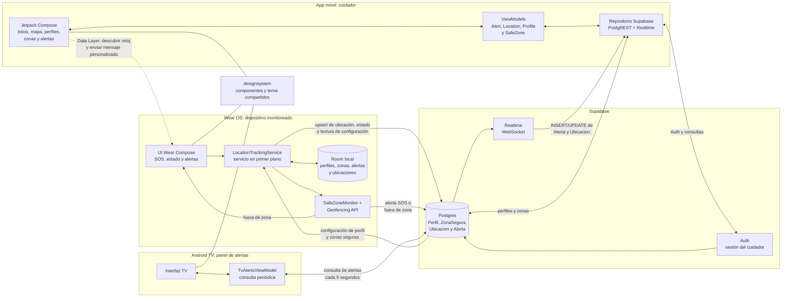
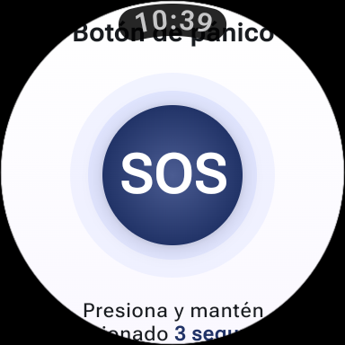
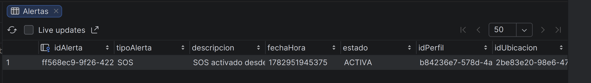
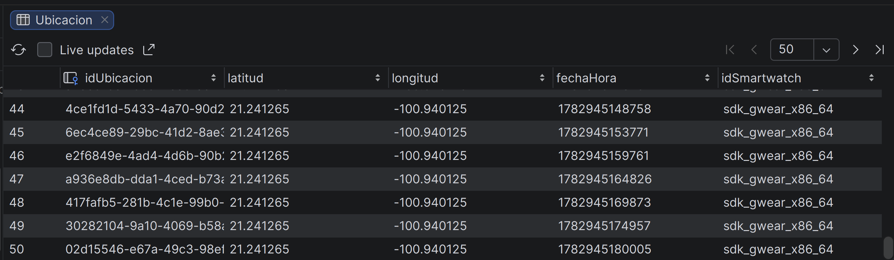
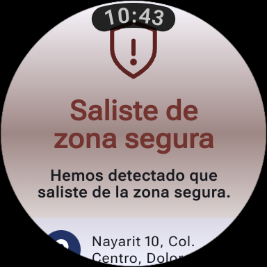
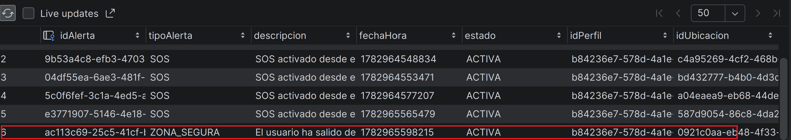

# SafeCare Wear OS

## Nombre del estudiante

- Isaac Cano Hernández
- Luis Manuel Ramírez Ramírez

## Grupo

GIDS6093-E

## Objetivo

Desarrollar una aplicación para dispositivos Wear OS orientada al monitoreo y seguridad de menores de edad y adultos mayores. El smartwatch permite obtener y registrar la ubicación de la persona monitoreada, detectar la salida de zonas seguras y enviar alertas ante situaciones de emergencia, facilitando una atención rápida por parte del cuidador.

## Funcionalidades

* Consulta y actualización periódica de la ubicación del usuario desde el smartwatch.
* Registro local de ubicaciones, estados y eventos de seguridad.
* Botón de pánico SOS mediante pulsación prolongada.
* Generación de alertas de emergencia desde el reloj.
* Configuración y monitoreo de zonas seguras mediante geocercas.
* Alerta al detectar que el usuario sale de una zona segura.
* Vibración y pantalla de alerta ante eventos importantes.
* Visualización del estado de conexión y batería del dispositivo.
* Servicio de ubicación en segundo plano para mantener el monitoreo activo.
* Monitoreo periódico del estado del dispositivo mediante WorkManager.

## Persona beneficiaria y validación del problema

La aplicación fue planteada con la retroalimentación de Laura Patricia Rangel Romero, quien se desempeña como *Enfermera General - Particular en Instituto de salud pública del estado de Guanajuato .

Por su experiencia con menores de edad, adultos mayores, familias, cuidadores, identificó la necesidad de cuidar completamente a personas. Esta situación puede dificultar la supervisión, la atención oportuna ante una emergencia, el seguimiento de ubicación.

SafeCare responde a esa necesidad mediante un smartwatch para la persona monitoreada, una aplicación móvil para el cuidador y un panel de TV para visualizar perfiles y alertas. Las funciones de ubicación, botón SOS, zonas seguras y notificaciones fueron consideradas pertinentes por la persona beneficiaria para apoyar el cuidado completo de las personas y mantenerse al tanto en el lugar que este, sin depender que se encuestre vigilandolas fisicamente todo el tiempo.

## Arquitectura del proyecto

SafeCare está formado por tres aplicaciones Android y un módulo visual compartido. Supabase es la fuente de verdad: el reloj registra ubicaciones y alertas directamente, mientras que el móvil las recibe en tiempo real y la TV las consulta para mostrarlas en pantalla.


```mermaid
flowchart LR
    subgraph Wear["Wear OS: dispositivo monitoreado"]
        WUI["UI Wear Compose\nSOS, estado y alertas"]
        LOC["LocationTrackingService\nservicio en primer plano"]
        GEOFENCE["SafeZoneMonitor +\nGeofencing API"]
        WROOM[("Room local\nperfiles, zonas, alertas\ny ubicaciones")]
        WUI --> LOC
        LOC --> GEOFENCE
        LOC <--> WROOM
        GEOFENCE -->|"fuera de zona"| WUI
    end

    subgraph Cloud["Supabase"]
        AUTH["Auth\nsesión del cuidador"]
        DB[("Postgres\nPerfil, ZonaSegura,\nUbicacion y Alerta")]
        RT["Realtime\nWebSocket"]
        AUTH --> DB
        DB --> RT
    end

    subgraph Mobile["App móvil: cuidador"]
        MUI["Jetpack Compose\nInicio, mapa, perfiles,\nzonas y alertas"]
        MVM["ViewModels\nAlert, Location, Profile\ny SafeZone"]
        MREPO["Repositorio Supabase\nPostgREST + Realtime"]
        MUI <--> MVM
        MVM <--> MREPO
    end

    subgraph TV["Android TV: panel de alertas"]
        TVUI["Interfaz TV"]
        TVVM["TvAlertsViewModel\nconsulta periódica"]
        TVUI <--> TVVM
    end

    DS["designsystem\ncomponentes y tema compartidos"]

    LOC -->|"upsert de ubicación, estado\ny lectura de configuración"| DB
    GEOFENCE -->|"alerta SOS o\nfuera de zona"| DB
    DB -->|"configuración de perfil\ny zonas seguras"| LOC

    MREPO <-->|"Auth y consultas"| AUTH
    MREPO <-->|"perfiles y zonas"| DB
    RT -->|"INSERT/UPDATE de\nAlerta y Ubicacion"| MREPO
    TVVM <-->|"consulta de alertas\ncada 5 segundos"| DB

    MUI --- DS
    WUI --- DS
    TVUI --- DS

    MUI -.->|"Data Layer: descubrir reloj\ny enviar mensaje personalizado"| WUI
```

### Flujos principales

1. **Monitoreo:** el servicio del reloj obtiene la ubicación, la guarda como respaldo local y la registra directamente en Supabase. También descarga desde Supabase el perfil vinculado y sus zonas seguras.
2. **Detección de riesgo:** `SafeZoneMonitor` y las geocercas validan la posición. Al detectar una salida de zona, o al pulsar SOS, el reloj guarda la alerta localmente y la publica en Supabase.
3. **Actualización del móvil:** los `ViewModel` del móvil están suscritos a Supabase Realtime para las tablas `Alerta` y `Ubicacion`; por ello actualizan la interfaz sin depender del puente con el reloj.
4. **Visualización en TV:** la TV consulta las alertas de Supabase cada cinco segundos y prioriza las alertas SOS.
5. **Data Layer:** se usa únicamente para descubrir/vincular el reloj y para mensajes personalizados enviados desde el móvil; no transporta ubicaciones ni alertas de monitoreo.

## Guía de revisión del código

Esta sección funciona como un índice funcional del proyecto: permite localizar rápidamente qué responsabilidad tiene cada archivo sin duplicar el código fuente dentro del README. Las rutas son relativas a cada módulo. Se incluyen todos los archivos de producción y configuración de los módulos **app**, **wearable** y **tv**; los íconos, recursos equivalentes por densidad y pruebas de plantilla se agrupan para conservar una lectura limpia.

**Ruta recomendada de revisión:** empezar por la actividad de entrada, continuar con la pantalla o controlador principal, después con sus <code>ViewModel</code> o servicios, y finalmente con el repositorio y los modelos que acceden a Supabase o Room.

<details open>
<summary><strong>1. Módulo móvil — <code>app</code> (aplicación del cuidador)</strong></summary>

**Flujo central:** <code>MainActivity</code> inicia <code>SafeCareApp</code>; esta coordina las pantallas y los <code>ViewModel</code>. Los <code>ViewModel</code> solicitan o reciben cambios desde <code>SupabaseRepository</code>, que concentra el acceso a Supabase. El mapa, las alertas, perfiles y zonas se actualizan desde ese estado.

| Archivo o grupo | Responsabilidad |
| --- | --- |
| <code>build.gradle.kts</code> | Configura el APK móvil, Compose y las dependencias de Supabase, OsmDroid y Wearable Data Layer. Lee las credenciales de Supabase desde <code>local.properties</code> y las expone de forma controlada en <code>BuildConfig</code>. |
| <code>proguard-rules.pro</code> | Contiene las reglas de ofuscación para una compilación de publicación. |
| <code>src/main/AndroidManifest.xml</code> | Declara la aplicación, la actividad de inicio, permisos de Internet, red y ubicación, además de reglas de respaldo. |
| <code>MainActivity.kt</code> | Punto de entrada Android; coloca la interfaz Compose <code>SafeCareApp</code> en pantalla. |
| <code>ui/screens/SafeCareApp.kt</code> | Raíz de navegación y composición. Crea los <code>ViewModel</code>, conserva la pantalla seleccionada, carga datos al autenticar, inicia actualizaciones en tiempo real y conecta el menú inferior con cada pantalla. |
| <code>data/remote/SupabaseClient.kt</code> | Crea el cliente único de Supabase con autenticación, PostgREST y Realtime. |
| <code>data/repository/SupabaseRepository.kt</code> | Capa de datos del móvil. Registra ubicaciones, alertas y usuarios; crea, edita y elimina perfiles y zonas; consulta perfiles, zonas, alertas, reloj y última ubicación del cuidador autenticado. También traduce las columnas de Supabase a modelos Kotlin. |
| <code>data/local/entity/Entities.kt</code> | Define los modelos usados por el móvil para perfiles monitoreados, zonas, relojes, alertas, ubicación y la unión alerta-perfil. Son el contrato de datos entre repositorio, <code>ViewModel</code> y UI. |
| <code>data/local/entity/UsuarioEntity.kt</code> | Representa el perfil del cuidador que se guarda en la tabla de usuarios después del registro en Supabase Auth. |
| <code>data/datalayer/WearDataLayerRepository.kt</code> | Descubre relojes cercanos y envía solicitudes de vinculación, sincronización de zonas, desvinculación y alerta personalizada mediante la Wearable Data Layer. |
| <code>data/datalayer/MobileDataLayerService.kt</code> | Listener para elementos de datos recibidos del reloj. Interpreta estados, ubicaciones y alertas y los reenvía al repositorio cuando se usa ese canal de respaldo. |
| <code>ui/viewmodel/AuthViewModel.kt</code> | Mantiene los estados de inicio de sesión y registro. Autentica con correo/contraseña, crea el usuario de dominio y devuelve mensajes de error comprensibles a la UI. |
| <code>ui/viewmodel/ProfileViewModel.kt</code> | Expone la lista de perfiles y coordina sus operaciones de alta, edición, consulta y eliminación con el repositorio. |
| <code>ui/viewmodel/SafeZoneViewModel.kt</code> | Mantiene las zonas seguras del cuidador, permite crearlas, editarlas, activar/desactivar su monitoreo y eliminarlas. |
| <code>ui/viewmodel/AlertViewModel.kt</code> | Consulta alertas, las relaciona con el nombre del perfil y se suscribe a inserciones y cambios de <code>Alerta</code> mediante Supabase Realtime. |
| <code>ui/viewmodel/LocationViewModel.kt</code> | Obtiene las últimas ubicaciones de los perfiles y escucha los cambios de <code>Ubicacion</code> en tiempo real para alimentar el mapa. |
| <code>ui/components/OsmMapView.kt</code> | Adaptador Compose para OsmDroid. Inicializa el mapa y ofrece utilidades para colocar marcadores y dibujar el radio de una zona segura. |
| <code>ui/screens/dashboard/DashboardScreen.kt</code> | Presenta el resumen de personas monitoreadas y sus indicadores; desde aquí se abre el detalle en el mapa o se agrega un perfil. |
| <code>ui/screens/map/LiveMapScreen.kt</code> | Muestra el mapa en vivo, el perfil elegido, su última ubicación, las zonas seguras y las alertas asociadas. |
| <code>ui/screens/alerts/AlertsScreen.kt</code> | Lista las alertas recibidas y genera el título y mensaje legible según el tipo de evento. |
| <code>ui/screens/login/LoginScreen.kt</code> y <code>ui/screens/register/RegisterScreen.kt</code> | Formularios Compose para autenticar al cuidador y crear una cuenta. Reciben estado y acciones desde <code>AuthViewModel</code>. |
| <code>ui/screens/profile/ProfilesScreen.kt</code>, <code>AddProfileScreen.kt</code> y <code>EditProfileScreen.kt</code> | Consulta, alta y edición de perfiles monitoreados, incluida la vinculación de un reloj cuando corresponde. |
| <code>ui/screens/zone/SafeZonesScreen.kt</code>, <code>CreateSafeZoneScreen.kt</code> y <code>EditSafeZoneScreen.kt</code> | Lista y administra zonas seguras: nombre, perfil asociado, coordenadas, radio y estado activo. |
| <code>ui/theme/Color.kt</code>, <code>Theme.kt</code> y <code>Type.kt</code> | Paleta, tipografía y tema Compose propios del módulo móvil. |
| <code>util/SecurityUtils.kt</code> | Centraliza el cálculo del hash de contraseña que se conserva en el registro de usuario de dominio. |
| <code>src/main/res/values/{colors,strings,themes}.xml</code> | Recursos de texto, color y tema de Android. |
| <code>src/main/res/drawable/*</code>, <code>mipmap-*/ic_launcher*</code> y <code>mipmap-anydpi/*.xml</code> | Capas vectoriales e íconos adaptativos del lanzador en sus distintas densidades. |
| <code>src/main/res/xml/backup_rules.xml</code> y <code>data_extraction_rules.xml</code> | Política de respaldo y extracción de datos para Android. |
| <code>src/test/.../ExampleUnitTest.kt</code> y <code>src/androidTest/.../ExampleInstrumentedTest.kt</code> | Plantillas de prueba unitaria local e instrumentada del módulo. |

</details>

<details>
<summary><strong>2. Módulo Wear OS — <code>wearable</code> (dispositivo monitoreado)</strong></summary>

**Flujo central:** <code>presentation/MainActivity</code> solicita permisos, programa el trabajo periódico y enciende <code>LocationTrackingService</code>. El servicio toma GPS y estado del reloj, guarda un respaldo en Room, sincroniza con Supabase y actualiza las geocercas. Un SOS o una salida de zona crea una alerta local y remota.

| Archivo o grupo | Responsabilidad |
| --- | --- |
| <code>build.gradle.kts</code> | Configura la app Wear OS, Compose, Room con KSP, ubicación, geocercas, WorkManager, Supabase y la Wearable Data Layer. Obtiene credenciales de <code>local.properties</code>. |
| <code>proguard-rules.pro</code> y <code>lint.xml</code> | Definen reglas de publicación y ajustes de análisis estático del módulo. |
| <code>src/main/AndroidManifest.xml</code> | Declara el dispositivo como reloj, permisos de ubicación, segundo plano, red, vibración y notificaciones; registra el servicio de ubicación, receptor de geocercas, listener de Data Layer y actividades. |
| <code>presentation/MainActivity.kt</code> | Punto de entrada del reloj. Gestiona permisos, programa <code>StatusWorker</code> cada 15 minutos, inicia el seguimiento y registra las geocercas guardadas en Room. |
| <code>presentation/AlertActivity.kt</code> | Actividad que muestra una alerta importante sobre la pantalla bloqueada cuando llega una alerta personalizada o de seguridad. |
| <code>presentation/ui/WearHomeScreen.kt</code> | Interfaz principal del reloj: botón SOS por pulsación prolongada e indicadores de ubicación, batería, red y permisos. |
| <code>presentation/ui/WearAlertScreen.kt</code> | Composición visual de una alerta recibida, con tipo, mensaje, detalle y acción para cerrarla. |
| <code>presentation/ui/WearHomeUiState.kt</code> | Modelo inmutable del estado que consume la pantalla principal. |
| <code>presentation/theme/Theme.kt</code> | Aplica el tema Compose del reloj y el tema compartido de SafeCare. |
| <code>presentation/controller/WearStatusController.kt</code> | Orquesta el SOS y la información mostrada. Lee batería, conectividad y ubicación; persiste reloj, ubicación y alerta en Room y las sincroniza con Supabase cuando hay red. |
| <code>presentation/location/LocationTrackingService.kt</code> | Servicio en primer plano y núcleo del monitoreo. Valida lecturas GPS, conserva un historial local acotado, evalúa zonas, actualiza batería/conexión y sincroniza periódicamente el perfil y sus zonas desde Supabase. |
| <code>presentation/location/WearLocationReader.kt</code> | Solicita una ubicación puntual del reloj para acciones como SOS o actualización manual. |
| <code>presentation/location/LocationPermissionManager.kt</code> | Centraliza las comprobaciones y arreglos de permisos de ubicación precisa, segundo plano y geocercas. |
| <code>presentation/sensors/DeviceStatusReader.kt</code> y <code>presentation/data/DeviceStatus.kt</code> | Obtienen batería y conectividad del reloj y las presentan como un objeto de estado listo para la UI. |
| <code>presentation/geofence/GeofenceManager.kt</code> | Convierte zonas activas en geocercas circulares de Google Play Services; reemplaza las anteriores y registra entrada/salida. |
| <code>presentation/geofence/GeofenceBroadcastReceiver.kt</code> | Recibe transiciones de geocerca, identifica la salida relevante y activa la creación de alerta de seguridad. |
| <code>presentation/geofence/SafeZoneMonitor.kt</code> | Verificación complementaria basada en cada coordenada recibida. Guarda el estado dentro/fuera por zona para no repetir alertas al permanecer fuera. |
| <code>presentation/geofence/SafeCareAlertNotifier.kt</code> | Construye la notificación de alta prioridad, vibra y abre <code>AlertActivity</code> para avisar el evento. |
| <code>data/worker/StatusWorker.kt</code> | Trabajo de WorkManager de respaldo. En cada ejecución reporta batería, conectividad y una ubicación puntual a Supabase si el reloj está en línea. |
| <code>data/remote/SupabaseClient.kt</code> | Cliente singleton de Supabase para el reloj. |
| <code>data/repository/SupabaseRepository.kt</code> | Encapsula el envío de ubicación, alerta y estado del smartwatch; además obtiene el perfil vinculado y sus zonas para mantener configurado al reloj. |
| <code>data/local/database/DatabaseProvider.kt</code> y <code>SafeCareDatabase.kt</code> | Crean y describen la instancia Room con sus entidades y DAOs; son el respaldo local ante conectividad intermitente. |
| <code>data/local/dao/AlertaDao.kt</code>, <code>PerfilMonitoreadoDao.kt</code>, <code>SmartwatchDao.kt</code>, <code>UbicacionDao.kt</code> y <code>ZonaSeguraDao.kt</code> | Contratos SQL de Room para insertar, consultar, actualizar, depurar registros antiguos y administrar el perfil y las zonas activas. |
| <code>data/local/entity/AlertaEntity.kt</code>, <code>PerfilMonitoreadoEntity.kt</code>, <code>SmartwatchEntity.kt</code>, <code>UbicacionEntity.kt</code> y <code>ZonaSeguraEntity.kt</code> | Entidades Room que modelan los cinco datos persistidos localmente: alerta, persona, reloj, coordenada y zona segura. |
| <code>data/local/SafeCareProfileResolver.kt</code> | Resuelve de forma segura cuál es el perfil activo en la base local, incluso si aún no hay un perfil vinculado. |
| <code>data/model/AppModels.kt</code> | Catálogo de enumeraciones del dominio: tipo de perfil, alerta, estado de alerta y tipo de conexión. |
| <code>data/datalayer/WearIdentityStore.kt</code> | Genera y conserva el identificador de instalación único del reloj, usado como identidad y número de serie. |
| <code>data/datalayer/WearDataLayerService.kt</code> | Atiende solicitudes del móvil: responde información del reloj, vincula o desvincula un perfil, recibe zonas y muestra alertas personalizadas. Actualiza Room y geocercas al recibir esos comandos. |
| <code>data/datalayer/WearDataPublisher.kt</code> | Define el formato de elementos de datos para publicar estado, ubicación y alertas por el canal Wearable cuando se requiere ese medio. |
| <code>src/main/res/values/{strings,styles,wear_capabilities}.xml</code> | Textos, tema de inicio y capacidad que permite al móvil descubrir relojes SafeCare. |
| <code>src/main/res/drawable/{ic_launcher_background,ic_launcher_foreground,ic_notification_alert,splash_icon}.xml</code> | Recursos vectoriales del lanzador, notificación de alerta y pantalla de inicio. |
| <code>src/main/res/mipmap-*/ic_launcher*</code> y <code>mipmap-anydpi/*.xml</code> | Íconos del lanzador en las densidades y variantes adaptativas requeridas por Wear OS. |

</details>

<details>
<summary><strong>3. Módulo Android TV — <code>tv</code> (panel del cuidador)</strong></summary>

**Flujo central:** <code>MainActivity</code> abre <code>SafeCareTvApp</code>. Tras autenticar al cuidador, los <code>ViewModel</code> cargan perfiles, recomendaciones y alertas. La pantalla de alerta tiene prioridad visual; los perfiles se actualizan periódicamente desde Supabase y el panel de tonos guarda su selección localmente.

| Archivo o grupo | Responsabilidad |
| --- | --- |
| <code>build.gradle.kts</code> | Configura el APK para TV, Compose, Supabase, OsmDroid, Coil y acceso HTTP a YouTube. Lee las credenciales de Supabase y la clave de YouTube desde <code>local.properties</code>. |
| <code>proguard-rules.pro</code> | Reglas de ofuscación para la versión de publicación de TV. |
| <code>src/main/AndroidManifest.xml</code> | Declara permisos de red y soporte Leanback; registra la actividad tanto para el lanzador normal como para el lanzador de Android TV. |
| <code>MainActivity.kt</code> | Punto de entrada de TV que inicializa el tema y la raíz Compose <code>SafeCareTvApp</code>. |
| <code>ui/SafeCareTvApp.kt</code> | Coordinador de navegación y estados. Decide entre acceso, inicio, detalle de perfil, selector de tonos y alerta a pantalla completa; una alerta activa toma prioridad. |
| <code>data/remote/TvSupabaseClient.kt</code> | Cliente singleton de Supabase usado por la app de TV para autenticación y consultas. |
| <code>data/alert/TvAlert.kt</code> | Modelo de alerta para TV; expone las clasificaciones SOS y salida de zona segura utilizadas para priorizar la atención. |
| <code>data/alert/TvAlertsRepository.kt</code> | Consulta alertas activas, normaliza la fecha recibida, descarta tipos no relevantes y las ordena de la más reciente a la más antigua. |
| <code>data/profile/MonitoredProfile.kt</code> | Modelos de presentación de un perfil, sus zonas y su estado de monitoreo: seguro, fuera de zona u offline. |
| <code>data/profile/MonitoredProfilesRepository.kt</code> | Obtiene perfiles del cuidador, relojes, zonas activas y ubicaciones; calcula la distancia a cada zona para construir el estado actual y la última posición de cada persona. |
| <code>data/sound/AlertTone.kt</code> | Declara el catálogo de ocho tonos y las preferencias locales que guardan el tono elegido. |
| <code>data/sound/AlertTonePlayer.kt</code> | Reproduce, detiene y libera el audio de vista previa del tono seleccionado. |
| <code>data/youtube/YouTubeVideo.kt</code> | Modelo compacto de video recomendado: identificador, título, canal, miniatura y duración. |
| <code>data/youtube/YouTubeRepository.kt</code> | Consulta la API de YouTube para recomendaciones en español, obtiene duraciones, trata errores de cuota o clave y protege la solicitud con datos del paquete Android. |
| <code>ui/viewmodel/TvAuthViewModel.kt</code> | Verifica la sesión, inicia o cierra sesión con Supabase y publica estados de carga, error o autenticación. |
| <code>ui/viewmodel/MonitoredProfilesViewModel.kt</code> | Mantiene los estados de carga, contenido y error de los perfiles; los actualiza al iniciar y cada 30 segundos. |
| <code>ui/viewmodel/TvAlertsViewModel.kt</code> | Consulta alertas cada 5 segundos, da prioridad a SOS y guarda en preferencias las alertas reconocidas para no mostrarlas repetidamente. |
| <code>ui/viewmodel/YouTubeViewModel.kt</code> | Expone a la interfaz el estado de carga, éxito o error de las recomendaciones de YouTube y libera el cliente al finalizar. |
| <code>ui/login/TvLoginScreen.kt</code> | Formulario adaptado al control remoto para el acceso del cuidador. |
| <code>ui/home/TvHomeScreen.kt</code> | Panel principal navegable con tarjetas de perfiles, métricas de monitoreo, acciones de sesión, acceso a tonos y recomendaciones de YouTube. |
| <code>ui/profile/TvProfileDetailScreen.kt</code> | Detalle del perfil: mapa OpenStreetMap, ubicación, zona actual, datos personales, estado del reloj y métricas. |
| <code>ui/alert/TvFullScreenAlert.kt</code> | Vista de atención prioritaria para SOS o salida de zona; presenta datos del perfil, ubicación y tiempo transcurrido y permite reconocer la alerta. |
| <code>ui/settings/TvAlertTonesScreen.kt</code> | Pantalla para seleccionar un tono, previsualizarlo y persistir la elección. |
| <code>ui/theme/Color.kt</code>, <code>Theme.kt</code> y <code>Type.kt</code> | Colores, tipografías y tema Material 3 ajustados al contraste y tamaño de TV. |
| <code>src/main/res/raw/alert_tone_1.wav</code> a <code>alert_tone_8.wav</code> | Ocho archivos de audio disponibles para la alerta del panel. |
| <code>src/main/res/values/{colors,strings,themes}.xml</code> | Recursos de Android para nombre, colores y tema de TV. |
| <code>src/main/res/drawable/*</code>, <code>mipmap-*/ic_launcher*</code> y <code>mipmap-anydpi/*.xml</code> | Recursos e íconos del lanzador en las densidades requeridas. |
| <code>src/test/.../ExampleUnitTest.kt</code> y <code>src/androidTest/.../ExampleInstrumentedTest.kt</code> | Plantillas de prueba unitaria local e instrumentada del módulo. |

</details>

### Estructura de directorios de los módulos

La siguiente vista muestra la organización de los tres módulos de aplicación. Se omite la carpeta `build/` de cada uno porque contiene archivos generados por Gradle durante la compilación.

<details open>
<summary><strong>1. <code>app</code> — aplicación móvil</strong></summary>

```text
app/
├── build.gradle.kts
├── proguard-rules.pro
└── src/
    ├── androidTest/
    │   └── java/mx/utng/ich/safecare/
    ├── main/
    │   ├── AndroidManifest.xml
    │   ├── java/mx/utng/ich/safecare/
    │   │   ├── MainActivity.kt
    │   │   ├── data/
    │   │   │   ├── datalayer/
    │   │   │   ├── local/entity/
    │   │   │   ├── remote/
    │   │   │   └── repository/
    │   │   ├── ui/
    │   │   │   ├── components/
    │   │   │   ├── screens/
    │   │   │   │   ├── alerts/
    │   │   │   │   ├── dashboard/
    │   │   │   │   ├── login/
    │   │   │   │   ├── map/
    │   │   │   │   ├── profile/
    │   │   │   │   ├── register/
    │   │   │   │   └── zone/
    │   │   │   ├── theme/
    │   │   │   └── viewmodel/
    │   │   └── util/
    │   └── res/
    │       ├── drawable/
    │       ├── mipmap-anydpi/ y mipmap-*/
    │       ├── values/
    │       └── xml/
    └── test/
        └── java/mx/utng/ich/safecare/
```

</details>

<details>
<summary><strong>2. <code>wearable</code> — aplicación Wear OS</strong></summary>

```text
wearable/
├── build.gradle.kts
├── lint.xml
├── proguard-rules.pro
└── src/
    └── main/
        ├── AndroidManifest.xml
        ├── java/mx/utng/ich/safecare/wearable/
        │   ├── data/
        │   │   ├── datalayer/
        │   │   ├── local/
        │   │   │   ├── dao/
        │   │   │   ├── database/
        │   │   │   └── entity/
        │   │   ├── model/
        │   │   ├── remote/
        │   │   ├── repository/
        │   │   └── worker/
        │   └── presentation/
        │       ├── controller/
        │       ├── data/
        │       ├── geofence/
        │       ├── location/
        │       ├── sensors/
        │       ├── theme/
        │       └── ui/
        └── res/
            ├── drawable/
            ├── mipmap-anydpi/ y mipmap-*/
            └── values/
```

</details>

<details>
<summary><strong>3. <code>tv</code> — aplicación Android TV</strong></summary>

```text
tv/
├── build.gradle.kts
├── proguard-rules.pro
└── src/
    ├── androidTest/
    │   └── java/mx/utng/ich/safecaretv/
    ├── main/
    │   ├── AndroidManifest.xml
    │   ├── java/mx/utng/ich/safecaretv/
    │   │   ├── MainActivity.kt
    │   │   ├── data/
    │   │   │   ├── alert/
    │   │   │   ├── profile/
    │   │   │   ├── remote/
    │   │   │   ├── sound/
    │   │   │   └── youtube/
    │   │   └── ui/
    │   │       ├── alert/
    │   │       ├── home/
    │   │       ├── login/
    │   │       ├── profile/
    │   │       ├── settings/
    │   │       ├── theme/
    │   │       └── viewmodel/
    │   └── res/
    │       ├── drawable/
    │       ├── mipmap-anydpi/ y mipmap-*/
    │       ├── raw/
    │       └── values/
    └── test/
        └── java/mx/utng/ich/safecaretv/
```

</details>

### Límites y responsabilidades entre módulos

| Módulo | Produce | Consume |
| --- | --- | --- |
| **wearable** | Ubicación, estado del reloj y alertas SOS o de zona segura. | Perfil y zonas seguras vinculados desde Supabase o desde el móvil. |
| **app** | Perfiles, zonas seguras, cuentas de cuidador y alertas personalizadas para el reloj. | Datos de monitoreo en Supabase Realtime y dispositivos Wear OS disponibles. |
| **tv** | Reconocimiento local de alertas y preferencia de tono. | Sesión del cuidador, perfiles, zonas, estado, ubicación y alertas de Supabase; recomendaciones de YouTube. |

## Tecnologías utilizadas

* Kotlin.
* Android Studio.
* Wear OS.
* Jetpack Compose para Wear OS.
* Material 3 para Wear OS.
* Google Play Services Location.
* Geofencing API.
* Room Database.
* WorkManager.
* Servicios en primer plano para ubicación.
* Gradle con Kotlin DSL.
* Git y GitHub para control de versiones.

## Instrucciones de ejecución

1. Clonar el repositorio:

   ```bash
   git clone https://github.com/IsaacCanoH/SafeCare.git
   ```

2. Abrir el proyecto en Android Studio.

3. Esperar a que Gradle sincronice y descargue las dependencias necesarias.

4. Seleccionar el módulo `wearable`.

5. Iniciar un emulador Wear OS o conectar un dispositivo físico compatible.

6. Ejecutar la aplicación desde Android Studio usando la opción **Run**.

7. Al iniciar la aplicación, aceptar los permisos solicitados para ubicación, ubicación en segundo plano y notificaciones.

8. Para probar las zonas seguras, configurar una ubicación dentro y otra fuera del radio definido en el emulador Wear OS. Al salir de la zona segura, la aplicación debe generar una alerta y vibrar.

## Documentación del código

Esta sección presenta los fragmentos de código más relevantes del proyecto, organizados por módulo y en el orden recomendado de revisión: punto de entrada → pantalla/controlador → servicios → repositorio/datos. Cada bloque incluye los comentarios de documentación que aparecen en el código fuente.

---

### Módulo Wear OS — `wearable`

#### 1. `MainActivity.kt` — Punto de entrada del reloj

Gestiona permisos, programa el trabajo periódico con WorkManager y registra las geocercas al iniciar.

```kotlin
class MainActivity : ComponentActivity() {

    private lateinit var wearStatusController: WearStatusController
    private lateinit var geofenceManager: GeofenceManager

    // Inicializa la app del reloj y prepara el monitoreo.
    override fun onCreate(savedInstanceState: Bundle?) {
        super.onCreate(savedInstanceState)

        wearStatusController =
            WearStatusController(this) { updatedUiState ->
                uiState = updatedUiState
            }
        geofenceManager = GeofenceManager(this)

        wearStatusController.updateLocationPermissionStatus()
        setupPeriodicMonitoring()

        setContent {
            WearHomeScreen(
                uiState = uiState,
                onPanicButtonLongPress = {
                    wearStatusController.onPanicButtonPressed { permissions ->
                        locationPermissionLauncher.launch(permissions)
                    }
                }
            )
        }

        requestMonitoringPermissionsOrSetupGeofences()
    }

    // Programa la actualización periódica del estado del reloj.
    private fun setupPeriodicMonitoring() {
        val monitorWorkRequest = PeriodicWorkRequestBuilder<StatusWorker>(
            15, TimeUnit.MINUTES
        ).build()

        WorkManager.getInstance(this).enqueueUniquePeriodicWork(
            "SafeCareMonitor",
            ExistingPeriodicWorkPolicy.KEEP,
            monitorWorkRequest
        )
    }

    // Carga las geocercas del perfil activo en el sistema.
    private fun setupGeofences() {
        geofenceSetupJob?.cancel()
        geofenceSetupJob = lifecycleScope.launch {
            val database = DatabaseProvider.getDatabase(this@MainActivity)
            val watchId = WearIdentityStore(this@MainActivity).getOrCreateWatchId()
            val idPerfil = SafeCareProfileResolver.resolveProfileId(database, watchId) ?: run {
                actualizarGeofencingEnAndroid(emptyList())
                return@launch
            }
            val zonasLocales = database.zonaSeguraDao().obtenerZonasActivas(idPerfil)
            actualizarGeofencingEnAndroid(zonasLocales)
        }
    }

    // Sincroniza las zonas locales con las geocercas de Android.
    private suspend fun actualizarGeofencingEnAndroid(zonas: List<ZonaSeguraEntity>) {
        val safeZones = zonas.map { zona ->
            SafeZoneGeofence(
                id = zona.idZona,
                lat = zona.latitudCentro,
                lng = zona.longitudCentro,
                radiusInMeters = zona.radioMetros.toFloat()
            )
        }
        geofenceManager.replaceGeofences(safeZones)
            .onSuccess { count -> Log.i(TAG, "Geocercas activas confirmadas: $count") }
            .onFailure { exception -> Log.e(TAG, "Fallo al activar geocercas", exception) }
    }
}
```

---

#### 2. `WearStatusController.kt` — Orquestador de SOS y estado de la UI

Coordina el botón SOS, la lectura de batería/conectividad y la actualización del estado observable de la pantalla principal.

```kotlin
class WearStatusController(
    private val context: Context,
    private val onUiStateChange: (WearHomeUiState) -> Unit
) {
    private val locationPermissionManager = LocationPermissionManager(context)
    private val wearLocationReader = WearLocationReader(context)
    private val deviceStatusReader = DeviceStatusReader(context)
    private val scope = CoroutineScope(Dispatchers.IO)

    // Genera y publica una alerta SOS con la ubicación disponible.
    fun onPanicButtonPressed(
        onRequestLocationPermission: (Array<String>) -> Unit
    ) {
        if (locationPermissionManager.hasLocationPermission()) {
            scope.launch {
                val serialIdentificador = WearIdentityStore(context).getOrCreateWatchId()
                val database = DatabaseProvider.getDatabase(context)
                val idPerfil = SafeCareProfileResolver.resolveProfileId(
                    database = database,
                    watchId = serialIdentificador
                ) ?: run {
                    Log.e(TAG, "SOS descartado: el reloj no tiene un perfil vinculado")
                    return@launch
                }

                val locationData = wearLocationReader.getCurrentLocationData()
                val batteryLevel = deviceStatusReader.getBatteryLevel()
                val isOnline = deviceStatusReader.isOnline()

                // 1. Guardar localmente en Room
                val alertaLocal = AlertaEntity(
                    tipoAlerta = "SOS",
                    descripcion = "El perfil monitoreado activó una alerta SOS desde su reloj",
                    idPerfil = idPerfil,
                    idUbicacion = localUbicacionId
                )
                database.alertaDao().insertar(alertaLocal)

                // 2. Sincronizar con Supabase si hay red
                if (isOnline) {
                    SupabaseRepository().saveAlert(alertaLocal)
                }
            }
        } else {
            onRequestLocationPermission(locationPermissionManager.getLocationPermissions())
        }
    }

    // Actualiza el estado observable que consume la interfaz Wear.
    private fun updateUiState(newUiState: WearHomeUiState) {
        currentUiState = newUiState
        onUiStateChange(currentUiState)
    }
}
```

---

#### 3. `LocationTrackingService.kt` — Servicio en primer plano de monitoreo

Núcleo del rastreo continuo. Recibe actualizaciones GPS, las valida, las guarda en Room y las sincroniza con Supabase. También monitorea batería/conexión y refresca la configuración remota.

```kotlin
class LocationTrackingService : Service() {

    private val locationListener = object : LocationListener {
        // Procesa cada ubicación nueva recibida del proveedor GPS.
        override fun onLocationChanged(location: Location) {
            if (isUsableWatchGpsLocation(location)) {
                saveLocation(location)
            } else {
                Log.w(TAG, "Lectura GPS descartada: provider=${location.provider}, " +
                        "ageMs=${locationAgeMillis(location)}, accuracy=${location.accuracy}")
            }
        }
    }

    // Inicia el rastreo y mantiene el servicio activo.
    override fun onStartCommand(intent: Intent?, flags: Int, startId: Int): Int {
        if (!hasLocationPermission()) { stopSelf(); return START_NOT_STICKY }
        startAsForegroundService()
        startLocationUpdates()
        startStatusMonitoring()
        serviceScope.launch { synchronizeRemoteConfigurationIfDue(force = true) }
        return START_STICKY
    }

    // Valida precisión y antigüedad de una ubicación GPS.
    private fun isUsableWatchGpsLocation(location: Location): Boolean {
        return location.provider == LocationManager.GPS_PROVIDER &&
                location.latitude in -90.0..90.0 &&
                location.longitude in -180.0..180.0 &&
                locationAgeMillis(location) <= MAX_LOCATION_AGE_MILLIS &&
                (!location.hasAccuracy() || location.accuracy <= MAX_ACCURACY_METERS)
    }

    // Guarda, sincroniza y publica la ubicación recibida.
    private fun saveLocation(location: Location) {
        serviceScope.launch {
            val locationEntity = UbicacionEntity(
                latitud = location.latitude,
                longitud = location.longitude,
                fechaHora = location.time.takeIf { it > 0L } ?: System.currentTimeMillis(),
                idSmartwatch = WearIdentityStore(applicationContext).getOrCreateWatchId()
            )
            ubicacionDao.insertar(locationEntity)
            safeZoneMonitor.evaluate(location)  // verificación de zona segura por GPS
            if (deviceStatusReader.isOnline()) {
                supabaseRepository.saveLocation(locationEntity)
            }
            ubicacionDao.conservarSoloRegistrosRecientes(MAX_LOCATION_RECORDS)
        }
    }

    // Actualiza la configuración remota cuando corresponde sincronizarla.
    private suspend fun synchronizeRemoteConfigurationIfDue(force: Boolean = false) {
        val configuration = supabaseRepository.fetchLinkedConfiguration(watchId) ?: return
        database.withTransaction {
            database.perfilMonitoreadoDao().insertar(configuration.profile.copy(estadoActual = true))
            database.zonaSeguraDao().eliminarPorPerfil(configuration.profile.idPerfil)
            if (configuration.zones.isNotEmpty()) {
                database.zonaSeguraDao().insertarZonas(configuration.zones)
            }
        }
        safeZoneMonitor.reset(configuration.profile.idPerfil)
        GeofenceManager(applicationContext).replaceGeofences(
            configuration.zones.filter { it.activa }.map { zone ->
                SafeZoneGeofence(id = zone.idZona, lat = zone.latitudCentro,
                    lng = zone.longitudCentro, radiusInMeters = zone.radioMetros.toFloat())
            }
        )
    }

    companion object {
        private const val LOCATION_INTERVAL_MILLIS = 5_000L     // Cada 5 segundos
        private const val MAX_LOCATION_AGE_MILLIS  = 30_000L    // Máximo 30 s de antigüedad
        private const val MAX_ACCURACY_METERS      = 200f        // Precisión máxima aceptada

        // Inicia el servicio de rastreo desde cualquier contexto.
        fun start(context: Context) {
            val intent = Intent(context, LocationTrackingService::class.java)
            if (Build.VERSION.SDK_INT >= Build.VERSION_CODES.O) {
                context.startForegroundService(intent)
            } else {
                context.startService(intent)
            }
        }
    }
}
```

---

#### 4. `GeofenceManager.kt` — Registro de geocercas circulares

Convierte las `ZonaSeguraEntity` activas en geocercas de Google Play Services, reemplazando el conjunto anterior completo en cada actualización.

```kotlin
data class SafeZoneGeofence(
    val id: String,
    val lat: Double,
    val lng: Double,
    val radiusInMeters: Float
)

class GeofenceManager(context: Context) {

    @SuppressLint("MissingPermission")
    // Reemplaza las geocercas del sistema por las zonas actuales.
    suspend fun replaceGeofences(zones: List<SafeZoneGeofence>): Result<Int> =
        withContext(Dispatchers.IO) {
            try {
                Tasks.await(geofencingClient.removeGeofences(geofencePendingIntent))

                if (zones.isEmpty()) return@withContext Result.success(0)

                val geofences = zones.map { zone ->
                    Geofence.Builder()
                        .setRequestId(zone.id)
                        .setCircularRegion(zone.lat, zone.lng, zone.radiusInMeters)
                        .setExpirationDuration(Geofence.NEVER_EXPIRE)
                        .setTransitionTypes(
                            Geofence.GEOFENCE_TRANSITION_EXIT or
                                    Geofence.GEOFENCE_TRANSITION_ENTER
                        )
                        .setNotificationResponsiveness(10_000)
                        .build()
                }

                val request = GeofencingRequest.Builder()
                    .setInitialTrigger(
                        GeofencingRequest.INITIAL_TRIGGER_ENTER or
                                GeofencingRequest.INITIAL_TRIGGER_EXIT
                    )
                    .addGeofences(geofences)
                    .build()

                Tasks.await(geofencingClient.addGeofences(request, geofencePendingIntent))
                Result.success(zones.size)
            } catch (exception: Exception) {
                Result.failure(exception)
            }
        }
}
```

---

#### 5. `SafeZoneMonitor.kt` — Verificación independiente de zona segura

Complemento al sistema de geocercas de Google. Evalúa cada coordenada GPS recibida para detectar salidas de zona sin depender de una transición del sistema.

```kotlin
/**
 * Verificación independiente de Google Geofencing.
 *
 * Se ejecuta con cada coordenada GPS producida por el propio reloj. De esta forma
 * SafeCare no depende de que Fused Location/Geofencing entregue una transición.
 */
class SafeZoneMonitor(context: Context) {

    // Evalúa si la ubicación actual salió de una zona segura.
    suspend fun evaluate(location: Location) {
        val zones = database.zonaSeguraDao().obtenerZonasActivas(profileId)

        val containingZone = zones.firstOrNull { zone ->
            distanceMeters(
                location.latitude, location.longitude,
                zone.latitudCentro, zone.longitudCentro
            ) <= zone.radioMetros
        }
        val isInsideAnySafeZone = containingZone != null
        val wasInside = preferences.getBoolean(stateKey, false)
        preferences.edit().putBoolean(stateKey, isInsideAnySafeZone).apply()

        if (isInsideAnySafeZone) {
            if (!wasInside) SafeCareAlertNotifier.dismissSafeZoneExitNotification(appContext)
            return
        }

        // Solo genera alerta si el estado cambió (estaba adentro o no había estado previo)
        if (!hadPreviousState || wasInside) {
            GeofenceBroadcastReceiver.handleSafeZoneExit(
                context = appContext,
                zoneLabel = nearestZoneLabel(location, zones),
                triggeringLocation = location
            )
        }
    }

    // Calcula la distancia en metros entre dos coordenadas.
    private fun distanceMeters(
        latitude: Double, longitude: Double,
        centerLatitude: Double, centerLongitude: Double
    ): Float {
        val result = FloatArray(1)
        Location.distanceBetween(latitude, longitude, centerLatitude, centerLongitude, result)
        return result[0]
    }
}
```

---

#### 6. `GeofenceBroadcastReceiver.kt` — Receptor de transiciones de geocerca

Recibe el `Intent` del sistema cuando se cruza una geocerca, filtra las salidas y delega la creación de alerta, vibración y pantalla de aviso.

```kotlin
class GeofenceBroadcastReceiver : BroadcastReceiver() {

    // Atiende eventos del sistema cuando se cruza una geocerca.
    override fun onReceive(context: Context, intent: Intent) {
        val geofencingEvent = GeofencingEvent.fromIntent(intent) ?: return

        if (geofencingEvent.geofenceTransition != Geofence.GEOFENCE_TRANSITION_EXIT) return

        val zoneLabel = geofencingEvent.triggeringGeofences?.firstOrNull()?.requestId
            ?.let { "Zona $it" }
        val triggeringLocation = geofencingEvent.triggeringLocation

        val pendingResult = goAsync()
        handleSafeZoneExit(context.applicationContext, zoneLabel, triggeringLocation) {
            pendingResult.finish()
        }
    }

    companion object {
        // Crea y publica la alerta cuando se sale de una zona segura.
        fun handleSafeZoneExit(
            context: Context,
            zoneLabel: String?,
            triggeringLocation: Location?,
            onFinished: (() -> Unit)? = null
        ) {
            val receiver = GeofenceBroadcastReceiver()
            val appContext = context.applicationContext

            receiver.launchAlertActivity(appContext, zoneLabel, triggeringLocation)
            SafeCareAlertNotifier.showSafeZoneExitNotification(appContext, zoneLabel, triggeringLocation)
            receiver.triggerVibration(appContext)

            CoroutineScope(Dispatchers.IO).launch {
                try {
                    receiver.saveSafeZoneExitAlert(appContext, triggeringLocation)
                } finally {
                    onFinished?.invoke()
                }
            }
        }
    }
}
```

---

#### 7. `AlertActivity.kt` — Pantalla de alerta sobre la pantalla bloqueada

Se muestra al detectar un evento de seguridad. Permanece visible sobre el bloqueo de pantalla y activa una vibración de emergencia.

```kotlin
class AlertActivity : ComponentActivity() {

    // Muestra y activa los recursos de una alerta urgente.
    override fun onCreate(savedInstanceState: Bundle?) {
        super.onCreate(savedInstanceState)
        showAsPersistentFullScreenAlert()
        startEmergencyVibration()

        val message   = intent.getStringExtra(EXTRA_MESSAGE)    ?: "Saliste de zona segura"
        val alertType = intent.getStringExtra(EXTRA_ALERT_TYPE) ?: "FUERA_ZONA_SEGURA"
        val latitude  = intent.getDoubleExtra("EXTRA_LATITUDE",  Double.NaN)
        val longitude = intent.getDoubleExtra("EXTRA_LONGITUDE", Double.NaN)

        setContent { WearAlertScreen(message, displayAddress, alertType, onDismiss = { dismissAlert() }) }

        if (hasCoordinates(latitude, longitude)) {
            lifecycleScope.launch {
                resolveAddressFromCoordinates(latitude, longitude)
                    ?.let { displayAddress = it }
            }
        }
    }

    // Mantiene la alerta visible a pantalla completa sobre otras vistas.
    private fun showAsPersistentFullScreenAlert() {
        if (Build.VERSION.SDK_INT >= Build.VERSION_CODES.O_MR1) {
            setShowWhenLocked(true)
            setTurnScreenOn(true)
        }
        window.addFlags(
            WindowManager.LayoutParams.FLAG_KEEP_SCREEN_ON or
                    WindowManager.LayoutParams.FLAG_SHOW_WHEN_LOCKED or
                    WindowManager.LayoutParams.FLAG_TURN_SCREEN_ON
        )
    }

    // Inicia el patrón de vibración de emergencia.
    private fun startEmergencyVibration() {
        val pattern = longArrayOf(0, 500, 200, 500)
        if (Build.VERSION.SDK_INT >= Build.VERSION_CODES.O) {
            vibrator?.vibrate(VibrationEffect.createWaveform(pattern, 0))
        }
    }

    // Convierte coordenadas de alerta en una dirección para mostrar.
    private suspend fun resolveAddressFromCoordinates(lat: Double, lng: Double): String? =
        withContext(Dispatchers.IO) {
            runCatching {
                val geocoder = Geocoder(this@AlertActivity, Locale.getDefault())
                geocoder.getFromLocation(lat, lng, 1)?.firstOrNull()?.toDisplayAddress()
            }.getOrNull()
        }
}
```

---

#### 8. `SupabaseRepository.kt` (wearable) — Capa de acceso remoto del reloj

Encapsula todas las operaciones de escritura y lectura que el reloj realiza sobre Supabase.

```kotlin
class SupabaseRepository {

    // Sincroniza el estado actual del smartwatch con Supabase.
    suspend fun updateSmartWatchStatus(
        numeroSerie: String,
        bateria: Int,
        conexion: String
    ): String? = withContext(Dispatchers.IO) {
        try {
            val updateData = buildJsonObject {
                put("bateria", bateria)
                put("conexion", conexion.lowercase())
                put("ultimaConexion", System.currentTimeMillis())
            }
            client.postgrest["SmartWatch"].update(updateData) {
                filter { eq("numeroSerie", numeroSerie) }
            }
            "success"
        } catch (e: Exception) { null }
    }

    // Guarda la ubicación generada por el smartwatch en Supabase.
    suspend fun saveLocation(location: UbicacionEntity): Boolean =
        withContext(Dispatchers.IO) {
            try {
                val locationData = buildJsonObject {
                    put("idUbicacion", location.idUbicacion)
                    put("latitud",     location.latitud)
                    put("longitud",    location.longitud)
                    put("fechaHora",   location.fechaHora)
                    put("idSmartwatch", location.idSmartwatch)
                }
                client.postgrest["Ubicacion"].upsert(locationData) {
                    onConflict = "idUbicacion"
                }
                true
            } catch (exception: Exception) { false }
        }

    // Guarda una alerta del smartwatch en Supabase.
    suspend fun saveAlert(alert: AlertaEntity): Boolean =
        withContext(Dispatchers.IO) {
            try {
                val alertData = buildJsonObject {
                    put("idAlerta",   alert.idAlerta)
                    put("tipoAlerta", alert.tipoAlerta)
                    put("descripcion", alert.descripcion)
                    put("fechaHora",  alert.fechaHora)
                    put("estado",     alert.estado)
                    put("idPerfil",   alert.idPerfil)
                    alert.idUbicacion?.let { put("idUbicacion", it) }
                }
                client.postgrest["Alerta"].upsert(alertData) {
                    onConflict = "idAlerta"
                }
                true
            } catch (exception: Exception) { false }
        }

    // Obtiene la configuración remota vinculada a este reloj.
    suspend fun fetchLinkedConfiguration(numeroSerie: String): LinkedConfiguration? =
        withContext(Dispatchers.IO) {
            try {
                val profileId = client.postgrest["SmartWatch"]
                    .select(Columns.list("idPerfil")) {
                        filter { eq("numeroSerie", numeroSerie) }
                    }.decodeList<WatchLinkRow>().firstOrNull()?.idPerfil ?: return@withContext null

                val profile = client.postgrest["PerfilMonitoreado"].select {
                    filter { eq("idPerfil", profileId) }
                }.decodeList<ProfileRow>().firstOrNull() ?: return@withContext null

                val zones = client.postgrest["ZonaSegura"].select {
                    filter { eq("idPerfil", profileId) }
                }.decodeList<SafeZoneRow>().map { row ->
                    ZonaSeguraEntity(idZona = row.id, nombre = row.nombre,
                        latitudCentro = row.latitudCentro, longitudCentro = row.longitudCentro,
                        radioMetros = row.radioMetros, activa = row.activa, idPerfil = row.idPerfil)
                }

                LinkedConfiguration(profile = PerfilMonitoreadoEntity(/* ... */), zones = zones)
            } catch (exception: Exception) { null }
        }
}
```

---

#### 9. `StatusWorker.kt` — Trabajo periódico de respaldo (WorkManager)

Se ejecuta cada 15 minutos para reportar batería, conectividad y una ubicación puntual a Supabase, incluso si el servicio principal de rastreo no está activo.

```kotlin
class StatusWorker(context: Context, params: WorkerParameters) :
    CoroutineWorker(context, params) {

    // Publica el estado del reloj y agenda su siguiente actualización.
    override suspend fun doWork(): Result {
        val reader    = DeviceStatusReader(applicationContext)
        val watchId   = WearIdentityStore(applicationContext).getOrCreateWatchId()
        val online    = reader.isOnline()
        val repository = SupabaseRepository()

        val status = SmartwatchEntity(
            watchId, watchId,
            reader.getBatteryLevel(),
            if (online) "online" else "offline"
        )
        if (online) repository.updateSmartWatchStatus(watchId, status.bateria, status.conexion)

        WearLocationReader(applicationContext).getCurrentLocationData()?.let { location ->
            val entity = UbicacionEntity(
                latitud = location.latitude,
                longitud = location.longitude,
                idSmartwatch = watchId
            )
            if (online) repository.saveLocation(entity)
        }

        return Result.success()
    }
}
```

---

### Módulo móvil — `app`

#### 10. `AlertViewModel.kt` — Alertas en tiempo real (Supabase Realtime)

Se suscribe al canal Realtime de Supabase para recibir nuevas alertas al instante, las asocia con el nombre del perfil y permite enviar alertas personalizadas al reloj.

```kotlin
class AlertViewModel(
    context: Context,
    private val repository: SupabaseRepository = SupabaseRepository()
) : ViewModel() {

    private val _alerts = MutableStateFlow<List<AlertaConPerfil>>(emptyList())
    val alerts: StateFlow<List<AlertaConPerfil>> = _alerts

    // Carga las alertas junto con el nombre de cada perfil.
    fun refreshAlerts(): Job? {
        val caregiverId = SupabaseClient.client.auth.currentSessionOrNull()?.user?.id ?: return null
        return viewModelScope.launch {
            val profiles = repository.fetchProfilesForCaregiver(caregiverId)
                .associateBy { it.idPerfil }
            repository.fetchAlertsForCaregiver(caregiverId)
                .map { AlertaConPerfil(it, profiles[it.idPerfil]?.nombre) }
                .sortedByDescending { it.alerta.fechaHora }
                .also { _alerts.value = it }
        }
    }

    // Escucha nuevas alertas remotas y refresca la pantalla.
    fun startRealtimeUpdates() {
        if (realtimeJob != null) return
        val caregiverId = SupabaseClient.client.auth.currentSessionOrNull()?.user?.id ?: return
        val channel = SupabaseClient.client.channel("mobile-alerts-$caregiverId")
        realtimeJob = viewModelScope.launch {
            channel.postgresChangeFlow<PostgresAction>(schema = "public") {
                table = "Alerta"
            }.collectLatest {
                refreshAlerts()?.join()
            }
        }
        viewModelScope.launch { channel.subscribe(blockUntilSubscribed = true) }
    }

    // Envía una alerta personalizada al reloj del perfil elegido.
    fun sendCustomAlert(profileId: String, message: String, onResult: (Result<Unit>) -> Unit) {
        viewModelScope.launch {
            val result = runCatching {
                val alert = AlertaEntity(tipoAlerta = "ALERTA", descripcion = message.trim(), idPerfil = profileId)
                repository.saveAlert(alert)
                val serial = repository.fetchWatchSerial(profileId) ?: error("Perfil sin reloj vinculado")
                val watch  = wearRepository.discoverAvailableWatches()
                    .firstOrNull { it.watchInstallationId == serial } ?: error("Reloj no disponible")
                wearRepository.sendCustomAlert(watch.nodeId, alert).getOrThrow()
            }
            onResult(result)
        }
    }
}
```

---

#### 11. `LocationViewModel.kt` — Ubicaciones en tiempo real (Supabase Realtime)

Mantiene el mapa actualizado combinando eventos Realtime del WebSocket con un refresco de respaldo cada 30 segundos.

```kotlin
class LocationViewModel(
    private val repository: SupabaseRepository = SupabaseRepository()
) : ViewModel() {

    private val _latestLocationsByProfile =
        MutableStateFlow<Map<String, LatestProfileLocation>>(emptyMap())
    val latestLocationsByProfile: StateFlow<Map<String, LatestProfileLocation>> =
        _latestLocationsByProfile

    /**
     * Mantiene el mapa actualizado con INSERT/UPDATE de Supabase Realtime. Un refresco
     * ligero funciona como respaldo y también recupera el estado tras una desconexión.
     */
    fun startRealtimeUpdates() {
        realtimeJob = viewModelScope.launch {
            launch { collectRealtimeLocations(caregiverId) }
            launch {
                while (isActive) {
                    delay(FALLBACK_REFRESH_MILLIS)  // 30 segundos
                    refreshLocations()?.join()
                }
            }
        }
    }

    /** Aplica solo la nueva fila recibida; no descarga el historial de Ubicacion. */
    private suspend fun applyRealtimeLocation(action: PostgresAction) {
        val row = when (action) {
            is PostgresAction.Insert -> action.decodeRecordOrNull<RealtimeLocationRow>()
            is PostgresAction.Update -> action.decodeRecordOrNull<RealtimeLocationRow>()
            else -> null
        } ?: return

        val profileId = profileIdByWatchId[row.watchId]
        val current   = _latestLocationsByProfile.value[profileId]
        if (current != null && current.fechaHora > row.timestamp) return

        val location = LatestProfileLocation(
            idPerfil    = profileId!!,
            latitud     = row.latitude,
            longitud    = row.longitude,
            fechaHora   = row.timestamp,
            idSmartwatch = row.watchId
        )
        _latestLocationsByProfile.value =
            _latestLocationsByProfile.value + (profileId to location)
    }

    companion object {
        const val FALLBACK_REFRESH_MILLIS  = 30_000L  // Refresco de respaldo
        const val RECONNECT_DELAY_MILLIS   =  5_000L  // Espera antes de reconectar Realtime
    }
}
```

---

#### 12. `SafeZoneViewModel.kt` — Gestión de zonas seguras

Administra el ciclo completo de zonas seguras: carga, búsqueda de dirección con Nominatim (OpenStreetMap), creación, edición y cambio de estado.

```kotlin
class SafeZoneViewModel(
    context: Context,
    private val repository: SupabaseRepository = SupabaseRepository()
) : ViewModel() {

    // Carga las zonas seguras de los perfiles del cuidador.
    fun loadZones(): Job? {
        val userId = SupabaseClient.client.auth.currentSessionOrNull()?.user?.id ?: return null
        return viewModelScope.launch {
            runCatching { repository.fetchSafeZonesForCaregiver(userId) }
                .onSuccess { _zones.value = it }
        }
    }

    // Busca direcciones y devuelve sus coordenadas en el mapa.
    fun searchLocation(query: String) {
        if (query.length < 3) { _searchResults.value = emptyList(); return }
        searchJob = viewModelScope.launch {
            delay(600)   // espera 600 ms para no hacer peticiones por cada tecla
            val url = "https://nominatim.openstreetmap.org/search?format=json&q=${URLEncoder.encode(query, "UTF-8")}"
            val json = JSONArray(URL(url).openConnection().getInputStream().bufferedReader().readText())
            _searchResults.value = List(json.length()) { i ->
                json.getJSONObject(i).let {
                    it.getString("display_name") to GeoPoint(it.getDouble("lat"), it.getDouble("lon"))
                }
            }
        }
    }

    // Crea una zona segura con las coordenadas seleccionadas.
    fun addZone(nombre: String, lat: Double, lng: Double, radio: Double, idPerfil: String,
                onComplete: (Boolean) -> Unit) = viewModelScope.launch {
        val success = runCatching {
            repository.createSafeZone(UUID.randomUUID().toString(), nombre, lat, lng, radio, idPerfil)
        }.getOrDefault(false)
        if (success) loadZones()?.join()
        onComplete(success)
    }

    // Cambia el estado activo de una zona segura.
    fun toggleZoneStatus(zone: ZonaSeguraEntity, newStatus: Boolean) = viewModelScope.launch {
        if (repository.toggleSafeZoneStatus(zone.idZona, newStatus)) loadZones()
    }
}
```

---

### Módulo Android TV — `tv`

#### 13. `TvAlertsViewModel.kt` — Sondeo periódico de alertas

Consulta Supabase cada 5 segundos para priorizar SOS y mostrar alertas en pantalla completa.

```kotlin
class TvAlertsViewModel : ViewModel() {
    private val repository = TvAlertsRepository()
    private val _activeAlert = MutableStateFlow<TvAlert?>(null)
    val activeAlert = _activeAlert.asStateFlow()

    init {
        viewModelScope.launch {
            while (isActive) {
                refresh()
                delay(5_000)   // Sondeo cada 5 segundos
            }
        }
    }

    // Reconoce la alerta actual en Supabase para retirarla de todos los dispositivos.
    fun acknowledge() {
        _activeAlert.value?.let { alert ->
            viewModelScope.launch {
                runCatching { repository.acknowledgeAlert(alert.id) }
                    .onSuccess { _activeAlert.value = null; refresh() }
            }
        }
    }

    // Recarga la alerta más reciente desde el repositorio.
    private suspend fun refresh() {
        runCatching { repository.getActiveAlerts() }
            .onSuccess { alerts ->
                val currentAlert       = _activeAlert.value
                val currentStillActive = currentAlert?.let { a -> alerts.firstOrNull { it.id == a.id } }
                val newestAlert        = alerts.firstOrNull()
                _activeAlert.value = when {
                    currentStillActive == null                              -> newestAlert
                    newestAlert?.isSos == true && !currentStillActive.isSos -> newestAlert
                    else                                                    -> currentStillActive
                }
            }
    }
}
```

---

#### 14. `MonitoredProfilesViewModel.kt` (TV) — Perfiles con ubicación en tiempo real

Combina carga inicial desde Supabase, suscripción Realtime a la tabla `Ubicacion` y un refresco de respaldo cada 30 segundos para mantener el panel de TV siempre actualizado.

```kotlin
sealed interface ProfilesUiState {
    data object Loading : ProfilesUiState
    data class Content(val profiles: List<MonitoredProfile>) : ProfilesUiState
    data class Error(val message: String) : ProfilesUiState
}

class MonitoredProfilesViewModel(
    private val repository: MonitoredProfilesRepository = MonitoredProfilesRepository()
) : ViewModel() {

    init {
        loadProfiles()
        viewModelScope.launch {
            // Respaldo: mantiene perfiles/zonas/estado correctos si se perdió algún evento.
            while (isActive) {
                delay(FALLBACK_REFRESH_MILLIS)
                refreshProfiles(showLoading = false)
            }
        }
        startRealtimeLocationUpdates()
    }

    /** Actualiza en memoria únicamente el perfil dueño de la nueva coordenada. */
    private fun applyRealtimeLocation(action: PostgresAction) {
        val row = when (action) {
            is PostgresAction.Insert -> action.decodeRecordOrNull<TvRealtimeLocationRow>()
            is PostgresAction.Update -> action.decodeRecordOrNull<TvRealtimeLocationRow>()
            else -> null
        } ?: return

        val content  = _state.value as? ProfilesUiState.Content ?: return
        val profiles = content.profiles.map { profile ->
            if (row.watchId !in profile.watchIds ||
                (profile.locationTimestamp != null && profile.locationTimestamp > row.timestamp)) {
                profile
            } else {
                profile.copy(
                    latitude          = row.latitude,
                    longitude         = row.longitude,
                    locationTimestamp = row.timestamp
                )
            }
        }
        if (profiles != content.profiles) _state.value = ProfilesUiState.Content(profiles)
    }
}
```

---

## Código fuente completo de los módulos

Para facilitar la revisión del proyecto, se incluye íntegramente el contenido de todos los archivos de texto que forman parte de los módulos **app**, **wearable** y **tv**. Se conservan las rutas y el contenido completo de cada archivo. Los recursos binarios (imágenes y tonos de audio) se excluyen porque no contienen código fuente legible.

### Módulo Wear OS — `wearable`

#### `wearable/.gitignore`
````text
/build
````

#### `wearable/build.gradle.kts`
````kotlin
import java.util.Properties

plugins {
    alias(libs.plugins.android.application)
    alias(libs.plugins.kotlin.compose)
    alias(libs.plugins.ksp)
    alias(libs.plugins.kotlin.serialization)
}

val localProperties = Properties()
val localPropertiesFile = rootProject.file("local.properties")
if (localPropertiesFile.exists()) {
    localProperties.load(localPropertiesFile.inputStream())
}

val supabaseUrl = localProperties.getProperty("SUPABASE_URL") ?: ""
val supabaseKey = localProperties.getProperty("SUPABASE_KEY") ?: ""

android {
    namespace = "mx.utng.ich.safecare.wearable"
    compileSdk = 37

    defaultConfig {
        // Data Layer exige el mismo applicationId y certificado en móvil y reloj.
        applicationId = "mx.utng.ich.safecare"
        minSdk = 30
        targetSdk = 36
        versionCode = 1
        versionName = "1.0"

        buildConfigField("String", "SUPABASE_URL", "\"$supabaseUrl\"")
        buildConfigField("String", "SUPABASE_KEY", "\"$supabaseKey\"")
    }

    buildTypes {
        release {
            isMinifyEnabled = false
            proguardFiles(
                getDefaultProguardFile("proguard-android-optimize.txt"),
                "proguard-rules.pro"
            )
        }
    }
    compileOptions {
        sourceCompatibility = JavaVersion.VERSION_11
        targetCompatibility = JavaVersion.VERSION_11
    }
    useLibrary("wear-sdk")
    buildFeatures {
        compose = true
        buildConfig = true
    }
}

dependencies {
    implementation(project(":designsystem"))

    implementation(libs.androidx.room.runtime)
    implementation(libs.androidx.room.ktx)
    ksp(libs.androidx.room.compiler)


    implementation("com.google.android.gms:play-services-location:21.3.0")

    implementation(platform(libs.androidx.compose.bom))
    implementation(libs.androidx.activity.compose)
    implementation(libs.androidx.compose.foundation)
    implementation(libs.androidx.compose.ui)
    implementation(libs.androidx.compose.ui.graphics)
    implementation(libs.androidx.compose.ui.tooling.preview)
    implementation(libs.androidx.material.icons.core)
    implementation(libs.androidx.material.icons.extended)
    implementation(libs.androidx.core.splashscreen)
    implementation(libs.androidx.work.runtime.ktx)
    implementation(libs.androidx.wear.tooling.preview)
    implementation(libs.compose.material3)
    implementation(libs.compose.ui.tooling)
    implementation(libs.play.services.wearable)

    // Supabase
    implementation(libs.supabase.postgrest)
    implementation(libs.supabase.auth)
    implementation(libs.supabase.realtime)
    implementation(libs.ktor.client.android)
    implementation(libs.ktor.client.core)
    implementation(libs.kotlinx.serialization.json)

    androidTestImplementation(platform(libs.androidx.compose.bom))
    androidTestImplementation(libs.androidx.compose.ui.test.junit4)
    debugImplementation(libs.androidx.compose.ui.test.manifest)
    debugImplementation(libs.androidx.compose.ui.tooling)
}
````

#### `wearable/lint.xml`
````xml
<?xml version="1.0" encoding="UTF-8"?>
<lint>
    <!-- Ignore the IconLocation for the Tile preview images -->
    <issue id="IconLocation">
        <ignore path="res/drawable/tile_preview.png" />
        <ignore path="res/drawable-round/tile_preview.png" />
    </issue>
</lint>
````

#### `wearable/proguard-rules.pro`
````proguard
# Add project specific ProGuard rules here.
# You can control the set of applied configuration files using the
# proguardFiles setting in build.gradle.
#
# For more details, see
#   http://developer.android.com/guide/developing/tools/proguard.html

# If your project uses WebView with JS, uncomment the following
# and specify the fully qualified class name to the JavaScript interface
# class:
#-keepclassmembers class fqcn.of.javascript.interface.for.webview {
#   public *;
#}

# Uncomment this to preserve the line number information for
# debugging stack traces.
#-keepattributes SourceFile,LineNumberTable

# If you keep the line number information, uncomment this to
# hide the original source file name.
#-renamesourcefileattribute SourceFile
````

#### `wearable/src/main/AndroidManifest.xml`
````xml
<?xml version="1.0" encoding="utf-8"?>
<manifest xmlns:android="http://schemas.android.com/apk/res/android">

    <uses-permission android:name="android.permission.WAKE_LOCK" />
    <uses-permission android:name="android.permission.INTERNET" />

    <uses-permission android:name="android.permission.ACCESS_FINE_LOCATION" />
    <uses-permission android:name="android.permission.ACCESS_COARSE_LOCATION" />
    <uses-permission android:name="android.permission.ACCESS_BACKGROUND_LOCATION" />

    <uses-permission android:name="android.permission.VIBRATE" />
    <uses-permission android:name="android.permission.ACCESS_NETWORK_STATE" />
    <uses-permission android:name="android.permission.FOREGROUND_SERVICE" />
    <uses-permission android:name="android.permission.FOREGROUND_SERVICE_LOCATION" />
    <uses-permission android:name="android.permission.POST_NOTIFICATIONS" />
    <uses-permission android:name="android.permission.USE_FULL_SCREEN_INTENT" />

    <uses-feature android:name="android.hardware.type.watch" />

    <uses-feature
        android:name="android.hardware.location.gps"
        android:required="false" />

    <application
        android:allowBackup="true"
        android:icon="@mipmap/ic_launcher"
        android:label="@string/app_name"
        android:supportsRtl="true"
        android:theme="@android:style/Theme.DeviceDefault">

        <uses-library
            android:name="com.google.android.wearable"
            android:required="true" />

        <uses-library
            android:name="wear-sdk"
            android:required="false" />

        <meta-data
            android:name="com.google.android.wearable.standalone"
            android:value="true" />

        <receiver
            android:name=".presentation.geofence.GeofenceBroadcastReceiver"
            android:enabled="true"
            android:exported="false" />

        <service
            android:name=".presentation.location.LocationTrackingService"
            android:enabled="true"
            android:exported="false"
            android:foregroundServiceType="location"
            android:stopWithTask="false" />

        <service
            android:name=".data.datalayer.WearDataLayerService"
            android:exported="true">
            <intent-filter>
                <action android:name="com.google.android.gms.wearable.REQUEST_RECEIVED" />
                <data
                    android:scheme="wear"
                    android:host="*"
                    android:pathPrefix="/safecare" />
            </intent-filter>
        </service>

        <activity
            android:name=".presentation.MainActivity"
            android:exported="true"
            android:taskAffinity=""
            android:theme="@style/MainActivityTheme.Starting">

            <intent-filter>
                <action android:name="android.intent.action.MAIN" />

                <category android:name="android.intent.category.LAUNCHER" />
            </intent-filter>

        </activity>

        <activity
            android:name=".presentation.AlertActivity"
            android:exported="false"
            android:showWhenLocked="true"
            android:turnScreenOn="true"
            android:theme="@android:style/Theme.DeviceDefault" />

    </application>

</manifest>
````

#### `wearable/src/main/java/mx/utng/ich/safecare/wearable/data/datalayer/WearDataLayerService.kt`
````kotlin

package mx.utng.ich.safecare.wearable.data.datalayer

import android.content.Intent
import android.os.BatteryManager
import android.os.Build
import androidx.room.withTransaction
import com.google.android.gms.tasks.Task
import com.google.android.gms.tasks.Tasks
import com.google.android.gms.wearable.WearableListenerService
import java.util.concurrent.Executors
import kotlinx.coroutines.runBlocking
import mx.utng.ich.safecare.wearable.data.local.database.DatabaseProvider
import mx.utng.ich.safecare.wearable.data.local.entity.PerfilMonitoreadoEntity
import mx.utng.ich.safecare.wearable.data.local.entity.SmartwatchEntity
import mx.utng.ich.safecare.wearable.data.local.entity.ZonaSeguraEntity
import mx.utng.ich.safecare.wearable.data.local.entity.AlertaEntity
import mx.utng.ich.safecare.wearable.presentation.AlertActivity
import mx.utng.ich.safecare.wearable.presentation.geofence.SafeCareAlertNotifier
import mx.utng.ich.safecare.wearable.presentation.geofence.GeofenceManager
import mx.utng.ich.safecare.wearable.presentation.geofence.SafeZoneGeofence
import mx.utng.ich.safecare.wearable.presentation.geofence.SafeZoneMonitor
import org.json.JSONObject

class WearDataLayerService : WearableListenerService() {
    private val executor = Executors.newSingleThreadExecutor()

    // Atiende solicitudes recibidas desde el teléfono emparejado.
    override fun onRequest(
        nodeId: String,
        path: String,
        request: ByteArray
    ): Task<ByteArray>? {
        if (!path.startsWith(PATH_PREFIX)) return null
        return Tasks.call(executor) {
            runCatching {
                when (path) {
                    PATH_DEVICE_INFO -> deviceInfo()
                    PATH_LINK_PROFILE -> linkProfile(JSONObject(request.toString(Charsets.UTF_8)))
                    PATH_SYNC_ZONES -> syncZones(JSONObject(request.toString(Charsets.UTF_8)))
                    PATH_CUSTOM_ALERT -> receiveCustomAlert(
                        JSONObject(request.toString(Charsets.UTF_8))
                    )
                    PATH_UNLINK_PROFILE -> unlinkProfile(
                        JSONObject(request.toString(Charsets.UTF_8))
                    )
                    else -> errorResponse("Ruta Data Layer desconocida: $path")
                }
            }.getOrElse { exception ->
                errorResponse(exception.message ?: "Error de sincronización")
            }.toString().toByteArray(Charsets.UTF_8)
        }
    }

    // Libera los recursos locales al destruir el servicio.
    override fun onDestroy() {
        executor.shutdown()
        super.onDestroy()
    }

    // Construye la información de identificación y batería del reloj.
    private fun deviceInfo(): JSONObject {
        val batteryManager = getSystemService(BATTERY_SERVICE) as BatteryManager
        return successResponse()
            .put(KEY_WATCH_ID, WearIdentityStore(this).getOrCreateWatchId())
            .put(KEY_DISPLAY_NAME, "${Build.MANUFACTURER} ${Build.MODEL}".trim())
            .put(KEY_MODEL, Build.MODEL)
            .put(
                KEY_BATTERY,
                batteryManager.getIntProperty(BatteryManager.BATTERY_PROPERTY_CAPACITY)
            )
    }

    // Guarda localmente el perfil enviado para vincular el reloj.
    private fun linkProfile(payload: JSONObject): JSONObject = runBlocking {
        val watchId = WearIdentityStore(this@WearDataLayerService).getOrCreateWatchId()
        val requestedWatchId = payload.getString(KEY_WATCH_ID)
        require(requestedWatchId == watchId) {
            "La identidad del reloj no coincide"
        }

        val database = DatabaseProvider.getDatabase(this@WearDataLayerService)
        val profile = PerfilMonitoreadoEntity(
            idPerfil = payload.getString(KEY_PROFILE_ID),
            nombre = payload.getString(KEY_NAME),
            edad = payload.getInt(KEY_AGE),
            fechaNacimiento = payload.optNullableString(KEY_BIRTH_DATE),
            tipoPerfil = payload.getString(KEY_PROFILE_TYPE),
            foto = payload.optNullableString(KEY_PHOTO),
            estadoActual = true,
            idCuidador = payload.getString(KEY_CAREGIVER_ID)
        )

        database.withTransaction {
            database.perfilMonitoreadoDao().desactivarTodos()
            database.perfilMonitoreadoDao().insertar(profile)
            database.smartwatchDao().insertarOActualizar(
                SmartwatchEntity(
                    idSmartwatch = watchId,
                    numeroSerie = watchId,
                    bateria = currentBatteryLevel(),
                    conexion = "online",
                    estado = "ACTIVO",
                    idPerfil = profile.idPerfil
                )
            )
        }
        successResponse()
    }

    // Reemplaza las zonas locales por las recibidas del teléfono.
    private fun syncZones(payload: JSONObject): JSONObject = runBlocking {
        val profileId = payload.getString(KEY_PROFILE_ID)
        val database = DatabaseProvider.getDatabase(this@WearDataLayerService)
        require(database.perfilMonitoreadoDao().obtenerPorId(profileId) != null) {
            "El perfil todavía no está vinculado en el reloj"
        }

        val zonesJson = payload.getJSONArray(KEY_ZONES)
        val zones = buildList {
            for (index in 0 until zonesJson.length()) {
                val zone = zonesJson.getJSONObject(index)
                add(
                    ZonaSeguraEntity(
                        idZona = zone.getString(KEY_ZONE_ID),
                        nombre = zone.getString(KEY_NAME),
                        latitudCentro = zone.getDouble(KEY_LATITUDE),
                        longitudCentro = zone.getDouble(KEY_LONGITUDE),
                        radioMetros = zone.getDouble(KEY_RADIUS),
                        activa = zone.getBoolean(KEY_ACTIVE),
                        idPerfil = profileId
                    )
                )
            }
        }

        database.withTransaction {
            database.zonaSeguraDao().eliminarPorPerfil(profileId)
            if (zones.isNotEmpty()) {
                database.zonaSeguraDao().insertarZonas(zones)
            }
        }

        SafeZoneMonitor(this@WearDataLayerService).reset(profileId)
        GeofenceManager(this@WearDataLayerService).replaceGeofences(
            zones.filter { it.activa }.map { zone ->
                SafeZoneGeofence(
                    id = zone.idZona,
                    lat = zone.latitudCentro,
                    lng = zone.longitudCentro,
                    radiusInMeters = zone.radioMetros.toFloat()
                )
            }
        ).getOrThrow()
        successResponse().put("count", zones.size)
    }

    // Elimina localmente el perfil y sus zonas asociadas.
    private fun unlinkProfile(payload: JSONObject): JSONObject = runBlocking {
        val profileId = payload.getString(KEY_PROFILE_ID)
        val database = DatabaseProvider.getDatabase(this@WearDataLayerService)
        database.withTransaction {
            database.zonaSeguraDao().eliminarPorPerfil(profileId)
            database.perfilMonitoreadoDao().eliminarPorId(profileId)
            database.smartwatchDao().obtenerEstado()?.let { current ->
                if (current.idPerfil == profileId) {
                    database.smartwatchDao().insertarOActualizar(
                        current.copy(idPerfil = null)
                    )
                }
            }
        }
        successResponse()
    }

    // Guarda y muestra una alerta personalizada recibida del teléfono.
    private fun receiveCustomAlert(payload: JSONObject): JSONObject = runBlocking {
        val profileId = payload.getString(KEY_PROFILE_ID)
        val message = payload.getString(KEY_DESCRIPTION).trim()
        require(message.isNotEmpty()) { "El mensaje de la alerta está vacío" }
        require(message.length <= MAX_CUSTOM_ALERT_LENGTH) {
            "El mensaje excede $MAX_CUSTOM_ALERT_LENGTH caracteres"
        }

        val database = DatabaseProvider.getDatabase(this@WearDataLayerService)
        val profile = database.perfilMonitoreadoDao().obtenerPorId(profileId)
            ?: error("El perfil no está vinculado en este reloj")

        val alert = AlertaEntity(
            idAlerta = payload.getString(KEY_ALERT_ID),
            tipoAlerta = "ALERTA",
            descripcion = message,
            fechaHora = payload.getLong(KEY_TIMESTAMP),
            estado = payload.optString(KEY_STATE, "ACTIVA"),
            idPerfil = profileId
        )
        database.alertaDao().insertar(alert)

        SafeCareAlertNotifier.showCustomAlertNotification(
            context = this@WearDataLayerService,
            message = message
        )
        startActivity(
            Intent(this@WearDataLayerService, AlertActivity::class.java).apply {
                flags = Intent.FLAG_ACTIVITY_NEW_TASK or Intent.FLAG_ACTIVITY_CLEAR_TOP
                putExtra(AlertActivity.EXTRA_ALERT_TYPE, "ALERTA")
                putExtra(AlertActivity.EXTRA_MESSAGE, message)
                putExtra(AlertActivity.EXTRA_ADDRESS, message)
            }
        )
        successResponse()
    }

    // Obtiene el porcentaje actual de batería del reloj.
    private fun currentBatteryLevel(): Int {
        val batteryManager = getSystemService(BATTERY_SERVICE) as BatteryManager
        return batteryManager.getIntProperty(BatteryManager.BATTERY_PROPERTY_CAPACITY)
    }

    // Crea una respuesta JSON de operación exitosa.
    private fun successResponse() = JSONObject().put(KEY_SUCCESS, true)

    // Crea una respuesta JSON con el error de la operación.
    private fun errorResponse(message: String) = JSONObject()
        .put(KEY_SUCCESS, false)
        .put(KEY_ERROR, message)

    // Obtiene un texto JSON tratando valores nulos como ausencia.
    private fun JSONObject.optNullableString(key: String): String? =
        if (isNull(key)) null else optString(key).takeIf { it.isNotBlank() }

    companion object {
        private const val PATH_PREFIX = "/safecare"
        private const val PATH_DEVICE_INFO = "/safecare/device-info"
        private const val PATH_LINK_PROFILE = "/safecare/link-profile"
        private const val PATH_SYNC_ZONES = "/safecare/sync-zones"
        private const val PATH_CUSTOM_ALERT = "/safecare/custom-alert"
        private const val PATH_UNLINK_PROFILE = "/safecare/unlink-profile"

        private const val KEY_SUCCESS = "success"
        private const val KEY_ERROR = "error"
        private const val KEY_WATCH_ID = "watchInstallationId"
        private const val KEY_DISPLAY_NAME = "displayName"
        private const val KEY_MODEL = "model"
        private const val KEY_BATTERY = "battery"
        private const val KEY_PROFILE_ID = "profileId"
        private const val KEY_NAME = "name"
        private const val KEY_AGE = "age"
        private const val KEY_BIRTH_DATE = "birthDate"
        private const val KEY_PROFILE_TYPE = "profileType"
        private const val KEY_PHOTO = "photo"
        private const val KEY_CAREGIVER_ID = "caregiverId"
        private const val KEY_ZONE_ID = "zoneId"
        private const val KEY_LATITUDE = "latitude"
        private const val KEY_LONGITUDE = "longitude"
        private const val KEY_RADIUS = "radius"
        private const val KEY_ACTIVE = "active"
        private const val KEY_ZONES = "zones"
        private const val KEY_ALERT_ID = "alertId"
        private const val KEY_DESCRIPTION = "description"
        private const val KEY_TIMESTAMP = "timestamp"
        private const val KEY_STATE = "state"
        private const val MAX_CUSTOM_ALERT_LENGTH = 160
    }
}
````

#### `wearable/src/main/java/mx/utng/ich/safecare/wearable/data/datalayer/WearDataPublisher.kt`
````kotlin
package mx.utng.ich.safecare.wearable.data.datalayer

import android.content.Context
import android.location.Location
import android.util.Log
import com.google.android.gms.wearable.PutDataMapRequest
import com.google.android.gms.wearable.Wearable
import mx.utng.ich.safecare.wearable.data.local.entity.AlertaEntity
import mx.utng.ich.safecare.wearable.data.local.entity.SmartwatchEntity
import mx.utng.ich.safecare.wearable.data.local.entity.UbicacionEntity

class WearDataPublisher(context: Context) {
    private val dataClient = Wearable.getDataClient(context.applicationContext)

    // Envía el estado del smartwatch a la aplicación móvil.
    fun publishStatus(status: SmartwatchEntity) {
        val request = PutDataMapRequest.create("$PATH_STATUS${status.idSmartwatch}").apply {
            dataMap.putString(KEY_WATCH_ID, status.idSmartwatch)
            dataMap.putInt(KEY_BATTERY, status.bateria)
            dataMap.putString(KEY_CONNECTION, status.conexion)
            dataMap.putLong(KEY_TIMESTAMP, status.ultimaConexion)
        }.asPutDataRequest().setUrgent()

        dataClient.putDataItem(request)
            .addOnFailureListener { Log.w(TAG, "Estado pendiente de sincronización", it) }
    }

    // Envía una alerta y sus coordenadas a la aplicación móvil.
    fun publishAlert(
        watchId: String,
        alert: AlertaEntity,
        location: Location?
    ) {
        val request = PutDataMapRequest.create("$PATH_ALERT${alert.idAlerta}").apply {
            dataMap.putString(KEY_WATCH_ID, watchId)
            dataMap.putString(KEY_ALERT_ID, alert.idAlerta)
            dataMap.putString(KEY_PROFILE_ID, alert.idPerfil)
            dataMap.putString(KEY_ALERT_TYPE, alert.tipoAlerta)
            dataMap.putString(KEY_DESCRIPTION, alert.descripcion)
            dataMap.putString(KEY_STATE, alert.estado)
            dataMap.putLong(KEY_TIMESTAMP, alert.fechaHora)
            alert.idUbicacion?.let { dataMap.putString(KEY_LOCATION_ID, it) }
            location?.let {
                dataMap.putDouble(KEY_LATITUDE, it.latitude)
                dataMap.putDouble(KEY_LONGITUDE, it.longitude)
            }
        }.asPutDataRequest().setUrgent()

        dataClient.putDataItem(request)
            .addOnFailureListener { Log.w(TAG, "Alerta pendiente de sincronización", it) }
    }

    // Envía una ubicación nueva a la aplicación móvil.
    fun publishLocation(location: UbicacionEntity) {
        val request = PutDataMapRequest.create("$PATH_LOCATION${location.idSmartwatch}").apply {
            dataMap.putString(KEY_WATCH_ID, location.idSmartwatch)
            dataMap.putString(KEY_LOCATION_ID, location.idUbicacion)
            dataMap.putDouble(KEY_LATITUDE, location.latitud)
            dataMap.putDouble(KEY_LONGITUDE, location.longitud)
            dataMap.putLong(KEY_TIMESTAMP, location.fechaHora)
        }.asPutDataRequest().setUrgent()

        dataClient.putDataItem(request)
            .addOnFailureListener { Log.w(TAG, "Ubicación pendiente de sincronización", it) }
    }

    companion object {
        private const val TAG = "WearDataPublisher"
        private const val PATH_STATUS = "/safecare/status/"
        private const val PATH_ALERT = "/safecare/alert/"
        private const val PATH_LOCATION = "/safecare/location/"
        private const val KEY_WATCH_ID = "watchId"
        private const val KEY_BATTERY = "battery"
        private const val KEY_CONNECTION = "connection"
        private const val KEY_TIMESTAMP = "timestamp"
        private const val KEY_ALERT_ID = "alertId"
        private const val KEY_PROFILE_ID = "profileId"
        private const val KEY_LOCATION_ID = "locationId"
        private const val KEY_LATITUDE = "latitude"
        private const val KEY_LONGITUDE = "longitude"
        private const val KEY_ALERT_TYPE = "alertType"
        private const val KEY_DESCRIPTION = "description"
        private const val KEY_STATE = "state"
    }
}
````

#### `wearable/src/main/java/mx/utng/ich/safecare/wearable/data/datalayer/WearIdentityStore.kt`
````kotlin
package mx.utng.ich.safecare.wearable.data.datalayer

import android.content.Context
import java.util.UUID

class WearIdentityStore(context: Context) {
    private val preferences = context.applicationContext.getSharedPreferences(
        PREFERENCES_NAME,
        Context.MODE_PRIVATE
    )

    // Recupera o crea el identificador único de esta instalación.
    fun getOrCreateWatchId(): String {
        preferences.getString(KEY_WATCH_ID, null)?.let { return it }
        val newId = UUID.randomUUID().toString()
        preferences.edit().putString(KEY_WATCH_ID, newId).apply()
        return newId
    }

    companion object {
        private const val PREFERENCES_NAME = "safecare_wear_identity"
        private const val KEY_WATCH_ID = "watch_installation_id"
    }
}
````

#### `wearable/src/main/java/mx/utng/ich/safecare/wearable/data/local/dao/AlertaDao.kt`
````kotlin

package mx.utng.ich.safecare.wearable.data.local.dao

import androidx.room.Dao
import androidx.room.Insert
import androidx.room.OnConflictStrategy
import androidx.room.Query
import mx.utng.ich.safecare.wearable.data.local.entity.AlertaEntity

@Dao
interface AlertaDao {

    @Insert(onConflict = OnConflictStrategy.REPLACE)
    // Guarda una alerta en el almacenamiento local.
    suspend fun insertar(alerta: AlertaEntity): Long

    @Query(
        """
        SELECT * FROM Alertas
        ORDER BY fechaHora DESC
        """
    )
    // Obtiene todas las alertas almacenadas en el reloj.
    suspend fun obtenerTodas(): List<AlertaEntity>

    @Query("DELETE FROM Alertas")
    // Elimina todas las alertas almacenadas localmente.
    suspend fun eliminarTodas()
}
````

#### `wearable/src/main/java/mx/utng/ich/safecare/wearable/data/local/dao/PerfilMonitoreadoDao.kt`
````kotlin

package mx.utng.ich.safecare.wearable.data.local.dao

import androidx.room.Dao
import androidx.room.Insert
import androidx.room.OnConflictStrategy
import androidx.room.Query
import mx.utng.ich.safecare.wearable.data.local.entity.PerfilMonitoreadoEntity

@Dao
interface PerfilMonitoreadoDao {
    @Insert(onConflict = OnConflictStrategy.REPLACE)
    // Guarda o actualiza un perfil monitoreado local.
    suspend fun insertar(perfil: PerfilMonitoreadoEntity)

    @Query("SELECT * FROM PerfilMonitoreado WHERE idPerfil = :id LIMIT 1")
    // Busca un perfil local por su identificador.
    suspend fun obtenerPorId(id: String): PerfilMonitoreadoEntity?

    @Query("SELECT * FROM PerfilMonitoreado WHERE estadoActual = 1 LIMIT 1")
    // Obtiene el perfil marcado como activo en el reloj.
    suspend fun obtenerPerfilActivo(): PerfilMonitoreadoEntity?

    @Query("UPDATE PerfilMonitoreado SET estadoActual = 0")
    // Desactiva todos los perfiles almacenados localmente.
    suspend fun desactivarTodos()

    @Query("DELETE FROM PerfilMonitoreado WHERE idPerfil = :idPerfil")
    // Elimina el perfil local con el identificador indicado.
    suspend fun eliminarPorId(idPerfil: String)

    @Query("DELETE FROM PerfilMonitoreado")
    // Elimina todos los perfiles almacenados en el reloj.
    suspend fun eliminarTodo()
}
````

#### `wearable/src/main/java/mx/utng/ich/safecare/wearable/data/local/dao/SmartwatchDao.kt`
````kotlin

package mx.utng.ich.safecare.wearable.data.local.dao

import androidx.room.Dao
import androidx.room.Insert
import androidx.room.OnConflictStrategy
import androidx.room.Query
import mx.utng.ich.safecare.wearable.data.local.entity.SmartwatchEntity

@Dao
interface SmartwatchDao {

    @Insert(onConflict = OnConflictStrategy.REPLACE)
    // Guarda o actualiza el estado local del smartwatch.
    suspend fun insertarOActualizar(smartwatch: SmartwatchEntity): Long

    @Query("SELECT * FROM SmartWatch ORDER BY ultimaConexion DESC, idSmartwatch DESC LIMIT 1")
    // Obtiene el último estado registrado del smartwatch.
    suspend fun obtenerEstado(): SmartwatchEntity?

    @Query(
        """
        SELECT * FROM SmartWatch
        WHERE numeroSerie = :numeroSerie
        ORDER BY ultimaConexion DESC, idSmartwatch DESC
        LIMIT 1
        """
    )
    // Busca un smartwatch local por su número de serie.
    suspend fun obtenerPorNumeroSerie(numeroSerie: String): SmartwatchEntity?

    @Query(
        """
        DELETE FROM SmartWatch
        WHERE idSmartwatch NOT IN (
            SELECT idSmartwatch FROM SmartWatch
            ORDER BY ultimaConexion DESC, idSmartwatch DESC
            LIMIT :maxRecords
        )
        """
    )
    // Conserva solo los estados de smartwatch más recientes.
    suspend fun conservarSoloRegistrosRecientes(maxRecords: Int)
}
````

#### `wearable/src/main/java/mx/utng/ich/safecare/wearable/data/local/dao/UbicacionDao.kt`
````kotlin

package mx.utng.ich.safecare.wearable.data.local.dao

import androidx.room.Dao
import androidx.room.Insert
import androidx.room.OnConflictStrategy
import androidx.room.Query
import mx.utng.ich.safecare.wearable.data.local.entity.UbicacionEntity

@Dao
interface UbicacionDao {

    @Insert(onConflict = OnConflictStrategy.REPLACE)
    // Guarda una ubicación en la base local del reloj.
    suspend fun insertar(ubicacion: UbicacionEntity): Long

    @Query("SELECT * FROM Ubicacion ORDER BY fechaHora DESC")
    // Obtiene las ubicaciones guardadas localmente.
    suspend fun obtenerTodas(): List<UbicacionEntity>

    @Query(
        """
        DELETE FROM Ubicacion
        WHERE idUbicacion NOT IN (
            SELECT idUbicacion FROM Ubicacion
            ORDER BY fechaHora DESC
            LIMIT :maxRecords
        )
        """
    )
    // Conserva solo las ubicaciones locales más recientes.
    suspend fun conservarSoloRegistrosRecientes(maxRecords: Int)

    @Query("DELETE FROM Ubicacion")
    // Elimina todas las ubicaciones guardadas en el reloj.
    suspend fun eliminarTodas()
}
````

#### `wearable/src/main/java/mx/utng/ich/safecare/wearable/data/local/dao/ZonaSeguraDao.kt`
````kotlin

package mx.utng.ich.safecare.wearable.data.local.dao

import androidx.room.Dao
import androidx.room.Insert
import androidx.room.OnConflictStrategy
import androidx.room.Query
import mx.utng.ich.safecare.wearable.data.local.entity.ZonaSeguraEntity

@Dao
interface ZonaSeguraDao {

    @Insert(onConflict = OnConflictStrategy.REPLACE)
    // Guarda el conjunto de zonas seguras sincronizadas.
    suspend fun insertarZonas(zonas: List<ZonaSeguraEntity>)

    @Query("SELECT * FROM ZonaSegura WHERE idPerfil = :idPerfil AND activa = 1")
    // Obtiene las zonas activas del perfil indicado.
    suspend fun obtenerZonasActivas(idPerfil: String): List<ZonaSeguraEntity>

    @Query("SELECT * FROM ZonaSegura WHERE idZona = :idZona LIMIT 1")
    // Busca una zona segura local por su identificador.
    suspend fun obtenerPorId(idZona: String): ZonaSeguraEntity?

    @Query("DELETE FROM ZonaSegura WHERE idPerfil = :idPerfil")
    // Elimina las zonas seguras de un perfil local.
    suspend fun eliminarPorPerfil(idPerfil: String)

    @Query("DELETE FROM ZonaSegura")
    // Elimina todas las zonas seguras almacenadas.
    suspend fun eliminarTodas()
}
````

#### `wearable/src/main/java/mx/utng/ich/safecare/wearable/data/local/database/DatabaseProvider.kt`
````kotlin

package mx.utng.ich.safecare.wearable.data.local.database

import android.content.Context
import androidx.room.Room
import androidx.room.migration.Migration
import androidx.sqlite.db.SupportSQLiteDatabase

object DatabaseProvider {

    @Volatile
    private var instance: SafeCareDatabase? = null

    // Crea o devuelve la instancia única de la base local.
    fun getDatabase(context: Context): SafeCareDatabase {
        return instance ?: synchronized(this) {
            instance ?: Room.databaseBuilder(
                context.applicationContext,
                SafeCareDatabase::class.java,
                "safecare_database"
            )
                .addMigrations(MIGRATION_8_10, MIGRATION_9_10, MIGRATION_10_11)
                .fallbackToDestructiveMigration(dropAllTables = true)
                .build()
                .also { database ->
                    instance = database
                }
        }
    }

    private val MIGRATION_8_10 = object : Migration(8, 10) {
        // Migra la tabla de smartwatch a la siguiente versión.
        override fun migrate(db: SupportSQLiteDatabase) {
            migrateSmartwatchTable(db, copyTemporaryHistory = false)
        }
    }

    private val MIGRATION_9_10 = object : Migration(9, 10) {
        // Migra el esquema local a las entidades actuales.
        override fun migrate(db: SupportSQLiteDatabase) {
            migrateSmartwatchTable(db, copyTemporaryHistory = true)
        }
    }

    private val MIGRATION_10_11 = object : Migration(10, 11) {
        // Actualiza todas las tablas al formato local vigente.
        override fun migrate(db: SupportSQLiteDatabase) {
            migratePerfilMonitoreadoToModel(db)
            migrateZonaSeguraToModel(db)
            migrateSmartwatchToModel(db)
            migrateUbicacionToModel(db)
            migrateAlertasToModel(db)
        }
    }

    // Reconstruye la tabla de smartwatch sin perder datos compatibles.
    private fun migrateSmartwatchTable(
        db: SupportSQLiteDatabase,
        copyTemporaryHistory: Boolean
    ) {
        if (!tableExists(db, "smartwatch")) {
            return
        }

        db.execSQL("ALTER TABLE `smartwatch` RENAME TO `smartwatch_old`")
        db.execSQL(
            """
            CREATE TABLE IF NOT EXISTS `smartwatch` (
                `id` INTEGER PRIMARY KEY AUTOINCREMENT NOT NULL,
                `numeroSerie` TEXT NOT NULL,
                `bateria` INTEGER NOT NULL,
                `conexion` TEXT NOT NULL,
                `ultimaConexion` INTEGER NOT NULL,
                `motivo` TEXT NOT NULL,
                `idPerfil` TEXT,
                `sincronizado` INTEGER NOT NULL
            )
            """.trimIndent()
        )
        db.execSQL(
            """
            INSERT INTO `smartwatch` (
                `numeroSerie`,
                `bateria`,
                `conexion`,
                `ultimaConexion`,
                `motivo`,
                `idPerfil`,
                `sincronizado`
            )
            SELECT
                `numeroSerie`,
                `bateria`,
                `conexion`,
                `ultimaConexion`,
                'MIGRACION',
                `idPerfil`,
                `sincronizado`
            FROM `smartwatch_old`
            """.trimIndent()
        )

        if (copyTemporaryHistory && tableExists(db, "smartwatch_estado_historial")) {
            db.execSQL(
                """
                INSERT INTO `smartwatch` (
                    `numeroSerie`,
                    `bateria`,
                    `conexion`,
                    `ultimaConexion`,
                    `motivo`,
                    `idPerfil`,
                    `sincronizado`
                )
                SELECT
                    `numeroSerie`,
                    `bateria`,
                    `conexion`,
                    `fechaHora`,
                    `motivo`,
                    `idPerfil`,
                    `sincronizado`
                FROM `smartwatch_estado_historial`
                """.trimIndent()
            )
        }

        db.execSQL("DROP TABLE `smartwatch_old`")
        db.execSQL("DROP TABLE IF EXISTS `smartwatch_estado_historial`")
    }

    // Adapta la tabla de perfiles al modelo actual.
    private fun migratePerfilMonitoreadoToModel(db: SupportSQLiteDatabase) {
        db.execSQL(createPerfilMonitoreadoSql())

        if (!tableExists(db, "perfil_monitoreado")) {
            return
        }

        db.execSQL(
            """
            INSERT OR REPLACE INTO `PerfilMonitoreado` (
                `idPerfil`,
                `nombre`,
                `edad`,
                `fechaNacimiento`,
                `tipoPerfil`,
                `foto`,
                `estadoActual`,
                `idCuidador`
            )
            SELECT
                `id_perfil`,
                `nombre`,
                `edad`,
                `fecha_nacimiento`,
                `tipo_perfil`,
                `foto_url`,
                `estado_actual`,
                `id_cuidador`
            FROM `perfil_monitoreado`
            """.trimIndent()
        )
        db.execSQL("DROP TABLE `perfil_monitoreado`")
    }

    // Adapta la tabla de zonas seguras al modelo actual.
    private fun migrateZonaSeguraToModel(db: SupportSQLiteDatabase) {
        db.execSQL(createZonaSeguraSql())

        if (!tableExists(db, "zona_segura")) {
            return
        }

        db.execSQL(
            """
            INSERT OR REPLACE INTO `ZonaSegura` (
                `idZona`,
                `nombre`,
                `latitudCentro`,
                `longitudCentro`,
                `radioMetros`,
                `activa`,
                `idPerfil`
            )
            SELECT
                `id_zona`,
                `nombre`,
                `latitud_centro`,
                `longitud_centro`,
                `radio_metros`,
                `activa`,
                `id_perfil`
            FROM `zona_segura`
            """.trimIndent()
        )
        db.execSQL("DROP TABLE `zona_segura`")
    }

    // Adapta la tabla de smartwatch al modelo actual.
    private fun migrateSmartwatchToModel(db: SupportSQLiteDatabase) {
        if (tableExists(db, "smartwatch")) {
            db.execSQL("ALTER TABLE `smartwatch` RENAME TO `smartwatch_model_old`")
        }

        db.execSQL(createSmartwatchSql())

        if (!tableExists(db, "smartwatch_model_old")) {
            return
        }

        db.execSQL(
            """
            INSERT OR REPLACE INTO `SmartWatch` (
                `idSmartwatch`,
                `numeroSerie`,
                `bateria`,
                `conexion`,
                `ultimaConexion`,
                `estado`,
                `idPerfil`
            )
            SELECT
                COALESCE(NULLIF(`numeroSerie`, ''), CAST(`id` AS TEXT)),
                `numeroSerie`,
                `bateria`,
                `conexion`,
                `ultimaConexion`,
                CASE
                    WHEN LOWER(`conexion`) = 'online' THEN 'ACTIVO'
                    ELSE 'INACTIVO'
                END,
                `idPerfil`
            FROM `smartwatch_model_old`
            ORDER BY `ultimaConexion` ASC, `id` ASC
            """.trimIndent()
        )
        db.execSQL("DROP TABLE `smartwatch_model_old`")
    }

    // Adapta la tabla de ubicaciones al modelo actual.
    private fun migrateUbicacionToModel(db: SupportSQLiteDatabase) {
        db.execSQL(createUbicacionSql())

        if (!tableExists(db, "ubicaciones")) {
            return
        }

        db.execSQL(
            """
            INSERT OR REPLACE INTO `Ubicacion` (
                `idUbicacion`,
                `latitud`,
                `longitud`,
                `fechaHora`,
                `idSmartwatch`
            )
            SELECT
                CAST(`id` AS TEXT),
                `latitud`,
                `longitud`,
                `fechaHora`,
                `idSmartwatch`
            FROM `ubicaciones`
            """.trimIndent()
        )
        db.execSQL("DROP TABLE `ubicaciones`")
    }

    // Adapta la tabla de alertas al modelo actual.
    private fun migrateAlertasToModel(db: SupportSQLiteDatabase) {
        if (tableExists(db, "alertas")) {
            db.execSQL("ALTER TABLE `alertas` RENAME TO `alertas_model_old`")
        }

        db.execSQL(createAlertasSql())

        if (!tableExists(db, "alertas_model_old")) {
            return
        }

        db.execSQL(
            """
            INSERT OR REPLACE INTO `Alertas` (
                `idAlerta`,
                `tipoAlerta`,
                `descripcion`,
                `fechaHora`,
                `estado`,
                `idPerfil`,
                `idUbicacion`
            )
            SELECT
                CAST(`id` AS TEXT),
                `tipoAlerta`,
                `descripcion`,
                `fechaCreacion`,
                'ACTIVA',
                `idPerfil`,
                `idUbicacion`
            FROM `alertas_model_old`
            """.trimIndent()
        )
        db.execSQL("DROP TABLE `alertas_model_old`")
    }

    // Genera el SQL para crear la tabla de perfiles.
    private fun createPerfilMonitoreadoSql(): String {
        return """
            CREATE TABLE IF NOT EXISTS `PerfilMonitoreado` (
                `idPerfil` TEXT NOT NULL,
                `nombre` TEXT NOT NULL,
                `edad` INTEGER NOT NULL,
                `fechaNacimiento` TEXT,
                `tipoPerfil` TEXT NOT NULL,
                `foto` TEXT,
                `estadoActual` INTEGER NOT NULL,
                `idCuidador` TEXT NOT NULL,
                PRIMARY KEY(`idPerfil`)
            )
        """.trimIndent()
    }

    // Genera el SQL para crear la tabla de zonas seguras.
    private fun createZonaSeguraSql(): String {
        return """
            CREATE TABLE IF NOT EXISTS `ZonaSegura` (
                `idZona` TEXT NOT NULL,
                `nombre` TEXT NOT NULL,
                `latitudCentro` REAL NOT NULL,
                `longitudCentro` REAL NOT NULL,
                `radioMetros` REAL NOT NULL,
                `activa` INTEGER NOT NULL,
                `idPerfil` TEXT NOT NULL,
                PRIMARY KEY(`idZona`)
            )
        """.trimIndent()
    }

    // Genera el SQL para crear la tabla de smartwatch.
    private fun createSmartwatchSql(): String {
        return """
            CREATE TABLE IF NOT EXISTS `SmartWatch` (
                `idSmartwatch` TEXT NOT NULL,
                `numeroSerie` TEXT NOT NULL,
                `bateria` INTEGER NOT NULL,
                `conexion` TEXT NOT NULL,
                `ultimaConexion` INTEGER NOT NULL,
                `estado` TEXT NOT NULL,
                `idPerfil` TEXT,
                PRIMARY KEY(`idSmartwatch`)
            )
        """.trimIndent()
    }

    // Genera el SQL para crear la tabla de ubicaciones.
    private fun createUbicacionSql(): String {
        return """
            CREATE TABLE IF NOT EXISTS `Ubicacion` (
                `idUbicacion` TEXT NOT NULL,
                `latitud` REAL NOT NULL,
                `longitud` REAL NOT NULL,
                `fechaHora` INTEGER NOT NULL,
                `idSmartwatch` TEXT NOT NULL,
                PRIMARY KEY(`idUbicacion`)
            )
        """.trimIndent()
    }

    // Genera el SQL para crear la tabla de alertas.
    private fun createAlertasSql(): String {
        return """
            CREATE TABLE IF NOT EXISTS `Alertas` (
                `idAlerta` TEXT NOT NULL,
                `tipoAlerta` TEXT NOT NULL,
                `descripcion` TEXT NOT NULL,
                `fechaHora` INTEGER NOT NULL,
                `estado` TEXT NOT NULL,
                `idPerfil` TEXT NOT NULL,
                `idUbicacion` TEXT,
                PRIMARY KEY(`idAlerta`)
            )
        """.trimIndent()
    }

    // Verifica si una tabla existe antes de migrarla.
    private fun tableExists(db: SupportSQLiteDatabase, tableName: String): Boolean {
        val cursor = db.query(
            "SELECT name FROM sqlite_master WHERE type = 'table' AND name = ?",
            arrayOf(tableName)
        )
        cursor.use {
            return it.moveToFirst()
        }
    }
}
````

#### `wearable/src/main/java/mx/utng/ich/safecare/wearable/data/local/database/SafeCareDatabase.kt`
````kotlin

package mx.utng.ich.safecare.wearable.data.local.database

import androidx.room.Database
import androidx.room.RoomDatabase
import mx.utng.ich.safecare.wearable.data.local.dao.AlertaDao
import mx.utng.ich.safecare.wearable.data.local.dao.UbicacionDao
import mx.utng.ich.safecare.wearable.data.local.dao.SmartwatchDao
import mx.utng.ich.safecare.wearable.data.local.dao.ZonaSeguraDao
import mx.utng.ich.safecare.wearable.data.local.dao.PerfilMonitoreadoDao
import mx.utng.ich.safecare.wearable.data.local.entity.AlertaEntity
import mx.utng.ich.safecare.wearable.data.local.entity.UbicacionEntity
import mx.utng.ich.safecare.wearable.data.local.entity.SmartwatchEntity
import mx.utng.ich.safecare.wearable.data.local.entity.ZonaSeguraEntity
import mx.utng.ich.safecare.wearable.data.local.entity.PerfilMonitoreadoEntity

@Database(
    entities = [
        AlertaEntity::class,
        UbicacionEntity::class,
        SmartwatchEntity::class,
        ZonaSeguraEntity::class,
        PerfilMonitoreadoEntity::class
    ],
    version = 11,
    exportSchema = false
)
abstract class SafeCareDatabase : RoomDatabase() {

    // Expone las operaciones locales para las alertas.
    abstract fun alertaDao(): AlertaDao
    // Expone las operaciones locales para las ubicaciones.
    abstract fun ubicacionDao(): UbicacionDao
    // Expone las operaciones locales para el estado del reloj.
    abstract fun smartwatchDao(): SmartwatchDao
    // Expone las operaciones locales para las zonas seguras.
    abstract fun zonaSeguraDao(): ZonaSeguraDao
    // Expone las operaciones locales para los perfiles monitoreados.
    abstract fun perfilMonitoreadoDao(): PerfilMonitoreadoDao
}
````

#### `wearable/src/main/java/mx/utng/ich/safecare/wearable/data/local/entity/AlertaEntity.kt`
````kotlin

package mx.utng.ich.safecare.wearable.data.local.entity

import androidx.room.Entity
import androidx.room.PrimaryKey
import java.util.UUID

@Entity(tableName = "Alertas")
data class AlertaEntity(
    @PrimaryKey
    val idAlerta: String = UUID.randomUUID().toString(),
    val tipoAlerta: String,
    val descripcion: String,
    val fechaHora: Long = System.currentTimeMillis(),
    val estado: String = "ACTIVA",
    val idPerfil: String,
    val idUbicacion: String? = null
)
````

#### `wearable/src/main/java/mx/utng/ich/safecare/wearable/data/local/entity/PerfilMonitoreadoEntity.kt`
````kotlin

package mx.utng.ich.safecare.wearable.data.local.entity

import androidx.room.Entity
import androidx.room.PrimaryKey

@Entity(tableName = "PerfilMonitoreado")
data class PerfilMonitoreadoEntity(
    @PrimaryKey
    val idPerfil: String,
    val nombre: String,
    val edad: Int,
    val fechaNacimiento: String? = null,
    val tipoPerfil: String,
    val foto: String? = null,
    val estadoActual: Boolean,
    val idCuidador: String
)
````

#### `wearable/src/main/java/mx/utng/ich/safecare/wearable/data/local/entity/SmartwatchEntity.kt`
````kotlin

package mx.utng.ich.safecare.wearable.data.local.entity

import androidx.room.Entity
import androidx.room.PrimaryKey
import java.util.UUID

@Entity(tableName = "SmartWatch")
data class SmartwatchEntity(
    @PrimaryKey
    val idSmartwatch: String = UUID.randomUUID().toString(),
    val numeroSerie: String,
    val bateria: Int,
    val conexion: String,
    val ultimaConexion: Long = System.currentTimeMillis(),
    val estado: String = "ACTIVO",
    val idPerfil: String? = null
)
````

#### `wearable/src/main/java/mx/utng/ich/safecare/wearable/data/local/entity/UbicacionEntity.kt`
````kotlin

package mx.utng.ich.safecare.wearable.data.local.entity

import androidx.room.Entity
import androidx.room.PrimaryKey
import java.util.UUID

@Entity(tableName = "Ubicacion")
data class UbicacionEntity(
    @PrimaryKey
    val idUbicacion: String = UUID.randomUUID().toString(),
    val latitud: Double,
    val longitud: Double,
    val fechaHora: Long = System.currentTimeMillis(),
    val idSmartwatch: String
)
````

#### `wearable/src/main/java/mx/utng/ich/safecare/wearable/data/local/entity/ZonaSeguraEntity.kt`
````kotlin

package mx.utng.ich.safecare.wearable.data.local.entity

import androidx.room.Entity
import androidx.room.PrimaryKey

@Entity(tableName = "ZonaSegura")
data class ZonaSeguraEntity(
    @PrimaryKey
    val idZona: String,
    val nombre: String,
    val latitudCentro: Double,
    val longitudCentro: Double,
    val radioMetros: Double,
    val activa: Boolean,
    val idPerfil: String
)
````

#### `wearable/src/main/java/mx/utng/ich/safecare/wearable/data/local/SafeCareProfileResolver.kt`
````kotlin

package mx.utng.ich.safecare.wearable.data.local

import android.util.Log
import androidx.room.withTransaction
import mx.utng.ich.safecare.wearable.data.local.database.SafeCareDatabase
import mx.utng.ich.safecare.wearable.data.repository.SupabaseRepository

object SafeCareProfileResolver {
    /**
     * Obtiene el perfil vinculado al reloj. Si Room todavía no tiene la configuración,
     * la recupera desde Supabase y la deja disponible para los siguientes eventos.
     *
     * Nunca fabrica un identificador: una alerta sin perfil asociado no se debe publicar,
     * porque ningún cuidador podría relacionarla ni atenderla correctamente.
     */
    suspend fun resolveProfileId(
        database: SafeCareDatabase,
        watchId: String,
        repository: SupabaseRepository = SupabaseRepository()
    ): String? {
        database.perfilMonitoreadoDao().obtenerPerfilActivo()?.idPerfil?.let { return it }

        val configuration = repository.fetchLinkedConfiguration(watchId)
        if (configuration == null) {
            Log.w(TAG, "No hay un perfil vinculado para el reloj $watchId")
            return null
        }

        database.withTransaction {
            database.perfilMonitoreadoDao().desactivarTodos()
            database.perfilMonitoreadoDao().insertar(
                configuration.profile.copy(estadoActual = true)
            )
            database.zonaSeguraDao().eliminarPorPerfil(configuration.profile.idPerfil)
            if (configuration.zones.isNotEmpty()) {
                database.zonaSeguraDao().insertarZonas(configuration.zones)
            }
            database.smartwatchDao().obtenerPorNumeroSerie(watchId)?.let { smartwatch ->
                database.smartwatchDao().insertarOActualizar(
                    smartwatch.copy(idPerfil = configuration.profile.idPerfil)
                )
            }
        }
        Log.i(TAG, "Perfil vinculado recuperado para el reloj $watchId")
        return configuration.profile.idPerfil
    }

    private const val TAG = "ProfileResolver"
}
````

#### `wearable/src/main/java/mx/utng/ich/safecare/wearable/data/model/AppModels.kt`
````kotlin
package mx.utng.ich.safecare.wearable.data.model

enum class TipoPerfil {
    MENOR,
    ADULTO_MAYOR,
    CUIDADOR
}

enum class EstadoAlerta {
    ACTIVA,
    ATENDIDA,
    FALSA_ALARMA
}

enum class TipoAlerta {
    SOS,
    ZONA_SEGURA,
    BATERIA_BAJA,
    SIN_CONEXION
}

enum class TipoConexion {
    ONLINE,
    OFFLINE
}
````

#### `wearable/src/main/java/mx/utng/ich/safecare/wearable/data/remote/SupabaseClient.kt`
````kotlin
package mx.utng.ich.safecare.wearable.data.remote

import io.github.jan.supabase.createSupabaseClient
import io.github.jan.supabase.auth.Auth
import io.github.jan.supabase.postgrest.Postgrest
import io.github.jan.supabase.realtime.Realtime
import mx.utng.ich.safecare.wearable.BuildConfig

object SupabaseClient {
    private val SUPABASE_URL = BuildConfig.SUPABASE_URL
    private val SUPABASE_KEY = BuildConfig.SUPABASE_KEY

    val client = createSupabaseClient(
        supabaseUrl = SUPABASE_URL,
        supabaseKey = SUPABASE_KEY
    ) {
        install(Postgrest)
        install(Auth)
        install(Realtime)
    }
}
````

#### `wearable/src/main/java/mx/utng/ich/safecare/wearable/data/repository/SupabaseRepository.kt`
````kotlin
package mx.utng.ich.safecare.wearable.data.repository

import io.github.jan.supabase.postgrest.postgrest
import io.github.jan.supabase.postgrest.query.Columns
import kotlinx.coroutines.Dispatchers
import kotlinx.coroutines.withContext
import kotlinx.serialization.json.buildJsonObject
import kotlinx.serialization.json.put
import mx.utng.ich.safecare.wearable.data.local.entity.UbicacionEntity
import mx.utng.ich.safecare.wearable.data.local.entity.AlertaEntity
import mx.utng.ich.safecare.wearable.data.remote.SupabaseClient
import android.util.Log
import kotlinx.serialization.SerialName
import kotlinx.serialization.Serializable
import mx.utng.ich.safecare.wearable.data.local.entity.PerfilMonitoreadoEntity
import mx.utng.ich.safecare.wearable.data.local.entity.ZonaSeguraEntity

class SupabaseRepository {

    private val client = SupabaseClient.client

    // Sincroniza el estado actual del smartwatch con Supabase.
    suspend fun updateSmartWatchStatus(
        numeroSerie: String,
        bateria: Int,
        conexion: String
    ): String? = withContext(Dispatchers.IO) {
        try {
            val updateData = buildJsonObject {
                put("bateria", bateria)
                put("conexion", conexion.lowercase())
                put("ultimaConexion", System.currentTimeMillis())
            }
            
            client.postgrest["SmartWatch"].update(updateData) {
                filter {
                    eq("numeroSerie", numeroSerie)
                }
            }
            "success"
        } catch (e: Exception) {
            Log.e("SupabaseRepo", "Error: ${e.message}")
            null
        }
    }

    // Guarda la ubicación generada por el smartwatch en Supabase.
    suspend fun saveLocation(location: UbicacionEntity): Boolean =
        withContext(Dispatchers.IO) {
            try {
                val locationData = buildJsonObject {
                    put("idUbicacion", location.idUbicacion)
                    put("latitud", location.latitud)
                    put("longitud", location.longitud)
                    put("fechaHora", location.fechaHora)
                    put("idSmartwatch", location.idSmartwatch)
                }
                client.postgrest["Ubicacion"].upsert(locationData) {
                    onConflict = "idUbicacion"
                }
                true
            } catch (exception: Exception) {
                Log.e(
                    "SupabaseRepo",
                    "No se pudo guardar ubicación ${location.idUbicacion}",
                    exception
                )
                false
            }
        }

    // Guarda una alerta del smartwatch en Supabase.
    suspend fun saveAlert(alert: AlertaEntity): Boolean =
        withContext(Dispatchers.IO) {
            try {
                val alertData = buildJsonObject {
                    put("idAlerta", alert.idAlerta)
                    put("tipoAlerta", alert.tipoAlerta)
                    put("descripcion", alert.descripcion)
                    put("fechaHora", alert.fechaHora)
                    put("estado", alert.estado)
                    put("idPerfil", alert.idPerfil)
                    alert.idUbicacion?.let { put("idUbicacion", it) }
                }
                client.postgrest["Alerta"].upsert(alertData) {
                    onConflict = "idAlerta"
                }
                true
            } catch (exception: Exception) {
                Log.e(
                    "SupabaseRepo",
                    "No se pudo guardar alerta ${alert.idAlerta}",
                    exception
                )
                false
            }
        }

    // Obtiene la configuración remota vinculada a este reloj.
    suspend fun fetchLinkedConfiguration(numeroSerie: String): LinkedConfiguration? =
        withContext(Dispatchers.IO) {
            try {
                val profileId = client.postgrest["SmartWatch"].select(Columns.list("idPerfil")) {
                    filter { eq("numeroSerie", numeroSerie) }
                }.decodeList<WatchLinkRow>().firstOrNull()?.idPerfil ?: return@withContext null

                val profile = client.postgrest["PerfilMonitoreado"].select {
                    filter { eq("idPerfil", profileId) }
                }.decodeList<ProfileRow>().firstOrNull() ?: return@withContext null

                val zoneIds = client.postgrest["ZonaSeguraPerfil"].select {
                    filter { eq("idPerfil", profileId) }
                }.decodeList<SafeZoneProfileRow>().map(SafeZoneProfileRow::zoneId)

                val zones = if (zoneIds.isEmpty()) {
                    emptyList()
                } else {
                    client.postgrest["ZonaSegura"].select {
                        filter { isIn("idZona", zoneIds) }
                    }.decodeList<SafeZoneRow>()
                }.map { row ->
                    ZonaSeguraEntity(
                        idZona = row.id,
                        nombre = row.nombre,
                        latitudCentro = row.latitudCentro,
                        longitudCentro = row.longitudCentro,
                        radioMetros = row.radioMetros,
                        activa = row.activa,
                        idPerfil = profileId
                    )
                }

                LinkedConfiguration(
                    profile = PerfilMonitoreadoEntity(
                        idPerfil = profile.id,
                        nombre = profile.nombre,
                        edad = profile.edad,
                        fechaNacimiento = profile.fechaNacimiento,
                        tipoPerfil = profile.tipoPerfil,
                        foto = profile.foto,
                        estadoActual = profile.estadoActual,
                        idCuidador = profile.idCuidador
                    ),
                    zones = zones
                )
            } catch (exception: Exception) {
                Log.w("SupabaseRepo", "No se pudo consultar la configuración remota", exception)
                null
            }
        }

    @Serializable
    private data class WatchLinkRow(@SerialName("idPerfil") val idPerfil: String? = null)

    @Serializable
    private data class ProfileRow(
        @SerialName("idPerfil") val id: String,
        val nombre: String,
        val edad: Int,
        @SerialName("fechaNacimiento") val fechaNacimiento: String? = null,
        @SerialName("tipoPerfil") val tipoPerfil: String = "menor",
        val foto: String? = null,
        @SerialName("estadoActual") val estadoActual: Boolean = true,
        @SerialName("idCuidador") val idCuidador: String
    )

    @Serializable
    private data class SafeZoneRow(
        @SerialName("idZona") val id: String,
        val nombre: String,
        @SerialName("latitudCentro") val latitudCentro: Double,
        @SerialName("longitudCentro") val longitudCentro: Double,
        @SerialName("radioMetros") val radioMetros: Double,
        val activa: Boolean = true,
        @SerialName("idPerfil") val idPerfil: String
    )

    @Serializable
    private data class SafeZoneProfileRow(
        @SerialName("idZona") val zoneId: String
    )
}

data class LinkedConfiguration(
    val profile: PerfilMonitoreadoEntity,
    val zones: List<ZonaSeguraEntity>
)
````

#### `wearable/src/main/java/mx/utng/ich/safecare/wearable/data/worker/StatusWorker.kt`
````kotlin
package mx.utng.ich.safecare.wearable.data.worker

import android.content.Context
import androidx.work.CoroutineWorker
import androidx.work.WorkerParameters
import mx.utng.ich.safecare.wearable.data.datalayer.WearIdentityStore
import mx.utng.ich.safecare.wearable.data.local.entity.SmartwatchEntity
import mx.utng.ich.safecare.wearable.data.local.entity.UbicacionEntity
import mx.utng.ich.safecare.wearable.data.repository.SupabaseRepository
import mx.utng.ich.safecare.wearable.presentation.location.WearLocationReader
import mx.utng.ich.safecare.wearable.presentation.sensors.DeviceStatusReader

class StatusWorker(context: Context, params: WorkerParameters) : CoroutineWorker(context, params) {
    // Publica el estado del reloj y agenda su siguiente actualización.
    override suspend fun doWork(): Result {
        val reader = DeviceStatusReader(applicationContext)
        val watchId = WearIdentityStore(applicationContext).getOrCreateWatchId()
        val online = reader.isOnline()
        val repository = SupabaseRepository()
        val status = SmartwatchEntity(watchId, watchId, reader.getBatteryLevel(), if (online) "online" else "offline")
        if (online) repository.updateSmartWatchStatus(watchId, status.bateria, status.conexion)
        WearLocationReader(applicationContext).getCurrentLocationData()?.let { location ->
            val entity = UbicacionEntity(latitud = location.latitude, longitud = location.longitude, idSmartwatch = watchId)
            if (online) repository.saveLocation(entity)
        }
        return Result.success()
    }
}
````

#### `wearable/src/main/java/mx/utng/ich/safecare/wearable/presentation/AlertActivity.kt`
````kotlin
package mx.utng.ich.safecare.wearable.presentation

import android.content.Context
import android.location.Address
import android.location.Geocoder
import android.os.Build
import android.os.Bundle
import android.os.VibrationEffect
import android.os.Vibrator
import android.os.VibratorManager
import android.view.WindowManager
import androidx.activity.ComponentActivity
import androidx.activity.compose.setContent
import androidx.compose.runtime.getValue
import androidx.compose.runtime.mutableStateOf
import androidx.compose.runtime.setValue
import androidx.lifecycle.lifecycleScope
import java.util.Locale
import kotlinx.coroutines.Dispatchers
import kotlinx.coroutines.launch
import kotlinx.coroutines.withContext
import mx.utng.ich.safecare.wearable.presentation.geofence.SafeCareAlertNotifier
import mx.utng.ich.safecare.wearable.presentation.ui.WearAlertScreen

class AlertActivity : ComponentActivity() {
    private var vibrator: Vibrator? = null
    private var displayAddress by mutableStateOf("Ubicacion desconocida")

    // Muestra y activa los recursos de una alerta urgente.
    override fun onCreate(savedInstanceState: Bundle?) {
        super.onCreate(savedInstanceState)

        showAsPersistentFullScreenAlert()
        startEmergencyVibration()

        val message = intent.getStringExtra(EXTRA_MESSAGE) ?: "Saliste de zona segura"
        val alertType = intent.getStringExtra(EXTRA_ALERT_TYPE) ?: "FUERA_ZONA_SEGURA"
        displayAddress = intent.getStringExtra(EXTRA_ADDRESS) ?: "Ubicacion desconocida"
        val latitude = intent.getDoubleExtra("EXTRA_LATITUDE", Double.NaN)
        val longitude = intent.getDoubleExtra("EXTRA_LONGITUDE", Double.NaN)

        setContent {
            WearAlertScreen(
                message = message,
                address = displayAddress,
                alertType = alertType,
                onDismiss = {
                    dismissAlert()
                }
            )
        }

        if (hasCoordinates(latitude, longitude)) {
            lifecycleScope.launch {
                resolveAddressFromCoordinates(latitude, longitude)?.let { resolvedAddress ->
                    displayAddress = resolvedAddress
                }
            }
        }
    }

    // Cierra la alerta y elimina la notificación asociada.
    private fun dismissAlert() {
        stopVibration()
        SafeCareAlertNotifier.dismissSafeZoneExitNotification(this)
        finish()
    }

    // Detiene la vibración al cerrar la pantalla de alerta.
    override fun onDestroy() {
        stopVibration()
        super.onDestroy()
    }

    // Mantiene la alerta visible a pantalla completa sobre otras vistas.
    private fun showAsPersistentFullScreenAlert() {
        // Mantener la pantalla encendida y mostrar sobre el bloqueo.
        if (Build.VERSION.SDK_INT >= Build.VERSION_CODES.O_MR1) {
            setShowWhenLocked(true)
            setTurnScreenOn(true)
        }

        window.addFlags(
            WindowManager.LayoutParams.FLAG_KEEP_SCREEN_ON or
                    WindowManager.LayoutParams.FLAG_SHOW_WHEN_LOCKED or
                    WindowManager.LayoutParams.FLAG_TURN_SCREEN_ON or
                    WindowManager.LayoutParams.FLAG_ALLOW_LOCK_WHILE_SCREEN_ON
        )
    }

    // Inicia el patrón de vibración de emergencia.
    private fun startEmergencyVibration() {
        vibrator = if (Build.VERSION.SDK_INT >= Build.VERSION_CODES.S) {
            val vibratorManager =
                getSystemService(Context.VIBRATOR_MANAGER_SERVICE) as VibratorManager
            vibratorManager.defaultVibrator
        } else {
            @Suppress("DEPRECATION")
            getSystemService(Context.VIBRATOR_SERVICE) as Vibrator
        }

        vibrator?.let {
            if (it.hasVibrator()) {
                val pattern = longArrayOf(0, 500, 200, 500)
                if (Build.VERSION.SDK_INT >= Build.VERSION_CODES.O) {
                    it.vibrate(VibrationEffect.createWaveform(pattern, 0))
                } else {
                    @Suppress("DEPRECATION")
                    it.vibrate(pattern, 0)
                }
            }
        }
    }

    // Cancela cualquier vibración activa del reloj.
    private fun stopVibration() {
        vibrator?.cancel()
    }

    // Verifica que las coordenadas recibidas sean utilizables.
    private fun hasCoordinates(latitude: Double, longitude: Double): Boolean {
        return !latitude.isNaN() && !longitude.isNaN()
    }

    // Convierte coordenadas de alerta en una dirección para mostrar.
    private suspend fun resolveAddressFromCoordinates(
        latitude: Double,
        longitude: Double
    ): String? = withContext(Dispatchers.IO) {
        if (!Geocoder.isPresent()) {
            return@withContext null
        }

        runCatching {
            val geocoder = Geocoder(this@AlertActivity, Locale.getDefault())
            @Suppress("DEPRECATION")
            val address = geocoder.getFromLocation(latitude, longitude, 1)
                ?.firstOrNull()

            address?.toDisplayAddress()
        }.getOrNull()
    }

    // Convierte una dirección geocodificada a texto visible.
    private fun Address.toDisplayAddress(): String? {
        val street = listOfNotNull(thoroughfare, subThoroughfare)
            .filter { it.isNotBlank() }
            .joinToString(" ")
            .takeIf { it.isNotBlank() }
            ?: featureName?.takeIf { it.isNotBlank() }

        val neighborhood = subLocality
            ?.takeIf { it.isNotBlank() }
            ?.let { "Col. $it" }

        val city = listOfNotNull(locality, subAdminArea, adminArea)
            .firstOrNull { it.isNotBlank() }

        val compactAddress = listOfNotNull(street, neighborhood, city)
            .distinct()
            .joinToString(", ")

        return compactAddress.takeIf { it.isNotBlank() }
            ?: getAddressLine(0)?.takeIf { it.isNotBlank() }
    }

    // Deshabilitar el boton de atras para evitar el cierre accidental.
    @Deprecated("Deprecated in Java")
    // Evita cerrar la alerta urgente con el botón de regresar.
    override fun onBackPressed() {
        // No hacer nada para evitar el cierre accidental.
    }

    companion object {
        const val EXTRA_ALERT_TYPE = "EXTRA_ALERT_TYPE"
        const val EXTRA_MESSAGE = "EXTRA_MESSAGE"
        const val EXTRA_ADDRESS = "EXTRA_ADDRESS"
    }
}
````

#### `wearable/src/main/java/mx/utng/ich/safecare/wearable/presentation/controller/WearStatusController.kt`
````kotlin
package mx.utng.ich.safecare.wearable.presentation.controller

import android.content.Context
import android.util.Log
import kotlinx.coroutines.CoroutineScope
import kotlinx.coroutines.Dispatchers
import kotlinx.coroutines.launch
import mx.utng.ich.safecare.wearable.data.local.SafeCareProfileResolver
import mx.utng.ich.safecare.wearable.data.datalayer.WearIdentityStore
import mx.utng.ich.safecare.wearable.data.local.database.DatabaseProvider
import mx.utng.ich.safecare.wearable.data.local.entity.AlertaEntity
import mx.utng.ich.safecare.wearable.data.local.entity.SmartwatchEntity
import mx.utng.ich.safecare.wearable.data.local.entity.UbicacionEntity
import mx.utng.ich.safecare.wearable.presentation.location.LocationPermissionManager
import mx.utng.ich.safecare.wearable.presentation.location.WearLocationReader
import mx.utng.ich.safecare.wearable.presentation.sensors.DeviceStatusReader
import mx.utng.ich.safecare.wearable.presentation.ui.WearHomeUiState
import mx.utng.ich.safecare.wearable.data.repository.SupabaseRepository

class WearStatusController(
    private val context: Context,
    private val onUiStateChange: (WearHomeUiState) -> Unit
) {

    private val locationPermissionManager = LocationPermissionManager(context)
    private val wearLocationReader = WearLocationReader(context)
    private val deviceStatusReader = DeviceStatusReader(context)
    private val scope = CoroutineScope(Dispatchers.IO)

    private var currentUiState = WearHomeUiState()

    // Actualiza en la interfaz el estado de los permisos de ubicación.
    fun updateLocationPermissionStatus() {
        updateUiState(
            currentUiState.copy(
                locationPermissionStatus =
                    locationPermissionManager.getLocationPermissionStatusText()
            )
        )
    }

    // Genera y publica una alerta SOS con la ubicación disponible.
    fun onPanicButtonPressed(
        onRequestLocationPermission: (Array<String>) -> Unit
    ) {
        Log.e(TAG, "--- INICIANDO FLUJO SOS ---")
        
        updateDeviceStatus()

        val hasLocationPermission = locationPermissionManager.hasLocationPermission()

        if (hasLocationPermission) {
            scope.launch {
                val serialIdentificador = WearIdentityStore(context).getOrCreateWatchId()
                val database = DatabaseProvider.getDatabase(context)
                val idPerfil = SafeCareProfileResolver.resolveProfileId(
                    database = database,
                    watchId = serialIdentificador
                ) ?: run {
                    Log.e(TAG, "SOS descartado: el reloj no tiene un perfil vinculado")
                    return@launch
                }
                val profileName = database.perfilMonitoreadoDao()
                    .obtenerPorId(idPerfil)
                    ?.nombre
                    ?.takeIf { it.isNotBlank() }
                    ?: "El perfil monitoreado"
                val locationData = wearLocationReader.getCurrentLocationData()
                val alertaDao = database.alertaDao()
                val ubicacionDao = database.ubicacionDao()
                val smartwatchDao = database.smartwatchDao()

                // 1. Guardar localmente en Room
                val batteryLevel = deviceStatusReader.getBatteryLevel()
                val isOnline = deviceStatusReader.isOnline()

                val smartwatchLocal = SmartwatchEntity(
                    idSmartwatch = serialIdentificador,
                    numeroSerie = serialIdentificador,
                    bateria = batteryLevel,
                    conexion = if (isOnline) "online" else "offline",
                    estado = if (isOnline) "ACTIVO" else "INACTIVO",
                    idPerfil = idPerfil
                )
                smartwatchDao.insertarOActualizar(smartwatchLocal)

                var localUbicacionId: String? = null
                if (locationData != null) {
                    val nuevaUbicacion = UbicacionEntity(
                        latitud = locationData.latitude,
                        longitud = locationData.longitude,
                        idSmartwatch = serialIdentificador
                    )
                    ubicacionDao.insertar(nuevaUbicacion)
                    if (isOnline) {
                        SupabaseRepository().saveLocation(nuevaUbicacion)
                    }
                    localUbicacionId = nuevaUbicacion.idUbicacion
                }

                val alertaLocal = AlertaEntity(
                    tipoAlerta = "SOS",
                    descripcion = "$profileName activó una alerta SOS desde su reloj",
                    idPerfil = idPerfil,
                    idUbicacion = localUbicacionId
                )
                alertaDao.insertar(alertaLocal)
                if (isOnline) {
                    val savedRemotely = SupabaseRepository().saveAlert(alertaLocal)
                    if (!savedRemotely) {
                        Log.w(TAG, "SOS pendiente de sincronización por el móvil")
                    }
                }
                
                Log.i(TAG, "SOS guardado localmente en Room")
                Log.i(TAG, "--- FLUJO SOS FINALIZADO ---")
            }
            getCurrentLocation()
        } else {
            onRequestLocationPermission(locationPermissionManager.getLocationPermissions())
        }
    }

    // Solicita permisos o inicia la lectura de ubicación actual.
    fun requestPermissionOrGetLocation(
        onRequestLocationPermission: (Array<String>) -> Unit
    ) {
        updateDeviceStatus()

        val hasLocationPermission =
            locationPermissionManager.hasLocationPermission()

        if (hasLocationPermission) {
            updateUiState(
                currentUiState.copy(
                    locationPermissionStatus = "Permiso de ubicación concedido"
                )
            )

            getCurrentLocation()
        } else {
            onRequestLocationPermission(
                locationPermissionManager.getLocationPermissions()
            )
        }
    }

    // Continúa el flujo de ubicación tras responder a los permisos.
    fun handleLocationPermissionResult(
        permissions: Map<String, Boolean>
    ) {
        val locationPermissionGranted =
            locationPermissionManager.isLocationPermissionGranted(permissions)

        if (locationPermissionGranted) {
            Log.i(TAG, "Permiso de ubicación concedido")

            updateUiState(
                currentUiState.copy(
                    locationPermissionStatus = "Permiso de ubicación concedido"
                )
            )

            updateDeviceStatus()
            getCurrentLocation()
        } else {
            Log.w(TAG, "Permiso de ubicación denegado")

            updateUiState(
                currentUiState.copy(
                    locationPermissionStatus = "Permiso de ubicación denegado",
                    locationText = "No se puede obtener ubicación sin permiso"
                )
            )

            updateDeviceStatus()
        }
    }

    // Lee y publica el estado actual del reloj.
    private fun updateDeviceStatus() {
        val deviceStatus = deviceStatusReader.getDeviceStatus()

        Log.i(TAG, deviceStatus.batteryText.replace("\n", " | "))
        Log.i(TAG, deviceStatus.connectionText.replace("\n", " | "))

        updateUiState(
            currentUiState.copy(
                batteryText = deviceStatus.batteryText,
                connectionText = deviceStatus.connectionText
            )
        )
    }

    // Solicita la ubicación actual para actualizar la interfaz.
    private fun getCurrentLocation() {
        wearLocationReader.getCurrentLocation { updatedLocationText ->

            Log.i(TAG, updatedLocationText.replace("\n", " | "))

            updateUiState(
                currentUiState.copy(
                    locationText = updatedLocationText
                )
            )
        }
    }

    // Actualiza el estado observable que consume la interfaz Wear.
    private fun updateUiState(
        newUiState: WearHomeUiState
    ) {
        currentUiState = newUiState
        onUiStateChange(currentUiState)
    }

    companion object {
        private const val TAG = "SafeCareSOS"
    }
}
````

#### `wearable/src/main/java/mx/utng/ich/safecare/wearable/presentation/data/DeviceStatus.kt`
````kotlin
package mx.utng.ich.safecare.wearable.presentation.data

data class DeviceStatus(
    val batteryText: String,
    val connectionText: String
)
````

#### `wearable/src/main/java/mx/utng/ich/safecare/wearable/presentation/geofence/GeofenceBroadcastReceiver.kt`
````kotlin
package mx.utng.ich.safecare.wearable.presentation.geofence

import android.content.BroadcastReceiver
import android.content.Context
import android.content.Intent
import android.location.Location
import android.os.Build
import android.os.VibrationEffect
import android.os.Vibrator
import android.os.VibratorManager
import android.util.Log
import com.google.android.gms.location.Geofence
import com.google.android.gms.location.GeofenceStatusCodes
import com.google.android.gms.location.GeofencingEvent
import kotlinx.coroutines.CoroutineScope
import kotlinx.coroutines.Dispatchers
import kotlinx.coroutines.launch
import mx.utng.ich.safecare.wearable.data.local.SafeCareProfileResolver
import mx.utng.ich.safecare.wearable.data.datalayer.WearIdentityStore
import mx.utng.ich.safecare.wearable.data.local.database.DatabaseProvider
import mx.utng.ich.safecare.wearable.data.local.entity.AlertaEntity
import mx.utng.ich.safecare.wearable.data.local.entity.SmartwatchEntity
import mx.utng.ich.safecare.wearable.data.local.entity.UbicacionEntity
import mx.utng.ich.safecare.wearable.presentation.AlertActivity
import mx.utng.ich.safecare.wearable.presentation.location.WearLocationReader
import mx.utng.ich.safecare.wearable.presentation.sensors.DeviceStatusReader
import mx.utng.ich.safecare.wearable.data.repository.SupabaseRepository

class GeofenceBroadcastReceiver : BroadcastReceiver() {

    // Atiende eventos del sistema cuando se cruza una geocerca.
    override fun onReceive(context: Context, intent: Intent) {
        val appContext = context.applicationContext
        Log.d(TAG, "Evento de geocerca recibido")

        val geofencingEvent = GeofencingEvent.fromIntent(intent) ?: run {
            Log.e(TAG, "El Intent no contenia un GeofencingEvent")
            return
        }

        if (geofencingEvent.hasError()) {
            val errorMessage = GeofenceStatusCodes.getStatusCodeString(geofencingEvent.errorCode)
            Log.e(TAG, "Error en evento de geocerca: $errorMessage")
            SafeCareAlertNotifier.showGeofenceErrorNotification(appContext, errorMessage)
            return
        }

        val geofenceTransition = geofencingEvent.geofenceTransition
        Log.i(
            TAG,
            "Transicion detectada: $geofenceTransition " +
                    "(EXIT=${Geofence.GEOFENCE_TRANSITION_EXIT}, " +
                    "ENTER=${Geofence.GEOFENCE_TRANSITION_ENTER})"
        )

        if (geofenceTransition != Geofence.GEOFENCE_TRANSITION_EXIT) {
            return
        }

        val geofenceId = geofencingEvent.triggeringGeofences?.firstOrNull()?.requestId
        val zoneLabel = geofenceId?.let { "Zona $it" }
        val triggeringLocation = geofencingEvent.triggeringLocation

        Log.w(TAG, "Usuario salio de zona segura: ${zoneLabel ?: "zona desconocida"}")

        val pendingResult = goAsync()
        handleSafeZoneExit(appContext, zoneLabel, triggeringLocation) {
            pendingResult.finish()
        }
    }

    // Guarda y transmite la alerta creada al salir de una zona.
    private suspend fun saveSafeZoneExitAlert(
        context: Context,
        triggeringLocation: Location?
    ) {
        val deviceStatusReader = DeviceStatusReader(context)
        val wearLocationReader = WearLocationReader(context)
        val serialIdentificador = WearIdentityStore(context).getOrCreateWatchId()

        val database = DatabaseProvider.getDatabase(context)
        val alertaDao = database.alertaDao()
        val ubicacionDao = database.ubicacionDao()
        val smartwatchDao = database.smartwatchDao()
        val idPerfil = SafeCareProfileResolver.resolveProfileId(
            database = database,
            watchId = serialIdentificador
        ) ?: run {
            Log.e(TAG, "Alerta de zona descartada: el reloj no tiene un perfil vinculado")
            return
        }
        val profileName = database.perfilMonitoreadoDao()
            .obtenerPorId(idPerfil)
            ?.nombre
            ?.takeIf { it.isNotBlank() }
            ?: "El perfil monitoreado"

        val batteryLevel = deviceStatusReader.getBatteryLevel()
        val isOnline = deviceStatusReader.isOnline()
        val smartwatchLocal = SmartwatchEntity(
            idSmartwatch = serialIdentificador,
            numeroSerie = serialIdentificador,
            bateria = batteryLevel,
            conexion = if (isOnline) "online" else "offline",
            estado = if (isOnline) "ACTIVO" else "INACTIVO",
            idPerfil = idPerfil
        )
        smartwatchDao.insertarOActualizar(smartwatchLocal)

        val locationData = triggeringLocation ?: wearLocationReader.getCurrentLocationData()
        var localUbicacionId: String? = null

        if (locationData != null) {
            val nuevaUbicacion = UbicacionEntity(
                latitud = locationData.latitude,
                longitud = locationData.longitude,
                idSmartwatch = serialIdentificador
            )
            ubicacionDao.insertar(nuevaUbicacion)
            if (isOnline) {
                SupabaseRepository().saveLocation(nuevaUbicacion)
            }
            localUbicacionId = nuevaUbicacion.idUbicacion
        }

        val alertaLocal = AlertaEntity(
            tipoAlerta = "FUERA_ZONA_SEGURA",
            descripcion = "$profileName salió del perímetro de la zona segura",
            idPerfil = idPerfil,
            idUbicacion = localUbicacionId
        )
        alertaDao.insertar(alertaLocal)
        if (isOnline) {
            val savedRemotely = SupabaseRepository().saveAlert(alertaLocal)
            if (!savedRemotely) {
                Log.w(TAG, "Alerta de zona pendiente de sincronización por el móvil")
            }
        }
    }

    // Ejecuta la vibración asociada a una salida de zona segura.
    private fun triggerVibration(context: Context) {
        val vibrator = if (Build.VERSION.SDK_INT >= Build.VERSION_CODES.S) {
            val vibratorManager =
                context.getSystemService(Context.VIBRATOR_MANAGER_SERVICE) as VibratorManager
            vibratorManager.defaultVibrator
        } else {
            context.getSystemService(Context.VIBRATOR_SERVICE) as Vibrator
        }

        if (!vibrator.hasVibrator()) {
            return
        }

        if (Build.VERSION.SDK_INT >= Build.VERSION_CODES.O) {
            val timings = longArrayOf(0, 500, 200, 500)
            val amplitudes = intArrayOf(0, 255, 0, 255)
            vibrator.vibrate(VibrationEffect.createWaveform(timings, amplitudes, -1))
        } else {
            vibrator.vibrate(1000)
        }
    }

    // Abre la pantalla persistente con los datos de la alerta.
    private fun launchAlertActivity(
        context: Context,
        zoneLabel: String?,
        triggeringLocation: Location?
    ) {
        val intent = Intent(context, AlertActivity::class.java).apply {
            flags = Intent.FLAG_ACTIVITY_NEW_TASK or Intent.FLAG_ACTIVITY_CLEAR_TOP
            putExtra("EXTRA_MESSAGE", "Saliste de zona segura")
            putExtra("EXTRA_ADDRESS", zoneLabel ?: "Zona segura")
            triggeringLocation?.let { location ->
                putExtra("EXTRA_LATITUDE", location.latitude)
                putExtra("EXTRA_LONGITUDE", location.longitude)
            }
        }
        context.startActivity(intent)
    }

    companion object {
        private const val TAG = "GeofenceReceiver"

        // Crea y publica la alerta cuando se sale de una zona segura.
        fun handleSafeZoneExit(
            context: Context,
            zoneLabel: String?,
            triggeringLocation: Location?,
            onFinished: (() -> Unit)? = null
        ) {
            val receiver = GeofenceBroadcastReceiver()
            val appContext = context.applicationContext

            receiver.launchAlertActivity(appContext, zoneLabel, triggeringLocation)
            SafeCareAlertNotifier.showSafeZoneExitNotification(
                context = appContext,
                zoneLabel = zoneLabel,
                location = triggeringLocation
            )
            receiver.triggerVibration(appContext)

            CoroutineScope(Dispatchers.IO).launch {
                try {
                    receiver.saveSafeZoneExitAlert(appContext, triggeringLocation)
                    Log.i(TAG, "Alerta de salida guardada en Room y enviada por Data Layer")
                } catch (exception: Exception) {
                    Log.e(TAG, "No se pudo guardar la alerta de zona segura", exception)
                } finally {
                    onFinished?.invoke()
                }
            }
        }
    }
}
````

#### `wearable/src/main/java/mx/utng/ich/safecare/wearable/presentation/geofence/GeofenceManager.kt`
````kotlin
package mx.utng.ich.safecare.wearable.presentation.geofence

import android.annotation.SuppressLint
import android.app.PendingIntent
import android.content.Context
import android.content.Intent
import android.util.Log
import com.google.android.gms.common.api.ApiException
import com.google.android.gms.location.Geofence
import com.google.android.gms.location.GeofenceStatusCodes
import com.google.android.gms.location.GeofencingRequest
import com.google.android.gms.location.LocationServices
import com.google.android.gms.tasks.Tasks
import kotlinx.coroutines.Dispatchers
import kotlinx.coroutines.withContext

data class SafeZoneGeofence(
    val id: String,
    val lat: Double,
    val lng: Double,
    val radiusInMeters: Float
)

class GeofenceManager(context: Context) {

    private val appContext = context.applicationContext
    private val geofencingClient = LocationServices.getGeofencingClient(appContext)

    private val geofencePendingIntent: PendingIntent by lazy {
        val intent = Intent(appContext, GeofenceBroadcastReceiver::class.java).apply {
            action = ACTION_GEOFENCE_EVENT
        }
        PendingIntent.getBroadcast(
            appContext,
            0,
            intent,
            PendingIntent.FLAG_UPDATE_CURRENT or PendingIntent.FLAG_MUTABLE
        )
    }

    @SuppressLint("MissingPermission")
    // Reemplaza las geocercas del sistema por las zonas actuales.
    suspend fun replaceGeofences(
        zones: List<SafeZoneGeofence>
    ): Result<Int> = withContext(Dispatchers.IO) {
        try {
            Tasks.await(geofencingClient.removeGeofences(geofencePendingIntent))
            Log.i(TAG, "Geocercas anteriores eliminadas")

            if (zones.isEmpty()) {
                Log.w(TAG, "No hay zonas activas para registrar")
                return@withContext Result.success(0)
            }

            val geofences = zones.map { zone ->
                Geofence.Builder()
                    .setRequestId(zone.id)
                    .setCircularRegion(zone.lat, zone.lng, zone.radiusInMeters)
                    .setExpirationDuration(Geofence.NEVER_EXPIRE)
                    .setTransitionTypes(
                        Geofence.GEOFENCE_TRANSITION_EXIT or
                                Geofence.GEOFENCE_TRANSITION_ENTER
                    )
                    .setNotificationResponsiveness(NOTIFICATION_RESPONSIVENESS_MS)
                    .build()
            }

            val geofencingRequest = GeofencingRequest.Builder()
                .setInitialTrigger(
                    GeofencingRequest.INITIAL_TRIGGER_ENTER or
                            GeofencingRequest.INITIAL_TRIGGER_EXIT
                )
                .addGeofences(geofences)
                .build()

            Tasks.await(geofencingClient.addGeofences(geofencingRequest, geofencePendingIntent))
            Log.i(TAG, "Geocercas registradas correctamente: ${zones.size}")
            Result.success(zones.size)
        } catch (exception: Exception) {
            Log.e(TAG, "No se pudieron registrar geocercas: ${exception.geofenceMessage()}", exception)
            Result.failure(exception)
        }
    }

    // Convierte un error de geocerca en un mensaje visible.
    private fun Throwable.geofenceMessage(): String {
        val statusCode = (this as? ApiException)?.statusCode
        val statusText = statusCode?.let { GeofenceStatusCodes.getStatusCodeString(it) }
        return statusText ?: message ?: javaClass.simpleName
    }

    companion object {
        private const val TAG = "GeofenceManager"
        private const val ACTION_GEOFENCE_EVENT =
            "mx.utng.ich.safecare.wearable.action.GEOFENCE_EVENT"
        private const val NOTIFICATION_RESPONSIVENESS_MS = 10_000
    }
}
````

#### `wearable/src/main/java/mx/utng/ich/safecare/wearable/presentation/geofence/SafeCareAlertNotifier.kt`
````kotlin
package mx.utng.ich.safecare.wearable.presentation.geofence

import android.Manifest
import android.app.Notification
import android.app.NotificationChannel
import android.app.NotificationManager
import android.app.PendingIntent
import android.content.Context
import android.content.Intent
import android.content.pm.PackageManager
import android.graphics.Color
import android.location.Location
import android.os.Build
import android.util.Log
import mx.utng.ich.safecare.wearable.R
import mx.utng.ich.safecare.wearable.presentation.AlertActivity

object SafeCareAlertNotifier {

    // Muestra la notificación de salida de una zona segura.
    fun showSafeZoneExitNotification(
        context: Context,
        zoneLabel: String? = null,
        location: Location? = null
    ): Boolean {
        val detail = if (zoneLabel.isNullOrBlank()) {
            "Se detecto que saliste del perimetro de seguridad."
        } else {
            "Se detecto salida de $zoneLabel."
        }

        return showNotification(
            context = context,
            notificationId = SAFE_ZONE_EXIT_NOTIFICATION_ID,
            requestCode = SAFE_ZONE_EXIT_REQUEST_CODE,
            title = "Saliste de zona segura",
            text = detail,
            alertMessage = "Saliste de zona segura",
            alertAddress = zoneLabel ?: "Zona segura",
            alertLocation = location,
            fullScreen = true
        )
    }

    // Muestra una notificación cuando falla una geocerca.
    fun showGeofenceErrorNotification(
        context: Context,
        errorMessage: String
    ): Boolean {
        return showNotification(
            context = context,
            notificationId = GEOFENCE_ERROR_NOTIFICATION_ID,
            requestCode = GEOFENCE_ERROR_REQUEST_CODE,
            title = "Zona segura sin monitoreo",
            text = errorMessage,
            alertMessage = "No se pudo monitorear la zona segura",
            alertAddress = errorMessage,
            alertLocation = null,
            fullScreen = false
        )
    }

    // Muestra una notificación para una alerta enviada por el cuidador.
    fun showCustomAlertNotification(
        context: Context,
        message: String
    ): Boolean {
        return showNotification(
            context = context,
            notificationId = SAFE_ZONE_EXIT_NOTIFICATION_ID,
            requestCode = SAFE_ZONE_EXIT_REQUEST_CODE,
            title = "Alerta de SafeCare",
            text = message,
            alertMessage = message,
            alertAddress = message,
            alertLocation = null,
            fullScreen = true,
            alertType = "ALERTA"
        )
    }

    // Elimina la notificación activa de salida de zona segura.
    fun dismissSafeZoneExitNotification(context: Context) {
        val notificationManager =
            context.applicationContext.getSystemService(NotificationManager::class.java)
        notificationManager.cancel(SAFE_ZONE_EXIT_NOTIFICATION_ID)
    }

    // Construye y publica una notificación de alerta en el reloj.
    private fun showNotification(
        context: Context,
        notificationId: Int,
        requestCode: Int,
        title: String,
        text: String,
        alertMessage: String,
        alertAddress: String,
        alertLocation: Location?,
        fullScreen: Boolean,
        alertType: String = "FUERA_ZONA_SEGURA"
    ): Boolean {
        val appContext = context.applicationContext

        if (!canPostNotifications(appContext)) {
            Log.w(TAG, "No se publico notificacion porque falta POST_NOTIFICATIONS")
            return false
        }

        val notificationManager = appContext.getSystemService(NotificationManager::class.java)
        ensureNotificationChannel(notificationManager)

        val alertIntent = Intent(appContext, AlertActivity::class.java).apply {
            flags = Intent.FLAG_ACTIVITY_NEW_TASK or Intent.FLAG_ACTIVITY_CLEAR_TOP
            putExtra("EXTRA_MESSAGE", alertMessage)
            putExtra("EXTRA_ADDRESS", alertAddress)
            putExtra("EXTRA_ALERT_TYPE", alertType)
            alertLocation?.let { location ->
                putExtra("EXTRA_LATITUDE", location.latitude)
                putExtra("EXTRA_LONGITUDE", location.longitude)
            }
        }

        val contentIntent = PendingIntent.getActivity(
            appContext,
            requestCode,
            alertIntent,
            PendingIntent.FLAG_UPDATE_CURRENT or PendingIntent.FLAG_IMMUTABLE
        )

        val notification = Notification.Builder(appContext, CHANNEL_ID)
            .setSmallIcon(R.drawable.ic_notification_alert)
            .setContentTitle(title)
            .setContentText(text)
            .setStyle(Notification.BigTextStyle().bigText(text))
            .setContentIntent(contentIntent)
            .setFullScreenIntent(contentIntent, fullScreen)
            .setOngoing(fullScreen)
            .setAutoCancel(!fullScreen)
            .setCategory(Notification.CATEGORY_ALARM)
            .setColor(Color.rgb(211, 47, 47))
            .setPriority(Notification.PRIORITY_MAX)
            .setVisibility(Notification.VISIBILITY_PUBLIC)
            .setVibrate(VIBRATION_PATTERN)
            .setWhen(System.currentTimeMillis())
            .setShowWhen(true)
            .build()

        notificationManager.notify(notificationId, notification)
        return true
    }

    // Verifica si la app puede publicar notificaciones.
    private fun canPostNotifications(context: Context): Boolean {
        return Build.VERSION.SDK_INT < Build.VERSION_CODES.TIRAMISU ||
                context.checkSelfPermission(Manifest.permission.POST_NOTIFICATIONS) ==
                PackageManager.PERMISSION_GRANTED
    }

    // Crea el canal de notificaciones si aún no existe.
    private fun ensureNotificationChannel(notificationManager: NotificationManager) {
        val channel = NotificationChannel(
            CHANNEL_ID,
            CHANNEL_NAME,
            NotificationManager.IMPORTANCE_HIGH
        ).apply {
            description = CHANNEL_DESCRIPTION
            enableVibration(true)
            vibrationPattern = VIBRATION_PATTERN
            lockscreenVisibility = Notification.VISIBILITY_PUBLIC
        }

        notificationManager.createNotificationChannel(channel)
    }

    private const val TAG = "SafeCareNotifier"
    private const val CHANNEL_ID = "safe_zone_alerts"
    private const val CHANNEL_NAME = "Alertas de zona segura"
    private const val CHANNEL_DESCRIPTION = "Avisos cuando el usuario sale de una zona segura"
    private const val SAFE_ZONE_EXIT_NOTIFICATION_ID = 2001
    private const val GEOFENCE_ERROR_NOTIFICATION_ID = 2002
    private const val SAFE_ZONE_EXIT_REQUEST_CODE = 3001
    private const val GEOFENCE_ERROR_REQUEST_CODE = 3002
    private val VIBRATION_PATTERN = longArrayOf(0, 500, 200, 500)
}
````

#### `wearable/src/main/java/mx/utng/ich/safecare/wearable/presentation/geofence/SafeZoneMonitor.kt`
````kotlin
package mx.utng.ich.safecare.wearable.presentation.geofence

import android.content.Context
import android.location.Location
import android.util.Log
import mx.utng.ich.safecare.wearable.data.datalayer.WearIdentityStore
import mx.utng.ich.safecare.wearable.data.local.SafeCareProfileResolver
import mx.utng.ich.safecare.wearable.data.local.database.DatabaseProvider

/**
 * Verificación independiente de Google Geofencing.
 *
 * Se ejecuta con cada coordenada GPS producida por el propio reloj. De esta forma
 * SafeCare no depende de que Fused Location/Geofencing entregue una transición.
 */
class SafeZoneMonitor(context: Context) {
    private val appContext = context.applicationContext
    private val preferences = appContext.getSharedPreferences(PREFERENCES_NAME, Context.MODE_PRIVATE)

    // Evalúa si la ubicación actual salió de una zona segura.
    suspend fun evaluate(location: Location) {
        val database = DatabaseProvider.getDatabase(appContext)
        val watchId = WearIdentityStore(appContext).getOrCreateWatchId()
        val profileId = SafeCareProfileResolver.resolveProfileId(database, watchId) ?: run {
            Log.w(TAG, "No se evaluó la ubicación: el reloj no tiene un perfil vinculado")
            return
        }

        val zones = database.zonaSeguraDao().obtenerZonasActivas(profileId)
        if (zones.isEmpty()) {
            Log.w(TAG, "No se evaluó la ubicación: no hay zonas activas para $profileId")
            return
        }

        val containingZone = zones.firstOrNull { zone ->
            distanceMeters(
                location.latitude,
                location.longitude,
                zone.latitudCentro,
                zone.longitudCentro
            ) <= zone.radioMetros
        }
        val isInsideAnySafeZone = containingZone != null
        val stateKey = "$STATE_KEY_PREFIX$profileId"
        val hadPreviousState = preferences.contains(stateKey)
        val wasInside = preferences.getBoolean(stateKey, false)

        preferences.edit().putBoolean(stateKey, isInsideAnySafeZone).apply()

        if (isInsideAnySafeZone) {
            if (!wasInside) {
                Log.i(TAG, "El wearable está dentro de ${containingZone?.nombre}")
                SafeCareAlertNotifier.dismissSafeZoneExitNotification(appContext)
            }
            return
        }

        if (!hadPreviousState || wasInside) {
            Log.w(TAG, "Salida de zona segura detectada con GPS nativo del wearable")
            GeofenceBroadcastReceiver.handleSafeZoneExit(
                context = appContext,
                zoneLabel = nearestZoneLabel(location, zones),
                triggeringLocation = location
            )
        }
    }

    // Reinicia el estado de salida registrado para un perfil.
    fun reset(profileId: String) {
        preferences.edit().remove("$STATE_KEY_PREFIX$profileId").apply()
    }

    // Obtiene el nombre de la zona segura más cercana.
    private fun nearestZoneLabel(
        location: Location,
        zones: List<mx.utng.ich.safecare.wearable.data.local.entity.ZonaSeguraEntity>
    ): String? = zones.minByOrNull { zone ->
        distanceMeters(
            location.latitude,
            location.longitude,
            zone.latitudCentro,
            zone.longitudCentro
        )
    }?.nombre

    // Calcula la distancia en metros entre dos coordenadas.
    private fun distanceMeters(
        latitude: Double,
        longitude: Double,
        centerLatitude: Double,
        centerLongitude: Double
    ): Float {
        val result = FloatArray(1)
        Location.distanceBetween(
            latitude,
            longitude,
            centerLatitude,
            centerLongitude,
            result
        )
        return result[0]
    }

    companion object {
        private const val TAG = "SafeZoneMonitor"
        private const val PREFERENCES_NAME = "safe_zone_monitor"
        private const val STATE_KEY_PREFIX = "inside_"
    }
}
````

#### `wearable/src/main/java/mx/utng/ich/safecare/wearable/presentation/location/LocationPermissionManager.kt`
````kotlin
package mx.utng.ich.safecare.wearable.presentation.location

import android.Manifest
import android.content.Context
import android.content.pm.PackageManager
import android.os.Build

class LocationPermissionManager(
    private val context: Context
) {

    // Devuelve los permisos necesarios para obtener ubicación.
    fun getLocationPermissions(): Array<String> {
        return getForegroundLocationPermissions()
    }

    // Devuelve los permisos de ubicación requeridos en primer plano.
    fun getForegroundLocationPermissions(): Array<String> {
        return arrayOf(
            Manifest.permission.ACCESS_FINE_LOCATION,
            Manifest.permission.ACCESS_COARSE_LOCATION
        )
    }

    // Devuelve el permiso de ubicación en segundo plano si aplica.
    fun getBackgroundLocationPermission(): String? {
        return if (Build.VERSION.SDK_INT >= Build.VERSION_CODES.Q) {
            Manifest.permission.ACCESS_BACKGROUND_LOCATION
        } else {
            null
        }
    }

    // Verifica si se otorgó algún permiso de ubicación.
    fun hasLocationPermission(): Boolean {
        return hasPermission(Manifest.permission.ACCESS_FINE_LOCATION) ||
                hasPermission(Manifest.permission.ACCESS_COARSE_LOCATION)
    }

    // Verifica si se otorgó el permiso de ubicación precisa.
    fun hasPreciseLocationPermission(): Boolean {
        return hasPermission(Manifest.permission.ACCESS_FINE_LOCATION)
    }

    // Verifica si se otorgó ubicación en segundo plano.
    fun hasBackgroundLocationPermission(): Boolean {
        val permission = getBackgroundLocationPermission() ?: return true
        return hasPermission(permission)
    }

    // Verifica si existen permisos suficientes para geocercas.
    fun hasGeofencePermissions(): Boolean {
        return hasPreciseLocationPermission() && hasBackgroundLocationPermission()
    }

    // Evalúa el resultado recibido al solicitar ubicación.
    fun isLocationPermissionGranted(
        permissions: Map<String, Boolean>
    ): Boolean {
        val fineLocationGranted =
            permissions[Manifest.permission.ACCESS_FINE_LOCATION] == true

        val coarseLocationGranted =
            permissions[Manifest.permission.ACCESS_COARSE_LOCATION] == true

        return fineLocationGranted || coarseLocationGranted
    }

    // Evalúa el resultado recibido al solicitar ubicación precisa.
    fun isPreciseLocationPermissionGranted(
        permissions: Map<String, Boolean>
    ): Boolean {
        return permissions[Manifest.permission.ACCESS_FINE_LOCATION] == true ||
                hasPreciseLocationPermission()
    }

    // Genera un texto legible sobre el permiso de ubicación.
    fun getLocationPermissionStatusText(): String {
        return when {
            !hasLocationPermission() -> "Permiso de ubicacion pendiente"
            !hasPreciseLocationPermission() -> "Permiso de ubicacion precisa pendiente"
            !hasBackgroundLocationPermission() -> "Permiso de ubicacion en segundo plano pendiente"
            else -> "Permisos de ubicacion concedidos"
        }
    }

    // Comprueba si un permiso concreto fue otorgado.
    private fun hasPermission(permission: String): Boolean {
        return context.checkSelfPermission(permission) == PackageManager.PERMISSION_GRANTED
    }
}
````

#### `wearable/src/main/java/mx/utng/ich/safecare/wearable/presentation/location/LocationTrackingService.kt`
````kotlin
package mx.utng.ich.safecare.wearable.presentation.location

import android.Manifest
import android.annotation.SuppressLint
import android.app.Notification
import android.app.NotificationChannel
import android.app.NotificationManager
import android.app.PendingIntent
import android.app.Service
import android.content.Context
import android.content.Intent
import android.content.pm.PackageManager
import android.content.pm.ServiceInfo
import android.location.Location
import android.location.LocationListener
import android.location.LocationManager
import android.os.Build
import android.os.Bundle
import android.os.IBinder
import android.os.SystemClock
import android.util.Log
import androidx.room.withTransaction
import kotlinx.coroutines.CoroutineScope
import kotlinx.coroutines.Dispatchers
import kotlinx.coroutines.SupervisorJob
import kotlinx.coroutines.cancel
import kotlinx.coroutines.delay
import kotlinx.coroutines.isActive
import kotlinx.coroutines.launch
import mx.utng.ich.safecare.wearable.R
import mx.utng.ich.safecare.wearable.data.datalayer.WearIdentityStore
import mx.utng.ich.safecare.wearable.data.local.SafeCareProfileResolver
import mx.utng.ich.safecare.wearable.data.local.database.DatabaseProvider
import mx.utng.ich.safecare.wearable.data.local.entity.SmartwatchEntity
import mx.utng.ich.safecare.wearable.data.local.entity.UbicacionEntity
import mx.utng.ich.safecare.wearable.presentation.MainActivity
import mx.utng.ich.safecare.wearable.presentation.geofence.SafeZoneMonitor
import mx.utng.ich.safecare.wearable.presentation.geofence.GeofenceManager
import mx.utng.ich.safecare.wearable.presentation.geofence.SafeZoneGeofence
import mx.utng.ich.safecare.wearable.presentation.sensors.DeviceStatusReader
import mx.utng.ich.safecare.wearable.data.repository.SupabaseRepository

class LocationTrackingService : Service() {

    private val serviceScope = CoroutineScope(SupervisorJob() + Dispatchers.IO)

    private lateinit var locationManager: LocationManager
    private lateinit var deviceStatusReader: DeviceStatusReader
    private lateinit var safeZoneMonitor: SafeZoneMonitor
    private val supabaseRepository = SupabaseRepository()
    private var isTrackingStarted = false
    private var isStatusMonitoringStarted = false
    private var lastConfigurationSyncMillis = 0L

    private val locationListener = object : LocationListener {
        // Procesa cada ubicación nueva recibida del proveedor GPS.
        override fun onLocationChanged(location: Location) {
            if (isUsableWatchGpsLocation(location)) {
                saveLocation(location)
            } else {
                Log.w(
                    TAG,
                    "Lectura GPS descartada: provider=${location.provider}, " +
                            "ageMs=${locationAgeMillis(location)}, accuracy=${location.accuracy}"
                )
            }
        }

        // No requiere acción adicional al habilitar un proveedor.
        override fun onProviderEnabled(provider: String) = Unit
        // Registra cuando el proveedor de ubicación se deshabilita.
        override fun onProviderDisabled(provider: String) {
            Log.w(TAG, "Proveedor GPS del reloj deshabilitado: $provider")
        }
        @Deprecated("Deprecated in Android")
        // No usa los cambios de estado heredados del proveedor.
        override fun onStatusChanged(provider: String?, status: Int, extras: Bundle?) = Unit
    }

    // Inicializa los recursos necesarios para el rastreo continuo.
    override fun onCreate() {
        super.onCreate()
        locationManager = getSystemService(LocationManager::class.java)
        deviceStatusReader = DeviceStatusReader(this)
        safeZoneMonitor = SafeZoneMonitor(this)
        ensureNotificationChannel()
    }

    // Inicia el rastreo y mantiene el servicio activo.
    override fun onStartCommand(intent: Intent?, flags: Int, startId: Int): Int {
        if (!hasLocationPermission()) {
            Log.w(TAG, "Servicio de ubicacion detenido: falta ACCESS_FINE_LOCATION")
            stopSelf()
            return START_NOT_STICKY
        }

        startAsForegroundService()
        startLocationUpdates()
        startStatusMonitoring()
        serviceScope.launch { synchronizeRemoteConfigurationIfDue(force = true) }
        return START_STICKY
    }

    // Declara que este servicio no admite vinculación.
    override fun onBind(intent: Intent?): IBinder? = null

    // Detiene las actualizaciones de ubicación al cerrar el servicio.
    override fun onDestroy() {
        locationManager.removeUpdates(locationListener)
        serviceScope.cancel()
        super.onDestroy()
    }

    @SuppressLint("MissingPermission")
    // Registra el proveedor GPS para recibir ubicaciones periódicas.
    private fun startLocationUpdates() {
        if (isTrackingStarted) {
            return
        }

        if (!locationManager.isProviderEnabled(LocationManager.GPS_PROVIDER)) {
            Log.w(TAG, "GPS del reloj deshabilitado; no se guardarán coordenadas del teléfono")
            return
        }

        locationManager.requestLocationUpdates(
            LocationManager.GPS_PROVIDER,
            LOCATION_INTERVAL_MILLIS,
            MIN_LOCATION_DISTANCE_METERS,
            locationListener,
            mainLooper
        )
        run {
            isTrackingStarted = true
            Log.i(
                TAG,
                "Tracking GPS del reloj iniciado cada ${LOCATION_INTERVAL_MILLIS / 1000}s"
            )
        }
    }

    // Valida precisión y antigüedad de una ubicación GPS.
    private fun isUsableWatchGpsLocation(location: Location): Boolean {
        return location.provider == LocationManager.GPS_PROVIDER &&
                location.latitude in -90.0..90.0 &&
                location.longitude in -180.0..180.0 &&
                locationAgeMillis(location) <= MAX_LOCATION_AGE_MILLIS &&
                (!location.hasAccuracy() || location.accuracy <= MAX_ACCURACY_METERS)
    }

    // Calcula la antigüedad de una ubicación en milisegundos.
    private fun locationAgeMillis(location: Location): Long {
        val elapsedNanos = location.elapsedRealtimeNanos
        if (elapsedNanos <= 0L) return Long.MAX_VALUE
        return (
            SystemClock.elapsedRealtimeNanos() - elapsedNanos
        ).coerceAtLeast(0L) / 1_000_000L
    }

    // Guarda, sincroniza y publica la ubicación recibida.
    private fun saveLocation(location: Location) {
        serviceScope.launch {
            val database = DatabaseProvider.getDatabase(applicationContext)
            val ubicacionDao = database.ubicacionDao()

            val locationEntity = UbicacionEntity(
                latitud = location.latitude,
                longitud = location.longitude,
                fechaHora = location.time.takeIf { it > 0L } ?: System.currentTimeMillis(),
                idSmartwatch = WearIdentityStore(applicationContext).getOrCreateWatchId()
            )
            val insertedId = ubicacionDao.insertar(locationEntity)
            safeZoneMonitor.evaluate(location)

            if (deviceStatusReader.isOnline()) {
                supabaseRepository.saveLocation(locationEntity)
            }

            ubicacionDao.conservarSoloRegistrosRecientes(MAX_LOCATION_RECORDS)
            Log.d(TAG, "Ubicacion guardada id=$insertedId")
        }
    }

    // Inicia la actualización periódica del estado del dispositivo.
    private fun startStatusMonitoring() {
        if (isStatusMonitoringStarted) {
            return
        }

        isStatusMonitoringStarted = true
        serviceScope.launch {
            while (isActive) {
                saveStatusIfNeeded()
                delay(STATUS_CHECK_INTERVAL_MILLIS)
            }
        }
    }

    // Guarda el estado solo cuando detecta cambios relevantes.
    private suspend fun saveStatusIfNeeded() {
        val database = DatabaseProvider.getDatabase(applicationContext)
        val smartwatchDao = database.smartwatchDao()
        val serialNumber = WearIdentityStore(applicationContext).getOrCreateWatchId()
        val now = System.currentTimeMillis()
        val battery = deviceStatusReader.getBatteryLevel()
        val isOnline = deviceStatusReader.isOnline()
        val connection = if (isOnline) "online" else "offline"
        val currentStatus = smartwatchDao.obtenerPorNumeroSerie(serialNumber)

        val batteryChanged = currentStatus?.bateria != battery
        val connectionChanged = currentStatus?.conexion != connection
        val heartbeatDue = currentStatus == null ||
                now - currentStatus.ultimaConexion >= STATUS_HEARTBEAT_INTERVAL_MILLIS

        if (!batteryChanged && !connectionChanged && !heartbeatDue) {
            return
        }

        val idPerfil = SafeCareProfileResolver.resolveProfileId(database, serialNumber)
            ?: currentStatus?.idPerfil
        val status = SmartwatchEntity(
                idSmartwatch = serialNumber,
                numeroSerie = serialNumber,
                bateria = battery,
                conexion = connection,
                ultimaConexion = now,
                estado = if (isOnline) "ACTIVO" else "INACTIVO",
                idPerfil = idPerfil
            )
        val smartwatchId = smartwatchDao.insertarOActualizar(status)
        if (isOnline) {
            supabaseRepository.updateSmartWatchStatus(
                numeroSerie = serialNumber,
                bateria = battery,
                conexion = connection
            )
        }

        smartwatchDao.conservarSoloRegistrosRecientes(MAX_SMARTWATCH_RECORDS)
        synchronizeRemoteConfigurationIfDue()
        Log.d(TAG, "Estado wearable guardado en smartwatch id=$smartwatchId")
    }

    // Actualiza la configuración remota cuando corresponde sincronizarla.
    private suspend fun synchronizeRemoteConfigurationIfDue(force: Boolean = false) {
        val now = System.currentTimeMillis()
        if (!force && now - lastConfigurationSyncMillis < CONFIGURATION_SYNC_INTERVAL_MILLIS) {
            return
        }
        lastConfigurationSyncMillis = now

        val watchId = WearIdentityStore(applicationContext).getOrCreateWatchId()
        val configuration = supabaseRepository.fetchLinkedConfiguration(watchId) ?: return
        val database = DatabaseProvider.getDatabase(applicationContext)

        database.withTransaction {
            database.perfilMonitoreadoDao().desactivarTodos()
            database.perfilMonitoreadoDao().insertar(
                configuration.profile.copy(estadoActual = true)
            )
            database.zonaSeguraDao().eliminarPorPerfil(configuration.profile.idPerfil)
            if (configuration.zones.isNotEmpty()) {
                database.zonaSeguraDao().insertarZonas(configuration.zones)
            }
        }

        safeZoneMonitor.reset(configuration.profile.idPerfil)
        GeofenceManager(applicationContext).replaceGeofences(
            configuration.zones
                .filter { it.activa }
                .map { zone ->
                    SafeZoneGeofence(
                        id = zone.idZona,
                        lat = zone.latitudCentro,
                        lng = zone.longitudCentro,
                        radiusInMeters = zone.radioMetros.toFloat()
                    )
                }
        ).onSuccess { count ->
            Log.i(TAG, "Configuración remota sincronizada: $count zonas")
        }.onFailure { exception ->
            Log.w(TAG, "No se pudieron registrar las zonas remotas", exception)
        }
    }

    // Promueve el rastreo a servicio en primer plano.
    private fun startAsForegroundService() {
        val notification = createNotification()

        if (Build.VERSION.SDK_INT >= Build.VERSION_CODES.Q) {
            startForeground(
                TRACKING_NOTIFICATION_ID,
                notification,
                ServiceInfo.FOREGROUND_SERVICE_TYPE_LOCATION
            )
        } else {
            startForeground(TRACKING_NOTIFICATION_ID, notification)
        }
    }

    // Crea la notificación persistente del rastreo activo.
    private fun createNotification(): Notification {
        val intent = Intent(this, MainActivity::class.java)
        val pendingIntent = PendingIntent.getActivity(
            this,
            TRACKING_REQUEST_CODE,
            intent,
            PendingIntent.FLAG_UPDATE_CURRENT or PendingIntent.FLAG_IMMUTABLE
        )

        return Notification.Builder(this, CHANNEL_ID)
            .setSmallIcon(R.drawable.ic_notification_alert)
            .setContentTitle("SafeCare activo")
            .setContentText("Monitoreando ubicacion y estado del wearable")
            .setContentIntent(pendingIntent)
            .setOngoing(true)
            .setCategory(Notification.CATEGORY_SERVICE)
            .setVisibility(Notification.VISIBILITY_PUBLIC)
            .build()
    }

    // Crea el canal de la notificación de rastreo si falta.
    private fun ensureNotificationChannel() {
        val notificationManager = getSystemService(NotificationManager::class.java)
        val channel = NotificationChannel(
            CHANNEL_ID,
            CHANNEL_NAME,
            NotificationManager.IMPORTANCE_LOW
        ).apply {
            description = CHANNEL_DESCRIPTION
            lockscreenVisibility = Notification.VISIBILITY_PUBLIC
        }

        notificationManager.createNotificationChannel(channel)
    }

    // Comprueba los permisos antes de solicitar ubicación.
    private fun hasLocationPermission(): Boolean {
        return checkSelfPermission(Manifest.permission.ACCESS_FINE_LOCATION) ==
                PackageManager.PERMISSION_GRANTED
    }

    companion object {
        private const val TAG = "LocationTrackingService"
        private const val CHANNEL_ID = "safe_location_tracking"
        private const val CHANNEL_NAME = "Seguimiento de ubicacion"
        private const val CHANNEL_DESCRIPTION =
            "Servicio que registra la ubicacion del wearable periodicamente"
        private const val TRACKING_NOTIFICATION_ID = 2101
        private const val TRACKING_REQUEST_CODE = 3101
        private const val LOCATION_INTERVAL_MILLIS = 5_000L
        private const val MIN_LOCATION_DISTANCE_METERS = 0f
        private const val MAX_LOCATION_AGE_MILLIS = 30_000L
        private const val MAX_ACCURACY_METERS = 200f
        private const val MAX_LOCATION_RECORDS = 5_000
        private const val STATUS_CHECK_INTERVAL_MILLIS = 5_000L
        private const val STATUS_HEARTBEAT_INTERVAL_MILLIS = 60_000L
        private const val CONFIGURATION_SYNC_INTERVAL_MILLIS = 60_000L
        private const val MAX_SMARTWATCH_RECORDS = 10_000

        // Inicia el servicio de rastreo desde cualquier contexto.
        fun start(context: Context) {
            val intent = Intent(context, LocationTrackingService::class.java)
            if (Build.VERSION.SDK_INT >= Build.VERSION_CODES.O) {
                context.startForegroundService(intent)
            } else {
                context.startService(intent)
            }
        }
    }
}
````

#### `wearable/src/main/java/mx/utng/ich/safecare/wearable/presentation/location/WearLocationReader.kt`
````kotlin
package mx.utng.ich.safecare.wearable.presentation.location

import android.annotation.SuppressLint
import android.content.Context
import android.location.Location
import android.location.LocationManager
import android.os.CancellationSignal
import android.os.SystemClock
import kotlin.coroutines.resume
import kotlin.coroutines.suspendCoroutine

class WearLocationReader(
    context: Context
) {
    private val appContext = context.applicationContext
    private val locationManager = appContext.getSystemService(LocationManager::class.java)

    @SuppressLint("MissingPermission")
    // Obtiene la ubicación actual usando el proveedor disponible.
    fun getCurrentLocation(
        onLocationTextChange: (String) -> Unit
    ) {
        onLocationTextChange("Obteniendo ubicación GPS del reloj...")

        if (!locationManager.isProviderEnabled(LocationManager.GPS_PROVIDER)) {
            onLocationTextChange("Activa el GPS del reloj")
            return
        }

        locationManager.getCurrentLocation(
            LocationManager.GPS_PROVIDER,
            CancellationSignal(),
            appContext.mainExecutor
        ) { location ->
            if (location != null && isUsableWatchGpsLocation(location)) {
                onLocationTextChange(
                    "Lat: ${location.latitude}\n" +
                            "Lng: ${location.longitude}\n" +
                            "Precisión: ${location.accuracy}m"
                )
            } else {
                onLocationTextChange("Esperando una lectura GPS reciente del reloj")
            }
        }
    }

    @SuppressLint("MissingPermission")
    // Obtiene de forma suspendida una ubicación GPS válida del reloj.
    suspend fun getCurrentLocationData(): Location? {
        if (!locationManager.isProviderEnabled(LocationManager.GPS_PROVIDER)) {
            return null
        }

        val location = suspendCoroutine<Location?> { continuation ->
            locationManager.getCurrentLocation(
                LocationManager.GPS_PROVIDER,
                CancellationSignal(),
                appContext.mainExecutor
            ) { result ->
                continuation.resume(result)
            }
        }
        return location?.takeIf(::isUsableWatchGpsLocation)
    }

    // Valida precisión y antigüedad de una ubicación GPS.
    private fun isUsableWatchGpsLocation(location: Location): Boolean {
        return location.provider == LocationManager.GPS_PROVIDER &&
                location.latitude in -90.0..90.0 &&
                location.longitude in -180.0..180.0 &&
                locationAgeMillis(location) <= MAX_LOCATION_AGE_MILLIS &&
                (!location.hasAccuracy() || location.accuracy <= MAX_ACCURACY_METERS)
    }

    // Calcula la antigüedad de una ubicación en milisegundos.
    private fun locationAgeMillis(location: Location): Long {
        if (location.elapsedRealtimeNanos <= 0L) return Long.MAX_VALUE
        return (
            SystemClock.elapsedRealtimeNanos() - location.elapsedRealtimeNanos
        ).coerceAtLeast(0L) / 1_000_000L
    }

    companion object {
        private const val MAX_LOCATION_AGE_MILLIS = 30_000L
        private const val MAX_ACCURACY_METERS = 200f
    }
}
````

#### `wearable/src/main/java/mx/utng/ich/safecare/wearable/presentation/MainActivity.kt`
````kotlin
package mx.utng.ich.safecare.wearable.presentation

import android.Manifest
import android.content.pm.PackageManager
import android.os.Build
import android.os.Bundle
import android.util.Log
import androidx.activity.ComponentActivity
import androidx.activity.compose.setContent
import androidx.activity.result.contract.ActivityResultContracts
import androidx.compose.runtime.getValue
import androidx.compose.runtime.mutableStateOf
import androidx.compose.runtime.setValue
import androidx.lifecycle.lifecycleScope
import androidx.work.ExistingPeriodicWorkPolicy
import androidx.work.PeriodicWorkRequestBuilder
import androidx.work.WorkManager
import java.util.concurrent.TimeUnit
import kotlinx.coroutines.Job
import kotlinx.coroutines.launch
import mx.utng.ich.safecare.wearable.data.datalayer.WearIdentityStore
import mx.utng.ich.safecare.wearable.data.local.SafeCareProfileResolver
import mx.utng.ich.safecare.wearable.data.local.database.DatabaseProvider
import mx.utng.ich.safecare.wearable.data.local.entity.ZonaSeguraEntity
import mx.utng.ich.safecare.wearable.data.worker.StatusWorker
import mx.utng.ich.safecare.wearable.presentation.controller.WearStatusController
import mx.utng.ich.safecare.wearable.presentation.geofence.GeofenceManager
import mx.utng.ich.safecare.wearable.presentation.geofence.SafeZoneGeofence
import mx.utng.ich.safecare.wearable.presentation.location.LocationPermissionManager
import mx.utng.ich.safecare.wearable.presentation.location.LocationTrackingService
import mx.utng.ich.safecare.wearable.presentation.ui.WearHomeScreen
import mx.utng.ich.safecare.wearable.presentation.ui.WearHomeUiState

class MainActivity : ComponentActivity() {

    private lateinit var wearStatusController: WearStatusController
    private lateinit var geofenceManager: GeofenceManager

    private val locationPermissionManager by lazy {
        LocationPermissionManager(this)
    }

    private var geofenceSetupJob: Job? = null
    private var uiState by mutableStateOf(WearHomeUiState())

    private val locationPermissionLauncher =
        registerForActivityResult(
            ActivityResultContracts.RequestMultiplePermissions()
        ) { permissions ->
            wearStatusController.handleLocationPermissionResult(permissions)

            if (locationPermissionManager.isPreciseLocationPermissionGranted(permissions)) {
                requestBackgroundLocationPermissionOrSetupGeofences()
            } else {
                Log.w(TAG, "No se registran geocercas sin ubicacion precisa")
                requestNotificationPermissionIfNeeded()
            }
        }

    private val backgroundLocationPermissionLauncher =
        registerForActivityResult(
            ActivityResultContracts.RequestPermission()
        ) { granted ->
            wearStatusController.updateLocationPermissionStatus()

            if (!granted && !locationPermissionManager.hasBackgroundLocationPermission()) {
                Log.w(TAG, "La ubicacion en segundo plano no fue concedida")
            }

            val notificationRequestStarted = requestNotificationPermissionIfNeeded()
            if (!notificationRequestStarted) {
                startLocationTrackingIfPossible()
            }
            setupGeofences()
        }

    private val notificationPermissionLauncher =
        registerForActivityResult(
            ActivityResultContracts.RequestPermission()
        ) { granted ->
            if (granted) {
                Log.i(TAG, "Permiso de notificaciones concedido")
            } else {
                Log.w(TAG, "Permiso de notificaciones denegado")
            }
            startLocationTrackingIfPossible()
        }

    // Inicializa la app del reloj y prepara el monitoreo.
    override fun onCreate(savedInstanceState: Bundle?) {
        super.onCreate(savedInstanceState)

        wearStatusController =
            WearStatusController(this) { updatedUiState ->
                uiState = updatedUiState
            }

        geofenceManager = GeofenceManager(this)

        wearStatusController.updateLocationPermissionStatus()
        setupPeriodicMonitoring()

        setContent {
            WearHomeScreen(
                uiState = uiState,
                onPanicButtonLongPress = {
                    wearStatusController.onPanicButtonPressed { permissions ->
                        locationPermissionLauncher.launch(permissions)
                    }
                }
            )
        }

        requestMonitoringPermissionsOrSetupGeofences()
    }

    // Programa la actualización periódica del estado del reloj.
    private fun setupPeriodicMonitoring() {
        val monitorWorkRequest = PeriodicWorkRequestBuilder<StatusWorker>(
            15, TimeUnit.MINUTES
        ).build()

        WorkManager.getInstance(this).enqueueUniquePeriodicWork(
            "SafeCareMonitor",
            ExistingPeriodicWorkPolicy.KEEP,
            monitorWorkRequest
        )
    }

    // Solicita permisos básicos antes de configurar las geocercas.
    private fun requestMonitoringPermissionsOrSetupGeofences() {
        if (!locationPermissionManager.hasPreciseLocationPermission()) {
            locationPermissionLauncher.launch(
                locationPermissionManager.getForegroundLocationPermissions()
            )
            return
        }

        requestBackgroundLocationPermissionOrSetupGeofences()
    }

    // Solicita ubicación en segundo plano cuando el sistema la exige.
    private fun requestBackgroundLocationPermissionOrSetupGeofences() {
        val backgroundPermission = locationPermissionManager.getBackgroundLocationPermission()

        if (
            backgroundPermission != null &&
            !locationPermissionManager.hasBackgroundLocationPermission()
        ) {
            backgroundLocationPermissionLauncher.launch(backgroundPermission)
            return
        }

        val notificationRequestStarted = requestNotificationPermissionIfNeeded()
        if (!notificationRequestStarted) {
            startLocationTrackingIfPossible()
        }
        setupGeofences()
    }

    // Solicita permiso para mostrar notificaciones en Android reciente.
    private fun requestNotificationPermissionIfNeeded(): Boolean {
        return if (
            Build.VERSION.SDK_INT >= Build.VERSION_CODES.TIRAMISU &&
            checkSelfPermission(Manifest.permission.POST_NOTIFICATIONS) !=
            PackageManager.PERMISSION_GRANTED
        ) {
            notificationPermissionLauncher.launch(Manifest.permission.POST_NOTIFICATIONS)
            true
        } else {
            false
        }
    }

    // Inicia el seguimiento de ubicación si hay permisos suficientes.
    private fun startLocationTrackingIfPossible() {
        if (!locationPermissionManager.hasPreciseLocationPermission()) {
            Log.w(TAG, "Tracking de ubicacion no iniciado: falta ubicacion precisa")
            return
        }

        LocationTrackingService.start(this)
    }

    // Carga las geocercas del perfil activo en el sistema.
    private fun setupGeofences() {
        wearStatusController.updateLocationPermissionStatus()

        if (!locationPermissionManager.hasGeofencePermissions()) {
            Log.w(
                TAG,
                "Geocercas no registradas. precise=" +
                        "${locationPermissionManager.hasPreciseLocationPermission()}, " +
                        "background=${locationPermissionManager.hasBackgroundLocationPermission()}"
            )
            return
        }

        geofenceSetupJob?.cancel()
        geofenceSetupJob = lifecycleScope.launch {
            val database = DatabaseProvider.getDatabase(this@MainActivity)
            val watchId = WearIdentityStore(this@MainActivity).getOrCreateWatchId()
            val idPerfil = SafeCareProfileResolver.resolveProfileId(database, watchId) ?: run {
                Log.w(TAG, "No se registraron geocercas: el reloj no tiene un perfil vinculado")
                actualizarGeofencingEnAndroid(emptyList())
                return@launch
            }
            val zonasLocales = database.zonaSeguraDao().obtenerZonasActivas(idPerfil)

            actualizarGeofencingEnAndroid(zonasLocales)

            if (zonasLocales.isNotEmpty()) {
                Log.i(
                    TAG,
                    "Geocercas cargadas desde Room: ${zonasLocales.size}, perfil=$idPerfil"
                )
            } else {
                Log.w(TAG, "No hay zonas activas en Room para el perfil=$idPerfil")
            }
        }
    }

    // Sincroniza las zonas locales con las geocercas de Android.
    private suspend fun actualizarGeofencingEnAndroid(zonas: List<ZonaSeguraEntity>) {
        val safeZones = zonas.map { zona ->
            SafeZoneGeofence(
                id = zona.idZona,
                lat = zona.latitudCentro,
                lng = zona.longitudCentro,
                radiusInMeters = zona.radioMetros.toFloat()
            )
        }

        geofenceManager.replaceGeofences(safeZones)
            .onSuccess { count ->
                Log.i(TAG, "Geocercas activas confirmadas: $count")
            }
            .onFailure { exception ->
                Log.e(TAG, "Fallo al activar geocercas", exception)
            }
    }

    companion object {
        private const val TAG = "SafeCareGeofences"
    }
}
````

#### `wearable/src/main/java/mx/utng/ich/safecare/wearable/presentation/sensors/DeviceStatusReader.kt`
````kotlin
package mx.utng.ich.safecare.wearable.presentation.sensors

import android.content.Context
import android.content.Intent
import android.content.IntentFilter
import android.net.ConnectivityManager
import android.net.NetworkCapabilities
import android.os.BatteryManager
import mx.utng.ich.safecare.wearable.presentation.data.DeviceStatus

class DeviceStatusReader(
    private val context: Context
) {

    // Reúne el estado de batería y conexión del reloj.
    fun getDeviceStatus(): DeviceStatus {
        return DeviceStatus(
            batteryText = getBatteryStatusText(),
            connectionText = getConnectionStatusText()
        )
    }

    // Obtiene el porcentaje actual de batería del dispositivo.
    fun getBatteryLevel(): Int {
        val batteryIntent: Intent? =
            context.registerReceiver(
                null,
                IntentFilter(Intent.ACTION_BATTERY_CHANGED)
            )
        val level = batteryIntent?.getIntExtra(BatteryManager.EXTRA_LEVEL, -1) ?: -1
        val scale = batteryIntent?.getIntExtra(BatteryManager.EXTRA_SCALE, -1) ?: -1
        return if (level >= 0 && scale > 0) (level * 100) / scale else -1
    }

    // Verifica si el reloj tiene una conexión de red activa.
    fun isOnline(): Boolean {
        val connectivityManager = context.getSystemService(ConnectivityManager::class.java)
        val activeNetwork = connectivityManager.activeNetwork ?: return false
        val networkCapabilities = connectivityManager.getNetworkCapabilities(activeNetwork) ?: return false
        return networkCapabilities.hasCapability(NetworkCapabilities.NET_CAPABILITY_INTERNET) &&
                networkCapabilities.hasCapability(NetworkCapabilities.NET_CAPABILITY_VALIDATED)
    }

    // Genera el texto de estado según la carga actual.
    private fun getBatteryStatusText(): String {
        val batteryIntent: Intent? =
            context.registerReceiver(
                null,
                IntentFilter(Intent.ACTION_BATTERY_CHANGED)
            )

        val level =
            batteryIntent?.getIntExtra(BatteryManager.EXTRA_LEVEL, -1) ?: -1

        val scale =
            batteryIntent?.getIntExtra(BatteryManager.EXTRA_SCALE, -1) ?: -1

        val batteryPercentage =
            if (level >= 0 && scale > 0) {
                (level * 100) / scale
            } else {
                -1
            }

        val status =
            batteryIntent?.getIntExtra(BatteryManager.EXTRA_STATUS, -1) ?: -1

        val isCharging =
            status == BatteryManager.BATTERY_STATUS_CHARGING ||
                    status == BatteryManager.BATTERY_STATUS_FULL

        val chargingText =
            if (isCharging) {
                "Cargando"
            } else {
                "No cargando"
            }

        return if (batteryPercentage >= 0) {
            "Batería: $batteryPercentage%\nEstado: $chargingText"
        } else {
            "No se pudo obtener batería"
        }
    }

    // Genera el texto de estado según la conectividad actual.
    private fun getConnectionStatusText(): String {
        val connectivityManager =
            context.getSystemService(ConnectivityManager::class.java)

        val activeNetwork =
            connectivityManager.activeNetwork

        val networkCapabilities =
            connectivityManager.getNetworkCapabilities(activeNetwork)

        if (networkCapabilities == null) {
            return "Conexión: Sin conexión"
        }

        val hasInternet =
            networkCapabilities.hasCapability(NetworkCapabilities.NET_CAPABILITY_INTERNET)

        val isValidated =
            networkCapabilities.hasCapability(NetworkCapabilities.NET_CAPABILITY_VALIDATED)

        val connectionType =
            when {
                networkCapabilities.hasTransport(NetworkCapabilities.TRANSPORT_WIFI) -> "Wi-Fi"
                networkCapabilities.hasTransport(NetworkCapabilities.TRANSPORT_CELLULAR) -> "Datos móviles"
                networkCapabilities.hasTransport(NetworkCapabilities.TRANSPORT_BLUETOOTH) -> "Bluetooth"
                networkCapabilities.hasTransport(NetworkCapabilities.TRANSPORT_ETHERNET) -> "Ethernet"
                else -> "Otro tipo de conexión"
            }

        val internetStatus =
            if (hasInternet && isValidated) {
                "Con internet"
            } else if (hasInternet) {
                "Red detectada"
            } else {
                "Sin internet"
            }

        return "Conexión: $internetStatus\nTipo: $connectionType"
    }
}
````

#### `wearable/src/main/java/mx/utng/ich/safecare/wearable/presentation/theme/Theme.kt`
````kotlin
package mx.utng.ich.safecare.wearable.presentation.theme

import androidx.compose.runtime.Composable
import androidx.wear.compose.material3.MaterialTheme

@Composable
fun SafeCareTheme(
    content: @Composable () -> Unit
) {
    /**
     * Empty theme to customize for your app.
     * See: https://developer.android.com/jetpack/compose/designsystems/custom
     */
    MaterialTheme(
        content = content
    )
}
````

#### `wearable/src/main/java/mx/utng/ich/safecare/wearable/presentation/ui/WearAlertScreen.kt`
````kotlin
package mx.utng.ich.safecare.wearable.presentation.ui

import androidx.compose.foundation.Canvas
import androidx.compose.foundation.background
import androidx.compose.foundation.clickable
import androidx.compose.foundation.gestures.detectTapGestures
import androidx.compose.foundation.layout.Arrangement
import androidx.compose.foundation.layout.Box
import androidx.compose.foundation.layout.Column
import androidx.compose.foundation.layout.Row
import androidx.compose.foundation.layout.Spacer
import androidx.compose.foundation.layout.fillMaxSize
import androidx.compose.foundation.layout.fillMaxWidth
import androidx.compose.foundation.layout.height
import androidx.compose.foundation.layout.padding
import androidx.compose.foundation.layout.size
import androidx.compose.foundation.layout.width
import androidx.compose.foundation.rememberScrollState
import androidx.compose.foundation.shape.CircleShape
import androidx.compose.foundation.shape.RoundedCornerShape
import androidx.compose.foundation.verticalScroll
import androidx.compose.material.icons.Icons
import androidx.compose.material.icons.filled.LocationOn
import androidx.compose.material.icons.filled.Message
import androidx.compose.runtime.Composable
import androidx.compose.ui.Alignment
import androidx.compose.ui.Modifier
import androidx.compose.ui.draw.clip
import androidx.compose.ui.geometry.Offset
import androidx.compose.ui.graphics.Brush
import androidx.compose.ui.graphics.Color
import androidx.compose.ui.graphics.Path
import androidx.compose.ui.graphics.StrokeCap
import androidx.compose.ui.graphics.StrokeJoin
import androidx.compose.ui.graphics.drawscope.Stroke
import androidx.compose.ui.input.pointer.pointerInput
import androidx.compose.ui.text.font.FontWeight
import androidx.compose.ui.text.style.TextAlign
import androidx.compose.ui.text.style.TextOverflow
import androidx.compose.ui.unit.dp
import androidx.compose.ui.unit.sp
import androidx.wear.compose.material3.AppScaffold
import androidx.wear.compose.material3.Icon
import androidx.wear.compose.material3.MaterialTheme
import androidx.wear.compose.material3.Text
import androidx.wear.compose.ui.tooling.preview.WearPreviewDevices
import mx.utng.ich.safecare.designsystem.theme.backgroundLight
import mx.utng.ich.safecare.designsystem.theme.errorContainerLight
import mx.utng.ich.safecare.designsystem.theme.errorLightMediumContrast
import mx.utng.ich.safecare.designsystem.theme.onBackgroundLight
import mx.utng.ich.safecare.designsystem.theme.onErrorContainerLight
import mx.utng.ich.safecare.designsystem.theme.onPrimaryLight
import mx.utng.ich.safecare.designsystem.theme.primaryContainerLight
import mx.utng.ich.safecare.designsystem.theme.primaryLightMediumContrast
import mx.utng.ich.safecare.designsystem.theme.surfaceContainerLowestLight
import mx.utng.ich.safecare.wearable.presentation.theme.SafeCareTheme

@Composable
// Muestra los datos y la acción de cierre de una alerta Wear.
fun WearAlertScreen(
    message: String = "Saliste de zona segura",
    address: String = "Zona segura",
    alertType: String = "FUERA_ZONA_SEGURA",
    onDismiss: () -> Unit = {}
) {
    val scrollState = rememberScrollState()
    val isSafeZoneExit = alertType == "FUERA_ZONA_SEGURA"
    val titleText = if (isSafeZoneExit) {
        "Saliste de\nzona segura"
    } else {
        "Alerta"
    }

    SafeCareTheme {
        AppScaffold {
            Box(
                modifier = Modifier
                    .fillMaxSize()
                    .background(
                        Brush.verticalGradient(
                            listOf(
                                backgroundLight,
                                errorContainerLight.copy(alpha = 0.62f),
                                surfaceContainerLowestLight
                            )
                        )
                    )
                    .pointerInput(Unit) {
                        detectTapGestures(
                            onTap = {
                                onDismiss()
                            }
                        )
                    },
                contentAlignment = Alignment.Center
            ) {
                Column(
                    modifier = Modifier
                        .fillMaxSize()
                        .verticalScroll(scrollState)
                        .padding(horizontal = 18.dp, vertical = 12.dp),
                    horizontalAlignment = Alignment.CenterHorizontally,
                    verticalArrangement = Arrangement.Center
                ) {
                    AlertShieldIcon(
                        modifier = Modifier.size(48.dp),
                        color = errorLightMediumContrast
                    )

                    Spacer(modifier = Modifier.height(8.dp))

                    Text(
                        text = titleText,
                        color = onErrorContainerLight,
                        style = MaterialTheme.typography.titleLarge,
                        fontSize = 20.sp,
                        lineHeight = 20.sp,
                        fontWeight = FontWeight.ExtraBold,
                        textAlign = TextAlign.Center
                    )

                    Spacer(modifier = Modifier.height(8.dp))

                    if (isSafeZoneExit) {
                        Text(
                            text = "Hemos detectado que\nsaliste de la zona segura.",
                            color = onBackgroundLight,
                            style = MaterialTheme.typography.bodySmall,
                            fontSize = 11.sp,
                            lineHeight = 12.sp,
                            fontWeight = FontWeight.SemiBold,
                            textAlign = TextAlign.Center
                        )
                        Spacer(modifier = Modifier.height(12.dp))
                    }

                    AlertDetailPill(
                        text = if (isSafeZoneExit) address else message,
                        isCustomAlert = !isSafeZoneExit
                    )

                    Spacer(modifier = Modifier.height(14.dp))

                    DismissButton(onDismiss = onDismiss)
                }
            }
        }
    }
}

@Composable
// Muestra el icono central que identifica una alerta activa.
private fun AlertShieldIcon(
    modifier: Modifier = Modifier,
    color: Color
) {
    Canvas(modifier = modifier) {
        val strokeWidth = 3.dp.toPx()
        val shieldPath = Path().apply {
            moveTo(size.width * 0.5f, size.height * 0.08f)
            lineTo(size.width * 0.82f, size.height * 0.2f)
            lineTo(size.width * 0.82f, size.height * 0.48f)
            quadraticTo(
                size.width * 0.82f,
                size.height * 0.72f,
                size.width * 0.5f,
                size.height * 0.9f
            )
            quadraticTo(
                size.width * 0.18f,
                size.height * 0.72f,
                size.width * 0.18f,
                size.height * 0.48f
            )
            lineTo(size.width * 0.18f, size.height * 0.2f)
            close()
        }

        drawPath(
            path = shieldPath,
            color = color,
            style = Stroke(
                width = strokeWidth,
                cap = StrokeCap.Round,
                join = StrokeJoin.Round
            )
        )
        drawLine(
            color = color,
            start = Offset(size.width * 0.5f, size.height * 0.36f),
            end = Offset(size.width * 0.5f, size.height * 0.56f),
            strokeWidth = strokeWidth,
            cap = StrokeCap.Round
        )
        drawCircle(
            color = color,
            radius = strokeWidth * 0.8f,
            center = Offset(size.width * 0.5f, size.height * 0.68f)
        )
    }
}

@Composable
// Muestra un dato compacto dentro del detalle de alerta.
private fun AlertDetailPill(
    text: String,
    isCustomAlert: Boolean
) {
    Row(
        modifier = Modifier
            .fillMaxWidth()
            .clip(RoundedCornerShape(8.dp))
            .background(primaryContainerLight.copy(alpha = 0.42f))
            .padding(horizontal = 12.dp, vertical = 9.dp),
        verticalAlignment = Alignment.CenterVertically
    ) {
        Box(
            modifier = Modifier
                .size(28.dp)
                .clip(CircleShape)
                .background(primaryLightMediumContrast),
            contentAlignment = Alignment.Center
        ) {
            Icon(
                imageVector = if (isCustomAlert) {
                    Icons.Default.Message
                } else {
                    Icons.Default.LocationOn
                },
                contentDescription = null,
                tint = onPrimaryLight,
                modifier = Modifier.size(18.dp)
            )
        }

        Spacer(modifier = Modifier.width(8.dp))

        Text(
            text = text,
            color = onBackgroundLight,
            fontSize = 10.sp,
            lineHeight = 12.sp,
            maxLines = 2,
            overflow = TextOverflow.Ellipsis,
            fontWeight = FontWeight.Medium
        )
    }
}

@Composable
// Muestra el botón para confirmar el cierre de la alerta.
private fun DismissButton(onDismiss: () -> Unit) {
    Box(
        modifier = Modifier
            .fillMaxWidth()
            .height(34.dp)
            .clip(RoundedCornerShape(8.dp))
            .background(primaryLightMediumContrast)
            .clickable {
                onDismiss()
            },
        contentAlignment = Alignment.Center
    ) {
        Text(
            text = "Entendido",
            color = onPrimaryLight,
            fontSize = 13.sp,
            fontWeight = FontWeight.SemiBold,
            textAlign = TextAlign.Center
        )
    }
}

@WearPreviewDevices
@Composable
// Genera una vista previa de la pantalla de alerta Wear.
fun WearAlertScreenPreview() {
    WearAlertScreen(
        address = "Av. Siempre Viva 123, Col. Centro, Ciudad"
    )
}
````

#### `wearable/src/main/java/mx/utng/ich/safecare/wearable/presentation/ui/WearHomeScreen.kt`
````kotlin
package mx.utng.ich.safecare.wearable.presentation.ui

import androidx.compose.animation.core.LinearEasing
import androidx.compose.animation.core.RepeatMode
import androidx.compose.animation.core.animateFloat
import androidx.compose.animation.core.infiniteRepeatable
import androidx.compose.animation.core.rememberInfiniteTransition
import androidx.compose.animation.core.tween
import androidx.compose.foundation.background
import androidx.compose.foundation.gestures.detectTapGestures
import androidx.compose.foundation.layout.Arrangement
import androidx.compose.foundation.layout.Box
import androidx.compose.foundation.layout.Column
import androidx.compose.foundation.layout.Row
import androidx.compose.foundation.layout.Spacer
import androidx.compose.foundation.layout.fillMaxSize
import androidx.compose.foundation.layout.height
import androidx.compose.foundation.layout.padding
import androidx.compose.foundation.layout.size
import androidx.compose.foundation.layout.width
import androidx.compose.foundation.rememberScrollState
import androidx.compose.foundation.shape.CircleShape
import androidx.compose.foundation.verticalScroll
import androidx.compose.material.icons.Icons
import androidx.compose.material.icons.filled.BatteryFull
import androidx.compose.material.icons.filled.Wifi
import androidx.compose.runtime.Composable
import androidx.compose.runtime.getValue
import androidx.compose.ui.Alignment
import androidx.compose.ui.Modifier
import androidx.compose.ui.draw.clip
import androidx.compose.ui.draw.shadow
import androidx.compose.ui.graphics.Brush
import androidx.compose.ui.graphics.Color
import androidx.compose.ui.graphics.graphicsLayer
import androidx.compose.ui.input.pointer.pointerInput
import androidx.compose.ui.text.SpanStyle
import androidx.compose.ui.text.buildAnnotatedString
import androidx.compose.ui.text.font.FontWeight
import androidx.compose.ui.text.style.TextAlign
import androidx.compose.ui.text.withStyle
import androidx.compose.ui.unit.dp
import androidx.compose.ui.unit.sp
import androidx.wear.compose.material3.AppScaffold
import androidx.wear.compose.material3.Icon
import androidx.wear.compose.material3.MaterialTheme
import androidx.wear.compose.material3.Text
import androidx.wear.compose.ui.tooling.preview.WearPreviewDevices
import androidx.wear.compose.ui.tooling.preview.WearPreviewFontScales
import mx.utng.ich.safecare.designsystem.theme.backgroundLight
import mx.utng.ich.safecare.designsystem.theme.onPrimaryLight
import mx.utng.ich.safecare.designsystem.theme.onSurfaceLight
import mx.utng.ich.safecare.designsystem.theme.outlineVariantLight
import mx.utng.ich.safecare.designsystem.theme.primaryContainerLight
import mx.utng.ich.safecare.designsystem.theme.primaryLight
import mx.utng.ich.safecare.designsystem.theme.primaryLightMediumContrast
import mx.utng.ich.safecare.designsystem.theme.surfaceContainerLowLight
import mx.utng.ich.safecare.designsystem.theme.surfaceContainerLowestLight
import mx.utng.ich.safecare.wearable.presentation.theme.SafeCareTheme

@Composable
// Muestra el estado del reloj y el acceso a la alerta SOS.
fun WearHomeScreen(
    uiState: WearHomeUiState = WearHomeUiState(),
    onPanicButtonLongPress: () -> Unit = {}
) {
    val scrollState = rememberScrollState()
    val infiniteTransition = rememberInfiniteTransition(label = "SosPulse")

    val ringScale by infiniteTransition.animateFloat(
        initialValue = 0.92f,
        targetValue = 1.28f,
        animationSpec = infiniteRepeatable(
            animation = tween(1800, easing = LinearEasing),
            repeatMode = RepeatMode.Restart
        ),
        label = "SosRingScale"
    )

    val ringAlpha by infiniteTransition.animateFloat(
        initialValue = 0.28f,
        targetValue = 0f,
        animationSpec = infiniteRepeatable(
            animation = tween(1800, easing = LinearEasing),
            repeatMode = RepeatMode.Restart
        ),
        label = "SosRingAlpha"
    )

    SafeCareTheme {
        AppScaffold {
            Box(
                modifier = Modifier
                    .fillMaxSize()
                    .background(
                        Brush.verticalGradient(
                            listOf(surfaceContainerLowestLight, backgroundLight)
                        )
                    ),
                contentAlignment = Alignment.Center
            ) {
                Column(
                    modifier = Modifier
                        .fillMaxSize()
                        .verticalScroll(scrollState)
                        .padding(horizontal = 18.dp, vertical = 10.dp),
                    horizontalAlignment = Alignment.CenterHorizontally,
                    verticalArrangement = Arrangement.Center
                ) {
                    Text(
                        text = "Bot\u00f3n de p\u00e1nico",
                        style = MaterialTheme.typography.titleSmall,
                        color = onSurfaceLight,
                        fontWeight = FontWeight.SemiBold,
                        textAlign = TextAlign.Center
                    )

                    Spacer(modifier = Modifier.height(8.dp))

                    SosPulseButton(
                        text = uiState.panicButtonText,
                        ringScale = ringScale,
                        ringAlpha = ringAlpha,
                        onLongPress = onPanicButtonLongPress
                    )

                    Spacer(modifier = Modifier.height(6.dp))

                    PanicInstructions()

                    Spacer(modifier = Modifier.height(12.dp))

                    StatusPill()
                }
            }
        }
    }
}

@Composable
// Muestra el botón SOS animado para activar una alerta.
private fun SosPulseButton(
    text: String,
    ringScale: Float,
    ringAlpha: Float,
    onLongPress: () -> Unit
) {
    Box(
        modifier = Modifier.size(126.dp),
        contentAlignment = Alignment.Center
    ) {
        Box(
            modifier = Modifier
                .size(114.dp)
                .clip(CircleShape)
                .background(primaryContainerLight.copy(alpha = 0.36f))
        )

        Box(
            modifier = Modifier
                .size(94.dp)
                .clip(CircleShape)
                .background(primaryContainerLight.copy(alpha = 0.72f))
        )

        Box(
            modifier = Modifier
                .size(82.dp)
                .graphicsLayer {
                    scaleX = ringScale
                    scaleY = ringScale
                    alpha = ringAlpha
                }
                .clip(CircleShape)
                .background(primaryLight)
        )

        Box(
            modifier = Modifier
                .size(78.dp)
                .shadow(6.dp, CircleShape)
                .clip(CircleShape)
                .background(
                    Brush.radialGradient(
                        colors = listOf(primaryLight, primaryLightMediumContrast)
                    )
                )
                .pointerInput(Unit) {
                    detectTapGestures(
                        onLongPress = {
                            onLongPress()
                        }
                    )
                },
            contentAlignment = Alignment.Center
        ) {
            Text(
                text = text,
                color = onPrimaryLight,
                fontSize = 30.sp,
                fontWeight = FontWeight.ExtraBold,
                textAlign = TextAlign.Center
            )
        }
    }
}

@Composable
// Muestra instrucciones breves para usar la alerta SOS.
private fun PanicInstructions() {
    Text(
        text = buildAnnotatedString {
            append("Presiona y mant\u00e9n\npresionado ")
            withStyle(
                SpanStyle(
                    color = primaryLightMediumContrast,
                    fontWeight = FontWeight.Bold
                )
            ) {
                append("3 segundos")
            }
            append("\npara enviar alerta")
        },
        style = MaterialTheme.typography.bodySmall,
        color = onSurfaceLight,
        textAlign = TextAlign.Center,
        fontSize = 11.sp,
        lineHeight = 13.sp
    )
}

@Composable
// Muestra el indicador compacto del estado de monitoreo.
private fun StatusPill() {
    Row(
        modifier = Modifier
            .clip(CircleShape)
            .background(surfaceContainerLowLight)
            .padding(horizontal = 14.dp, vertical = 7.dp),
        verticalAlignment = Alignment.CenterVertically,
        horizontalArrangement = Arrangement.spacedBy(10.dp)
    ) {
        Row(verticalAlignment = Alignment.CenterVertically) {
            Icon(
                imageVector = Icons.Default.Wifi,
                contentDescription = null,
                modifier = Modifier.size(14.dp),
                tint = primaryLightMediumContrast
            )
            Spacer(modifier = Modifier.width(4.dp))
            Text(
                text = "En l\u00ednea",
                fontSize = 10.sp,
                color = onSurfaceLight,
                fontWeight = FontWeight.Medium
            )
        }

        Box(
            modifier = Modifier
                .width(1.dp)
                .height(14.dp)
                .background(outlineVariantLight)
        )

        Row(verticalAlignment = Alignment.CenterVertically) {
            Icon(
                imageVector = Icons.Default.BatteryFull,
                contentDescription = null,
                modifier = Modifier.size(14.dp),
                tint = onSurfaceLight
            )
            Spacer(modifier = Modifier.width(4.dp))
            Text(
                text = "85%",
                fontSize = 10.sp,
                color = onSurfaceLight,
                fontWeight = FontWeight.Medium
            )
        }
    }
}

@WearPreviewDevices
@WearPreviewFontScales
@Composable
// Genera una vista previa de la pantalla principal Wear.
fun WearHomeScreenPreview() {
    WearHomeScreen()
}
````

#### `wearable/src/main/java/mx/utng/ich/safecare/wearable/presentation/ui/WearHomeUiState.kt`
````kotlin
package mx.utng.ich.safecare.wearable.presentation.ui

data class WearHomeUiState(
    val greetingName: String = "SafeCare",
    val locationPermissionStatus: String = "Permiso de ubicación pendiente",
    val locationText: String = "Ubicación todavía no consultada",
    val batteryText: String = "Batería todavía no consultada",
    val connectionText: String = "Conexión todavía no consultada",
    val panicButtonText: String = "SOS"
)
````

#### `wearable/src/main/res/drawable/ic_launcher_background.xml`
````xml
<?xml version="1.0" encoding="utf-8"?>
<vector xmlns:android="http://schemas.android.com/apk/res/android"
    android:width="108dp"
    android:height="108dp"
    android:viewportWidth="108"
    android:viewportHeight="108">
    <path
        android:fillColor="#3DDC84"
        android:pathData="M0,0h108v108h-108z" />
    <path
        android:fillColor="#00000000"
        android:pathData="M9,0L9,108"
        android:strokeWidth="0.8"
        android:strokeColor="#33FFFFFF" />
    <path
        android:fillColor="#00000000"
        android:pathData="M19,0L19,108"
        android:strokeWidth="0.8"
        android:strokeColor="#33FFFFFF" />
    <path
        android:fillColor="#00000000"
        android:pathData="M29,0L29,108"
        android:strokeWidth="0.8"
        android:strokeColor="#33FFFFFF" />
    <path
        android:fillColor="#00000000"
        android:pathData="M39,0L39,108"
        android:strokeWidth="0.8"
        android:strokeColor="#33FFFFFF" />
    <path
        android:fillColor="#00000000"
        android:pathData="M49,0L49,108"
        android:strokeWidth="0.8"
        android:strokeColor="#33FFFFFF" />
    <path
        android:fillColor="#00000000"
        android:pathData="M59,0L59,108"
        android:strokeWidth="0.8"
        android:strokeColor="#33FFFFFF" />
    <path
        android:fillColor="#00000000"
        android:pathData="M69,0L69,108"
        android:strokeWidth="0.8"
        android:strokeColor="#33FFFFFF" />
    <path
        android:fillColor="#00000000"
        android:pathData="M79,0L79,108"
        android:strokeWidth="0.8"
        android:strokeColor="#33FFFFFF" />
    <path
        android:fillColor="#00000000"
        android:pathData="M89,0L89,108"
        android:strokeWidth="0.8"
        android:strokeColor="#33FFFFFF" />
    <path
        android:fillColor="#00000000"
        android:pathData="M99,0L99,108"
        android:strokeWidth="0.8"
        android:strokeColor="#33FFFFFF" />
    <path
        android:fillColor="#00000000"
        android:pathData="M0,9L108,9"
        android:strokeWidth="0.8"
        android:strokeColor="#33FFFFFF" />
    <path
        android:fillColor="#00000000"
        android:pathData="M0,19L108,19"
        android:strokeWidth="0.8"
        android:strokeColor="#33FFFFFF" />
    <path
        android:fillColor="#00000000"
        android:pathData="M0,29L108,29"
        android:strokeWidth="0.8"
        android:strokeColor="#33FFFFFF" />
    <path
        android:fillColor="#00000000"
        android:pathData="M0,39L108,39"
        android:strokeWidth="0.8"
        android:strokeColor="#33FFFFFF" />
    <path
        android:fillColor="#00000000"
        android:pathData="M0,49L108,49"
        android:strokeWidth="0.8"
        android:strokeColor="#33FFFFFF" />
    <path
        android:fillColor="#00000000"
        android:pathData="M0,59L108,59"
        android:strokeWidth="0.8"
        android:strokeColor="#33FFFFFF" />
    <path
        android:fillColor="#00000000"
        android:pathData="M0,69L108,69"
        android:strokeWidth="0.8"
        android:strokeColor="#33FFFFFF" />
    <path
        android:fillColor="#00000000"
        android:pathData="M0,79L108,79"
        android:strokeWidth="0.8"
        android:strokeColor="#33FFFFFF" />
    <path
        android:fillColor="#00000000"
        android:pathData="M0,89L108,89"
        android:strokeWidth="0.8"
        android:strokeColor="#33FFFFFF" />
    <path
        android:fillColor="#00000000"
        android:pathData="M0,99L108,99"
        android:strokeWidth="0.8"
        android:strokeColor="#33FFFFFF" />
    <path
        android:fillColor="#00000000"
        android:pathData="M19,29L89,29"
        android:strokeWidth="0.8"
        android:strokeColor="#33FFFFFF" />
    <path
        android:fillColor="#00000000"
        android:pathData="M19,39L89,39"
        android:strokeWidth="0.8"
        android:strokeColor="#33FFFFFF" />
    <path
        android:fillColor="#00000000"
        android:pathData="M19,49L89,49"
        android:strokeWidth="0.8"
        android:strokeColor="#33FFFFFF" />
    <path
        android:fillColor="#00000000"
        android:pathData="M19,59L89,59"
        android:strokeWidth="0.8"
        android:strokeColor="#33FFFFFF" />
    <path
        android:fillColor="#00000000"
        android:pathData="M19,69L89,69"
        android:strokeWidth="0.8"
        android:strokeColor="#33FFFFFF" />
    <path
        android:fillColor="#00000000"
        android:pathData="M19,79L89,79"
        android:strokeWidth="0.8"
        android:strokeColor="#33FFFFFF" />
    <path
        android:fillColor="#00000000"
        android:pathData="M29,19L29,89"
        android:strokeWidth="0.8"
        android:strokeColor="#33FFFFFF" />
    <path
        android:fillColor="#00000000"
        android:pathData="M39,19L39,89"
        android:strokeWidth="0.8"
        android:strokeColor="#33FFFFFF" />
    <path
        android:fillColor="#00000000"
        android:pathData="M49,19L49,89"
        android:strokeWidth="0.8"
        android:strokeColor="#33FFFFFF" />
    <path
        android:fillColor="#00000000"
        android:pathData="M59,19L59,89"
        android:strokeWidth="0.8"
        android:strokeColor="#33FFFFFF" />
    <path
        android:fillColor="#00000000"
        android:pathData="M69,19L69,89"
        android:strokeWidth="0.8"
        android:strokeColor="#33FFFFFF" />
    <path
        android:fillColor="#00000000"
        android:pathData="M79,19L79,89"
        android:strokeWidth="0.8"
        android:strokeColor="#33FFFFFF" />
</vector>
````

#### `wearable/src/main/res/drawable/ic_launcher_foreground.xml`
````xml
<vector xmlns:android="http://schemas.android.com/apk/res/android"
    xmlns:aapt="http://schemas.android.com/aapt"
    android:width="108dp"
    android:height="108dp"
    android:viewportWidth="108"
    android:viewportHeight="108">
    <path android:pathData="M31,63.928c0,0 6.4,-11 12.1,-13.1c7.2,-2.6 26,-1.4 26,-1.4l38.1,38.1L107,108.928l-32,-1L31,63.928z">
        <aapt:attr name="android:fillColor">
            <gradient
                android:endX="85.84757"
                android:endY="92.4963"
                android:startX="42.9492"
                android:startY="49.59793"
                android:type="linear">
                <item
                    android:color="#44000000"
                    android:offset="0.0" />
                <item
                    android:color="#00000000"
                    android:offset="1.0" />
            </gradient>
        </aapt:attr>
    </path>
    <path
        android:fillColor="#FFFFFF"
        android:fillType="nonZero"
        android:pathData="M65.3,45.828l3.8,-6.6c0.2,-0.4 0.1,-0.9 -0.3,-1.1c-0.4,-0.2 -0.9,-0.1 -1.1,0.3l-3.9,6.7c-6.3,-2.8 -13.4,-2.8 -19.7,0l-3.9,-6.7c-0.2,-0.4 -0.7,-0.5 -1.1,-0.3C38.8,38.328 38.7,38.828 38.9,39.228l3.8,6.6C36.2,49.428 31.7,56.028 31,63.928h46C76.3,56.028 71.8,49.428 65.3,45.828zM43.4,57.328c-0.8,0 -1.5,-0.5 -1.8,-1.2c-0.3,-0.7 -0.1,-1.5 0.4,-2.1c0.5,-0.5 1.4,-0.7 2.1,-0.4c0.7,0.3 1.2,1 1.2,1.8C45.3,56.528 44.5,57.328 43.4,57.328L43.4,57.328zM64.6,57.328c-0.8,0 -1.5,-0.5 -1.8,-1.2s-0.1,-1.5 0.4,-2.1c0.5,-0.5 1.4,-0.7 2.1,-0.4c0.7,0.3 1.2,1 1.2,1.8C66.5,56.528 65.6,57.328 64.6,57.328L64.6,57.328z"
        android:strokeWidth="1"
        android:strokeColor="#00000000" />
</vector>
````

#### `wearable/src/main/res/drawable/ic_notification_alert.xml`
````xml
<?xml version="1.0" encoding="utf-8"?>
<vector xmlns:android="http://schemas.android.com/apk/res/android"
    android:width="24dp"
    android:height="24dp"
    android:viewportWidth="24"
    android:viewportHeight="24">
    <path
        android:fillColor="#FFFFFFFF"
        android:pathData="M12,2L1,21h22L12,2zM13,18h-2v-2h2v2zM13,14h-2V8h2v6z" />
</vector>
````

#### `wearable/src/main/res/drawable/splash_icon.xml`
````xml
<?xml version="1.0" encoding="utf-8"?>

<layer-list xmlns:android="http://schemas.android.com/apk/res/android">
    <item
        android:width="48dp"
        android:height="48dp"
        android:gravity="center">
        <shape android:shape="oval">
            <solid android:color="#FFFFFF" />
        </shape>
    </item>
    <item
        android:width="40dp"
        android:height="40dp"
        android:gravity="center">
        <vector
            android:width="24dp"
            android:height="24dp"
            android:tint="#000000"
            android:viewportWidth="24"
            android:viewportHeight="24">
            <path
                android:fillColor="#FF000000"
                android:pathData="M17.6,11.48 L19.44,8.3a0.63,0.63 0,0 0,-1.09 -0.63l-1.88,3.24a11.43,11.43 0,0 0,-8.94 0L5.65,7.67a0.63,0.63 0,0 0,-1.09 0.63L6.4,11.48A10.81,10.81 0,0 0,1 20L23,20A10.81,10.81 0,0 0,17.6 11.48ZM7,17.25A1.25,1.25 0,1 1,8.25 16,1.25 1.25,0 0,1 7,17.25ZM17,17.25A1.25,1.25 0,1 1,18.25 16,1.25 1.25,0 0,1 17,17.25Z" />
        </vector>
    </item>
</layer-list>
````

#### `wearable/src/main/res/mipmap-anydpi/ic_launcher.xml`
````xml
<?xml version="1.0" encoding="utf-8"?>
<adaptive-icon xmlns:android="http://schemas.android.com/apk/res/android">
    <background android:drawable="@drawable/ic_launcher_background" />
    <foreground android:drawable="@drawable/familia_segura_launcher" />
</adaptive-icon>
````

#### `wearable/src/main/res/mipmap-anydpi/ic_launcher_round.xml`
````xml
<?xml version="1.0" encoding="utf-8"?>
<adaptive-icon xmlns:android="http://schemas.android.com/apk/res/android">
    <background android:drawable="@drawable/ic_launcher_background" />
    <foreground android:drawable="@drawable/familia_segura_launcher" />
</adaptive-icon>
````

#### `wearable/src/main/res/values/strings.xml`
````xml
<resources>
    <string name="app_name">Familia Segura</string>
    <string name="hello_world">Hello, %1$s!</string>
</resources>
````

#### `wearable/src/main/res/values/styles.xml`
````xml
<resources>

    <style name="MainActivityTheme.Starting" parent="Theme.SplashScreen">
        <item name="windowSplashScreenBackground">@android:color/black</item>
        <item name="windowSplashScreenAnimatedIcon">@drawable/splash_icon</item>
        <item name="postSplashScreenTheme">@android:style/Theme.DeviceDefault</item>
    </style>
</resources>
````

#### `wearable/src/main/res/values/wear_capabilities.xml`
````xml
<?xml version="1.0" encoding="utf-8"?>
<resources>
    <string-array name="android_wear_capabilities">
        <item>safecare_watch</item>
    </string-array>
</resources>
````

### Módulo Android TV — `tv`

#### `tv/.gitignore`
````text
/build
````

#### `tv/build.gradle.kts`
````kotlin
import java.util.Properties

plugins {
    alias(libs.plugins.android.application)
    alias(libs.plugins.kotlin.compose)
    alias(libs.plugins.kotlin.serialization)
}

val localProperties = Properties()
val localPropertiesFile = rootProject.file("local.properties")
if (localPropertiesFile.exists()) {
    localProperties.load(localPropertiesFile.inputStream())
}

val supabaseUrl = localProperties.getProperty("SUPABASE_URL") ?: ""
val supabaseKey = localProperties.getProperty("SUPABASE_KEY") ?: ""
val youtubeApiKey = localProperties.getProperty("YOUTUBE_API_KEY") ?: ""

android {
    namespace = "mx.utng.ich.safecaretv"
    compileSdk = 37

    defaultConfig {
        applicationId = "mx.utng.ich.safecaretv"
        minSdk = 26
        targetSdk = 36
        versionCode = 1
        versionName = "1.0"

        testInstrumentationRunner = "androidx.test.runner.AndroidJUnitRunner"

        buildConfigField("String", "SUPABASE_URL", "\"$supabaseUrl\"")
        buildConfigField("String", "SUPABASE_KEY", "\"$supabaseKey\"")
        buildConfigField("String", "YOUTUBE_API_KEY", "\"$youtubeApiKey\"")
    }

    buildTypes {
        release {
            isMinifyEnabled = false
            proguardFiles(
                getDefaultProguardFile("proguard-android-optimize.txt"),
                "proguard-rules.pro"
            )
        }
    }
    compileOptions {
        sourceCompatibility = JavaVersion.VERSION_11
        targetCompatibility = JavaVersion.VERSION_11
    }
    buildFeatures {
        compose = true
        buildConfig = true
    }
}

dependencies {
    implementation(libs.supabase.auth)
    implementation(libs.supabase.postgrest)
    implementation(libs.supabase.realtime)
    implementation(libs.ktor.client.android)
    implementation(libs.ktor.client.core)
    implementation(libs.kotlinx.serialization.json)
    implementation(libs.osmdroid.android)
    implementation("io.coil-kt.coil3:coil-compose:3.3.0")
    implementation("io.coil-kt.coil3:coil-network-okhttp:3.3.0")

    implementation(platform(libs.androidx.compose.bom))
    implementation(libs.androidx.activity.compose)
    implementation(libs.androidx.compose.material3)
    implementation(libs.androidx.compose.ui)
    implementation(libs.androidx.compose.ui.graphics)
    implementation(libs.androidx.compose.ui.tooling.preview)
    implementation(libs.androidx.core.ktx)
    implementation(libs.androidx.lifecycle.runtime.ktx)
    implementation(libs.androidx.material.icons.extended)
    implementation("androidx.lifecycle:lifecycle-runtime-compose:2.10.0")
    implementation("androidx.lifecycle:lifecycle-viewmodel-compose:2.10.0")
    testImplementation(libs.junit)
    androidTestImplementation(platform(libs.androidx.compose.bom))
    androidTestImplementation(libs.androidx.compose.ui.test.junit4)
    androidTestImplementation(libs.androidx.espresso.core)
    androidTestImplementation(libs.androidx.junit)
    debugImplementation(libs.androidx.compose.ui.test.manifest)
    debugImplementation(libs.androidx.compose.ui.tooling)
}
````

#### `tv/proguard-rules.pro`
````proguard
# Add project specific ProGuard rules here.
# You can control the set of applied configuration files using the
# proguardFiles setting in build.gradle.
#
# For more details, see
#   http://developer.android.com/guide/developing/tools/proguard.html

# If your project uses WebView with JS, uncomment the following
# and specify the fully qualified class name to the JavaScript interface
# class:
#-keepclassmembers class fqcn.of.javascript.interface.for.webview {
#   public *;
#}

# Uncomment this to preserve the line number information for
# debugging stack traces.
#-keepattributes SourceFile,LineNumberTable

# If you keep the line number information, uncomment this to
# hide the original source file name.
#-renamesourcefileattribute SourceFile
````

#### `tv/src/androidTest/java/mx/utng/ich/safecaretv/ExampleInstrumentedTest.kt`
````kotlin
package mx.utng.ich.safecaretv

import androidx.test.platform.app.InstrumentationRegistry
import androidx.test.ext.junit.runners.AndroidJUnit4

import org.junit.Test
import org.junit.runner.RunWith

import org.junit.Assert.*

/**
 * Instrumented test, which will execute on an Android device.
 *
 * See [testing documentation](http://d.android.com/tools/testing).
 */
@RunWith(AndroidJUnit4::class)
class ExampleInstrumentedTest {
    @Test
    fun useAppContext() {
        // Context of the app under test.
        val appContext = InstrumentationRegistry.getInstrumentation().targetContext
        assertEquals("mx.utng.ich.safecaretv", appContext.packageName)
    }
}
````

#### `tv/src/main/AndroidManifest.xml`
````xml
<?xml version="1.0" encoding="utf-8"?>
<manifest xmlns:android="http://schemas.android.com/apk/res/android">

    <uses-permission android:name="android.permission.INTERNET" />
    <uses-permission android:name="android.permission.ACCESS_NETWORK_STATE" />

    <uses-feature
        android:name="android.software.leanback"
        android:required="false" />
    <uses-feature
        android:name="android.hardware.touchscreen"
        android:required="false" />

    <application
        android:allowBackup="true"
        android:icon="@mipmap/ic_launcher"
        android:label="@string/app_name"
        android:roundIcon="@mipmap/ic_launcher_round"
        android:supportsRtl="true"
        android:theme="@style/Theme.SafeCare">
        <activity
            android:name=".MainActivity"
            android:exported="true"
            android:label="@string/app_name"
            android:theme="@style/Theme.SafeCare">
            <intent-filter>
                <action android:name="android.intent.action.MAIN" />

                <category android:name="android.intent.category.LAUNCHER" />
                <category android:name="android.intent.category.LEANBACK_LAUNCHER" />
            </intent-filter>
        </activity>
    </application>

</manifest>
````

#### `tv/src/main/java/mx/utng/ich/safecaretv/data/alert/TvAlert.kt`
````kotlin
package mx.utng.ich.safecaretv.data.alert

data class TvAlert(
    val id: String,
    val type: String,
    val description: String,
    val timestamp: Long,
    val profileId: String
) {
    val isSos: Boolean
        get() = type.equals("SOS", true)

    val isSafeZoneExit: Boolean
        get() = type.equals("FUERA_ZONA_SEGURA", true) ||
            type.equals("ZONA_SEGURA", true) ||
            type.equals("ZONA_SEGURA_SALIDA", true)
}
````

#### `tv/src/main/java/mx/utng/ich/safecaretv/data/alert/TvAlertsRepository.kt`
````kotlin
package mx.utng.ich.safecaretv.data.alert

import io.github.jan.supabase.auth.auth
import io.github.jan.supabase.postgrest.postgrest
import java.time.Instant
import java.time.OffsetDateTime
import kotlinx.serialization.SerialName
import kotlinx.serialization.Serializable
import kotlinx.serialization.json.buildJsonObject
import kotlinx.serialization.json.JsonObject
import kotlinx.serialization.json.contentOrNull
import kotlinx.serialization.json.jsonPrimitive
import kotlinx.serialization.json.put
import mx.utng.ich.safecaretv.data.remote.TvSupabaseClient

class TvAlertsRepository {
    private val client = TvSupabaseClient.client

    // Consulta solamente las alertas activas de los perfiles del cuidador en sesión.
    suspend fun getActiveAlerts(): List<TvAlert> {
        val caregiverId = client.auth.currentSessionOrNull()?.user?.id
            ?: error("La sesión ha expirado")
        val profileIds = client.postgrest["PerfilMonitoreado"].select {
            filter { eq("idCuidador", caregiverId) }
        }.decodeList<ProfileIdRow>().map(ProfileIdRow::id)
        if (profileIds.isEmpty()) return emptyList()

        return client.postgrest["Alerta"].select {
            filter {
                eq("estado", "ACTIVA")
                isIn("idPerfil", profileIds)
            }
        }.decodeList<JsonObject>()
            .mapNotNull(::toAlert)
            .filter { it.isSos || it.isSafeZoneExit }
            .sortedByDescending(TvAlert::timestamp)
    }

    // Reconoce una alerta en Supabase para retirarla de todos los dispositivos.
    suspend fun acknowledgeAlert(alertId: String) {
        client.postgrest["Alerta"].update(
            buildJsonObject { put("estado", "ATENDIDA") }
        ) {
            filter { eq("idAlerta", alertId) }
        }
    }

    // Convierte una fila remota al modelo de alerta de TV.
    private fun toAlert(row: JsonObject): TvAlert? {
        val id = row.text("idAlerta") ?: return null
        val type = row.text("tipoAlerta") ?: return null
        val profileId = row.text("idPerfil") ?: return null
        return TvAlert(
            id = id,
            type = type,
            description = row.text("descripcion").orEmpty(),
            timestamp = parseTimestamp(row.text("fechaHora")) ?: return null,
            profileId = profileId
        )
    }

    // Convierte la fecha remota a milisegundos desde época.
    private fun parseTimestamp(value: String?): Long? {
        if (value == null) return null
        return value.toLongOrNull()
            ?: runCatching { Instant.parse(value).toEpochMilli() }.getOrNull()
            ?: runCatching { OffsetDateTime.parse(value).toInstant().toEpochMilli() }.getOrNull()
    }

    // Busca el primer texto disponible entre varias claves JSON.
    private fun JsonObject.text(vararg keys: String): String? =
        keys.firstNotNullOfOrNull { key ->
            get(key)?.jsonPrimitive?.contentOrNull
        }

    @Serializable
    private data class ProfileIdRow(@SerialName("idPerfil") val id: String)
}
````

#### `tv/src/main/java/mx/utng/ich/safecaretv/data/profile/MonitoredProfile.kt`
````kotlin
package mx.utng.ich.safecaretv.data.profile

enum class MonitoringStatus {
    SAFE,
    OUTSIDE_SAFE_ZONE,
    SOS,
    OFFLINE
}

data class MonitoredProfile(
    val id: String,
    val name: String,
    val age: Int,
    val profileType: String,
    val birthDate: String?,
    val photoUrl: String?,
    val batteryLevel: Int?,
    val isOnline: Boolean,
    val status: MonitoringStatus,
    val watchName: String?,
    val lastConnection: Long?,
    val latitude: Double?,
    val longitude: Double?,
    val locationTimestamp: Long?,
    val currentSafeZoneName: String?,
    val safeZones: List<SafeZoneInfo>,
    /** Identificadores aceptados por Ubicacion para actualizar este perfil desde Realtime. */
    val watchIds: Set<String> = emptySet()
)

data class SafeZoneInfo(
    val name: String,
    val latitude: Double,
    val longitude: Double,
    val radiusMeters: Double
)
````

#### `tv/src/main/java/mx/utng/ich/safecaretv/data/profile/MonitoredProfilesRepository.kt`
````kotlin
package mx.utng.ich.safecaretv.data.profile

import io.github.jan.supabase.auth.auth
import io.github.jan.supabase.postgrest.postgrest
import io.github.jan.supabase.postgrest.query.Order
import kotlinx.coroutines.async
import kotlinx.coroutines.coroutineScope
import kotlinx.serialization.SerialName
import kotlinx.serialization.Serializable
import mx.utng.ich.safecaretv.data.remote.TvSupabaseClient
import kotlin.math.atan2
import kotlin.math.cos
import kotlin.math.sin
import kotlin.math.sqrt

class MonitoredProfilesRepository {
    private val client = TvSupabaseClient.client

    // Obtiene perfiles, relojes, ubicaciones y zonas para la TV.
    suspend fun getProfiles(): List<MonitoredProfile> = coroutineScope {
        val caregiverId = client.auth.currentSessionOrNull()?.user?.id
            ?: error("La sesión ha expirado")

        val profiles = client.postgrest["PerfilMonitoreado"].select {
            filter { eq("idCuidador", caregiverId) }
        }.decodeList<ProfileRow>()

        if (profiles.isEmpty()) return@coroutineScope emptyList()

        val profileIds = profiles.map { it.id }
        val watchesDeferred = async {
            client.postgrest["SmartWatch"].select {
                filter { isIn("idPerfil", profileIds) }
            }.decodeList<WatchRow>()
        }
        val zoneLinksDeferred = async {
            client.postgrest["ZonaSeguraPerfil"].select {
                filter { isIn("idPerfil", profileIds) }
            }.decodeList<SafeZoneProfileRow>()
        }

        val watches = watchesDeferred.await()
        val zoneLinks = zoneLinksDeferred.await()
        val zones = if (zoneLinks.isEmpty()) {
            emptyList()
        } else {
            val zoneData = client.postgrest["ZonaSegura"].select {
                filter {
                    isIn("idZona", zoneLinks.map(SafeZoneProfileRow::zoneId).distinct())
                    eq("activa", true)
                }
            }.decodeList<SafeZoneDataRow>().associateBy(SafeZoneDataRow::zoneId)

            zoneLinks.mapNotNull { link ->
                zoneData[link.zoneId]?.let { zone ->
                    SafeZoneRow(
                        name = zone.name,
                        latitude = zone.latitude,
                        longitude = zone.longitude,
                        radiusMeters = zone.radiusMeters,
                        profileId = link.profileId
                    )
                }
            }
        }
        val watchIds = watches
            .flatMap { listOfNotNull(it.id, it.serialNumber) }
            .distinct()
        val locations = watchIds.mapNotNull { watchId ->
            client.postgrest["Ubicacion"].select {
                filter { eq("idSmartwatch", watchId) }
                order("fechaHora", Order.DESCENDING)
                limit(1)
            }.decodeList<LocationRow>().firstOrNull()
        }

        val watchByProfile = watches
            .filter { !it.profileId.isNullOrBlank() }
            .associateBy { it.profileId!! }
        val latestLocationByWatch = locations
            .groupBy { it.watchId }
            .mapValues { (_, values) -> values.maxByOrNull(LocationRow::timestamp) }
        val zonesByProfile = zones.groupBy(SafeZoneRow::profileId)

        profiles.map { profile ->
            val watch = watchByProfile[profile.id]
            val online = watch?.connection.equals("online", ignoreCase = true) ||
                watch?.connection.equals("bluetooth", ignoreCase = true)
            val location = watch?.let {
                latestLocationByWatch[it.id] ?: it.serialNumber?.let(latestLocationByWatch::get)
            }
            val profileZones = zonesByProfile[profile.id].orEmpty()
            val currentZone = location?.let { currentLocation ->
                profileZones.firstOrNull { zone ->
                    distanceMeters(
                        currentLocation.latitude,
                        currentLocation.longitude,
                        zone.latitude,
                        zone.longitude
                    ) <= zone.radiusMeters
                }
            }
            val isOutside = location != null &&
                profileZones.isNotEmpty() &&
                profileZones.none { zone ->
                    distanceMeters(
                        location.latitude,
                        location.longitude,
                        zone.latitude,
                        zone.longitude
                    ) <= zone.radiusMeters
                }

            MonitoredProfile(
                id = profile.id,
                name = profile.name,
                age = profile.age,
                profileType = profile.profileType,
                birthDate = profile.birthDate,
                photoUrl = profile.photoUrl,
                batteryLevel = watch?.battery?.coerceIn(0, 100),
                isOnline = online,
                status = when {
                    !online -> MonitoringStatus.OFFLINE
                    isOutside -> MonitoringStatus.OUTSIDE_SAFE_ZONE
                    else -> MonitoringStatus.SAFE
                },
                watchName = watch?.deviceName ?: watch?.model ?: watch?.serialNumber,
                lastConnection = watch?.lastConnection,
                latitude = location?.latitude,
                longitude = location?.longitude,
                locationTimestamp = location?.timestamp,
                currentSafeZoneName = currentZone?.name,
                safeZones = profileZones.map {
                    SafeZoneInfo(it.name, it.latitude, it.longitude, it.radiusMeters)
                },
                watchIds = watch?.let { listOfNotNull(it.id, it.serialNumber).toSet() }.orEmpty()
            )
        }
    }

    // Calcula la distancia en metros entre dos coordenadas.
    private fun distanceMeters(
        latitudeA: Double,
        longitudeA: Double,
        latitudeB: Double,
        longitudeB: Double
    ): Double {
        val earthRadiusMeters = 6_371_000.0
        val latitudeDelta = Math.toRadians(latitudeB - latitudeA)
        val longitudeDelta = Math.toRadians(longitudeB - longitudeA)
        val a = sin(latitudeDelta / 2) * sin(latitudeDelta / 2) +
            cos(Math.toRadians(latitudeA)) * cos(Math.toRadians(latitudeB)) *
            sin(longitudeDelta / 2) * sin(longitudeDelta / 2)
        return earthRadiusMeters * 2 * atan2(sqrt(a), sqrt(1 - a))
    }

}

@Serializable
private data class ProfileRow(
    @SerialName("idPerfil") val id: String,
    @SerialName("nombre") val name: String,
    @SerialName("edad") val age: Int,
    @SerialName("tipoPerfil") val profileType: String = "menor",
    @SerialName("fechaNacimiento") val birthDate: String? = null,
    @SerialName("foto") val photoUrl: String? = null
)

@Serializable
private data class WatchRow(
    @SerialName("idSmartwatch") val id: String,
    @SerialName("bateria") val battery: Int = 0,
    @SerialName("conexion") val connection: String = "offline",
    @SerialName("ultimaConexion") val lastConnection: Long? = null,
    @SerialName("numeroSerie") val serialNumber: String? = null,
    @SerialName("nombreDispositivo") val deviceName: String? = null,
    @SerialName("modelo") val model: String? = null,
    @SerialName("idPerfil") val profileId: String? = null
)

@Serializable
private data class SafeZoneDataRow(
    @SerialName("idZona") val zoneId: String,
    @SerialName("nombre") val name: String,
    @SerialName("latitudCentro") val latitude: Double,
    @SerialName("longitudCentro") val longitude: Double,
    @SerialName("radioMetros") val radiusMeters: Double
)

@Serializable
private data class SafeZoneProfileRow(
    @SerialName("idZona") val zoneId: String,
    @SerialName("idPerfil") val profileId: String
)

private data class SafeZoneRow(
    val name: String,
    val latitude: Double,
    val longitude: Double,
    val radiusMeters: Double,
    val profileId: String
)

@Serializable
private data class LocationRow(
    @SerialName("latitud") val latitude: Double,
    @SerialName("longitud") val longitude: Double,
    @SerialName("fechaHora") val timestamp: Long,
    @SerialName("idSmartwatch") val watchId: String
)
````

#### `tv/src/main/java/mx/utng/ich/safecaretv/data/remote/TvSupabaseClient.kt`
````kotlin
package mx.utng.ich.safecaretv.data.remote

import io.github.jan.supabase.auth.Auth
import io.github.jan.supabase.createSupabaseClient
import io.github.jan.supabase.postgrest.Postgrest
import io.github.jan.supabase.realtime.Realtime
import mx.utng.ich.safecaretv.BuildConfig

object TvSupabaseClient {
    val client = createSupabaseClient(
        supabaseUrl = BuildConfig.SUPABASE_URL,
        supabaseKey = BuildConfig.SUPABASE_KEY
    ) {
        install(Auth)
        install(Postgrest)
        install(Realtime)
    }
}
````

#### `tv/src/main/java/mx/utng/ich/safecaretv/data/sound/AlertTone.kt`
````kotlin
package mx.utng.ich.safecaretv.data.sound

import android.content.Context
import mx.utng.ich.safecaretv.R

data class AlertTone(
    val id: Int,
    val name: String,
    val description: String,
    val soundResId: Int
)

object AlertTones {
    val all = listOf(
        AlertTone(1, "Alerta clásica", "Dos pulsos claros", R.raw.alert_tone_1),
        AlertTone(2, "Campana", "Aviso suave y brillante", R.raw.alert_tone_2),
        AlertTone(3, "Urgente", "Pulsos rápidos", R.raw.alert_tone_3),
        AlertTone(4, "Radar", "Barrido ascendente", R.raw.alert_tone_4),
        AlertTone(5, "Digital", "Secuencia electrónica", R.raw.alert_tone_5),
        AlertTone(6, "Doble aviso", "Dos notas alternadas", R.raw.alert_tone_6),
        AlertTone(7, "Emergencia", "Sirena breve", R.raw.alert_tone_7),
        AlertTone(8, "Atención", "Tres campanadas", R.raw.alert_tone_8)
    )

    // Busca un tono por identificador con un tono seguro por defecto.
    fun find(id: Int): AlertTone = all.firstOrNull { it.id == id } ?: all.first()
}

object AlertTonePreferences {
    private const val PREFERENCES_NAME = "tv_alert_tone_preferences"
    private const val SELECTED_TONE_KEY = "selected_tone"

    // Obtiene el tono de alerta guardado en las preferencias.
    fun selected(context: Context): AlertTone {
        val preferences = context.getSharedPreferences(PREFERENCES_NAME, Context.MODE_PRIVATE)
        return AlertTones.find(preferences.getInt(SELECTED_TONE_KEY, AlertTones.all.first().id))
    }

    // Guarda el tono elegido para próximas alertas.
    fun select(context: Context, tone: AlertTone) {
        context.getSharedPreferences(PREFERENCES_NAME, Context.MODE_PRIVATE)
            .edit()
            .putInt(SELECTED_TONE_KEY, tone.id)
            .apply()
    }
}
````

#### `tv/src/main/java/mx/utng/ich/safecaretv/data/sound/AlertTonePlayer.kt`
````kotlin
package mx.utng.ich.safecaretv.data.sound

import android.content.Context
import android.media.AudioAttributes
import android.media.MediaPlayer

class AlertTonePlayer(private val context: Context) {
    private var mediaPlayer: MediaPlayer? = null

    // Reproduce una vista previa corta del tono seleccionado.
    fun playPreview(tone: AlertTone) {
        stop()
        mediaPlayer = createPlayer(tone.soundResId).apply {
            isLooping = false
            setOnCompletionListener {
                it.release()
                if (mediaPlayer === it) mediaPlayer = null
            }
            start()
        }
    }

    // Reproduce el tono configurado para una alerta activa.
    fun playAlert(tone: AlertTone) {
        stop()
        mediaPlayer = createPlayer(tone.soundResId).apply {
            isLooping = true
            start()
        }
    }

    // Detiene y libera el reproductor de audio actual.
    fun stop() {
        mediaPlayer?.runCatching {
            if (isPlaying) stop()
            release()
        }
        mediaPlayer = null
    }

    // Crea un reproductor de audio con el recurso indicado.
    private fun createPlayer(soundResId: Int): MediaPlayer {
        val descriptor = context.resources.openRawResourceFd(soundResId)
        return MediaPlayer().apply {
            setAudioAttributes(
                AudioAttributes.Builder()
                    .setUsage(AudioAttributes.USAGE_ALARM)
                    .setContentType(AudioAttributes.CONTENT_TYPE_SONIFICATION)
                    .build()
            )
            setDataSource(descriptor.fileDescriptor, descriptor.startOffset, descriptor.length)
            descriptor.close()
            prepare()
        }
    }
}
````

#### `tv/src/main/java/mx/utng/ich/safecaretv/data/youtube/YouTubeRepository.kt`
````kotlin
package mx.utng.ich.safecaretv.data.youtube

import android.content.Context
import android.content.pm.PackageManager
import android.os.Build
import android.text.Html
import io.ktor.client.HttpClient
import io.ktor.client.engine.android.Android
import io.ktor.client.request.get
import io.ktor.client.request.header
import io.ktor.client.request.parameter
import io.ktor.client.statement.bodyAsText
import io.ktor.http.isSuccess
import java.time.Duration
import java.security.MessageDigest
import kotlinx.serialization.json.Json
import kotlinx.serialization.json.JsonObject
import kotlinx.serialization.json.contentOrNull
import kotlinx.serialization.json.jsonArray
import kotlinx.serialization.json.jsonObject
import kotlinx.serialization.json.jsonPrimitive
import mx.utng.ich.safecaretv.BuildConfig

class YouTubeRepository(
    context: Context,
    private val apiKey: String = BuildConfig.YOUTUBE_API_KEY
) {
    private val appContext = context.applicationContext
    private val client = HttpClient(Android)
    private val json = Json { ignoreUnknownKeys = true }
    private val certificateSha1 = appContext.signingCertificateSha1()

    // Descarga videos de YouTube recomendados para el cuidado.
    suspend fun getCareRecommendations(): List<YouTubeVideo> {
        check(apiKey.isNotBlank()) {
            "Falta configurar YOUTUBE_API_KEY en local.properties"
        }

        val searchResponse = client.get("$BASE_URL/search") {
            addAndroidRestrictionHeaders()
            parameter("part", "snippet")
            parameter(
                "q",
                "cuidados para adultos mayores|cuidado salud y seguridad de niños"
            )
            parameter("type", "video")
            parameter("maxResults", MAX_RESULTS)
            parameter("order", "relevance")
            parameter("relevanceLanguage", "es")
            parameter("regionCode", "MX")
            parameter("safeSearch", "strict")
            parameter("key", apiKey)
        }
        val searchBody = searchResponse.bodyAsText()
        ensureSuccessful(searchResponse.status.value, searchBody)

        val root = json.parseToJsonElement(searchBody).jsonObject
        val searchItems = root["items"]?.jsonArray.orEmpty()
        val videosWithoutDuration = searchItems.mapNotNull { element ->
            val item = element.jsonObject
            val id = item["id"]?.jsonObject
                ?.get("videoId")?.jsonPrimitive?.contentOrNull
                ?: return@mapNotNull null
            val snippet = item["snippet"]?.jsonObject ?: return@mapNotNull null
            val thumbnail = snippet["thumbnails"]?.jsonObject
                ?.bestThumbnailUrl()
                ?: return@mapNotNull null

            YouTubeVideo(
                id = id,
                title = decodeHtml(snippet.string("title")),
                channelTitle = decodeHtml(snippet.string("channelTitle")),
                thumbnailUrl = thumbnail,
                duration = ""
            )
        }

        if (videosWithoutDuration.isEmpty()) return emptyList()

        val durations = getDurations(videosWithoutDuration.map { it.id })
        return videosWithoutDuration.map { video ->
            video.copy(duration = durations[video.id].orEmpty())
        }
    }

    // Libera el cliente HTTP usado para consultar YouTube.
    fun close() {
        client.close()
    }

    // Consulta y asocia la duración de cada video recomendado.
    private suspend fun getDurations(videoIds: List<String>): Map<String, String> {
        val response = client.get("$BASE_URL/videos") {
            addAndroidRestrictionHeaders()
            parameter("part", "contentDetails")
            parameter("id", videoIds.joinToString(","))
            parameter("key", apiKey)
        }
        val responseBody = response.bodyAsText()
        ensureSuccessful(response.status.value, responseBody)

        return json.parseToJsonElement(responseBody)
            .jsonObject["items"]
            ?.jsonArray
            .orEmpty()
            .mapNotNull { element ->
                val item = element.jsonObject
                val id = item["id"]?.jsonPrimitive?.contentOrNull ?: return@mapNotNull null
                val isoDuration = item["contentDetails"]?.jsonObject
                    ?.get("duration")?.jsonPrimitive?.contentOrNull
                    ?: return@mapNotNull null
                id to formatDuration(isoDuration)
            }
            .toMap()
    }

    // Valida que la respuesta HTTP de YouTube sea correcta.
    private fun ensureSuccessful(statusCode: Int, responseBody: String) {
        if (statusCode in 200..299) return
        val reason = runCatching {
            json.parseToJsonElement(responseBody).jsonObject["error"]
                ?.jsonObject
                ?.get("errors")
                ?.jsonArray
                ?.firstOrNull()
                ?.jsonObject
                ?.get("reason")
                ?.jsonPrimitive
                ?.contentOrNull
        }.getOrNull()
        error(
            when (reason) {
                "quotaExceeded", "dailyLimitExceeded" ->
                    "Se agotó temporalmente la cuota de YouTube"
                "keyInvalid", "accessNotConfigured" ->
                    "La API key de YouTube no es válida o la API no está habilitada"
                else -> "YouTube no respondió correctamente (código $statusCode)"
            }
        )
    }

    // Obtiene un texto obligatorio de un objeto JSON.
    private fun JsonObject.string(key: String): String =
        get(key)?.jsonPrimitive?.contentOrNull.orEmpty()

    // Elige la miniatura de mayor calidad disponible.
    private fun JsonObject.bestThumbnailUrl(): String? =
        listOf("medium", "high", "default")
            .firstNotNullOfOrNull { quality ->
                get(quality)?.jsonObject
                    ?.get("url")?.jsonPrimitive?.contentOrNull
            }

    // Agrega datos de la app requeridos por la restricción Android.
    private fun io.ktor.client.request.HttpRequestBuilder.addAndroidRestrictionHeaders() {
        header("X-Android-Package", BuildConfig.APPLICATION_ID)
        if (certificateSha1.isNotBlank()) {
            header("X-Android-Cert", certificateSha1)
        }
    }

    @Suppress("DEPRECATION")
    // Decodifica entidades HTML presentes en los títulos de video.
    private fun decodeHtml(value: String): String =
        Html.fromHtml(value, Html.FROM_HTML_MODE_LEGACY).toString()

    // Convierte la duración ISO de YouTube a un formato legible.
    private fun formatDuration(value: String): String = runCatching {
        val duration = Duration.parse(value)
        val totalSeconds = duration.seconds
        val hours = totalSeconds / 3_600
        val minutes = (totalSeconds % 3_600) / 60
        val seconds = totalSeconds % 60
        if (hours > 0) {
            "$hours:${minutes.toString().padStart(2, '0')}:${seconds.toString().padStart(2, '0')}"
        } else {
            "$minutes:${seconds.toString().padStart(2, '0')}"
        }
    }.getOrDefault("")

    companion object {
        private const val BASE_URL = "https://www.googleapis.com/youtube/v3"
        private const val MAX_RESULTS = 6
    }
}

// Obtiene la huella SHA-1 de firma para las solicitudes de YouTube.
private fun Context.signingCertificateSha1(): String = runCatching {
    val signatures = if (Build.VERSION.SDK_INT >= Build.VERSION_CODES.P) {
        packageManager.getPackageInfo(
            packageName,
            PackageManager.GET_SIGNING_CERTIFICATES
        ).signingInfo?.apkContentsSigners
    } else {
        @Suppress("DEPRECATION")
        packageManager.getPackageInfo(packageName, PackageManager.GET_SIGNATURES).signatures
    }
    val certificate = signatures?.firstOrNull()?.toByteArray() ?: return@runCatching ""
    MessageDigest.getInstance("SHA-1")
        .digest(certificate)
        .joinToString("") { byte -> "%02X".format(byte) }
}.getOrDefault("")
````

#### `tv/src/main/java/mx/utng/ich/safecaretv/data/youtube/YouTubeVideo.kt`
````kotlin
package mx.utng.ich.safecaretv.data.youtube

data class YouTubeVideo(
    val id: String,
    val title: String,
    val channelTitle: String,
    val thumbnailUrl: String,
    val duration: String
) {
    val watchUrl: String
        get() = "https://www.youtube.com/watch?v=$id"
}
````

#### `tv/src/main/java/mx/utng/ich/safecaretv/MainActivity.kt`
````kotlin
package mx.utng.ich.safecaretv

import android.os.Bundle
import androidx.activity.ComponentActivity
import androidx.activity.compose.setContent
import androidx.activity.enableEdgeToEdge
import androidx.lifecycle.viewmodel.compose.viewModel
import mx.utng.ich.safecaretv.ui.SafeCareTvApp
import mx.utng.ich.safecaretv.ui.theme.SafeCareTheme
import mx.utng.ich.safecaretv.ui.viewmodel.TvAuthViewModel

class MainActivity : ComponentActivity() {
    // Inicializa la interfaz principal de SafeCare para TV.
    override fun onCreate(savedInstanceState: Bundle?) {
        super.onCreate(savedInstanceState)
        enableEdgeToEdge()
        setContent {
            SafeCareTheme {
                val authViewModel: TvAuthViewModel = viewModel()
                SafeCareTvApp(authViewModel)
            }
        }
    }
}
````

#### `tv/src/main/java/mx/utng/ich/safecaretv/ui/alert/TvFullScreenAlert.kt`
````kotlin
package mx.utng.ich.safecaretv.ui.alert

import android.location.Geocoder
import androidx.compose.foundation.Canvas
import androidx.compose.foundation.background
import androidx.compose.foundation.border
import androidx.compose.foundation.focusable
import androidx.compose.foundation.layout.Arrangement
import androidx.compose.foundation.layout.Box
import androidx.compose.foundation.layout.Column
import androidx.compose.foundation.layout.Row
import androidx.compose.foundation.layout.Spacer
import androidx.compose.foundation.layout.fillMaxSize
import androidx.compose.foundation.layout.height
import androidx.compose.foundation.layout.padding
import androidx.compose.foundation.layout.size
import androidx.compose.foundation.layout.width
import androidx.compose.foundation.shape.RoundedCornerShape
import androidx.compose.material.icons.Icons
import androidx.compose.material.icons.filled.LocationOn
import androidx.compose.material.icons.filled.Shield
import androidx.compose.material3.Icon
import androidx.compose.material3.Surface
import androidx.compose.material3.Text
import androidx.compose.runtime.Composable
import androidx.compose.runtime.DisposableEffect
import androidx.compose.runtime.LaunchedEffect
import androidx.compose.runtime.getValue
import androidx.compose.runtime.mutableStateOf
import androidx.compose.runtime.remember
import androidx.compose.runtime.setValue
import androidx.compose.ui.Alignment
import androidx.compose.ui.Modifier
import androidx.compose.ui.focus.FocusRequester
import androidx.compose.ui.focus.focusRequester
import androidx.compose.ui.focus.onFocusChanged
import androidx.compose.ui.graphics.Color
import androidx.compose.ui.graphics.drawscope.Stroke
import androidx.compose.ui.platform.LocalContext
import androidx.compose.ui.text.font.FontWeight
import androidx.compose.ui.text.style.TextAlign
import androidx.compose.ui.unit.dp
import androidx.compose.ui.unit.sp
import kotlinx.coroutines.Dispatchers
import kotlinx.coroutines.delay
import kotlinx.coroutines.withContext
import mx.utng.ich.safecaretv.data.alert.TvAlert
import mx.utng.ich.safecaretv.data.profile.MonitoredProfile
import mx.utng.ich.safecaretv.data.sound.AlertTonePlayer
import mx.utng.ich.safecaretv.data.sound.AlertTonePreferences
import java.util.Locale

@Composable
// Muestra una alerta urgente a pantalla completa en la TV.
fun TvFullScreenAlert(
    alert: TvAlert,
    profile: MonitoredProfile,
    onAcknowledge: () -> Unit
) {
    var now by remember { mutableStateOf(System.currentTimeMillis()) }
    var focused by remember { mutableStateOf(false) }
    val focusRequester = remember { FocusRequester() }
    val address = alertAddress(profile.latitude, profile.longitude)
    val context = LocalContext.current

    DisposableEffect(alert.id) {
        val player = AlertTonePlayer(context.applicationContext)
        player.playAlert(AlertTonePreferences.selected(context))
        onDispose(player::stop)
    }

    LaunchedEffect(Unit) {
        focusRequester.requestFocus()
        while (true) {
            now = System.currentTimeMillis()
            delay(1_000)
        }
    }

    Box(
        modifier = Modifier.fillMaxSize().background(Color(0xFFCE1616)),
        contentAlignment = Alignment.Center
    ) {
        Canvas(Modifier.fillMaxSize()) {
            val center = center
            listOf(150f, 270f, 400f, 540f, 690f).forEach { radius ->
                drawCircle(
                    color = Color.White.copy(alpha = .09f),
                    radius = radius,
                    center = center,
                    style = Stroke(width = 2.5f)
                )
            }
        }

        Column(
            horizontalAlignment = Alignment.CenterHorizontally,
            modifier = Modifier.padding(vertical = 24.dp)
        ) {
            if (!alert.isSos) {
                Icon(
                    imageVector = Icons.Default.Shield,
                    contentDescription = null,
                    tint = Color.White,
                    modifier = Modifier.size(72.dp)
                )
                Spacer(Modifier.height(8.dp))
            }
            Text(
                if (alert.isSos) "¡SOS!" else "¡Alerta!",
                color = Color.White,
                fontSize = 46.sp,
                fontWeight = FontWeight.ExtraBold
            )
            Text(
                if (alert.isSos) {
                    "${profile.name} activó una alerta SOS"
                } else {
                    "${profile.name} salió de la zona segura"
                },
                color = Color.White,
                fontSize = 27.sp,
                fontWeight = FontWeight.Bold,
                textAlign = TextAlign.Center
            )
            Spacer(Modifier.height(22.dp))
            Surface(
                color = Color(0xFF981212).copy(alpha = .78f),
                shape = RoundedCornerShape(15.dp)
            ) {
                Row(
                    modifier = Modifier.width(420.dp).padding(horizontal = 28.dp, vertical = 18.dp),
                    verticalAlignment = Alignment.CenterVertically
                ) {
                    Icon(
                        Icons.Default.LocationOn,
                        null,
                        tint = Color.White,
                        modifier = Modifier.size(52.dp)
                    )
                    Spacer(Modifier.width(20.dp))
                    Column {
                        Text(
                            "Ubicación actual",
                            color = Color.White,
                            fontSize = 16.sp,
                            fontWeight = FontWeight.Bold
                        )
                        Text(
                            address,
                            color = Color.White,
                            fontSize = 16.sp,
                            maxLines = 2
                        )
                    }
                }
            }
            Spacer(Modifier.height(12.dp))
            Text(
                elapsedAlertTime(alert.timestamp, now),
                color = Color.White.copy(alpha = .9f),
                fontSize = 14.sp
            )
            Spacer(Modifier.height(28.dp))
            Surface(
                onClick = onAcknowledge,
                modifier = Modifier
                    .width(300.dp)
                    .height(72.dp)
                    .focusRequester(focusRequester)
                    .onFocusChanged { focused = it.isFocused }
                    .focusable()
                    .border(
                        if (focused) 4.dp else 1.dp,
                        if (focused) Color.White else Color(0xFFE4DCDC),
                        RoundedCornerShape(16.dp)
                    ),
                color = Color.White,
                shape = RoundedCornerShape(16.dp),
                shadowElevation = 9.dp
            ) {
                Box(contentAlignment = Alignment.Center) {
                    Text(
                        "Entendido",
                        color = Color(0xFFC51616),
                        fontSize = 21.sp,
                        fontWeight = FontWeight.ExtraBold
                    )
                }
            }
        }
    }
}

@Composable
// Genera una dirección legible a partir de las coordenadas.
private fun alertAddress(latitude: Double?, longitude: Double?): String {
    val context = LocalContext.current
    val fallback = if (latitude != null && longitude != null) {
        String.format(Locale.US, "%.6f, %.6f", latitude, longitude)
    } else {
        "Ubicación no disponible"
    }
    var address by remember(latitude, longitude) { mutableStateOf(fallback) }
    LaunchedEffect(latitude, longitude) {
        if (latitude == null || longitude == null) return@LaunchedEffect
        address = withContext(Dispatchers.IO) {
            runCatching {
                @Suppress("DEPRECATION")
                Geocoder(context, Locale.getDefault())
                    .getFromLocation(latitude, longitude, 1)
                    ?.firstOrNull()
                    ?.getAddressLine(0)
            }.getOrNull().orEmpty().ifBlank { fallback }
        }
    }
    return address
}

// Calcula el tiempo transcurrido desde que se creó la alerta.
private fun elapsedAlertTime(timestamp: Long, now: Long): String {
    val seconds = ((now - timestamp) / 1_000).coerceAtLeast(0)
    return when {
        seconds < 10 -> "Ahora"
        seconds < 60 -> "Hace $seconds seg"
        seconds < 3_600 -> "Hace ${seconds / 60} min"
        seconds < 86_400 -> "Hace ${seconds / 3_600} h"
        else -> "Hace ${seconds / 86_400} d"
    }
}
````

#### `tv/src/main/java/mx/utng/ich/safecaretv/ui/home/TvHomeScreen.kt`
````kotlin
package mx.utng.ich.safecaretv.ui.home

import android.content.Intent
import android.net.Uri
import androidx.compose.foundation.background
import androidx.compose.foundation.border
import androidx.compose.foundation.clickable
import androidx.compose.foundation.layout.Arrangement
import androidx.compose.foundation.layout.Box
import androidx.compose.foundation.layout.Column
import androidx.compose.foundation.layout.PaddingValues
import androidx.compose.foundation.layout.Row
import androidx.compose.foundation.layout.Spacer
import androidx.compose.foundation.layout.aspectRatio
import androidx.compose.foundation.layout.fillMaxHeight
import androidx.compose.foundation.layout.fillMaxSize
import androidx.compose.foundation.layout.fillMaxWidth
import androidx.compose.foundation.layout.height
import androidx.compose.foundation.layout.padding
import androidx.compose.foundation.layout.size
import androidx.compose.foundation.layout.width
import androidx.compose.foundation.lazy.LazyColumn
import androidx.compose.foundation.lazy.items
import androidx.compose.foundation.lazy.grid.GridCells
import androidx.compose.foundation.lazy.grid.LazyVerticalGrid
import androidx.compose.foundation.lazy.grid.items as gridItems
import androidx.compose.foundation.shape.RoundedCornerShape
import androidx.compose.material.icons.Icons
import androidx.compose.material.icons.filled.BatteryFull
import androidx.compose.material.icons.filled.CheckCircle
import androidx.compose.material.icons.filled.Error
import androidx.compose.material.icons.filled.Person
import androidx.compose.material.icons.filled.MusicNote
import androidx.compose.material.icons.filled.Refresh
import androidx.compose.material.icons.filled.Security
import androidx.compose.material.icons.filled.Sos
import androidx.compose.material.icons.filled.Wifi
import androidx.compose.material.icons.filled.WifiOff
import androidx.compose.material3.Button
import androidx.compose.material3.ButtonDefaults
import androidx.compose.material3.CircularProgressIndicator
import androidx.compose.material3.Icon
import androidx.compose.material3.MaterialTheme
import androidx.compose.material3.Surface
import androidx.compose.material3.Text
import androidx.compose.runtime.Composable
import androidx.compose.runtime.LaunchedEffect
import androidx.compose.runtime.getValue
import androidx.compose.runtime.mutableStateOf
import androidx.compose.runtime.remember
import androidx.compose.runtime.setValue
import androidx.compose.ui.Alignment
import androidx.compose.ui.Modifier
import androidx.compose.ui.draw.clip
import androidx.compose.ui.draw.scale
import androidx.compose.ui.focus.onFocusChanged
import androidx.compose.ui.graphics.Color
import androidx.compose.ui.layout.ContentScale
import androidx.compose.ui.platform.LocalContext
import androidx.compose.ui.text.font.FontWeight
import androidx.compose.ui.text.style.TextOverflow
import androidx.compose.ui.unit.dp
import androidx.compose.ui.unit.sp
import androidx.lifecycle.compose.collectAsStateWithLifecycle
import coil3.compose.AsyncImage
import java.text.SimpleDateFormat
import java.util.Date
import java.util.Locale
import kotlinx.coroutines.delay
import mx.utng.ich.safecaretv.data.youtube.YouTubeVideo
import mx.utng.ich.safecaretv.data.profile.MonitoredProfile
import mx.utng.ich.safecaretv.data.profile.MonitoringStatus
import mx.utng.ich.safecaretv.ui.theme.SafeBackground
import mx.utng.ich.safecaretv.ui.theme.SafeNavy
import mx.utng.ich.safecaretv.ui.theme.SafePurple
import mx.utng.ich.safecaretv.ui.theme.SafePurpleLight
import mx.utng.ich.safecaretv.ui.theme.SafeTextMuted
import mx.utng.ich.safecaretv.ui.viewmodel.YouTubeUiState
import mx.utng.ich.safecaretv.ui.viewmodel.YouTubeViewModel
import mx.utng.ich.safecaretv.ui.viewmodel.MonitoredProfilesViewModel
import mx.utng.ich.safecaretv.ui.viewmodel.ProfilesUiState

@Composable
// Muestra el panel principal de perfiles y recomendaciones en TV.
fun TvHomeScreen(
    email: String,
    youTubeViewModel: YouTubeViewModel,
    profilesViewModel: MonitoredProfilesViewModel,
    onProfileClick: (MonitoredProfile) -> Unit,
    onAlertTonesClick: () -> Unit,
    onLogout: () -> Unit
) {
    val youTubeState by youTubeViewModel.state.collectAsStateWithLifecycle()
    val profilesState by profilesViewModel.state.collectAsStateWithLifecycle()
    val context = LocalContext.current
    var now by remember { mutableStateOf(Date()) }

    LaunchedEffect(Unit) {
        while (true) {
            now = Date()
            delay(30_000)
        }
    }

    Column(
        modifier = Modifier
            .fillMaxSize()
            .background(SafeBackground)
    ) {
        DashboardHeader(
            now = now,
            onAlertTonesClick = onAlertTonesClick
        )

        Row(modifier = Modifier.fillMaxSize()) {
            Column(
                modifier = Modifier
                    .weight(0.66f)
                    .fillMaxHeight()
                    .padding(start = 32.dp, top = 20.dp, end = 22.dp, bottom = 24.dp)
            ) {
                Text(
                    text = "Personas monitoreadas",
                    color = SafeNavy,
                    fontSize = 20.sp,
                    fontWeight = FontWeight.Bold
                )
                Spacer(Modifier.height(12.dp))
                ProfilesContent(
                    state = profilesState,
                    onRetry = profilesViewModel::loadProfiles,
                    onProfileClick = onProfileClick,
                    modifier = Modifier.weight(1f)
                )
                ProfilesLegend()
            }

            RecommendationsPanel(
                state = youTubeState,
                onRetry = youTubeViewModel::loadRecommendations,
                onVideoClick = { video ->
                    context.startActivity(
                        Intent(Intent.ACTION_VIEW, Uri.parse(video.watchUrl))
                            .addFlags(Intent.FLAG_ACTIVITY_NEW_TASK)
                    )
                },
                onMoreClick = {
                    context.startActivity(
                        Intent(
                            Intent.ACTION_VIEW,
                            Uri.parse(
                                "https://www.youtube.com/results?search_query=" +
                                    "cuidados+adultos+mayores+cuidado+infantil"
                            )
                        ).addFlags(Intent.FLAG_ACTIVITY_NEW_TASK)
                    )
                },
                modifier = Modifier
                    .weight(0.34f)
                    .fillMaxHeight()
            )
        }
    }
}

@Composable
// Muestra la cuadrícula de perfiles monitoreados disponibles.
private fun ProfilesContent(
    state: ProfilesUiState,
    onRetry: () -> Unit,
    onProfileClick: (MonitoredProfile) -> Unit,
    modifier: Modifier = Modifier
) {
    Box(modifier = modifier.fillMaxWidth(), contentAlignment = Alignment.Center) {
        when (state) {
            ProfilesUiState.Loading -> Column(horizontalAlignment = Alignment.CenterHorizontally) {
                CircularProgressIndicator(color = SafePurple)
                Spacer(Modifier.height(10.dp))
                Text("Cargando personas monitoreadas…", color = SafeTextMuted)
            }
            is ProfilesUiState.Error -> ErrorRecommendations(
                message = state.message,
                onRetry = onRetry
            )
            is ProfilesUiState.Content -> {
                if (state.profiles.isEmpty()) {
                    Column(horizontalAlignment = Alignment.CenterHorizontally) {
                        Icon(
                            Icons.Default.Person,
                            contentDescription = null,
                            tint = SafePurple.copy(alpha = 0.55f),
                            modifier = Modifier.size(58.dp)
                        )
                        Spacer(Modifier.height(8.dp))
                        Text(
                            "Aún no hay personas monitoreadas",
                            color = SafeNavy,
                            fontWeight = FontWeight.Bold
                        )
                        Text(
                            "Agrégalas desde la aplicación móvil",
                            color = SafeTextMuted,
                            fontSize = 13.sp
                        )
                    }
                } else {
                    LazyVerticalGrid(
                        columns = GridCells.Fixed(3),
                        modifier = Modifier.fillMaxSize(),
                        horizontalArrangement = Arrangement.spacedBy(14.dp),
                        verticalArrangement = Arrangement.spacedBy(14.dp),
                        contentPadding = PaddingValues(bottom = 12.dp)
                    ) {
                        gridItems(state.profiles, key = { it.id }) { profile ->
                            MonitoredProfileCard(profile, onClick = { onProfileClick(profile) })
                        }
                    }
                }
            }
        }
    }
}

@Composable
// Muestra el resumen seleccionable de un perfil monitoreado.
private fun MonitoredProfileCard(profile: MonitoredProfile, onClick: () -> Unit) {
    var focused by remember { mutableStateOf(false) }
    val statusColor = profile.status.statusColor()
    Surface(
        modifier = Modifier
            .fillMaxWidth()
            .height(202.dp)
            .scale(if (focused) 1.035f else 1f)
            .onFocusChanged { focused = it.isFocused }
            .border(
                if (focused) 2.dp else 1.dp,
                if (focused) SafePurple else Color(0xFFE1DEE8),
                RoundedCornerShape(15.dp)
            )
            .clickable(onClick = onClick),
        color = Color.White,
        shape = RoundedCornerShape(15.dp)
    ) {
        Column(
            modifier = Modifier.padding(horizontal = 12.dp, vertical = 11.dp),
            horizontalAlignment = Alignment.CenterHorizontally
        ) {
            Box {
                Box(
                    modifier = Modifier
                        .size(76.dp)
                        .clip(androidx.compose.foundation.shape.CircleShape)
                        .background(SafePurpleLight),
                    contentAlignment = Alignment.Center
                ) {
                    if (!profile.photoUrl.isNullOrBlank()) {
                        AsyncImage(
                            model = profile.photoUrl,
                            contentDescription = "Foto de ${profile.name}",
                            contentScale = ContentScale.Crop,
                            modifier = Modifier.fillMaxSize()
                        )
                    } else {
                        Text(
                            text = profile.name.trim().take(1).uppercase(),
                            color = SafePurple,
                            fontSize = 31.sp,
                            fontWeight = FontWeight.ExtraBold
                        )
                    }
                }
                Icon(
                    imageVector = profile.status.statusIcon(),
                    contentDescription = profile.status.statusLabel(),
                    tint = statusColor,
                    modifier = Modifier
                        .align(Alignment.TopEnd)
                        .size(25.dp)
                        .background(Color.White, androidx.compose.foundation.shape.CircleShape)
                        .padding(2.dp)
                )
            }
            Spacer(Modifier.height(6.dp))
            Text(
                profile.name,
                color = SafeNavy,
                fontSize = 17.sp,
                fontWeight = FontWeight.ExtraBold,
                maxLines = 1,
                overflow = TextOverflow.Ellipsis
            )
            Spacer(Modifier.height(7.dp))
            Row(
                modifier = Modifier
                    .clip(RoundedCornerShape(8.dp))
                    .background(statusColor.copy(alpha = 0.14f))
                    .padding(horizontal = 9.dp, vertical = 5.dp),
                verticalAlignment = Alignment.CenterVertically
            ) {
                Icon(
                    profile.status.statusIcon(),
                    contentDescription = null,
                    tint = statusColor,
                    modifier = Modifier.size(14.dp)
                )
                Spacer(Modifier.width(5.dp))
                Text(
                    profile.status.statusLabel(),
                    color = statusColor,
                    fontSize = 11.sp,
                    fontWeight = FontWeight.Bold,
                    maxLines = 1
                )
            }
            Spacer(Modifier.weight(1f))
            Row(
                modifier = Modifier.fillMaxWidth(),
                horizontalArrangement = Arrangement.SpaceEvenly,
                verticalAlignment = Alignment.CenterVertically
            ) {
                ProfileMetric(
                    icon = Icons.Default.BatteryFull,
                    label = profile.batteryLevel?.let { "$it%" } ?: "--"
                )
                ProfileMetric(
                    icon = if (profile.isOnline) Icons.Default.Wifi else Icons.Default.WifiOff,
                    label = if (profile.isOnline) "En línea" else "Sin conexión"
                )
            }
        }
    }
}

@Composable
// Muestra una métrica breve dentro de la tarjeta del perfil.
private fun ProfileMetric(
    icon: androidx.compose.ui.graphics.vector.ImageVector,
    label: String
) {
    Row(verticalAlignment = Alignment.CenterVertically) {
        Icon(icon, contentDescription = null, tint = SafeNavy, modifier = Modifier.size(15.dp))
        Spacer(Modifier.width(4.dp))
        Text(label, color = SafeNavy, fontSize = 11.sp, fontWeight = FontWeight.Medium)
    }
}

@Composable
// Muestra la leyenda de colores para los estados de monitoreo.
private fun ProfilesLegend() {
    Row(
        modifier = Modifier.fillMaxWidth().padding(top = 7.dp),
        horizontalArrangement = Arrangement.SpaceEvenly
    ) {
        LegendItem("En zona segura", Color(0xFF24943A))
        LegendItem("Fuera de zona", Color(0xFFF2A900))
        LegendItem("SOS activo", Color(0xFFE31C24))
        LegendItem("Sin conexión", Color(0xFF9A94B7))
    }
}

@Composable
// Muestra un elemento de la leyenda de estados.
private fun LegendItem(label: String, color: Color) {
    Row(verticalAlignment = Alignment.CenterVertically) {
        Box(
            Modifier
                .size(10.dp)
                .background(color, androidx.compose.foundation.shape.CircleShape)
        )
        Spacer(Modifier.width(5.dp))
        Text(label, color = SafeTextMuted, fontSize = 10.sp)
    }
}

// Traduce el estado de monitoreo a una etiqueta corta.
private fun MonitoringStatus.statusLabel(): String = when (this) {
    MonitoringStatus.SAFE -> "En zona segura"
    MonitoringStatus.OUTSIDE_SAFE_ZONE -> "Fuera de zona"
    MonitoringStatus.SOS -> "SOS activo"
    MonitoringStatus.OFFLINE -> "Sin conexión"
}

// Define el color asociado a cada estado de monitoreo.
private fun MonitoringStatus.statusColor(): Color = when (this) {
    MonitoringStatus.SAFE -> Color(0xFF24943A)
    MonitoringStatus.OUTSIDE_SAFE_ZONE -> Color(0xFFF2A900)
    MonitoringStatus.SOS -> Color(0xFFE31C24)
    MonitoringStatus.OFFLINE -> Color(0xFF77718F)
}

// Selecciona el icono asociado a cada estado de monitoreo.
private fun MonitoringStatus.statusIcon() = when (this) {
    MonitoringStatus.SAFE -> Icons.Default.CheckCircle
    MonitoringStatus.OUTSIDE_SAFE_ZONE -> Icons.Default.Error
    MonitoringStatus.SOS -> Icons.Default.Sos
    MonitoringStatus.OFFLINE -> Icons.Default.WifiOff
}

@Composable
// Muestra el encabezado con las acciones principales del panel.
private fun DashboardHeader(
    now: Date,
    onAlertTonesClick: () -> Unit
) {
    val mexicanSpanish = remember { Locale.forLanguageTag("es-MX") }
    val timeFormatter = remember { SimpleDateFormat("h:mm a", mexicanSpanish) }
    val dateFormatter = remember { SimpleDateFormat("d 'de' MMMM, yyyy", mexicanSpanish) }

    Surface(
        modifier = Modifier
            .fillMaxWidth()
            .height(94.dp),
        color = Color.White,
        shadowElevation = 3.dp
    ) {
        Row(
            modifier = Modifier.padding(horizontal = 34.dp, vertical = 14.dp),
            verticalAlignment = Alignment.CenterVertically
        ) {
            Icon(
                imageVector = Icons.Default.Security,
                contentDescription = null,
                tint = SafePurple,
                modifier = Modifier.size(48.dp)
            )
            Spacer(Modifier.width(14.dp))
            Column {
                Text(
                    text = "Familia Segura",
                    color = SafeNavy,
                    fontSize = 27.sp,
                    fontWeight = FontWeight.ExtraBold
                )
                Text(
                    text = "Monitoreo en tiempo real",
                    color = SafeTextMuted,
                    fontSize = 13.sp
                )
            }

            Spacer(Modifier.weight(1f))
            HeaderAction(
                text = "Tonos de alerta",
                icon = Icons.Default.MusicNote,
                onClick = onAlertTonesClick
            )
            Spacer(Modifier.width(32.dp))
            Column(horizontalAlignment = Alignment.End) {
                Text(
                    text = timeFormatter.format(now).lowercase(mexicanSpanish),
                    color = SafeNavy,
                    fontSize = 17.sp,
                    fontWeight = FontWeight.Bold
                )
                Text(
                    text = dateFormatter.format(now),
                    color = SafeNavy,
                    fontSize = 13.sp
                )
            }
            Spacer(Modifier.width(18.dp))
            Icon(
                imageVector = Icons.Default.Wifi,
                contentDescription = "Conexión de red",
                tint = SafeNavy,
                modifier = Modifier.size(30.dp)
            )
        }
    }
}

@Composable
// Muestra una acción textual en el encabezado de TV.
private fun HeaderAction(
    text: String,
    icon: androidx.compose.ui.graphics.vector.ImageVector,
    onClick: () -> Unit
) {
    var focused by remember { mutableStateOf(false) }
    Surface(
        modifier = Modifier
            .scale(if (focused) 1.05f else 1f)
            .onFocusChanged { focused = it.isFocused }
            .border(
                width = 2.dp,
                color = if (focused) SafePurple else SafePurple.copy(alpha = 0.7f),
                shape = RoundedCornerShape(11.dp)
            )
            .clickable(onClick = onClick),
        shape = RoundedCornerShape(11.dp),
        color = Color.White
    ) {
        Row(
            modifier = Modifier.padding(horizontal = 24.dp, vertical = 13.dp),
            verticalAlignment = Alignment.CenterVertically
        ) {
            Icon(icon, contentDescription = null, tint = SafePurple, modifier = Modifier.size(23.dp))
            Spacer(Modifier.width(10.dp))
            Text(text, color = SafePurple, fontSize = 15.sp, fontWeight = FontWeight.Bold)
        }
    }
}

@Composable
// Muestra recomendaciones de video y su estado de carga.
private fun RecommendationsPanel(
    state: YouTubeUiState,
    onRetry: () -> Unit,
    onVideoClick: (YouTubeVideo) -> Unit,
    onMoreClick: () -> Unit,
    modifier: Modifier = Modifier
) {
    Surface(
        modifier = modifier.padding(top = 2.dp, end = 18.dp, bottom = 18.dp),
        color = Color(0xFFF6F4FA),
        shape = RoundedCornerShape(topStart = 22.dp, bottomStart = 22.dp),
        border = androidx.compose.foundation.BorderStroke(1.dp, Color(0xFFE3E0EA))
    ) {
        Column(modifier = Modifier.fillMaxSize()) {
            Text(
                text = "Recomendaciones para ti",
                modifier = Modifier.padding(horizontal = 22.dp, vertical = 18.dp),
                color = SafeNavy,
                fontSize = 19.sp,
                fontWeight = FontWeight.ExtraBold
            )

            Box(modifier = Modifier.weight(1f).fillMaxWidth()) {
                when (state) {
                    YouTubeUiState.Loading -> Box(
                        modifier = Modifier.fillMaxSize(),
                        contentAlignment = Alignment.Center
                    ) {
                        Column(horizontalAlignment = Alignment.CenterHorizontally) {
                            CircularProgressIndicator(color = SafePurple)
                            Spacer(Modifier.height(12.dp))
                            Text("Buscando recomendaciones reales…", color = SafeTextMuted)
                        }
                    }
                    is YouTubeUiState.Error -> ErrorRecommendations(
                        message = state.message,
                        onRetry = onRetry
                    )
                    is YouTubeUiState.Content -> LazyColumn(
                        contentPadding = PaddingValues(horizontal = 18.dp, vertical = 2.dp),
                        verticalArrangement = Arrangement.spacedBy(10.dp)
                    ) {
                        items(state.videos, key = { it.id }) { video ->
                            VideoRecommendationItem(
                                video = video,
                                onClick = { onVideoClick(video) }
                            )
                        }
                    }
                }
            }

            MoreYouTubeButton(onClick = onMoreClick)
        }
    }
}

@Composable
// Muestra un video recomendado y permite abrirlo.
private fun VideoRecommendationItem(
    video: YouTubeVideo,
    onClick: () -> Unit
) {
    var focused by remember { mutableStateOf(false) }
    Surface(
        modifier = Modifier
            .fillMaxWidth()
            .scale(if (focused) 1.025f else 1f)
            .onFocusChanged { focused = it.isFocused }
            .border(
                width = if (focused) 2.dp else 1.dp,
                color = if (focused) SafePurple else Color(0xFFE4E1E9),
                shape = RoundedCornerShape(13.dp)
            )
            .clickable(onClick = onClick),
        color = Color.White,
        shape = RoundedCornerShape(13.dp)
    ) {
        Row(
            modifier = Modifier.padding(9.dp),
            verticalAlignment = Alignment.CenterVertically
        ) {
            Box(
                modifier = Modifier
                    .width(142.dp)
                    .aspectRatio(16f / 9f)
                    .clip(RoundedCornerShape(10.dp))
                    .background(Color(0xFFE8E6EC))
            ) {
                AsyncImage(
                    model = video.thumbnailUrl,
                    contentDescription = "Miniatura de ${video.title}",
                    modifier = Modifier.fillMaxSize(),
                    contentScale = ContentScale.Crop
                )
                if (video.duration.isNotBlank()) {
                    Text(
                        text = video.duration,
                        modifier = Modifier
                            .align(Alignment.BottomEnd)
                            .padding(5.dp)
                            .background(
                                Color.Black.copy(alpha = 0.82f),
                                RoundedCornerShape(4.dp)
                            )
                            .padding(horizontal = 5.dp, vertical = 2.dp),
                        color = Color.White,
                        fontSize = 10.sp,
                        fontWeight = FontWeight.Bold
                    )
                }
            }
            Spacer(Modifier.width(13.dp))
            Column(modifier = Modifier.weight(1f)) {
                Text(
                    text = video.title,
                    color = SafeNavy,
                    fontSize = 14.sp,
                    lineHeight = 18.sp,
                    fontWeight = FontWeight.Bold,
                    maxLines = 3,
                    overflow = TextOverflow.Ellipsis
                )
                Spacer(Modifier.height(6.dp))
                Text(
                    text = video.channelTitle,
                    color = SafeTextMuted,
                    fontSize = 12.sp,
                    maxLines = 1,
                    overflow = TextOverflow.Ellipsis
                )
            }
        }
    }
}

@Composable
// Muestra un mensaje cuando no se pueden cargar recomendaciones.
private fun ErrorRecommendations(
    message: String,
    onRetry: () -> Unit
) {
    Box(modifier = Modifier.fillMaxSize(), contentAlignment = Alignment.Center) {
        Column(
            modifier = Modifier.padding(24.dp),
            horizontalAlignment = Alignment.CenterHorizontally
        ) {
            Text(
                text = message,
                color = MaterialTheme.colorScheme.error,
                fontSize = 14.sp
            )
            Spacer(Modifier.height(14.dp))
            Button(
                onClick = onRetry,
                colors = ButtonDefaults.buttonColors(containerColor = SafePurple)
            ) {
                Icon(Icons.Default.Refresh, contentDescription = null)
                Spacer(Modifier.width(8.dp))
                Text("Reintentar")
            }
        }
    }
}

@Composable
// Muestra el acceso para ver más contenido en YouTube.
private fun MoreYouTubeButton(onClick: () -> Unit) {
    var focused by remember { mutableStateOf(false) }
    Row(
        modifier = Modifier
            .fillMaxWidth()
            .scale(if (focused) 1.02f else 1f)
            .onFocusChanged { focused = it.isFocused }
            .background(if (focused) Color(0xFFFFEBEE) else Color.White)
            .clickable(onClick = onClick)
            .padding(horizontal = 22.dp, vertical = 15.dp),
        verticalAlignment = Alignment.CenterVertically
    ) {
        Box(
            modifier = Modifier
                .width(34.dp)
                .height(23.dp)
                .clip(RoundedCornerShape(6.dp))
                .background(Color(0xFFFF0000)),
            contentAlignment = Alignment.Center
        ) {
            Text("▶", color = Color.White, fontSize = 12.sp)
        }
        Spacer(Modifier.width(12.dp))
        Text(
            text = "Más videos en YouTube",
            color = SafeNavy,
            fontSize = 15.sp,
            fontWeight = FontWeight.Bold
        )
    }
}
````

#### `tv/src/main/java/mx/utng/ich/safecaretv/ui/login/TvLoginScreen.kt`
````kotlin
package mx.utng.ich.safecaretv.ui.login

import androidx.compose.animation.animateColorAsState
import androidx.compose.foundation.background
import androidx.compose.foundation.border
import androidx.compose.foundation.layout.Arrangement
import androidx.compose.foundation.layout.Box
import androidx.compose.foundation.layout.Column
import androidx.compose.foundation.layout.Row
import androidx.compose.foundation.layout.Spacer
import androidx.compose.foundation.layout.fillMaxHeight
import androidx.compose.foundation.layout.fillMaxSize
import androidx.compose.foundation.layout.fillMaxWidth
import androidx.compose.foundation.layout.height
import androidx.compose.foundation.layout.padding
import androidx.compose.foundation.layout.size
import androidx.compose.foundation.layout.width
import androidx.compose.foundation.shape.RoundedCornerShape
import androidx.compose.foundation.text.KeyboardActions
import androidx.compose.foundation.text.KeyboardOptions
import androidx.compose.material.icons.Icons
import androidx.compose.material.icons.filled.Lock
import androidx.compose.material.icons.filled.Mail
import androidx.compose.material.icons.filled.Security
import androidx.compose.material3.Button
import androidx.compose.material3.ButtonDefaults
import androidx.compose.material3.CircularProgressIndicator
import androidx.compose.material3.Icon
import androidx.compose.material3.MaterialTheme
import androidx.compose.material3.OutlinedTextField
import androidx.compose.material3.OutlinedTextFieldDefaults
import androidx.compose.material3.Text
import androidx.compose.runtime.Composable
import androidx.compose.runtime.LaunchedEffect
import androidx.compose.runtime.getValue
import androidx.compose.runtime.mutableStateOf
import androidx.compose.runtime.remember
import androidx.compose.runtime.setValue
import androidx.compose.ui.Alignment
import androidx.compose.ui.Modifier
import androidx.compose.ui.draw.clip
import androidx.compose.ui.draw.scale
import androidx.compose.ui.focus.FocusRequester
import androidx.compose.ui.focus.focusRequester
import androidx.compose.ui.focus.onFocusChanged
import androidx.compose.ui.graphics.Color
import androidx.compose.ui.text.font.FontWeight
import androidx.compose.ui.text.input.ImeAction
import androidx.compose.ui.text.input.KeyboardType
import androidx.compose.ui.text.input.PasswordVisualTransformation
import androidx.compose.ui.text.style.TextAlign
import androidx.compose.ui.unit.dp
import androidx.compose.ui.unit.sp
import mx.utng.ich.safecaretv.ui.theme.SafeNavy
import mx.utng.ich.safecaretv.ui.theme.SafePurple
import mx.utng.ich.safecaretv.ui.theme.SafePurpleLight
import mx.utng.ich.safecaretv.ui.theme.SafeTextMuted

@Composable
// Muestra el formulario de inicio de sesión adaptado a TV.
fun TvLoginScreen(
    isLoading: Boolean,
    errorMessage: String?,
    onLogin: (String, String) -> Unit,
    onInputChanged: () -> Unit = {}
) {
    var email by remember { mutableStateOf("") }
    var password by remember { mutableStateOf("") }
    var buttonFocused by remember { mutableStateOf(false) }
    val emailFocusRequester = remember { FocusRequester() }
    val buttonBorderColor by animateColorAsState(
        if (buttonFocused) Color.White else Color.Transparent,
        label = "loginButtonBorder"
    )

    LaunchedEffect(Unit) {
        emailFocusRequester.requestFocus()
    }

    Row(
        modifier = Modifier
            .fillMaxSize()
            .background(MaterialTheme.colorScheme.background)
    ) {
        BrandPanel(modifier = Modifier.weight(0.44f))

        Box(
            modifier = Modifier
                .weight(0.56f)
                .fillMaxHeight()
                .padding(horizontal = 64.dp, vertical = 40.dp),
            contentAlignment = Alignment.Center
        ) {
            Column(
                modifier = Modifier.fillMaxWidth(0.78f),
                verticalArrangement = Arrangement.Center
            ) {
                Text(
                    text = "Iniciar sesión",
                    color = MaterialTheme.colorScheme.onBackground,
                    fontSize = 36.sp,
                    fontWeight = FontWeight.ExtraBold
                )
                Spacer(Modifier.height(8.dp))
                Text(
                    text = "Accede con la misma cuenta que utilizas en SafeCare.",
                    color = SafeTextMuted,
                    fontSize = 17.sp
                )
                Spacer(Modifier.height(28.dp))

                OutlinedTextField(
                    value = email,
                    onValueChange = {
                        email = it
                        onInputChanged()
                    },
                    modifier = Modifier
                        .fillMaxWidth()
                        .focusRequester(emailFocusRequester),
                    enabled = !isLoading,
                    singleLine = true,
                    label = { Text("Correo electrónico") },
                    leadingIcon = { Icon(Icons.Default.Mail, contentDescription = null) },
                    keyboardOptions = KeyboardOptions(
                        keyboardType = KeyboardType.Email,
                        imeAction = ImeAction.Next
                    ),
                    shape = RoundedCornerShape(12.dp),
                    colors = tvTextFieldColors()
                )
                Spacer(Modifier.height(16.dp))

                OutlinedTextField(
                    value = password,
                    onValueChange = {
                        password = it
                        onInputChanged()
                    },
                    modifier = Modifier.fillMaxWidth(),
                    enabled = !isLoading,
                    singleLine = true,
                    label = { Text("Contraseña") },
                    leadingIcon = { Icon(Icons.Default.Lock, contentDescription = null) },
                    visualTransformation = PasswordVisualTransformation(),
                    keyboardOptions = KeyboardOptions(
                        keyboardType = KeyboardType.Password,
                        imeAction = ImeAction.Done
                    ),
                    keyboardActions = KeyboardActions(
                        onDone = {
                            if (!isLoading) onLogin(email, password)
                        }
                    ),
                    shape = RoundedCornerShape(12.dp),
                    colors = tvTextFieldColors()
                )

                if (errorMessage != null) {
                    Spacer(Modifier.height(12.dp))
                    Text(
                        text = errorMessage,
                        color = MaterialTheme.colorScheme.error,
                        fontSize = 14.sp
                    )
                }

                Spacer(Modifier.height(24.dp))
                Button(
                    onClick = { onLogin(email, password) },
                    enabled = !isLoading,
                    modifier = Modifier
                        .fillMaxWidth()
                        .height(58.dp)
                        .scale(if (buttonFocused) 1.025f else 1f)
                        .onFocusChanged { buttonFocused = it.isFocused }
                        .border(3.dp, buttonBorderColor, RoundedCornerShape(12.dp)),
                    shape = RoundedCornerShape(12.dp),
                    colors = ButtonDefaults.buttonColors(
                        containerColor = SafePurple,
                        disabledContainerColor = SafePurple.copy(alpha = 0.55f)
                    )
                ) {
                    if (isLoading) {
                        CircularProgressIndicator(
                            modifier = Modifier.size(24.dp),
                            color = Color.White,
                            strokeWidth = 3.dp
                        )
                    } else {
                        Text(
                            text = "Iniciar sesión",
                            fontSize = 18.sp,
                            fontWeight = FontWeight.Bold
                        )
                    }
                }
                Spacer(Modifier.height(16.dp))
                Text(
                    text = "El registro y la administración de perfiles se realizan desde la app móvil.",
                    modifier = Modifier.fillMaxWidth(),
                    color = SafeTextMuted,
                    fontSize = 13.sp,
                    textAlign = TextAlign.Center
                )
            }
        }
    }
}

@Composable
// Muestra la identidad visual de SafeCare en el acceso.
private fun BrandPanel(modifier: Modifier = Modifier) {
    Box(
        modifier = modifier
            .fillMaxHeight()
            .background(SafeNavy)
            .padding(56.dp),
        contentAlignment = Alignment.Center
    ) {
        Column(horizontalAlignment = Alignment.CenterHorizontally) {
            Box(
                modifier = Modifier
                    .size(92.dp)
                    .clip(RoundedCornerShape(26.dp))
                    .background(SafePurpleLight.copy(alpha = 0.14f)),
                contentAlignment = Alignment.Center
            ) {
                Icon(
                    imageVector = Icons.Default.Security,
                    contentDescription = null,
                    tint = Color.White,
                    modifier = Modifier.size(56.dp)
                )
            }
            Spacer(Modifier.height(28.dp))
            Text(
                text = "Familia Segura",
                color = Color.White,
                fontSize = 44.sp,
                fontWeight = FontWeight.ExtraBold,
                textAlign = TextAlign.Center
            )
            Spacer(Modifier.height(16.dp))
            Text(
                text = "Accede al modo dashboard para disfrutar de un monitoreo familiar más claro y completo.",
                modifier = Modifier.fillMaxWidth(0.82f),
                color = Color.White.copy(alpha = 0.76f),
                fontSize = 19.sp,
                lineHeight = 28.sp,
                textAlign = TextAlign.Center
            )
        }
    }
}

@Composable
// Define los colores de los campos de texto para TV.
private fun tvTextFieldColors() = OutlinedTextFieldDefaults.colors(
    focusedBorderColor = SafePurple,
    focusedLabelColor = SafePurple,
    focusedLeadingIconColor = SafePurple,
    unfocusedBorderColor = Color(0xFFD4D2DD),
    unfocusedContainerColor = Color.White,
    focusedContainerColor = Color.White
)
````

#### `tv/src/main/java/mx/utng/ich/safecaretv/ui/profile/TvProfileDetailScreen.kt`
````kotlin
package mx.utng.ich.safecaretv.ui.profile

import android.graphics.Color as AndroidColor
import android.location.Geocoder
import androidx.compose.foundation.background
import androidx.compose.foundation.border
import androidx.compose.foundation.clickable
import androidx.compose.foundation.layout.Arrangement
import androidx.compose.foundation.layout.Box
import androidx.compose.foundation.layout.Column
import androidx.compose.foundation.layout.Row
import androidx.compose.foundation.layout.Spacer
import androidx.compose.foundation.layout.fillMaxHeight
import androidx.compose.foundation.layout.fillMaxSize
import androidx.compose.foundation.layout.fillMaxWidth
import androidx.compose.foundation.layout.height
import androidx.compose.foundation.layout.padding
import androidx.compose.foundation.layout.size
import androidx.compose.foundation.layout.width
import androidx.compose.foundation.shape.CircleShape
import androidx.compose.foundation.shape.RoundedCornerShape
import androidx.compose.material.icons.Icons
import androidx.compose.material.icons.filled.ArrowBack
import androidx.compose.material.icons.filled.BatteryFull
import androidx.compose.material.icons.filled.CheckCircle
import androidx.compose.material.icons.filled.Error
import androidx.compose.material.icons.filled.LocationOn
import androidx.compose.material.icons.filled.Schedule
import androidx.compose.material.icons.filled.Sos
import androidx.compose.material.icons.filled.Wifi
import androidx.compose.material.icons.filled.WifiOff
import androidx.compose.material3.Icon
import androidx.compose.material3.MaterialTheme
import androidx.compose.material3.Surface
import androidx.compose.material3.Text
import androidx.compose.runtime.Composable
import androidx.compose.runtime.DisposableEffect
import androidx.compose.runtime.LaunchedEffect
import androidx.compose.runtime.getValue
import androidx.compose.runtime.mutableStateOf
import androidx.compose.runtime.remember
import androidx.compose.runtime.setValue
import androidx.compose.ui.Alignment
import androidx.compose.ui.Modifier
import androidx.compose.ui.draw.clip
import androidx.compose.ui.graphics.Color
import androidx.compose.ui.layout.ContentScale
import androidx.compose.ui.platform.LocalContext
import androidx.compose.ui.text.font.FontWeight
import androidx.compose.ui.text.style.TextOverflow
import androidx.compose.ui.unit.dp
import androidx.compose.ui.unit.sp
import androidx.compose.ui.viewinterop.AndroidView
import coil3.compose.AsyncImage
import java.text.SimpleDateFormat
import java.util.Date
import java.util.Locale
import kotlinx.coroutines.Dispatchers
import kotlinx.coroutines.delay
import kotlinx.coroutines.withContext
import mx.utng.ich.safecaretv.data.profile.MonitoredProfile
import mx.utng.ich.safecaretv.data.profile.MonitoringStatus
import mx.utng.ich.safecaretv.ui.theme.SafeBackground
import mx.utng.ich.safecaretv.ui.theme.SafeNavy
import mx.utng.ich.safecaretv.ui.theme.SafePurple
import mx.utng.ich.safecaretv.ui.theme.SafePurpleLight
import mx.utng.ich.safecaretv.ui.theme.SafeTextMuted
import org.osmdroid.config.Configuration
import org.osmdroid.tileprovider.tilesource.TileSourceFactory
import org.osmdroid.util.GeoPoint
import org.osmdroid.views.MapView
import org.osmdroid.views.overlay.Marker
import org.osmdroid.views.overlay.Polygon

@Composable
// Muestra el detalle de un perfil monitoreado en TV.
fun TvProfileDetailScreen(profile: MonitoredProfile, onBack: () -> Unit) {
    var now by remember { mutableStateOf(System.currentTimeMillis()) }
    val address = rememberAddress(profile.latitude, profile.longitude)

    LaunchedEffect(Unit) {
        while (true) {
            now = System.currentTimeMillis()
            delay(1_000)
        }
    }

    Column(Modifier.fillMaxSize().background(SafeBackground)) {
        Row(
            modifier = Modifier.fillMaxWidth().height(70.dp).padding(horizontal = 28.dp),
            verticalAlignment = Alignment.CenterVertically
        ) {
            Surface(
                modifier = Modifier.size(42.dp).clickable(onClick = onBack),
                color = Color.Transparent,
                shape = CircleShape
            ) {
                Box(contentAlignment = Alignment.Center) {
                    Icon(Icons.Default.ArrowBack, "Regresar", tint = SafeNavy)
                }
            }
            Spacer(Modifier.width(12.dp))
            Text(
                "Perfil de ${profile.name}",
                color = SafeNavy,
                fontSize = 24.sp,
                fontWeight = FontWeight.ExtraBold
            )
        }

        Row(
            modifier = Modifier.fillMaxSize().padding(start = 24.dp, end = 24.dp, bottom = 24.dp),
            horizontalArrangement = Arrangement.spacedBy(18.dp)
        ) {
            ProfileMap(
                profile = profile,
                updatedText = elapsedText(profile.locationTimestamp, now),
                modifier = Modifier.weight(0.42f).fillMaxHeight()
            )
            Column(
                modifier = Modifier.weight(0.58f).fillMaxHeight(),
                verticalArrangement = Arrangement.spacedBy(14.dp)
            ) {
                ProfileSummary(profile, now)
                PersonalInformation(profile, address, Modifier.weight(1f))
            }
        }
    }
}

@Composable
// Presenta el mapa o una alternativa cuando no hay ubicación.
private fun ProfileMap(
    profile: MonitoredProfile,
    updatedText: String,
    modifier: Modifier = Modifier
) {
    Surface(
        modifier = modifier,
        shape = RoundedCornerShape(18.dp),
        color = Color(0xFFEDEBF2),
        tonalElevation = 1.dp
    ) {
        Box {
            if (profile.latitude != null && profile.longitude != null) {
                OsmProfileMap(profile, Modifier.fillMaxSize())
            } else {
                Column(
                    Modifier.align(Alignment.Center),
                    horizontalAlignment = Alignment.CenterHorizontally
                ) {
                    Icon(
                        Icons.Default.LocationOn,
                        null,
                        tint = SafePurple.copy(alpha = .55f),
                        modifier = Modifier.size(64.dp)
                    )
                    Text("Sin ubicación recibida", color = SafeTextMuted)
                }
            }
            Surface(
                modifier = Modifier.align(Alignment.BottomCenter).padding(bottom = 22.dp),
                color = Color.White.copy(alpha = .95f),
                shape = RoundedCornerShape(11.dp),
                shadowElevation = 5.dp
            ) {
                Text(
                    updatedText,
                    modifier = Modifier.padding(horizontal = 18.dp, vertical = 11.dp),
                    color = SafeNavy,
                    fontSize = 13.sp,
                    fontWeight = FontWeight.Bold
                )
            }
        }
    }
}

@Composable
// Renderiza la última ubicación y zonas del perfil en OpenStreetMap.
private fun OsmProfileMap(profile: MonitoredProfile, modifier: Modifier = Modifier) {
    val context = LocalContext.current
    val center = remember(profile.latitude, profile.longitude) {
        GeoPoint(profile.latitude!!, profile.longitude!!)
    }
    val mapView = remember { MapView(context) }

    DisposableEffect(mapView) {
        Configuration.getInstance().userAgentValue = context.packageName
        mapView.onResume()
        onDispose {
            mapView.onPause()
            mapView.onDetach()
        }
    }

    AndroidView(
        modifier = modifier,
        factory = {
            mapView.apply {
                setTileSource(TileSourceFactory.MAPNIK)
                setMultiTouchControls(true)
                minZoomLevel = 4.0
                maxZoomLevel = 20.0
            }
        },
        update = { map ->
            map.overlays.clear()
            profile.safeZones.forEach { zone ->
                Polygon(map).apply {
                    points = Polygon.pointsAsCircle(
                        GeoPoint(zone.latitude, zone.longitude),
                        zone.radiusMeters
                    )
                    fillPaint.color = AndroidColor.argb(48, 90, 70, 153)
                    outlinePaint.color = AndroidColor.rgb(116, 88, 211)
                    outlinePaint.strokeWidth = 3f
                    map.overlays.add(this)
                }
            }
            map.overlays.add(
                Marker(map).apply {
                    position = center
                    title = profile.name
                    snippet = profile.currentSafeZoneName ?: "Ubicación actual"
                    setAnchor(Marker.ANCHOR_CENTER, Marker.ANCHOR_BOTTOM)
                }
            )
            map.controller.setZoom(16.0)
            map.controller.setCenter(center)
            map.invalidate()
        }
    )
}

@Composable
// Muestra métricas resumidas del estado del perfil.
private fun ProfileSummary(profile: MonitoredProfile, now: Long) {
    val statusColor = profile.status.detailColor()
    Surface(
        color = Color.White,
        shape = RoundedCornerShape(18.dp),
        border = androidx.compose.foundation.BorderStroke(1.dp, Color(0xFFE4E1EA))
    ) {
        Column(Modifier.padding(18.dp)) {
            Row(verticalAlignment = Alignment.CenterVertically) {
                ProfilePhoto(profile, 78)
                Spacer(Modifier.width(16.dp))
                Column(Modifier.weight(1f)) {
                    Text(profile.name, color = SafeNavy, fontSize = 23.sp, fontWeight = FontWeight.ExtraBold)
                    Text(profileTypeLabel(profile.profileType), color = SafeNavy, fontSize = 14.sp)
                }
                Row(
                    modifier = Modifier
                        .clip(RoundedCornerShape(12.dp))
                        .background(statusColor.copy(alpha = .14f))
                        .padding(horizontal = 12.dp, vertical = 8.dp),
                    verticalAlignment = Alignment.CenterVertically
                ) {
                    Icon(
                        profile.status.detailIcon(),
                        null,
                        tint = statusColor,
                        modifier = Modifier.size(17.dp)
                    )
                    Spacer(Modifier.width(5.dp))
                    Text(profile.status.detailLabel(), color = statusColor, fontWeight = FontWeight.Bold, fontSize = 12.sp)
                }
            }
            Spacer(Modifier.height(14.dp))
            Surface(
                color = Color(0xFFFBFAFD),
                shape = RoundedCornerShape(14.dp),
                border = androidx.compose.foundation.BorderStroke(1.dp, Color(0xFFE9E6EF))
            ) {
                Row(
                    Modifier.fillMaxWidth().padding(vertical = 15.dp),
                    horizontalArrangement = Arrangement.SpaceEvenly
                ) {
                    SummaryMetric(Icons.Default.BatteryFull, "Batería", profile.batteryLevel?.let { "$it%" } ?: "Sin dato")
                    VerticalDivider()
                    SummaryMetric(
                        if (profile.isOnline) Icons.Default.Wifi else Icons.Default.WifiOff,
                        "Conexión",
                        if (profile.isOnline) "En línea" else "Sin conexión"
                    )
                    VerticalDivider()
                    SummaryMetric(
                        Icons.Default.Schedule,
                        "Última actualización",
                        elapsedText(profile.locationTimestamp ?: profile.lastConnection, now)
                    )
                }
            }
        }
    }
}

@Composable
// Muestra una métrica individual dentro del resumen del perfil.
private fun SummaryMetric(icon: androidx.compose.ui.graphics.vector.ImageVector, title: String, value: String) {
    Column(horizontalAlignment = Alignment.CenterHorizontally) {
        Text(title, color = SafeTextMuted, fontSize = 11.sp, fontWeight = FontWeight.SemiBold)
        Spacer(Modifier.height(7.dp))
        Row(verticalAlignment = Alignment.CenterVertically) {
            Icon(icon, null, tint = SafeNavy, modifier = Modifier.size(19.dp))
            Spacer(Modifier.width(6.dp))
            Text(value, color = SafeNavy, fontSize = 13.sp, fontWeight = FontWeight.Bold)
        }
    }
}

@Composable
// Dibuja el separador vertical entre métricas del resumen.
private fun VerticalDivider() {
    Box(Modifier.width(1.dp).height(50.dp).background(Color(0xFFE7E3EC)))
}

@Composable
// Muestra los datos personales y ubicación del perfil.
private fun PersonalInformation(profile: MonitoredProfile, address: String, modifier: Modifier = Modifier) {
    Surface(
        modifier = modifier.fillMaxWidth(),
        color = Color.White,
        shape = RoundedCornerShape(18.dp),
        border = androidx.compose.foundation.BorderStroke(1.dp, Color(0xFFE4E1EA))
    ) {
        Column(
            Modifier.padding(horizontal = 22.dp, vertical = 18.dp),
            verticalArrangement = Arrangement.spacedBy(15.dp)
        ) {
            Text("Información personal", color = SafeNavy, fontSize = 15.sp, fontWeight = FontWeight.ExtraBold)
            InformationRow("Fecha de nacimiento", formatBirthDate(profile.birthDate))
            InformationRow("Dirección", address)
            InformationRow(
                "Smartwatch",
                if (profile.watchName != null || profile.batteryLevel != null) {
                    "Conectado"
                } else {
                    "Sin vincular"
                }
            )
            InformationRow(
                "Zona segura actual",
                when {
                    profile.currentSafeZoneName != null -> profile.currentSafeZoneName
                    profile.status == MonitoringStatus.OUTSIDE_SAFE_ZONE ->
                        "Fuera de zona segura"
                    profile.safeZones.isNotEmpty() -> profile.safeZones.first().name
                    else -> "Sin zona asignada"
                }
            )
        }
    }
}

@Composable
// Muestra una fila de información con etiqueta y valor.
private fun InformationRow(label: String, value: String) {
    Row(Modifier.fillMaxWidth(), verticalAlignment = Alignment.Top) {
        Text(label, color = SafeNavy, fontSize = 13.sp, fontWeight = FontWeight.SemiBold, modifier = Modifier.weight(.36f))
        Text(
            value,
            color = SafeNavy,
            fontSize = 13.sp,
            fontWeight = FontWeight.Medium,
            modifier = Modifier.weight(.64f),
            maxLines = 2,
            overflow = TextOverflow.Ellipsis
        )
    }
}

@Composable
// Muestra la fotografía o inicial del perfil monitoreado.
private fun ProfilePhoto(profile: MonitoredProfile, size: Int) {
    Box(
        Modifier.size(size.dp).clip(CircleShape).background(SafePurpleLight),
        contentAlignment = Alignment.Center
    ) {
        if (!profile.photoUrl.isNullOrBlank()) {
            AsyncImage(
                model = profile.photoUrl,
                contentDescription = "Foto de ${profile.name}",
                modifier = Modifier.fillMaxSize(),
                contentScale = ContentScale.Crop
            )
        } else {
            Text(
                profile.name.trim().take(1).uppercase(),
                color = SafePurple,
                fontSize = 31.sp,
                fontWeight = FontWeight.ExtraBold
            )
        }
    }
}

@Composable
// Conserva una dirección legible para las coordenadas del perfil.
private fun rememberAddress(latitude: Double?, longitude: Double?): String {
    val context = LocalContext.current
    val fallback = if (latitude != null && longitude != null) {
        String.format(Locale.US, "%.6f, %.6f", latitude, longitude)
    } else {
        "Sin ubicación recibida"
    }
    var address by remember(latitude, longitude) { mutableStateOf(fallback) }
    LaunchedEffect(latitude, longitude) {
        if (latitude == null || longitude == null) return@LaunchedEffect
        address = withContext(Dispatchers.IO) {
            runCatching {
                @Suppress("DEPRECATION")
                Geocoder(context, Locale.getDefault())
                    .getFromLocation(latitude, longitude, 1)
                    ?.firstOrNull()
                    ?.getAddressLine(0)
            }.getOrNull().orEmpty().ifBlank { fallback }
        }
    }
    return address
}

// Convierte una marca de tiempo opcional en tiempo transcurrido.
private fun elapsedText(timestamp: Long?, now: Long): String {
    if (timestamp == null) return "Sin actualización"
    val seconds = ((now - timestamp) / 1_000).coerceAtLeast(0)
    return when {
        seconds < 10 -> "Actualizado ahora"
        seconds < 60 -> "Hace $seconds seg"
        seconds < 3_600 -> "Hace ${seconds / 60} min"
        seconds < 86_400 -> "Hace ${seconds / 3_600} h"
        else -> "Hace ${seconds / 86_400} d"
    }
}

// Formatea la fecha de nacimiento para mostrarla al usuario.
private fun formatBirthDate(value: String?): String {
    if (value.isNullOrBlank()) return "Sin registrar"
    return runCatching {
        val source = SimpleDateFormat("yyyy-MM-dd", Locale.US).apply { isLenient = false }
        val target = SimpleDateFormat("dd/MM/yyyy", Locale.getDefault())
        target.format(source.parse(value) ?: Date())
    }.getOrDefault(value)
}

// Traduce el tipo técnico de perfil a una etiqueta visible.
private fun profileTypeLabel(value: String): String = when (value.lowercase()) {
    "menor" -> "Menor de edad"
    "adulto_mayor" -> "Adulto mayor"
    "cuidador" -> "Cuidador"
    else -> value.replace('_', ' ').replaceFirstChar { it.uppercase() }
}

// Traduce el estado de monitoreo para la vista de detalle.
private fun MonitoringStatus.detailLabel(): String = when (this) {
    MonitoringStatus.SAFE -> "En zona segura"
    MonitoringStatus.OUTSIDE_SAFE_ZONE -> "Fuera de zona"
    MonitoringStatus.SOS -> "SOS activo"
    MonitoringStatus.OFFLINE -> "Sin conexión"
}

// Define el color visual del estado de monitoreo.
private fun MonitoringStatus.detailColor(): Color = when (this) {
    MonitoringStatus.SAFE -> Color(0xFF24943A)
    MonitoringStatus.OUTSIDE_SAFE_ZONE -> Color(0xFFE18700)
    MonitoringStatus.SOS -> Color(0xFFD9232E)
    MonitoringStatus.OFFLINE -> Color(0xFF77718F)
}

// Selecciona el icono que representa el estado de monitoreo.
private fun MonitoringStatus.detailIcon() = when (this) {
    MonitoringStatus.SAFE -> Icons.Default.CheckCircle
    MonitoringStatus.OUTSIDE_SAFE_ZONE -> Icons.Default.Error
    MonitoringStatus.SOS -> Icons.Default.Sos
    MonitoringStatus.OFFLINE -> Icons.Default.WifiOff
}
````

#### `tv/src/main/java/mx/utng/ich/safecaretv/ui/SafeCareTvApp.kt`
````kotlin
package mx.utng.ich.safecaretv.ui

import androidx.compose.runtime.Composable
import androidx.compose.runtime.getValue
import androidx.compose.runtime.mutableStateOf
import androidx.compose.runtime.remember
import androidx.compose.runtime.setValue
import androidx.lifecycle.compose.collectAsStateWithLifecycle
import mx.utng.ich.safecaretv.ui.login.TvLoginScreen
import mx.utng.ich.safecaretv.ui.home.TvHomeScreen
import mx.utng.ich.safecaretv.ui.viewmodel.TvAuthState
import mx.utng.ich.safecaretv.ui.viewmodel.TvAuthViewModel
import mx.utng.ich.safecaretv.ui.viewmodel.YouTubeViewModel
import mx.utng.ich.safecaretv.ui.viewmodel.MonitoredProfilesViewModel
import androidx.lifecycle.viewmodel.compose.viewModel
import mx.utng.ich.safecaretv.ui.profile.TvProfileDetailScreen
import mx.utng.ich.safecaretv.ui.viewmodel.ProfilesUiState
import mx.utng.ich.safecaretv.ui.alert.TvFullScreenAlert
import mx.utng.ich.safecaretv.ui.viewmodel.TvAlertsViewModel
import mx.utng.ich.safecaretv.ui.settings.TvAlertTonesScreen

@Composable
// Coordina la navegación y pantallas de la aplicación para TV.
fun SafeCareTvApp(authViewModel: TvAuthViewModel) {
    val authState by authViewModel.state.collectAsStateWithLifecycle()

    when (val state = authState) {
        TvAuthState.CheckingSession -> TvLoginScreen(
            isLoading = true,
            errorMessage = null,
            onLogin = { _, _ -> }
        )
        TvAuthState.SignedOut -> TvLoginScreen(
            isLoading = false,
            errorMessage = null,
            onLogin = authViewModel::login
        )
        TvAuthState.Loading -> TvLoginScreen(
            isLoading = true,
            errorMessage = null,
            onLogin = { _, _ -> }
        )
        is TvAuthState.Error -> TvLoginScreen(
            isLoading = false,
            errorMessage = state.message,
            onLogin = authViewModel::login,
            onInputChanged = authViewModel::dismissError
        )
        is TvAuthState.SignedIn -> {
            val youTubeViewModel: YouTubeViewModel = viewModel()
            val profilesViewModel: MonitoredProfilesViewModel = viewModel()
            val alertsViewModel: TvAlertsViewModel = viewModel()
            val profilesState by profilesViewModel.state.collectAsStateWithLifecycle()
            val activeAlert by alertsViewModel.activeAlert.collectAsStateWithLifecycle()
            var selectedProfileId by remember { mutableStateOf<String?>(null) }
            var showingAlertTones by remember { mutableStateOf(false) }
            val profiles = (profilesState as? ProfilesUiState.Content)?.profiles.orEmpty()
            val selectedProfile = profiles
                ?.firstOrNull { it.id == selectedProfileId }
            val alertProfile = activeAlert?.let { alert ->
                profiles.firstOrNull { it.id == alert.profileId }
            }

            if (activeAlert != null && alertProfile != null) {
                TvFullScreenAlert(
                    alert = activeAlert!!,
                    profile = alertProfile,
                    onAcknowledge = alertsViewModel::acknowledge
                )
            } else if (showingAlertTones) {
                TvAlertTonesScreen(onBack = { showingAlertTones = false })
            } else selectedProfile?.let { profile ->
                TvProfileDetailScreen(
                    profile = profile,
                    onBack = { selectedProfileId = null }
                )
            } ?: TvHomeScreen(
                    email = state.email,
                    youTubeViewModel = youTubeViewModel,
                    profilesViewModel = profilesViewModel,
                    onProfileClick = { selectedProfileId = it.id },
                    onAlertTonesClick = { showingAlertTones = true },
                    onLogout = authViewModel::logout
                )
        }
    }
}
````

#### `tv/src/main/java/mx/utng/ich/safecaretv/ui/settings/TvAlertTonesScreen.kt`
````kotlin
package mx.utng.ich.safecaretv.ui.settings

import androidx.compose.foundation.background
import androidx.compose.foundation.border
import androidx.compose.foundation.focusable
import androidx.compose.foundation.layout.Arrangement
import androidx.compose.foundation.layout.Box
import androidx.compose.foundation.layout.Column
import androidx.compose.foundation.layout.PaddingValues
import androidx.compose.foundation.layout.Row
import androidx.compose.foundation.layout.Spacer
import androidx.compose.foundation.layout.fillMaxSize
import androidx.compose.foundation.layout.fillMaxWidth
import androidx.compose.foundation.layout.height
import androidx.compose.foundation.layout.padding
import androidx.compose.foundation.layout.size
import androidx.compose.foundation.lazy.grid.GridCells
import androidx.compose.foundation.lazy.grid.LazyVerticalGrid
import androidx.compose.foundation.lazy.grid.items
import androidx.compose.foundation.shape.CircleShape
import androidx.compose.foundation.shape.RoundedCornerShape
import androidx.compose.material.icons.Icons
import androidx.compose.material.icons.automirrored.filled.ArrowBack
import androidx.compose.material.icons.filled.Check
import androidx.compose.material.icons.filled.MusicNote
import androidx.compose.material.icons.filled.PlayArrow
import androidx.compose.material3.Icon
import androidx.compose.material3.Surface
import androidx.compose.material3.Text
import androidx.compose.runtime.Composable
import androidx.compose.runtime.DisposableEffect
import androidx.compose.runtime.getValue
import androidx.compose.runtime.mutableIntStateOf
import androidx.compose.runtime.mutableStateOf
import androidx.compose.runtime.remember
import androidx.compose.runtime.setValue
import androidx.compose.ui.Alignment
import androidx.compose.ui.Modifier
import androidx.compose.ui.draw.scale
import androidx.compose.ui.focus.onFocusChanged
import androidx.compose.ui.graphics.Color
import androidx.compose.ui.platform.LocalContext
import androidx.compose.ui.text.font.FontWeight
import androidx.compose.ui.unit.dp
import androidx.compose.ui.unit.sp
import mx.utng.ich.safecaretv.data.sound.AlertTone
import mx.utng.ich.safecaretv.data.sound.AlertTonePlayer
import mx.utng.ich.safecaretv.data.sound.AlertTonePreferences
import mx.utng.ich.safecaretv.data.sound.AlertTones
import mx.utng.ich.safecaretv.ui.theme.SafeBackground
import mx.utng.ich.safecaretv.ui.theme.SafeNavy
import mx.utng.ich.safecaretv.ui.theme.SafePurple
import mx.utng.ich.safecaretv.ui.theme.SafePurpleLight
import mx.utng.ich.safecaretv.ui.theme.SafeTextMuted

@Composable
// Permite elegir y previsualizar el tono de alertas de TV.
fun TvAlertTonesScreen(onBack: () -> Unit) {
    val context = LocalContext.current
    val player = remember { AlertTonePlayer(context.applicationContext) }
    var selectedToneId by remember {
        mutableIntStateOf(AlertTonePreferences.selected(context).id)
    }

    DisposableEffect(player) {
        onDispose(player::stop)
    }

    Column(
        modifier = Modifier
            .fillMaxSize()
            .background(SafeBackground)
            .padding(horizontal = 42.dp, vertical = 28.dp)
    ) {
        Row(verticalAlignment = Alignment.CenterVertically) {
            BackButton(onClick = onBack)
            Column(modifier = Modifier.padding(start = 22.dp)) {
                Text(
                    text = "Tonos de alerta",
                    color = SafeNavy,
                    fontSize = 29.sp,
                    fontWeight = FontWeight.ExtraBold
                )
                Text(
                    text = "Selecciona el tono que sonará cuando ocurra una alerta.",
                    color = SafeTextMuted,
                    fontSize = 15.sp
                )
            }
        }

        Spacer(Modifier.height(26.dp))

        LazyVerticalGrid(
            columns = GridCells.Fixed(4),
            horizontalArrangement = Arrangement.spacedBy(14.dp),
            verticalArrangement = Arrangement.spacedBy(14.dp),
            contentPadding = PaddingValues(bottom = 16.dp),
            modifier = Modifier.fillMaxSize()
        ) {
            items(AlertTones.all, key = AlertTone::id) { tone ->
                ToneCard(
                    tone = tone,
                    selected = tone.id == selectedToneId,
                    onSelect = {
                        selectedToneId = tone.id
                        AlertTonePreferences.select(context, tone)
                    },
                    onPreview = { player.playPreview(tone) }
                )
            }
        }
    }
}

@Composable
// Muestra una opción de tono y permite seleccionarla.
private fun ToneCard(
    tone: AlertTone,
    selected: Boolean,
    onSelect: () -> Unit,
    onPreview: () -> Unit
) {
    var focused by remember { mutableStateOf(false) }
    val outline = when {
        focused -> SafeNavy
        selected -> SafePurple
        else -> Color(0xFFE2DFEA)
    }

    Surface(
        onClick = onSelect,
        color = Color.White,
        shape = RoundedCornerShape(16.dp),
        shadowElevation = if (focused) 8.dp else 1.dp,
        modifier = Modifier
            .height(184.dp)
            .scale(if (focused) 1.035f else 1f)
            .onFocusChanged { focused = it.isFocused }
            .focusable()
            .border(if (selected || focused) 3.dp else 1.dp, outline, RoundedCornerShape(16.dp))
    ) {
        Box(modifier = Modifier.fillMaxSize().padding(14.dp)) {
            if (selected) {
                Box(
                    modifier = Modifier
                        .align(Alignment.TopEnd)
                        .size(29.dp)
                        .background(SafePurple, CircleShape),
                    contentAlignment = Alignment.Center
                ) {
                    Icon(Icons.Default.Check, null, tint = Color.White, modifier = Modifier.size(19.dp))
                }
            }

            Column(
                modifier = Modifier.fillMaxSize(),
                horizontalAlignment = Alignment.CenterHorizontally,
                verticalArrangement = Arrangement.Center
            ) {
                Box(
                    modifier = Modifier.size(64.dp).background(SafePurpleLight, CircleShape),
                    contentAlignment = Alignment.Center
                ) {
                    Icon(
                        Icons.Default.MusicNote,
                        contentDescription = null,
                        tint = SafePurple,
                        modifier = Modifier.size(35.dp)
                    )
                }
                Spacer(Modifier.height(8.dp))
                Text(tone.name, color = SafeNavy, fontSize = 16.sp, fontWeight = FontWeight.Bold)
                Text(tone.description, color = SafeTextMuted, fontSize = 11.sp)
                Spacer(Modifier.height(8.dp))
                Surface(
                    onClick = onPreview,
                    color = SafePurpleLight,
                    shape = CircleShape,
                    modifier = Modifier.size(38.dp)
                ) {
                    Box(contentAlignment = Alignment.Center) {
                        Icon(
                            Icons.Default.PlayArrow,
                            contentDescription = "Escuchar ${tone.name}",
                            tint = SafePurple,
                            modifier = Modifier.size(25.dp)
                        )
                    }
                }
            }
        }
    }
}

@Composable
// Muestra el botón para regresar a la pantalla anterior.
private fun BackButton(onClick: () -> Unit) {
    var focused by remember { mutableStateOf(false) }
    Surface(
        onClick = onClick,
        color = if (focused) SafePurpleLight else Color.Transparent,
        shape = CircleShape,
        modifier = Modifier
            .size(52.dp)
            .onFocusChanged { focused = it.isFocused }
            .focusable()
    ) {
        Box(contentAlignment = Alignment.Center) {
            Icon(
                Icons.AutoMirrored.Filled.ArrowBack,
                contentDescription = "Volver",
                tint = SafeNavy,
                modifier = Modifier.size(30.dp)
            )
        }
    }
}
````

#### `tv/src/main/java/mx/utng/ich/safecaretv/ui/theme/Color.kt`
````kotlin
package mx.utng.ich.safecaretv.ui.theme

import androidx.compose.ui.graphics.Color

val SafeNavy = Color(0xFF101C36)
val SafeNavyLight = Color(0xFF1B2B4D)
val SafePurple = Color(0xFF5A4699)
val SafePurpleLight = Color(0xFFE9E4F8)
val SafeBackground = Color(0xFFF8F7FC)
val SafeSurface = Color(0xFFFFFFFF)
val SafeText = Color(0xFF171823)
val SafeTextMuted = Color(0xFF686A78)
val SafeError = Color(0xFFC62828)
````

#### `tv/src/main/java/mx/utng/ich/safecaretv/ui/theme/Theme.kt`
````kotlin
package mx.utng.ich.safecaretv.ui.theme

import androidx.compose.material3.MaterialTheme
import androidx.compose.material3.lightColorScheme
import androidx.compose.runtime.Composable

private val LightColorScheme = lightColorScheme(
    primary = SafePurple,
    secondary = SafeNavyLight,
    background = SafeBackground,
    surface = SafeSurface,
    onPrimary = SafeSurface,
    onSecondary = SafeSurface,
    onBackground = SafeText,
    onSurface = SafeText,
    error = SafeError
)

@Composable
fun SafeCareTheme(
    content: @Composable () -> Unit
) {
    MaterialTheme(
        colorScheme = LightColorScheme,
        typography = Typography,
        content = content
    )
}
````

#### `tv/src/main/java/mx/utng/ich/safecaretv/ui/theme/Type.kt`
````kotlin
package mx.utng.ich.safecaretv.ui.theme

import androidx.compose.material3.Typography
import androidx.compose.ui.text.TextStyle
import androidx.compose.ui.text.font.FontFamily
import androidx.compose.ui.text.font.FontWeight
import androidx.compose.ui.unit.sp

// Set of Material typography styles to start with
val Typography = Typography(
    bodyLarge = TextStyle(
        fontFamily = FontFamily.Default,
        fontWeight = FontWeight.Normal,
        fontSize = 16.sp,
        lineHeight = 24.sp,
        letterSpacing = 0.5.sp
    )
    /* Other default text styles to override
    titleLarge = TextStyle(
        fontFamily = FontFamily.Default,
        fontWeight = FontWeight.Normal,
        fontSize = 22.sp,
        lineHeight = 28.sp,
        letterSpacing = 0.sp
    ),
    labelSmall = TextStyle(
        fontFamily = FontFamily.Default,
        fontWeight = FontWeight.Medium,
        fontSize = 11.sp,
        lineHeight = 16.sp,
        letterSpacing = 0.5.sp
    )
    */
)
````

#### `tv/src/main/java/mx/utng/ich/safecaretv/ui/viewmodel/MonitoredProfilesViewModel.kt`
````kotlin
package mx.utng.ich.safecaretv.ui.viewmodel

import android.util.Log
import androidx.lifecycle.ViewModel
import androidx.lifecycle.viewModelScope
import io.github.jan.supabase.realtime.PostgresAction
import io.github.jan.supabase.realtime.channel
import io.github.jan.supabase.realtime.decodeRecordOrNull
import io.github.jan.supabase.realtime.postgresChangeFlow
import kotlinx.coroutines.CancellationException
import kotlinx.coroutines.Job
import kotlinx.coroutines.coroutineScope
import kotlinx.coroutines.currentCoroutineContext
import kotlinx.coroutines.delay
import kotlinx.coroutines.flow.MutableStateFlow
import kotlinx.coroutines.flow.StateFlow
import kotlinx.coroutines.flow.asStateFlow
import kotlinx.coroutines.isActive
import kotlinx.coroutines.launch
import kotlinx.serialization.SerialName
import kotlinx.serialization.Serializable
import mx.utng.ich.safecaretv.data.profile.MonitoredProfilesRepository
import mx.utng.ich.safecaretv.data.remote.TvSupabaseClient

sealed interface ProfilesUiState {
    data object Loading : ProfilesUiState
    data class Content(val profiles: List<mx.utng.ich.safecaretv.data.profile.MonitoredProfile>) : ProfilesUiState
    data class Error(val message: String) : ProfilesUiState
}

class MonitoredProfilesViewModel(
    private val repository: MonitoredProfilesRepository = MonitoredProfilesRepository()
) : ViewModel() {
    private val _state = MutableStateFlow<ProfilesUiState>(ProfilesUiState.Loading)
    val state: StateFlow<ProfilesUiState> = _state.asStateFlow()
    private var realtimeJob: Job? = null

    init {
        loadProfiles()
        viewModelScope.launch {
            // Respaldo: mantiene perfiles/zonas/estado correctos si se perdió algún evento.
            while (isActive) {
                delay(FALLBACK_REFRESH_MILLIS)
                refreshProfiles(showLoading = false)
            }
        }
        startRealtimeLocationUpdates()
    }

    fun loadProfiles() {
        refreshProfiles(showLoading = true)
    }

    private fun refreshProfiles(showLoading: Boolean) {
        viewModelScope.launch {
            if (showLoading) _state.value = ProfilesUiState.Loading
            runCatching { repository.getProfiles() }
                .onSuccess { _state.value = ProfilesUiState.Content(it) }
                .onFailure {
                    Log.e(TAG, "Error loading profiles from Supabase", it)
                    if (showLoading || _state.value !is ProfilesUiState.Content) {
                        _state.value = ProfilesUiState.Error(
                            "No se pudieron cargar los datos de Supabase: " +
                                (it.message ?: "error desconocido")
                        )
                    }
                }
        }
    }

    private fun startRealtimeLocationUpdates() {
        if (realtimeJob?.isActive == true) return
        realtimeJob = viewModelScope.launch { collectRealtimeLocations() }
    }

    private suspend fun collectRealtimeLocations() {
        while (currentCoroutineContext().isActive) {
            val channel = TvSupabaseClient.client.channel("tv-locations-${System.nanoTime()}")
            try {
                val changes = channel.postgresChangeFlow<PostgresAction>(schema = "public") {
                    table = "Ubicacion"
                }
                coroutineScope {
                    val collector = launch { changes.collect(::applyRealtimeLocation) }
                    channel.subscribe(blockUntilSubscribed = true)
                    collector.join()
                }
            } catch (exception: CancellationException) {
                throw exception
            } catch (exception: Exception) {
                Log.w(TAG, "Canal Realtime de ubicación desconectado; se reintentará", exception)
            } finally {
                runCatching { channel.unsubscribe() }
            }
            delay(RECONNECT_DELAY_MILLIS)
        }
    }

    /** Actualiza en memoria únicamente el perfil dueño de la nueva coordenada. */
    private fun applyRealtimeLocation(action: PostgresAction) {
        val row = when (action) {
            is PostgresAction.Insert -> action.decodeRecordOrNull<TvRealtimeLocationRow>()
            is PostgresAction.Update -> action.decodeRecordOrNull<TvRealtimeLocationRow>()
            else -> null
        } ?: return

        val content = _state.value as? ProfilesUiState.Content ?: return
        val profiles = content.profiles.map { profile ->
            if (row.watchId !in profile.watchIds ||
                (profile.locationTimestamp != null && profile.locationTimestamp > row.timestamp)
            ) {
                profile
            } else {
                profile.copy(
                    latitude = row.latitude,
                    longitude = row.longitude,
                    locationTimestamp = row.timestamp
                )
            }
        }
        if (profiles != content.profiles) _state.value = ProfilesUiState.Content(profiles)
    }

    private companion object {
        const val TAG = "TvProfiles"
        const val FALLBACK_REFRESH_MILLIS = 30_000L
        const val RECONNECT_DELAY_MILLIS = 5_000L
    }
}

@Serializable
private data class TvRealtimeLocationRow(
    @SerialName("latitud") val latitude: Double,
    @SerialName("longitud") val longitude: Double,
    @SerialName("fechaHora") val timestamp: Long,
    @SerialName("idSmartwatch") val watchId: String
)
````

#### `tv/src/main/java/mx/utng/ich/safecaretv/ui/viewmodel/TvAlertsViewModel.kt`
````kotlin
package mx.utng.ich.safecaretv.ui.viewmodel

import android.util.Log
import androidx.lifecycle.ViewModel
import androidx.lifecycle.viewModelScope
import kotlinx.coroutines.delay
import kotlinx.coroutines.flow.MutableStateFlow
import kotlinx.coroutines.flow.asStateFlow
import kotlinx.coroutines.isActive
import kotlinx.coroutines.launch
import mx.utng.ich.safecaretv.data.alert.TvAlert
import mx.utng.ich.safecaretv.data.alert.TvAlertsRepository

class TvAlertsViewModel : ViewModel() {
    private val repository = TvAlertsRepository()
    private val _activeAlert = MutableStateFlow<TvAlert?>(null)
    val activeAlert = _activeAlert.asStateFlow()

    init {
        viewModelScope.launch {
            while (isActive) {
                refresh()
                delay(5_000)
            }
        }
    }

    // Reconoce la alerta actual en Supabase para retirarla de todos los dispositivos.
    fun acknowledge() {
        _activeAlert.value?.let { alert ->
            viewModelScope.launch {
                runCatching { repository.acknowledgeAlert(alert.id) }
                    .onSuccess {
                        _activeAlert.value = null
                        refresh()
                    }
                    .onFailure { exception ->
                        Log.e("TvAlerts", "Error acknowledging alert", exception)
                    }
            }
        }
    }

    // Recarga la alerta más reciente desde el repositorio.
    private suspend fun refresh() {
        runCatching { repository.getActiveAlerts() }
            .onSuccess { alerts ->
                val currentAlert = _activeAlert.value
                val currentStillActive = currentAlert?.let { active ->
                    alerts.firstOrNull { it.id == active.id }
                }
                val newestAlert = alerts.firstOrNull()
                _activeAlert.value = when {
                    currentStillActive == null -> newestAlert
                    newestAlert?.isSos == true && !currentStillActive.isSos -> newestAlert
                    else -> currentStillActive
                }
            }
            .onFailure { Log.e("TvAlerts", "Error loading Supabase alerts", it) }
    }
}
````

#### `tv/src/main/java/mx/utng/ich/safecaretv/ui/viewmodel/TvAuthViewModel.kt`
````kotlin
package mx.utng.ich.safecaretv.ui.viewmodel

import androidx.lifecycle.ViewModel
import androidx.lifecycle.viewModelScope
import io.github.jan.supabase.auth.auth
import io.github.jan.supabase.auth.providers.builtin.Email
import kotlinx.coroutines.flow.MutableStateFlow
import kotlinx.coroutines.flow.StateFlow
import kotlinx.coroutines.flow.asStateFlow
import kotlinx.coroutines.launch
import mx.utng.ich.safecaretv.data.remote.TvSupabaseClient

sealed interface TvAuthState {
    data object CheckingSession : TvAuthState
    data object SignedOut : TvAuthState
    data object Loading : TvAuthState
    data class SignedIn(val email: String) : TvAuthState
    data class Error(val message: String) : TvAuthState
}

class TvAuthViewModel : ViewModel() {
    private val _state = MutableStateFlow<TvAuthState>(TvAuthState.CheckingSession)
    val state: StateFlow<TvAuthState> = _state.asStateFlow()

    init {
        viewModelScope.launch {
            val session = TvSupabaseClient.client.auth.currentSessionOrNull()
            _state.value = session?.user?.email
                ?.let(TvAuthState::SignedIn)
                ?: TvAuthState.SignedOut
        }
    }

    // Inicia sesión en TV y actualiza el estado de acceso.
    fun login(email: String, password: String) {
        val cleanEmail = email.trim()
        if (cleanEmail.isEmpty() || password.isEmpty()) {
            _state.value = TvAuthState.Error("Ingresa tu correo y contraseña")
            return
        }

        viewModelScope.launch {
            _state.value = TvAuthState.Loading
            runCatching {
                TvSupabaseClient.client.auth.signInWith(Email) {
                    this.email = cleanEmail
                    this.password = password
                }
                val authenticatedEmail =
                    TvSupabaseClient.client.auth.currentSessionOrNull()?.user?.email
                        ?: cleanEmail
                TvAuthState.SignedIn(authenticatedEmail)
            }.onSuccess { authenticated ->
                _state.value = authenticated
            }.onFailure { error ->
                _state.value = TvAuthState.Error(error.toFriendlyMessage())
            }
        }
    }

    // Limpia el mensaje de error mostrado al usuario.
    fun dismissError() {
        if (_state.value is TvAuthState.Error) {
            _state.value = TvAuthState.SignedOut
        }
    }

    // Cierra la sesión activa de la aplicación de TV.
    fun logout() {
        viewModelScope.launch {
            runCatching { TvSupabaseClient.client.auth.signOut() }
            _state.value = TvAuthState.SignedOut
        }
    }

    // Traduce errores técnicos a un mensaje comprensible.
    private fun Throwable.toFriendlyMessage(): String = when {
        message?.contains("Invalid login credentials", ignoreCase = true) == true ->
            "Correo o contraseña incorrectos"
        message?.contains("Email not confirmed", ignoreCase = true) == true ->
            "Confirma tu correo antes de iniciar sesión"
        else -> "No se pudo iniciar sesión. Revisa tu conexión e inténtalo nuevamente"
    }
}
````

#### `tv/src/main/java/mx/utng/ich/safecaretv/ui/viewmodel/YouTubeViewModel.kt`
````kotlin
package mx.utng.ich.safecaretv.ui.viewmodel

import android.app.Application
import androidx.lifecycle.AndroidViewModel
import androidx.lifecycle.ViewModel
import androidx.lifecycle.viewModelScope
import kotlinx.coroutines.flow.MutableStateFlow
import kotlinx.coroutines.flow.StateFlow
import kotlinx.coroutines.flow.asStateFlow
import kotlinx.coroutines.launch
import mx.utng.ich.safecaretv.data.youtube.YouTubeRepository
import mx.utng.ich.safecaretv.data.youtube.YouTubeVideo

sealed interface YouTubeUiState {
    data object Loading : YouTubeUiState
    data class Content(val videos: List<YouTubeVideo>) : YouTubeUiState
    data class Error(val message: String) : YouTubeUiState
}

class YouTubeViewModel(application: Application) : AndroidViewModel(application) {
    private val repository = YouTubeRepository(application)
    private val _state = MutableStateFlow<YouTubeUiState>(YouTubeUiState.Loading)
    val state: StateFlow<YouTubeUiState> = _state.asStateFlow()

    init {
        loadRecommendations()
    }

    // Carga las recomendaciones de video para la pantalla principal.
    fun loadRecommendations() {
        viewModelScope.launch {
            _state.value = YouTubeUiState.Loading
            runCatching { repository.getCareRecommendations() }
                .onSuccess { videos ->
                    _state.value = if (videos.isEmpty()) {
                        YouTubeUiState.Error("YouTube no encontró recomendaciones disponibles")
                    } else {
                        YouTubeUiState.Content(videos)
                    }
                }
                .onFailure { error ->
                    _state.value = YouTubeUiState.Error(
                        error.message ?: "No se pudieron cargar las recomendaciones"
                    )
                }
        }
    }

    // Libera recursos al destruir el ViewModel.
    override fun onCleared() {
        repository.close()
        super.onCleared()
    }
}
````

#### `tv/src/main/res/drawable/ic_launcher_background.xml`
````xml
<?xml version="1.0" encoding="utf-8"?>
<vector xmlns:android="http://schemas.android.com/apk/res/android"
    android:width="108dp"
    android:height="108dp"
    android:viewportWidth="108"
    android:viewportHeight="108">
    <path
        android:fillColor="#3DDC84"
        android:pathData="M0,0h108v108h-108z" />
    <path
        android:fillColor="#00000000"
        android:pathData="M9,0L9,108"
        android:strokeWidth="0.8"
        android:strokeColor="#33FFFFFF" />
    <path
        android:fillColor="#00000000"
        android:pathData="M19,0L19,108"
        android:strokeWidth="0.8"
        android:strokeColor="#33FFFFFF" />
    <path
        android:fillColor="#00000000"
        android:pathData="M29,0L29,108"
        android:strokeWidth="0.8"
        android:strokeColor="#33FFFFFF" />
    <path
        android:fillColor="#00000000"
        android:pathData="M39,0L39,108"
        android:strokeWidth="0.8"
        android:strokeColor="#33FFFFFF" />
    <path
        android:fillColor="#00000000"
        android:pathData="M49,0L49,108"
        android:strokeWidth="0.8"
        android:strokeColor="#33FFFFFF" />
    <path
        android:fillColor="#00000000"
        android:pathData="M59,0L59,108"
        android:strokeWidth="0.8"
        android:strokeColor="#33FFFFFF" />
    <path
        android:fillColor="#00000000"
        android:pathData="M69,0L69,108"
        android:strokeWidth="0.8"
        android:strokeColor="#33FFFFFF" />
    <path
        android:fillColor="#00000000"
        android:pathData="M79,0L79,108"
        android:strokeWidth="0.8"
        android:strokeColor="#33FFFFFF" />
    <path
        android:fillColor="#00000000"
        android:pathData="M89,0L89,108"
        android:strokeWidth="0.8"
        android:strokeColor="#33FFFFFF" />
    <path
        android:fillColor="#00000000"
        android:pathData="M99,0L99,108"
        android:strokeWidth="0.8"
        android:strokeColor="#33FFFFFF" />
    <path
        android:fillColor="#00000000"
        android:pathData="M0,9L108,9"
        android:strokeWidth="0.8"
        android:strokeColor="#33FFFFFF" />
    <path
        android:fillColor="#00000000"
        android:pathData="M0,19L108,19"
        android:strokeWidth="0.8"
        android:strokeColor="#33FFFFFF" />
    <path
        android:fillColor="#00000000"
        android:pathData="M0,29L108,29"
        android:strokeWidth="0.8"
        android:strokeColor="#33FFFFFF" />
    <path
        android:fillColor="#00000000"
        android:pathData="M0,39L108,39"
        android:strokeWidth="0.8"
        android:strokeColor="#33FFFFFF" />
    <path
        android:fillColor="#00000000"
        android:pathData="M0,49L108,49"
        android:strokeWidth="0.8"
        android:strokeColor="#33FFFFFF" />
    <path
        android:fillColor="#00000000"
        android:pathData="M0,59L108,59"
        android:strokeWidth="0.8"
        android:strokeColor="#33FFFFFF" />
    <path
        android:fillColor="#00000000"
        android:pathData="M0,69L108,69"
        android:strokeWidth="0.8"
        android:strokeColor="#33FFFFFF" />
    <path
        android:fillColor="#00000000"
        android:pathData="M0,79L108,79"
        android:strokeWidth="0.8"
        android:strokeColor="#33FFFFFF" />
    <path
        android:fillColor="#00000000"
        android:pathData="M0,89L108,89"
        android:strokeWidth="0.8"
        android:strokeColor="#33FFFFFF" />
    <path
        android:fillColor="#00000000"
        android:pathData="M0,99L108,99"
        android:strokeWidth="0.8"
        android:strokeColor="#33FFFFFF" />
    <path
        android:fillColor="#00000000"
        android:pathData="M19,29L89,29"
        android:strokeWidth="0.8"
        android:strokeColor="#33FFFFFF" />
    <path
        android:fillColor="#00000000"
        android:pathData="M19,39L89,39"
        android:strokeWidth="0.8"
        android:strokeColor="#33FFFFFF" />
    <path
        android:fillColor="#00000000"
        android:pathData="M19,49L89,49"
        android:strokeWidth="0.8"
        android:strokeColor="#33FFFFFF" />
    <path
        android:fillColor="#00000000"
        android:pathData="M19,59L89,59"
        android:strokeWidth="0.8"
        android:strokeColor="#33FFFFFF" />
    <path
        android:fillColor="#00000000"
        android:pathData="M19,69L89,69"
        android:strokeWidth="0.8"
        android:strokeColor="#33FFFFFF" />
    <path
        android:fillColor="#00000000"
        android:pathData="M19,79L89,79"
        android:strokeWidth="0.8"
        android:strokeColor="#33FFFFFF" />
    <path
        android:fillColor="#00000000"
        android:pathData="M29,19L29,89"
        android:strokeWidth="0.8"
        android:strokeColor="#33FFFFFF" />
    <path
        android:fillColor="#00000000"
        android:pathData="M39,19L39,89"
        android:strokeWidth="0.8"
        android:strokeColor="#33FFFFFF" />
    <path
        android:fillColor="#00000000"
        android:pathData="M49,19L49,89"
        android:strokeWidth="0.8"
        android:strokeColor="#33FFFFFF" />
    <path
        android:fillColor="#00000000"
        android:pathData="M59,19L59,89"
        android:strokeWidth="0.8"
        android:strokeColor="#33FFFFFF" />
    <path
        android:fillColor="#00000000"
        android:pathData="M69,19L69,89"
        android:strokeWidth="0.8"
        android:strokeColor="#33FFFFFF" />
    <path
        android:fillColor="#00000000"
        android:pathData="M79,19L79,89"
        android:strokeWidth="0.8"
        android:strokeColor="#33FFFFFF" />
</vector>
````

#### `tv/src/main/res/drawable/ic_launcher_foreground.xml`
````xml
<vector xmlns:android="http://schemas.android.com/apk/res/android"
    xmlns:aapt="http://schemas.android.com/aapt"
    android:width="108dp"
    android:height="108dp"
    android:viewportWidth="108"
    android:viewportHeight="108">
    <path android:pathData="M31,63.928c0,0 6.4,-11 12.1,-13.1c7.2,-2.6 26,-1.4 26,-1.4l38.1,38.1L107,108.928l-32,-1L31,63.928z">
        <aapt:attr name="android:fillColor">
            <gradient
                android:endX="85.84757"
                android:endY="92.4963"
                android:startX="42.9492"
                android:startY="49.59793"
                android:type="linear">
                <item
                    android:color="#44000000"
                    android:offset="0.0" />
                <item
                    android:color="#00000000"
                    android:offset="1.0" />
            </gradient>
        </aapt:attr>
    </path>
    <path
        android:fillColor="#FFFFFF"
        android:fillType="nonZero"
        android:pathData="M65.3,45.828l3.8,-6.6c0.2,-0.4 0.1,-0.9 -0.3,-1.1c-0.4,-0.2 -0.9,-0.1 -1.1,0.3l-3.9,6.7c-6.3,-2.8 -13.4,-2.8 -19.7,0l-3.9,-6.7c-0.2,-0.4 -0.7,-0.5 -1.1,-0.3C38.8,38.328 38.7,38.828 38.9,39.228l3.8,6.6C36.2,49.428 31.7,56.028 31,63.928h46C76.3,56.028 71.8,49.428 65.3,45.828zM43.4,57.328c-0.8,0 -1.5,-0.5 -1.8,-1.2c-0.3,-0.7 -0.1,-1.5 0.4,-2.1c0.5,-0.5 1.4,-0.7 2.1,-0.4c0.7,0.3 1.2,1 1.2,1.8C45.3,56.528 44.5,57.328 43.4,57.328L43.4,57.328zM64.6,57.328c-0.8,0 -1.5,-0.5 -1.8,-1.2s-0.1,-1.5 0.4,-2.1c0.5,-0.5 1.4,-0.7 2.1,-0.4c0.7,0.3 1.2,1 1.2,1.8C66.5,56.528 65.6,57.328 64.6,57.328L64.6,57.328z"
        android:strokeWidth="1"
        android:strokeColor="#00000000" />
</vector>
````

#### `tv/src/main/res/mipmap-anydpi/ic_launcher.xml`
````xml
<?xml version="1.0" encoding="utf-8"?>
<adaptive-icon xmlns:android="http://schemas.android.com/apk/res/android">
    <background android:drawable="@drawable/ic_launcher_background" />
    <foreground android:drawable="@drawable/familia_segura_launcher" />
</adaptive-icon>
````

#### `tv/src/main/res/mipmap-anydpi/ic_launcher_round.xml`
````xml
<?xml version="1.0" encoding="utf-8"?>
<adaptive-icon xmlns:android="http://schemas.android.com/apk/res/android">
    <background android:drawable="@drawable/ic_launcher_background" />
    <foreground android:drawable="@drawable/familia_segura_launcher" />
</adaptive-icon>
````

#### `tv/src/main/res/values/colors.xml`
````xml
<?xml version="1.0" encoding="utf-8"?>
<resources>
    <color name="purple_200">#FFBB86FC</color>
    <color name="purple_500">#FF6200EE</color>
    <color name="purple_700">#FF3700B3</color>
    <color name="teal_200">#FF03DAC5</color>
    <color name="teal_700">#FF018786</color>
    <color name="black">#FF000000</color>
    <color name="white">#FFFFFFFF</color>
</resources>
````

#### `tv/src/main/res/values/strings.xml`
````xml
<resources>
    <string name="app_name">Familia Segura</string>
</resources>
````

#### `tv/src/main/res/values/themes.xml`
````xml
<?xml version="1.0" encoding="utf-8"?>
<resources>

    <style name="Theme.SafeCare" parent="android:Theme.Material.Light.NoActionBar" />
</resources>
````

#### `tv/src/test/java/mx/utng/ich/safecaretv/ExampleUnitTest.kt`
````kotlin
package mx.utng.ich.safecaretv

import org.junit.Test

import org.junit.Assert.*

/**
 * Example local unit test, which will execute on the development machine (host).
 *
 * See [testing documentation](http://d.android.com/tools/testing).
 */
class ExampleUnitTest {
    @Test
    fun addition_isCorrect() {
        assertEquals(4, 2 + 2)
    }
}
````

### Módulo aplicación móvil — `app`

#### `app/.gitignore`
````text
/build
````

#### `app/build.gradle.kts`
````kotlin
import java.util.Properties

plugins {
    alias(libs.plugins.android.application)
    alias(libs.plugins.kotlin.compose)
    alias(libs.plugins.kotlin.serialization)
}

val localProperties = Properties()
val localPropertiesFile = rootProject.file("local.properties")
if (localPropertiesFile.exists()) {
    localProperties.load(localPropertiesFile.inputStream())
}

val supabaseUrl = localProperties.getProperty("SUPABASE_URL") ?: ""
val supabaseKey = localProperties.getProperty("SUPABASE_KEY") ?: ""

android {
    namespace = "mx.utng.ich.safecare"
    compileSdk = 37

    defaultConfig {
        applicationId = "mx.utng.ich.safecare"
        minSdk = 26
        targetSdk = 36
        versionCode = 1
        versionName = "1.0"

        testInstrumentationRunner = "androidx.test.runner.AndroidJUnitRunner"

        buildConfigField("String", "SUPABASE_URL", "\"$supabaseUrl\"")
        buildConfigField("String", "SUPABASE_KEY", "\"$supabaseKey\"")
    }

    buildTypes {
        release {
            isMinifyEnabled = false
            proguardFiles(
                getDefaultProguardFile("proguard-android-optimize.txt"),
                "proguard-rules.pro"
            )
        }
    }
    compileOptions {
        sourceCompatibility = JavaVersion.VERSION_11
        targetCompatibility = JavaVersion.VERSION_11
    }
    buildFeatures {
        compose = true
        buildConfig = true
    }
}

dependencies {
    implementation(project(":designsystem"))

    implementation(libs.osmdroid.android)


    // Supabase
    implementation(libs.supabase.postgrest)
    implementation(libs.supabase.auth)
    implementation(libs.supabase.realtime)
    implementation(libs.ktor.client.android)
    implementation(libs.ktor.client.core)
    implementation(libs.ktor.client.okhttp)
    implementation(libs.kotlinx.serialization.json)
    implementation(libs.play.services.wearable)

    implementation(platform(libs.androidx.compose.bom))
    implementation(libs.androidx.activity.compose)
    implementation("androidx.compose.material:material")
    implementation(libs.androidx.compose.material3)
    implementation(libs.androidx.material.icons.extended)
    implementation(libs.androidx.compose.ui)
    implementation(libs.androidx.compose.ui.graphics)
    implementation(libs.androidx.compose.ui.tooling.preview)
    implementation(libs.androidx.core.ktx)
    implementation(libs.androidx.lifecycle.runtime.ktx)
    implementation("androidx.lifecycle:lifecycle-viewmodel-compose:2.10.0")
    testImplementation(libs.junit)
    androidTestImplementation(platform(libs.androidx.compose.bom))
    androidTestImplementation(libs.androidx.compose.ui.test.junit4)
    androidTestImplementation(libs.androidx.espresso.core)
    androidTestImplementation(libs.androidx.junit)
    debugImplementation(libs.androidx.compose.ui.test.manifest)
    debugImplementation(libs.androidx.compose.ui.tooling)
}
````

#### `app/proguard-rules.pro`
````proguard
# Add project specific ProGuard rules here.
# You can control the set of applied configuration files using the
# proguardFiles setting in build.gradle.
#
# For more details, see
#   http://developer.android.com/guide/developing/tools/proguard.html

# If your project uses WebView with JS, uncomment the following
# and specify the fully qualified class name to the JavaScript interface
# class:
#-keepclassmembers class fqcn.of.javascript.interface.for.webview {
#   public *;
#}

# Uncomment this to preserve the line number information for
# debugging stack traces.
#-keepattributes SourceFile,LineNumberTable

# If you keep the line number information, uncomment this to
# hide the original source file name.
#-renamesourcefileattribute SourceFile
````

#### `app/src/androidTest/java/mx/utng/ich/safecare/ExampleInstrumentedTest.kt`
````kotlin
package mx.utng.ich.safecare

import androidx.test.platform.app.InstrumentationRegistry
import androidx.test.ext.junit.runners.AndroidJUnit4

import org.junit.Test
import org.junit.runner.RunWith

import org.junit.Assert.*

/**
 * Instrumented test, which will execute on an Android device.
 *
 * See [testing documentation](http://d.android.com/tools/testing).
 */
@RunWith(AndroidJUnit4::class)
class ExampleInstrumentedTest {
    @Test
    fun useAppContext() {
        // Context of the app under test.
        val appContext = InstrumentationRegistry.getInstrumentation().targetContext
        assertEquals("mx.utng.ich.safecare", appContext.packageName)
    }
}
````

#### `app/src/main/AndroidManifest.xml`
````xml
<?xml version="1.0" encoding="utf-8"?>
<manifest xmlns:android="http://schemas.android.com/apk/res/android"
    xmlns:tools="http://schemas.android.com/tools">

    <uses-permission android:name="android.permission.INTERNET" />
    <uses-permission android:name="android.permission.ACCESS_FINE_LOCATION" />
    <uses-permission android:name="android.permission.ACCESS_COARSE_LOCATION" />
    <uses-permission android:name="android.permission.ACCESS_NETWORK_STATE" />
    <uses-permission android:name="android.permission.WRITE_EXTERNAL_STORAGE" android:maxSdkVersion="28" />

    <application
        android:allowBackup="true"
        android:dataExtractionRules="@xml/data_extraction_rules"
        android:fullBackupContent="@xml/backup_rules"
        android:icon="@mipmap/ic_launcher"
        android:label="@string/app_name"
        android:roundIcon="@mipmap/ic_launcher_round"
        android:supportsRtl="true"
        android:theme="@style/Theme.SafeCare">
        <activity
            android:name=".MainActivity"
            android:exported="true"
            android:label="@string/app_name"
            android:theme="@style/Theme.SafeCare">
            <intent-filter>
                <action android:name="android.intent.action.MAIN" />

                <category android:name="android.intent.category.LAUNCHER" />
            </intent-filter>
        </activity>

    </application>

</manifest>
````

#### `app/src/main/java/mx/utng/ich/safecare/data/datalayer/MobileDataLayerService.kt`
````kotlin
package mx.utng.ich.safecare.data.datalayer

import android.util.Log
import com.google.android.gms.wearable.DataEvent
import com.google.android.gms.wearable.DataEventBuffer
import com.google.android.gms.wearable.DataMapItem
import com.google.android.gms.wearable.WearableListenerService
import kotlinx.coroutines.CoroutineScope
import kotlinx.coroutines.Dispatchers
import kotlinx.coroutines.SupervisorJob
import kotlinx.coroutines.cancel
import kotlinx.coroutines.launch
import mx.utng.ich.safecare.data.local.entity.AlertaEntity
import mx.utng.ich.safecare.data.local.entity.UbicacionEntity
import mx.utng.ich.safecare.data.repository.SupabaseRepository

class MobileDataLayerService : WearableListenerService() {
    private val scope = CoroutineScope(SupervisorJob() + Dispatchers.IO)
    private val repository = SupabaseRepository()
    // Recibe y procesa los datos nuevos enviados desde el smartwatch.
    override fun onDataChanged(events: DataEventBuffer) {
        // DataEventBuffer solo es válido durante esta llamada. Congelamos los datos
        // antes de lanzar la corrutina para evitar "Buffer is closed".
        val changedItems = events
            .filter { it.type == DataEvent.TYPE_CHANGED }
            .map { it.dataItem.freeze() }

        changedItems.forEach { item ->
            scope.launch {
                runCatching { process(item) }
                    .onFailure { Log.e(TAG, "Data Layer", it) }
            }
        }
    }
    // Cancela las tareas pendientes al detener el servicio.
    override fun onDestroy() { scope.cancel(); super.onDestroy() }
    // Guarda el estado, ubicación o alerta recibida según su ruta.
    private suspend fun process(item: com.google.android.gms.wearable.DataItem) {
        val data = DataMapItem.fromDataItem(item).dataMap
        when {
            item.uri.path?.startsWith(PATH_STATUS) == true -> repository.updateSmartWatchStatus(
                data.getString(KEY_WATCH_ID) ?: return, data.getInt(KEY_BATTERY), data.getString(KEY_CONNECTION) ?: "online", data.getLong(KEY_TIMESTAMP))
            item.uri.path?.startsWith(PATH_LOCATION) == true -> repository.saveLocation(UbicacionEntity(
                data.getString(KEY_LOCATION_ID) ?: return, data.getDouble(KEY_LATITUDE), data.getDouble(KEY_LONGITUDE), data.getLong(KEY_TIMESTAMP), data.getString(KEY_WATCH_ID) ?: return))
            item.uri.path?.startsWith(PATH_ALERT) == true -> {
                val locationId = data.getString(KEY_LOCATION_ID)
                if (locationId != null && data.containsKey(KEY_LATITUDE)) repository.saveLocation(UbicacionEntity(locationId, data.getDouble(KEY_LATITUDE), data.getDouble(KEY_LONGITUDE), data.getLong(KEY_TIMESTAMP), data.getString(KEY_WATCH_ID) ?: return))
                repository.saveAlert(AlertaEntity(data.getString(KEY_ALERT_ID) ?: return, data.getString(KEY_ALERT_TYPE) ?: "ALERTA", data.getString(KEY_DESCRIPTION) ?: "", data.getLong(KEY_TIMESTAMP), data.getString(KEY_STATE) ?: "ACTIVA", data.getString(KEY_PROFILE_ID) ?: return, locationId))
            }
        }
    }
    companion object { private const val TAG="MobileDataLayer"; private const val PATH_STATUS="/safecare/status/"; private const val PATH_ALERT="/safecare/alert/"; private const val PATH_LOCATION="/safecare/location/"; private const val KEY_WATCH_ID="watchId"; private const val KEY_BATTERY="battery"; private const val KEY_CONNECTION="connection"; private const val KEY_TIMESTAMP="timestamp"; private const val KEY_ALERT_ID="alertId"; private const val KEY_PROFILE_ID="profileId"; private const val KEY_LOCATION_ID="locationId"; private const val KEY_LATITUDE="latitude"; private const val KEY_LONGITUDE="longitude"; private const val KEY_ALERT_TYPE="alertType"; private const val KEY_DESCRIPTION="description"; private const val KEY_STATE="state" }
}
````

#### `app/src/main/java/mx/utng/ich/safecare/data/datalayer/WearDataLayerRepository.kt`
````kotlin
package mx.utng.ich.safecare.data.datalayer

import android.content.Context
import com.google.android.gms.tasks.Tasks
import com.google.android.gms.wearable.CapabilityClient
import com.google.android.gms.wearable.Wearable
import java.util.concurrent.TimeUnit
import kotlinx.coroutines.Dispatchers
import kotlinx.coroutines.withContext
import mx.utng.ich.safecare.data.local.entity.PerfilMonitoreadoEntity
import mx.utng.ich.safecare.data.local.entity.AlertaEntity
import mx.utng.ich.safecare.data.local.entity.ZonaSeguraEntity
import org.json.JSONArray
import org.json.JSONObject

data class AvailableWearDevice(
    val nodeId: String,
    val watchInstallationId: String,
    val displayName: String,
    val model: String,
    val batteryLevel: Int,
    val isNearby: Boolean
)

class WearDataLayerRepository(context: Context) {
    private val appContext = context.applicationContext
    private val capabilityClient = Wearable.getCapabilityClient(appContext)
    private val messageClient = Wearable.getMessageClient(appContext)

    // Detecta relojes cercanos que pueden vincularse a un perfil.
    suspend fun discoverAvailableWatches(): List<AvailableWearDevice> =
        withContext(Dispatchers.IO) {
            val capability = Tasks.await(
                capabilityClient.getCapability(
                    CAPABILITY_WATCH,
                    CapabilityClient.FILTER_REACHABLE
                ),
                RPC_TIMEOUT_SECONDS,
                TimeUnit.SECONDS
            )

            capability.nodes.mapNotNull { node ->
                runCatching {
                    val response = Tasks.await(
                        messageClient.sendRequest(
                            node.id,
                            PATH_DEVICE_INFO,
                            ByteArray(0)
                        ),
                        RPC_TIMEOUT_SECONDS,
                        TimeUnit.SECONDS
                    )
                    val data = JSONObject(response.toString(Charsets.UTF_8))
                    AvailableWearDevice(
                        nodeId = node.id,
                        watchInstallationId = data.getString(KEY_WATCH_ID),
                        displayName = data.optString(KEY_DISPLAY_NAME, node.displayName),
                        model = data.optString(KEY_MODEL, node.displayName),
                        batteryLevel = data.optInt(KEY_BATTERY, -1),
                        isNearby = node.isNearby
                    )
                }.getOrNull()
            }.sortedWith(
                compareByDescending<AvailableWearDevice> { it.isNearby }
                    .thenBy { it.displayName }
            )
        }

    // Envía al reloj los datos del perfil que se va a monitorear.
    suspend fun linkProfile(
        device: AvailableWearDevice,
        profile: PerfilMonitoreadoEntity
    ): Result<Unit> = withContext(Dispatchers.IO) {
        runCatching {
            val request = JSONObject()
                .put(KEY_WATCH_ID, device.watchInstallationId)
                .put(KEY_PROFILE_ID, profile.idPerfil)
                .put(KEY_NAME, profile.nombre)
                .put(KEY_AGE, profile.edad)
                .put(KEY_BIRTH_DATE, profile.fechaNacimiento)
                .put(KEY_PROFILE_TYPE, profile.tipoPerfil)
                .put(KEY_PHOTO, profile.foto)
                .put(KEY_CAREGIVER_ID, profile.idCuidador)

            val response = sendRequest(device.nodeId, PATH_LINK_PROFILE, request)
            check(response.optBoolean(KEY_SUCCESS)) {
                response.optString(KEY_ERROR, "El reloj rechazó la vinculación")
            }
        }
    }

    // Sincroniza las zonas seguras activas con el reloj.
    suspend fun syncZones(
        nodeId: String,
        profileId: String,
        zones: List<ZonaSeguraEntity>
    ): Result<Unit> = withContext(Dispatchers.IO) {
        runCatching {
            val zoneArray = JSONArray()
            zones.forEach { zone ->
                zoneArray.put(
                    JSONObject()
                        .put(KEY_ZONE_ID, zone.idZona)
                        .put(KEY_NAME, zone.nombre)
                        .put(KEY_LATITUDE, zone.latitudCentro)
                        .put(KEY_LONGITUDE, zone.longitudCentro)
                        .put(KEY_RADIUS, zone.radioMetros)
                        .put(KEY_ACTIVE, zone.activa)
                )
            }
            val request = JSONObject()
                .put(KEY_PROFILE_ID, profileId)
                .put(KEY_ZONES, zoneArray)
            val response = sendRequest(nodeId, PATH_SYNC_ZONES, request)
            check(response.optBoolean(KEY_SUCCESS)) {
                response.optString(KEY_ERROR, "El reloj rechazó las zonas")
            }
        }
    }

    // Solicita al reloj eliminar el perfil vinculado.
    suspend fun unlinkProfile(nodeId: String, profileId: String): Result<Unit> =
        withContext(Dispatchers.IO) {
            runCatching {
                val response = sendRequest(
                    nodeId,
                    PATH_UNLINK_PROFILE,
                    JSONObject().put(KEY_PROFILE_ID, profileId)
                )
                check(response.optBoolean(KEY_SUCCESS)) {
                    response.optString(KEY_ERROR, "El reloj rechazó la desvinculación")
                }
            }
        }

    // Envía una alerta personalizada al reloj conectado.
    suspend fun sendCustomAlert(
        nodeId: String,
        alert: AlertaEntity
    ): Result<Unit> = withContext(Dispatchers.IO) {
        runCatching {
            val request = JSONObject()
                .put(KEY_ALERT_ID, alert.idAlerta)
                .put(KEY_PROFILE_ID, alert.idPerfil)
                .put(KEY_ALERT_TYPE, alert.tipoAlerta)
                .put(KEY_DESCRIPTION, alert.descripcion)
                .put(KEY_TIMESTAMP, alert.fechaHora)
                .put(KEY_STATE, alert.estado)
            val response = sendRequest(nodeId, PATH_CUSTOM_ALERT, request)
            check(response.optBoolean(KEY_SUCCESS)) {
                response.optString(KEY_ERROR, "El reloj rechazó la alerta")
            }
        }
    }

    // Ejecuta una petición con respuesta hacia un nodo Wear OS.
    private fun sendRequest(nodeId: String, path: String, payload: JSONObject): JSONObject {
        val response = Tasks.await(
            messageClient.sendRequest(
                nodeId,
                path,
                payload.toString().toByteArray(Charsets.UTF_8)
            ),
            RPC_TIMEOUT_SECONDS,
            TimeUnit.SECONDS
        )
        return JSONObject(response.toString(Charsets.UTF_8))
    }

    companion object {
        const val CAPABILITY_WATCH = "safecare_watch"
        const val PATH_DEVICE_INFO = "/safecare/device-info"
        const val PATH_LINK_PROFILE = "/safecare/link-profile"
        const val PATH_SYNC_ZONES = "/safecare/sync-zones"
        const val PATH_UNLINK_PROFILE = "/safecare/unlink-profile"
        const val PATH_CUSTOM_ALERT = "/safecare/custom-alert"

        const val KEY_SUCCESS = "success"
        const val KEY_ERROR = "error"
        const val KEY_WATCH_ID = "watchInstallationId"
        const val KEY_DISPLAY_NAME = "displayName"
        const val KEY_MODEL = "model"
        const val KEY_BATTERY = "battery"
        const val KEY_PROFILE_ID = "profileId"
        const val KEY_NAME = "name"
        const val KEY_AGE = "age"
        const val KEY_BIRTH_DATE = "birthDate"
        const val KEY_PROFILE_TYPE = "profileType"
        const val KEY_PHOTO = "photo"
        const val KEY_CAREGIVER_ID = "caregiverId"
        const val KEY_ZONE_ID = "zoneId"
        const val KEY_LATITUDE = "latitude"
        const val KEY_LONGITUDE = "longitude"
        const val KEY_RADIUS = "radius"
        const val KEY_ACTIVE = "active"
        const val KEY_ZONES = "zones"
        const val KEY_ALERT_ID = "alertId"
        const val KEY_ALERT_TYPE = "alertType"
        const val KEY_DESCRIPTION = "description"
        const val KEY_TIMESTAMP = "timestamp"
        const val KEY_STATE = "state"

        private const val RPC_TIMEOUT_SECONDS = 12L
    }
}
````

#### `app/src/main/java/mx/utng/ich/safecare/data/local/entity/Entities.kt`
````kotlin
package mx.utng.ich.safecare.data.local.entity

import java.util.UUID

data class PerfilMonitoreadoEntity(
    val idPerfil: String = UUID.randomUUID().toString(),
    val nombre: String,
    val edad: Int,
    val fechaNacimiento: String? = null,
    val tipoPerfil: String,
    val foto: String? = null,
    val estadoActual: Boolean = true,
    val idCuidador: String
)

data class ZonaSeguraEntity(
    val idZona: String = UUID.randomUUID().toString(),
    val nombre: String,
    val latitudCentro: Double,
    val longitudCentro: Double,
    val radioMetros: Double,
    val activa: Boolean = true,
    // Se conserva como perfil principal por compatibilidad con datos anteriores.
    val idPerfil: String,
    // Una zona puede estar asignada a varios perfiles monitoreados.
    val idPerfiles: Set<String> = setOf(idPerfil)
)

data class SmartwatchEntity(
    val idSmartwatch: String = UUID.randomUUID().toString(),
    val numeroSerie: String,
    val watchInstallationId: String? = null,
    val nombreDispositivo: String? = null,
    val modelo: String? = null,
    val dataLayerNodeId: String? = null,
    val bateria: Int = 100,
    val conexion: String = "online",
    val ultimaConexion: Long = System.currentTimeMillis(),
    val idPerfil: String? = null
)

data class AlertaEntity(
    val idAlerta: String = UUID.randomUUID().toString(),
    val tipoAlerta: String,
    val descripcion: String,
    val fechaHora: Long = System.currentTimeMillis(),
    val estado: String = "ACTIVA",
    val idPerfil: String,
    val idUbicacion: String? = null
)

data class AlertaConPerfil(
    val alerta: AlertaEntity,
    val nombrePerfil: String?
)

data class UbicacionEntity(
    val idUbicacion: String = UUID.randomUUID().toString(),
    val latitud: Double,
    val longitud: Double,
    val fechaHora: Long = System.currentTimeMillis(),
    val idSmartwatch: String
)

data class LatestProfileLocation(
    val idPerfil: String,
    val idUbicacion: String,
    val latitud: Double,
    val longitud: Double,
    val fechaHora: Long,
    val idSmartwatch: String
)
````

#### `app/src/main/java/mx/utng/ich/safecare/data/local/entity/UsuarioEntity.kt`
````kotlin
package mx.utng.ich.safecare.data.local.entity

data class UsuarioEntity(
    val idUsuario: String,
    val nombre: String,
    val correo: String,
    val contrasena: String,
    val telefono: String? = null,
    val estado: Boolean = true
)
````

#### `app/src/main/java/mx/utng/ich/safecare/data/remote/SupabaseClient.kt`
````kotlin
package mx.utng.ich.safecare.data.remote

import io.github.jan.supabase.createSupabaseClient
import io.github.jan.supabase.auth.Auth
import io.github.jan.supabase.postgrest.Postgrest
import io.github.jan.supabase.realtime.Realtime
import io.ktor.client.engine.okhttp.OkHttp
import mx.utng.ich.safecare.BuildConfig

object SupabaseClient {
    private val SUPABASE_URL = BuildConfig.SUPABASE_URL
    private val SUPABASE_KEY = BuildConfig.SUPABASE_KEY

    val client = createSupabaseClient(
        supabaseUrl = SUPABASE_URL,
        supabaseKey = SUPABASE_KEY
    ) {
        httpEngine = OkHttp.create()
        install(Postgrest)
        install(Auth)
        install(Realtime)
    }
}
````

#### `app/src/main/java/mx/utng/ich/safecare/data/repository/SupabaseRepository.kt`
````kotlin
package mx.utng.ich.safecare.data.repository

import io.github.jan.supabase.postgrest.postgrest
import io.github.jan.supabase.postgrest.query.Columns
import io.github.jan.supabase.postgrest.query.Order
import kotlinx.coroutines.async
import kotlinx.coroutines.coroutineScope
import kotlinx.coroutines.Dispatchers
import kotlinx.coroutines.withContext
import kotlinx.serialization.json.buildJsonObject
import kotlinx.serialization.json.buildJsonArray
import kotlinx.serialization.json.JsonPrimitive
import kotlinx.serialization.json.put
import mx.utng.ich.safecare.data.remote.SupabaseClient
import mx.utng.ich.safecare.data.local.entity.UsuarioEntity
import mx.utng.ich.safecare.data.local.entity.UbicacionEntity
import mx.utng.ich.safecare.data.local.entity.AlertaEntity
import mx.utng.ich.safecare.data.local.entity.LatestProfileLocation
import mx.utng.ich.safecare.data.local.entity.PerfilMonitoreadoEntity
import mx.utng.ich.safecare.data.local.entity.ZonaSeguraEntity
import android.util.Log
import java.util.UUID
import java.util.Locale
import java.text.SimpleDateFormat
import kotlinx.serialization.SerialName
import kotlinx.serialization.Serializable

class SupabaseRepository {

    private val client = SupabaseClient.client

    // Guarda o actualiza la ubicación recibida en Supabase.
    suspend fun saveLocation(location: UbicacionEntity): Boolean = withContext(Dispatchers.IO) {
        try {
            val locationData = buildJsonObject {
                put("idUbicacion", location.idUbicacion)
                put("latitud", location.latitud)
                put("longitud", location.longitud)
                put("fechaHora", location.fechaHora)
                put("idSmartwatch", location.idSmartwatch)
            }
            client.postgrest["Ubicacion"].upsert(locationData) {
                onConflict = "idUbicacion"
            }
            true
        } catch (e: Exception) {
            Log.e("SupabaseRepo", "Error syncing location ${location.idUbicacion}", e)
            false
        }
    }

    // Guarda o actualiza una alerta en Supabase.
    suspend fun saveAlert(alert: AlertaEntity): Boolean = withContext(Dispatchers.IO) {
        try {
            val alertData = buildJsonObject {
                put("idAlerta", alert.idAlerta)
                put("tipoAlerta", alert.tipoAlerta)
                put("descripcion", alert.descripcion)
                put("fechaHora", alert.fechaHora)
                put("estado", alert.estado)
                put("idPerfil", alert.idPerfil)
                alert.idUbicacion?.let { put("idUbicacion", it) }
            }
            client.postgrest["Alerta"].upsert(alertData) {
                onConflict = "idAlerta"
            }
            true
        } catch (e: Exception) {
            Log.e("SupabaseRepo", "Error syncing alert ${alert.idAlerta}", e)
            false
        }
    }

    // Marca una alerta como atendida para todos los dispositivos del cuidador.
    suspend fun acknowledgeAlert(alertId: String): Boolean = withContext(Dispatchers.IO) {
        try {
            val updateData = buildJsonObject {
                put("estado", "ATENDIDA")
            }
            client.postgrest["Alerta"].update(updateData) {
                filter { eq("idAlerta", alertId) }
            }
            true
        } catch (e: Exception) {
            Log.e("SupabaseRepo", "Error acknowledging alert $alertId", e)
            false
        }
    }

    // Registra los datos del cuidador en la base remota.
    suspend fun saveUser(usuario: UsuarioEntity): Boolean = withContext(Dispatchers.IO) {
        try {
            val userJson = buildJsonObject {
                put("idUsuario", usuario.idUsuario)
                put("nombre", usuario.nombre)
                put("correo", usuario.correo)
                put("contrasena", usuario.contrasena)
                put("telefono", usuario.telefono ?: "")
                put("estado", usuario.estado)
            }
            
            client.postgrest["Usuario"].insert(userJson)
            true
        } catch (e: Exception) {
            Log.e("SupabaseRepo", "Error saving user: ${e.message}")
            false
        }
    }

    // Crea un perfil monitoreado y vincula su reloj si existe.
    suspend fun createProfile(
        nombre: String, 
        edad: Int, 
        tipo: String, 
        idCuidador: String,
        numeroSerie: String? = null,
        fechaNacimiento: String? = null
    ): String? = withContext(Dispatchers.IO) {
        try {
            // Mapeamos el tipo amigable al valor EXACTO de tu imagen
            val tipoMapeado = when(tipo) {
                "Menor de edad" -> "menor" 
                "Adulto mayor" -> "adulto_mayor"
                "Cuidador" -> "cuidador"
                else -> "menor" // Valor por defecto seguro
            }

            val idPerfil = UUID.randomUUID().toString()
            val profileJson = buildJsonObject {
                put("idPerfil", idPerfil)
                put("nombre", nombre)
                put("edad", edad)
                formatBirthDate(fechaNacimiento)?.let { put("fechaNacimiento", it) }
                put("tipoPerfil", tipoMapeado)
                put("idCuidador", idCuidador)
                put("estadoActual", true)
            }
            client.postgrest["PerfilMonitoreado"].insert(profileJson)
            Log.d("SupabaseRepo", "Profile inserted successfully in Supabase: $idPerfil with type $tipoMapeado")
            
            // Si tiene smartwatch, lo vinculamos
            numeroSerie?.let {
                val watchJson = buildJsonObject {
                    put("numeroSerie", it)
                    put("idPerfil", idPerfil)
                    put("bateria", 100)
                    put("conexion", "online")
                }
                client.postgrest["SmartWatch"].insert(watchJson)
                Log.d("SupabaseRepo", "Smartwatch linked successfully: $it")
            }
            
            idPerfil
        } catch (e: Exception) {
            Log.e("SupabaseRepo", "CRITICAL ERROR creating profile: ${e.message}", e)
            null
        }
    }

    // Actualiza los datos editables de un perfil monitoreado.
    suspend fun updateProfile(
        idPerfil: String,
        nombre: String,
        edad: Int,
        fechaNacimiento: String? = null
    ): Boolean = withContext(Dispatchers.IO) {
        try {
            Log.d("SupabaseRepo", "Attempting update for ID: $idPerfil with name: $nombre")
            
            val fechaFormateada = formatBirthDate(fechaNacimiento)

            val updateData = buildJsonObject {
                put("nombre", nombre)
                put("edad", edad)
                // Solo enviamos la fecha si es válida, de lo contrario no la incluimos 
                // para evitar el error de sintaxis en Supabase
                fechaFormateada?.let { put("fechaNacimiento", it) }
            }

            client.postgrest["PerfilMonitoreado"].update(updateData) {
                filter {
                    eq("idPerfil", idPerfil)
                }
            }
            Log.d("SupabaseRepo", "Supabase update request sent successfully")
            true
        } catch (e: Exception) {
            Log.e("SupabaseRepo", "Error updating profile in Supabase: ${e.message}", e)
            false
        }
    }

    // Elimina un perfil y el reloj que tenga vinculado.
    suspend fun deleteProfile(idPerfil: String): Boolean = withContext(Dispatchers.IO) {
        try {
            // Primero intentamos borrar el smartwatch vinculado si existe (dependiendo de tus FK)
            try {
                client.postgrest["SmartWatch"].delete {
                    filter { eq("idPerfil", idPerfil) }
                }
            } catch (e: Exception) { /* Ignorable si no hay reloj */ }

            client.postgrest["PerfilMonitoreado"].delete {
                filter {
                    eq("idPerfil", idPerfil)
                }
            }
            true
        } catch (e: Exception) {
            Log.e("SupabaseRepo", "Error deleting profile: ${e.message}")
            false
        }
    }

    // Crea una zona segura y sus relaciones con los perfiles seleccionados de forma atómica.
    suspend fun createSafeZone(
        idZona: String,
        nombre: String,
        lat: Double,
        lng: Double,
        radio: Double,
        profileIds: List<String>
    ): Boolean = withContext(Dispatchers.IO) {
        try {
            client.postgrest.rpc(
                "create_safe_zone_with_profiles",
                safeZoneMutationParameters(idZona, nombre, lat, lng, radio, profileIds)
            )
            true
        } catch (e: Exception) {
            Log.e("SupabaseRepo", "Error creating zone: ${e.message}")
            false
        }
    }

    // Actualiza la ubicación, radio o estado de una zona segura.
    suspend fun updateSafeZone(
        idZona: String,
        nombre: String,
        lat: Double,
        lng: Double,
        radio: Double,
        profileIds: List<String>
    ): Boolean = withContext(Dispatchers.IO) {
        try {
            client.postgrest.rpc(
                "update_safe_zone_with_profiles",
                safeZoneMutationParameters(idZona, nombre, lat, lng, radio, profileIds)
            )
            true
        } catch (e: Exception) {
            Log.e("SupabaseRepo", "Error updating zone: ${e.message}")
            false
        }
    }

    // Activa o desactiva el monitoreo de una zona segura.
    suspend fun toggleSafeZoneStatus(idZona: String, activa: Boolean): Boolean = withContext(Dispatchers.IO) {
        try {
            val updateData = buildJsonObject {
                put("activa", activa)
            }
            client.postgrest["ZonaSegura"].update(updateData) {
                filter {
                    eq("idZona", idZona)
                }
            }
            true
        } catch (e: Exception) {
            Log.e("SupabaseRepo", "Error toggling zone: ${e.message}")
            false
        }
    }

    // Sincroniza la batería y conexión actual del smartwatch.
    suspend fun updateSmartWatchStatus(
        numeroSerie: String,
        bateria: Int,
        conexion: String,
        ultimaConexion: Long
    ): Boolean = withContext(Dispatchers.IO) {
        try {
            val updateData = buildJsonObject {
                put("bateria", bateria)
                put("conexion", conexion.lowercase())
                put("ultimaConexion", ultimaConexion)
            }
            client.postgrest["SmartWatch"].update(updateData) {
                filter { eq("numeroSerie", numeroSerie) }
            }
            true
        } catch (e: Exception) {
            Log.e("SupabaseRepo", "Error syncing smartwatch status $numeroSerie", e)
            false
        }
    }

    // Obtiene los perfiles asociados al cuidador autenticado.
    suspend fun fetchProfilesForCaregiver(caregiverId: String): List<PerfilMonitoreadoEntity> =
        withContext(Dispatchers.IO) {
            client.postgrest["PerfilMonitoreado"].select {
                filter { eq("idCuidador", caregiverId) }
            }.decodeList<ProfileRow>().map { row ->
                PerfilMonitoreadoEntity(
                    idPerfil = row.id,
                    nombre = row.nombre,
                    edad = row.edad,
                    fechaNacimiento = row.fechaNacimiento,
                    tipoPerfil = row.tipoPerfil,
                    foto = row.foto,
                    estadoActual = row.estadoActual,
                    idCuidador = row.idCuidador
                )
            }
        }

    // Obtiene cada zona una vez, con todos los perfiles del cuidador a los que está asignada.
    suspend fun fetchSafeZonesForCaregiver(caregiverId: String): List<ZonaSeguraEntity> =
        withContext(Dispatchers.IO) {
            val profileIds = client.postgrest["PerfilMonitoreado"].select(Columns.list("idPerfil")) {
                filter { eq("idCuidador", caregiverId) }
            }.decodeList<ProfileIdRow>().map(ProfileIdRow::id)
            if (profileIds.isEmpty()) return@withContext emptyList()

            val assignments = client.postgrest["ZonaSeguraPerfil"].select {
                filter { isIn("idPerfil", profileIds) }
            }.decodeList<SafeZoneProfileRow>()
            if (assignments.isEmpty()) return@withContext emptyList()

            val profileIdsByZone = assignments
                .groupBy(SafeZoneProfileRow::zoneId)
                .mapValues { (_, values) -> values.map(SafeZoneProfileRow::profileId).toSet() }

            client.postgrest["ZonaSegura"].select {
                filter { isIn("idZona", profileIdsByZone.keys.toList()) }
            }.decodeList<SafeZoneRow>().map { row ->
                ZonaSeguraEntity(
                    idZona = row.id,
                    nombre = row.nombre,
                    latitudCentro = row.latitudCentro,
                    longitudCentro = row.longitudCentro,
                    radioMetros = row.radioMetros,
                    activa = row.activa,
                    idPerfil = row.idPerfil,
                    idPerfiles = profileIdsByZone[row.id].orEmpty()
                )
            }
        }

    // Obtiene las alertas generadas por los perfiles del cuidador.
    suspend fun fetchAlertsForCaregiver(caregiverId: String): List<AlertaEntity> =
        withContext(Dispatchers.IO) {
            val profileIds = client.postgrest["PerfilMonitoreado"].select(Columns.list("idPerfil")) {
                filter { eq("idCuidador", caregiverId) }
            }.decodeList<ProfileIdRow>().map(ProfileIdRow::id)
            if (profileIds.isEmpty()) return@withContext emptyList()

            client.postgrest["Alerta"].select {
                filter { isIn("idPerfil", profileIds) }
            }.decodeList<AlertRow>().map { row ->
                AlertaEntity(
                    idAlerta = row.id,
                    tipoAlerta = row.tipoAlerta,
                    descripcion = row.descripcion,
                    fechaHora = row.fechaHora,
                    estado = row.estado,
                    idPerfil = row.idPerfil,
                    idUbicacion = row.idUbicacion
                )
            }
        }

    // Obtiene la última ubicación disponible de cada perfil.
    suspend fun fetchLatestLocationsForCaregiver(caregiverId: String): List<LatestProfileLocation> =
        withContext(Dispatchers.IO) {
            val profiles = client.postgrest["PerfilMonitoreado"].select(Columns.list("idPerfil")) {
                filter { eq("idCuidador", caregiverId) }
            }.decodeList<ProfileIdRow>()
            val profileIds = profiles.map(ProfileIdRow::id)
            if (profileIds.isEmpty()) return@withContext emptyList()

            val watches = client.postgrest["SmartWatch"].select {
                filter { isIn("idPerfil", profileIds) }
            }.decodeList<WatchRow>()
            val watchIds = watches.flatMap { listOfNotNull(it.id, it.numeroSerie) }.distinct()
            if (watchIds.isEmpty()) return@withContext emptyList()

            val latestByWatch = coroutineScope {
                watchIds.map { watchId ->
                    async {
                        watchId to client.postgrest["Ubicacion"].select {
                            filter { eq("idSmartwatch", watchId) }
                            order("fechaHora", Order.DESCENDING)
                            limit(1)
                        }.decodeList<LocationRow>().firstOrNull()
                    }
                }.map { it.await() }.toMap()
            }

            watches.mapNotNull { watch ->
                val location = latestByWatch[watch.id] ?: watch.numeroSerie?.let(latestByWatch::get)
                    ?: return@mapNotNull null
                val profileId = watch.idPerfil ?: return@mapNotNull null
                LatestProfileLocation(
                    idPerfil = profileId,
                    idUbicacion = location.id,
                    latitud = location.latitud,
                    longitud = location.longitud,
                    fechaHora = location.fechaHora,
                    idSmartwatch = location.idSmartwatch
                )
            }
        }

    // Busca el número de serie del reloj vinculado al perfil.
    suspend fun fetchWatchSerial(profileId: String): String? = withContext(Dispatchers.IO) {
        client.postgrest["SmartWatch"].select(Columns.list("numeroSerie")) {
            filter { eq("idPerfil", profileId) }
        }.decodeList<WatchSerialRow>().firstOrNull()?.numeroSerie
    }

    // Convierte una fecha válida al formato requerido por Supabase.
    private fun formatBirthDate(value: String?): String? {
        if (value.isNullOrBlank()) return null

        val outputFormat = SimpleDateFormat("yyyy-MM-dd", Locale.ROOT).apply {
            isLenient = false
        }
        val supportedFormats = listOf("dd/MM/yyyy", "yyyy-MM-dd")

        return supportedFormats.firstNotNullOfOrNull { pattern ->
            runCatching {
                SimpleDateFormat(pattern, Locale.ROOT).apply {
                    isLenient = false
                }.parse(value)?.let(outputFormat::format)
            }.getOrNull()
        }
    }

    @Serializable
    private data class ProfileIdRow(@SerialName("idPerfil") val id: String)

    @Serializable
    private data class ProfileRow(
        @SerialName("idPerfil") val id: String,
        val nombre: String,
        val edad: Int,
        @SerialName("fechaNacimiento") val fechaNacimiento: String? = null,
        @SerialName("tipoPerfil") val tipoPerfil: String = "menor",
        val foto: String? = null,
        @SerialName("estadoActual") val estadoActual: Boolean = true,
        @SerialName("idCuidador") val idCuidador: String
    )

    @Serializable
    private data class SafeZoneRow(
        @SerialName("idZona") val id: String,
        val nombre: String,
        @SerialName("latitudCentro") val latitudCentro: Double,
        @SerialName("longitudCentro") val longitudCentro: Double,
        @SerialName("radioMetros") val radioMetros: Double,
        val activa: Boolean = true,
        @SerialName("idPerfil") val idPerfil: String
    )

    @Serializable
    private data class SafeZoneProfileRow(
        @SerialName("idZona") val zoneId: String,
        @SerialName("idPerfil") val profileId: String
    )

    @Serializable
    private data class AlertRow(
        @SerialName("idAlerta") val id: String,
        @SerialName("tipoAlerta") val tipoAlerta: String,
        val descripcion: String = "",
        @SerialName("fechaHora") val fechaHora: Long,
        val estado: String = "ACTIVA",
        @SerialName("idPerfil") val idPerfil: String,
        @SerialName("idUbicacion") val idUbicacion: String? = null
    )

    @Serializable
    private data class WatchRow(
        @SerialName("idSmartwatch") val id: String? = null,
        @SerialName("numeroSerie") val numeroSerie: String? = null,
        @SerialName("idPerfil") val idPerfil: String? = null
    )

    @Serializable
    private data class WatchSerialRow(@SerialName("numeroSerie") val numeroSerie: String? = null)

    @Serializable
    private data class LocationRow(
        @SerialName("idUbicacion") val id: String,
        val latitud: Double,
        val longitud: Double,
        @SerialName("fechaHora") val fechaHora: Long,
        @SerialName("idSmartwatch") val idSmartwatch: String
    )

    private fun safeZoneMutationParameters(
        idZona: String,
        nombre: String,
        latitud: Double,
        longitud: Double,
        radio: Double,
        profileIds: List<String>
    ) = buildJsonObject {
        put("p_id_zona", idZona)
        put("p_nombre", nombre)
        put("p_latitud", latitud)
        put("p_longitud", longitud)
        put("p_radio", radio)
        put("p_id_perfiles", buildJsonArray {
            profileIds.distinct().forEach { add(JsonPrimitive(it)) }
        })
    }
}
````

#### `app/src/main/java/mx/utng/ich/safecare/MainActivity.kt`
````kotlin
package mx.utng.ich.safecare

import android.os.Bundle
import androidx.activity.ComponentActivity
import androidx.activity.compose.setContent
import androidx.activity.enableEdgeToEdge
import androidx.compose.runtime.*
import mx.utng.ich.safecare.ui.screens.SafeCareApp

class MainActivity : ComponentActivity() {
    // Inicializa la interfaz principal de la aplicación móvil.
    override fun onCreate(savedInstanceState: Bundle?) {
        super.onCreate(savedInstanceState)
        enableEdgeToEdge()
        setContent {
            SafeCareApp()
        }
    }
}
````

#### `app/src/main/java/mx/utng/ich/safecare/ui/components/OsmMapView.kt`
````kotlin
package mx.utng.ich.safecare.ui.components

import androidx.compose.runtime.Composable
import androidx.compose.runtime.DisposableEffect
import androidx.compose.runtime.LaunchedEffect
import androidx.compose.runtime.remember
import androidx.compose.ui.Modifier
import androidx.compose.ui.platform.LocalContext
import androidx.compose.ui.viewinterop.AndroidView
import org.osmdroid.config.Configuration
import org.osmdroid.tileprovider.tilesource.TileSourceFactory
import org.osmdroid.util.GeoPoint
import org.osmdroid.views.MapView
import org.osmdroid.views.overlay.Marker
import org.osmdroid.views.overlay.Polygon

@Composable
// Muestra un mapa de OpenStreetMap y entrega la vista ya configurada.
fun OsmMapView(
    modifier: Modifier = Modifier,
    center: GeoPoint = GeoPoint(21.1526, -100.9312),
    zoomLevel: Double = 15.0,
    onMapReady: (MapView) -> Unit = {}
) {
    val context = LocalContext.current
    val mapView = remember { MapView(context) }

    // Efecto para actualizar el centro cuando cambia externamente (ej. buscador)
    LaunchedEffect(center) {
        mapView.controller.animateTo(center)
    }

    DisposableEffect(Unit) {
        Configuration.getInstance().userAgentValue = context.packageName
        onDispose {
            mapView.onDetach()
        }
    }

    AndroidView(
        factory = {
            mapView.apply {
                setTileSource(TileSourceFactory.MAPNIK)
                controller.setZoom(zoomLevel)
                controller.setCenter(center)
                setMultiTouchControls(true)
                // Permitir que el mapa maneje sus propios eventos táctiles
                isClickable = true
                onMapReady(this)
            }
        },
        modifier = modifier,
        update = {
            // Se puede usar para actualizaciones de vista si es necesario
        }
    )
}

// Agrega un marcador simple en las coordenadas indicadas.
// Los marcadores deben agregarse después de los perímetros para quedar por encima de ellos.
fun MapView.addSimpleMarker(point: GeoPoint, title: String) {
    val marker = Marker(this)
    marker.position = point
    marker.setAnchor(Marker.ANCHOR_CENTER, Marker.ANCHOR_BOTTOM)
    marker.title = title
    this.overlays.add(marker)
    this.invalidate()
}

// Dibuja el perímetro circular de una zona segura.
fun MapView.addSafeZoneCircle(
    center: GeoPoint,
    radiusInMeters: Double,
    color: Int,
    title: String
) {
    val circle = Polygon(this)
    circle.points = Polygon.pointsAsCircle(center, radiusInMeters)
    circle.fillPaint.color = color
    circle.outlinePaint.color = color
    circle.outlinePaint.strokeWidth = 2f
    circle.title = title
    this.overlays.add(circle)
    this.invalidate()
}
````

#### `app/src/main/java/mx/utng/ich/safecare/ui/screens/alerts/AlertsScreen.kt`
````kotlin
package mx.utng.ich.safecare.ui.screens.alerts

import androidx.compose.foundation.background
import androidx.compose.foundation.layout.*
import androidx.compose.foundation.lazy.LazyColumn
import androidx.compose.foundation.lazy.items
import androidx.compose.foundation.shape.CircleShape
import androidx.compose.foundation.shape.RoundedCornerShape
import androidx.compose.material.icons.Icons
import androidx.compose.material.icons.filled.*
import androidx.compose.material3.*
import androidx.compose.runtime.*
import androidx.compose.ui.Alignment
import androidx.compose.ui.Modifier
import androidx.compose.ui.draw.clip
import androidx.compose.ui.graphics.Color
import androidx.compose.ui.text.font.FontWeight
import androidx.compose.ui.unit.dp
import androidx.compose.ui.unit.sp
import mx.utng.ich.safecare.data.local.entity.AlertaConPerfil
import mx.utng.ich.safecare.ui.viewmodel.AlertViewModel
import java.text.SimpleDateFormat
import java.util.*

@Composable
// Muestra las alertas recibidas y mantiene su contenido actualizado.
fun AlertsScreen(viewModel: AlertViewModel) {
    val alerts by viewModel.alerts.collectAsState()
    val isLoading by viewModel.isLoading.collectAsState()

    Column(modifier = Modifier.fillMaxSize()) {
        Spacer(modifier = Modifier.height(16.dp))
        
        Text(
            text = "Centro de Alertas", 
            style = MaterialTheme.typography.headlineSmall, 
            fontWeight = FontWeight.Bold,
            modifier = Modifier.padding(horizontal = 24.dp)
        )

        Spacer(modifier = Modifier.height(16.dp))

        if (isLoading) {
            Box(modifier = Modifier.fillMaxSize(), contentAlignment = Alignment.Center) {
                CircularProgressIndicator()
            }
        } else if (alerts.isEmpty()) {
            Box(modifier = Modifier.fillMaxSize(), contentAlignment = Alignment.Center) {
                Text("No hay alertas recientes", color = MaterialTheme.colorScheme.onSurfaceVariant)
            }
        } else {
            LazyColumn(
                modifier = Modifier
                    .fillMaxSize()
                    .padding(horizontal = 24.dp),
                verticalArrangement = Arrangement.spacedBy(12.dp),
                contentPadding = PaddingValues(bottom = 24.dp)
            ) {
                items(alerts, key = { it.alerta.idAlerta }) { alert ->
                    AlertItem(
                        item = alert,
                        onAcknowledge = {
                            viewModel.acknowledgeAlert(alert.alerta.idAlerta)
                        }
                    )
                }
            }
        }
    }
}

@Composable
// Presenta la información principal de una alerta individual.
@OptIn(ExperimentalMaterial3Api::class)
fun AlertItem(item: AlertaConPerfil, onAcknowledge: () -> Unit) {
    if (item.alerta.estado != "ACTIVA") {
        AlertCard(item)
        return
    }

    val dismissState = rememberSwipeToDismissBoxState(
        confirmValueChange = { value ->
            if (value == SwipeToDismissBoxValue.EndToStart) {
                onAcknowledge()
            }
            false
        }
    )
    SwipeToDismissBox(
        state = dismissState,
        backgroundContent = { AcknowledgeAlertBackground() },
        enableDismissFromStartToEnd = false,
        enableDismissFromEndToStart = true
    ) {
        AlertCard(item)
    }
}

@Composable
private fun AcknowledgeAlertBackground() {
    Box(
        modifier = Modifier
            .fillMaxSize()
            .clip(RoundedCornerShape(16.dp))
            .background(MaterialTheme.colorScheme.primary)
            .padding(end = 24.dp),
        contentAlignment = Alignment.CenterEnd
    ) {
        Row(verticalAlignment = Alignment.CenterVertically) {
            Icon(
                imageVector = Icons.Default.Check,
                contentDescription = null,
                tint = MaterialTheme.colorScheme.onPrimary
            )
            Spacer(modifier = Modifier.width(8.dp))
            Text(
                text = "Reconocer",
                color = MaterialTheme.colorScheme.onPrimary,
                fontWeight = FontWeight.Bold
            )
        }
    }
}

@Composable
private fun AlertCard(item: AlertaConPerfil) {
    val alert = item.alerta
    val sdf = SimpleDateFormat("dd/MM HH:mm", Locale.getDefault())
    val dateStr = sdf.format(Date(alert.fechaHora))
    val isActive = alert.estado == "ACTIVA"
    val isSos = alert.tipoAlerta == "SOS"
    val isCustomAlert = alert.tipoAlerta == "ALERTA"
    val accentColor = when {
        !isActive -> MaterialTheme.colorScheme.outline
        isSos -> Color(0xFFC62828)
        isCustomAlert -> MaterialTheme.colorScheme.primary
        else -> Color(0xFFF9A825)
    }
    val containerColor = when {
        !isActive -> MaterialTheme.colorScheme.surfaceVariant.copy(alpha = 0.55f)
        isSos -> Color(0xFFFFEBEE)
        isCustomAlert -> MaterialTheme.colorScheme.primaryContainer.copy(alpha = 0.35f)
        else -> Color(0xFFFFF8E1)
    }

    Card(
        modifier = Modifier.fillMaxWidth(),
        shape = RoundedCornerShape(16.dp),
        colors = CardDefaults.cardColors(
            containerColor = containerColor
        )
    ) {
        Row(
            modifier = Modifier.padding(16.dp),
            verticalAlignment = Alignment.CenterVertically
        ) {
            Box(
                modifier = Modifier
                    .size(40.dp)
                    .clip(CircleShape)
                    .background(
                        accentColor
                    ),
                contentAlignment = Alignment.Center
            ) {
                Icon(
                    imageVector = when {
                        isSos -> Icons.Default.Warning
                        isCustomAlert -> Icons.Default.Campaign
                        else -> Icons.Default.LocationOff
                    },
                    contentDescription = null, 
                    tint = Color.White
                )
            }

            Spacer(modifier = Modifier.width(16.dp))

            Column(modifier = Modifier.weight(1f)) {
                Text(
                    text = alertTitle(item),
                    fontWeight = FontWeight.Bold,
                    fontSize = 16.sp
                )
                Text(
                    text = alertMessage(item),
                    fontSize = 12.sp,
                    color = MaterialTheme.colorScheme.onSurfaceVariant
                )
                if (!isActive) {
                    Text(
                        text = "Atendida",
                        fontSize = 11.sp,
                        color = MaterialTheme.colorScheme.onSurfaceVariant
                    )
                }
            }

            Text(text = dateStr, fontSize = 10.sp, color = MaterialTheme.colorScheme.onSurfaceVariant)
        }
    }
}

// Genera el mensaje visible según el tipo de alerta.
fun alertMessage(item: AlertaConPerfil): String {
    val name = item.nombrePerfil?.trim().takeUnless { it.isNullOrEmpty() }
        ?: "Perfil sin nombre"
    return when (item.alerta.tipoAlerta) {
        "SOS" -> "$name activó una alerta SOS desde su reloj."
        "ALERTA" -> item.alerta.descripcion
        else -> "$name salió del perímetro de la zona segura."
    }
}

// Genera el título visible según el tipo de alerta.
fun alertTitle(item: AlertaConPerfil): String =
    when (item.alerta.tipoAlerta) {
        "SOS" -> "SOS"
        "ALERTA" -> "Alerta personalizada"
        else -> "Fuera de zona segura"
    }
````

#### `app/src/main/java/mx/utng/ich/safecare/ui/screens/dashboard/DashboardScreen.kt`
````kotlin
package mx.utng.ich.safecare.ui.screens.dashboard

import androidx.compose.foundation.background
import androidx.compose.foundation.layout.*
import androidx.compose.foundation.lazy.LazyColumn
import androidx.compose.foundation.lazy.items
import androidx.compose.foundation.shape.CircleShape
import androidx.compose.foundation.shape.RoundedCornerShape
import androidx.compose.material.icons.Icons
import androidx.compose.material.icons.filled.*
import androidx.compose.material3.*
import androidx.compose.runtime.Composable
import androidx.compose.ui.Alignment
import androidx.compose.ui.Modifier
import androidx.compose.ui.draw.clip
import androidx.compose.ui.graphics.Color
import androidx.compose.ui.graphics.vector.ImageVector
import androidx.compose.ui.text.font.FontWeight
import androidx.compose.ui.unit.dp
import androidx.compose.ui.unit.sp

data class MonitoredPerson(
    val id: String,
    val name: String,
    val type: String,
    val status: String,
    val battery: Int,
    val connection: String,
    val lastUpdate: String,
    val isInSafeZone: Boolean,
    val safeZonesCount: Int = 0, // Nuevo campo
    val isSosActive: Boolean = false
)

@Composable
// Muestra el resumen y accesos de los perfiles monitoreados.
fun DashboardContent(
    userName: String = "Usuario",
    monitoredPersons: List<MonitoredPerson> = emptyList(),
    onAddPersonClick: () -> Unit = {},
    onPersonClick: (MonitoredPerson) -> Unit = {}
) {
    val persons = monitoredPersons

    Column(
        modifier = Modifier
            .fillMaxSize()
            .padding(horizontal = 20.dp)
    ) {
        Spacer(modifier = Modifier.height(16.dp))
        
        Row(
            modifier = Modifier.fillMaxWidth(),
            horizontalArrangement = Arrangement.SpaceBetween,
            verticalAlignment = Alignment.CenterVertically
        ) {
            Column {
                Text(
                    text = "Hola, $userName",
                    style = MaterialTheme.typography.headlineSmall,
                    fontWeight = FontWeight.Bold
                )
                Text(
                    text = if (persons.isEmpty()) "Aún no tienes personas registradas." 
                          else "Este es el estado de tus\npersonas monitoreadas.",
                    style = MaterialTheme.typography.bodyMedium,
                    color = MaterialTheme.colorScheme.onSurfaceVariant
                )
            }
            
            Button(
                onClick = onAddPersonClick,
                shape = RoundedCornerShape(12.dp),
                contentPadding = PaddingValues(horizontal = 12.dp, vertical = 8.dp)
            ) {
                Icon(Icons.Default.Add, contentDescription = null, modifier = Modifier.size(18.dp))
                Spacer(modifier = Modifier.width(4.dp))
                Text("Agregar", fontSize = 12.sp)
            }
        }

        Spacer(modifier = Modifier.height(24.dp))

        if (persons.isEmpty()) {
            Box(modifier = Modifier.fillMaxSize(), contentAlignment = Alignment.Center) {
                Text("Presiona 'Agregar' para comenzar", color = MaterialTheme.colorScheme.onSurfaceVariant)
            }
        } else {
            LazyColumn(
                verticalArrangement = Arrangement.spacedBy(16.dp),
                contentPadding = PaddingValues(bottom = 24.dp)
            ) {
                items(persons) { person ->
                    PersonCard(person = person, onClick = { onPersonClick(person) })
                }
            }
        }
    }
}

@Composable
// Muestra el estado resumido de un perfil monitoreado.
fun PersonCard(person: MonitoredPerson, onClick: () -> Unit) {
    Card(
        onClick = onClick,
        modifier = Modifier.fillMaxWidth(),
        shape = RoundedCornerShape(16.dp),
        colors = CardDefaults.cardColors(containerColor = MaterialTheme.colorScheme.surfaceVariant.copy(alpha = 0.3f))
    ) {
        Row(
            modifier = Modifier
                .padding(16.dp)
                .fillMaxWidth(),
            verticalAlignment = Alignment.CenterVertically
        ) {
            // Profile Image Placeholder
            Box(
                modifier = Modifier
                    .size(56.dp)
                    .clip(CircleShape)
                    .background(MaterialTheme.colorScheme.primary.copy(alpha = 0.1f)),
                contentAlignment = Alignment.Center
            ) {
                Icon(
                    imageVector = Icons.Default.Person,
                    contentDescription = null,
                    tint = MaterialTheme.colorScheme.primary,
                    modifier = Modifier.size(32.dp)
                )
            }

            Spacer(modifier = Modifier.width(16.dp))

            Column(modifier = Modifier.weight(1f)) {
                Text(
                    text = person.name,
                    style = MaterialTheme.typography.titleMedium,
                    fontWeight = FontWeight.Bold
                )
                Text(
                    text = "${person.type} • ${person.safeZonesCount} zonas seguras",
                    style = MaterialTheme.typography.bodySmall,
                    color = MaterialTheme.colorScheme.onSurfaceVariant
                )
                
                Spacer(modifier = Modifier.height(4.dp))
                
                Surface(
                    color = when {
                        person.isSosActive -> MaterialTheme.colorScheme.error.copy(alpha = 0.1f)
                        person.isInSafeZone -> Color(0xFFE8F5E9)
                        else -> MaterialTheme.colorScheme.error.copy(alpha = 0.1f)
                    },
                    shape = CircleShape
                ) {
                    Row(
                        modifier = Modifier.padding(horizontal = 8.dp, vertical = 2.dp),
                        verticalAlignment = Alignment.CenterVertically
                    ) {
                        Box(
                            modifier = Modifier
                                .size(6.dp)
                                .clip(CircleShape)
                                .background(
                                    when {
                                        person.isSosActive -> MaterialTheme.colorScheme.error
                                        person.isInSafeZone -> Color(0xFF4CAF50)
                                        else -> MaterialTheme.colorScheme.error
                                    }
                                )
                        )
                        Spacer(modifier = Modifier.width(6.dp))
                        Text(
                            text = person.status,
                            fontSize = 10.sp,
                            fontWeight = FontWeight.Bold,
                            color = when {
                                person.isSosActive -> MaterialTheme.colorScheme.error
                                person.isInSafeZone -> Color(0xFF2E7D32)
                                else -> MaterialTheme.colorScheme.error
                            }
                        )
                    }
                }
            }

            Icon(
                imageVector = Icons.Default.ChevronRight,
                contentDescription = null,
                tint = MaterialTheme.colorScheme.onSurfaceVariant
            )
        }
        
        HorizontalDivider(modifier = Modifier.padding(horizontal = 16.dp), color = MaterialTheme.colorScheme.outlineVariant.copy(alpha = 0.5f))
        
        Row(
            modifier = Modifier
                .padding(16.dp)
                .fillMaxWidth(),
            horizontalArrangement = Arrangement.SpaceBetween
        ) {
            StatusItem(Icons.Default.BatteryFull, "${person.battery}%", "Batería")
            StatusItem(Icons.Default.Wifi, person.connection, "Conexión")
            StatusItem(Icons.Default.History, person.lastUpdate, "Actualizado")
        }
    }
}

@Composable
// Muestra un indicador compacto de estado del perfil.
fun StatusItem(icon: ImageVector, value: String, label: String) {
    Column {
        Text(text = label, fontSize = 8.sp, color = MaterialTheme.colorScheme.onSurfaceVariant)
        Row(verticalAlignment = Alignment.CenterVertically) {
            Icon(imageVector = icon, contentDescription = null, modifier = Modifier.size(12.dp), tint = MaterialTheme.colorScheme.onSurfaceVariant)
            Spacer(modifier = Modifier.width(4.dp))
            Text(text = value, fontSize = 10.sp, fontWeight = FontWeight.Bold)
        }
    }
}
````

#### `app/src/main/java/mx/utng/ich/safecare/ui/screens/login/LoginScreen.kt`
````kotlin
package mx.utng.ich.safecare.ui.screens.login

import androidx.compose.foundation.layout.*
import androidx.compose.foundation.text.KeyboardOptions
import androidx.compose.material.icons.Icons
import androidx.compose.material.icons.filled.*
import androidx.compose.material3.*
import androidx.compose.runtime.*
import androidx.compose.ui.Alignment
import androidx.compose.ui.Modifier
import androidx.compose.ui.text.font.FontWeight
import androidx.compose.ui.text.input.KeyboardType
import androidx.compose.ui.text.input.PasswordVisualTransformation
import androidx.compose.ui.text.input.VisualTransformation
import androidx.compose.ui.unit.dp
import mx.utng.ich.safecare.designsystem.theme.AppTheme
import mx.utng.ich.safecare.ui.viewmodel.AuthState

@OptIn(ExperimentalMaterial3Api::class)
@Composable
// Muestra el formulario que valida e inicia la sesión del cuidador.
fun LoginScreen(
    authState: AuthState = AuthState.Idle,
    onLoginClick: (String, String) -> Unit = { _, _ -> },
    onRegisterClick: () -> Unit = {}
) {
    var email by remember { mutableStateOf("") }
    var password by remember { mutableStateOf("") }
    var passwordVisible by remember { mutableStateOf(false) }
    
    var emailError by remember { mutableStateOf<String?>(null) }
    var passwordError by remember { mutableStateOf<String?>(null) }

    val snackbarHostState = remember { SnackbarHostState() }

    LaunchedEffect(authState) {
        if (authState is AuthState.Error) {
            snackbarHostState.showSnackbar(authState.message)
        }
    }

    // Comprueba que el correo tenga un formato válido.
    fun validateEmail(mail: String): Boolean {
        return android.util.Patterns.EMAIL_ADDRESS.matcher(mail).matches()
    }

    // Comprueba que la contraseña tenga la longitud mínima.
    fun validatePassword(pass: String): Boolean {
        return pass.length >= 6
    }

    AppTheme {
        Scaffold(
            snackbarHost = { SnackbarHost(snackbarHostState) }
        ) { padding ->
            Surface(
                modifier = Modifier.fillMaxSize().padding(padding),
                color = MaterialTheme.colorScheme.background
            ) {
                Column(
                    modifier = Modifier
                        .fillMaxSize()
                        .padding(24.dp),
                    horizontalAlignment = Alignment.CenterHorizontally,
                    verticalArrangement = Arrangement.Center
                ) {
                    // Logo
                    Icon(
                        imageVector = Icons.Default.Shield,
                        contentDescription = null,
                        tint = MaterialTheme.colorScheme.primary,
                        modifier = Modifier.size(100.dp)
                    )

                    Text(
                        text = "Familia Segura",
                        style = MaterialTheme.typography.headlineLarge,
                        fontWeight = FontWeight.Bold,
                        color = MaterialTheme.colorScheme.onBackground
                    )

                    Text(
                        text = "Sistema de monitoreo y seguridad",
                        style = MaterialTheme.typography.bodyMedium,
                        color = MaterialTheme.colorScheme.onSurfaceVariant,
                        modifier = Modifier.padding(bottom = 32.dp)
                    )

                    Text(
                        text = "Iniciar sesión",
                        style = MaterialTheme.typography.titleLarge,
                        fontWeight = FontWeight.SemiBold,
                        modifier = Modifier.fillMaxWidth().padding(bottom = 8.dp)
                    )

                    Text(
                        text = "Accede a tu cuenta para continuar",
                        style = MaterialTheme.typography.bodyMedium,
                        color = MaterialTheme.colorScheme.onSurfaceVariant,
                        modifier = Modifier.fillMaxWidth().padding(bottom = 24.dp)
                    )

                    // Email Field
                    OutlinedTextField(
                        value = email,
                        onValueChange = { 
                            email = it 
                            emailError = if (validateEmail(it)) null else "Correo inválido"
                        },
                        label = { Text("Correo") },
                        isError = emailError != null,
                        supportingText = { emailError?.let { Text(it) } },
                        leadingIcon = { Icon(Icons.Default.Email, contentDescription = null) },
                        modifier = Modifier.fillMaxWidth().padding(bottom = 16.dp),
                        keyboardOptions = KeyboardOptions(keyboardType = KeyboardType.Email),
                        enabled = authState !is AuthState.Loading
                    )

                    // Password Field
                    OutlinedTextField(
                        value = password,
                        onValueChange = { 
                            password = it 
                            passwordError = if (validatePassword(it)) null else "La contraseña no puede estar vacía"
                        },
                        label = { Text("Contraseña") },
                        isError = passwordError != null,
                        supportingText = { passwordError?.let { Text(it) } },
                        leadingIcon = { Icon(Icons.Default.Lock, contentDescription = null) },
                        trailingIcon = {
                            IconButton(onClick = { passwordVisible = !passwordVisible }) {
                                Icon(
                                    imageVector = if (passwordVisible) Icons.Default.Visibility else Icons.Default.VisibilityOff,
                                    contentDescription = null
                                )
                            }
                        },
                        modifier = Modifier.fillMaxWidth().padding(bottom = 32.dp),
                        visualTransformation = if (passwordVisible) VisualTransformation.None else PasswordVisualTransformation(),
                        keyboardOptions = KeyboardOptions(keyboardType = KeyboardType.Password),
                        enabled = authState !is AuthState.Loading
                    )

                    // Login Button
                    Button(
                        onClick = {
                            if (validateEmail(email) && validatePassword(password)) {
                                onLoginClick(email, password)
                            }
                        },
                        modifier = Modifier
                            .fillMaxWidth()
                            .height(56.dp),
                        shape = MaterialTheme.shapes.medium,
                        enabled = authState !is AuthState.Loading
                    ) {
                        if (authState is AuthState.Loading) {
                            CircularProgressIndicator(
                                modifier = Modifier.size(24.dp),
                                color = MaterialTheme.colorScheme.onPrimary,
                                strokeWidth = 2.dp
                            )
                        } else {
                            Text(
                                text = "Iniciar sesión",
                                style = MaterialTheme.typography.titleMedium,
                                fontWeight = FontWeight.Bold
                            )
                        }
                    }

                    Spacer(modifier = Modifier.height(24.dp))

                    Row(
                        modifier = Modifier.fillMaxWidth(),
                        horizontalArrangement = Arrangement.Center,
                        verticalAlignment = Alignment.CenterVertically
                    ) {
                        Text(
                            text = "¿No tienes una cuenta? ",
                            style = MaterialTheme.typography.bodyMedium
                        )
                        TextButton(
                            onClick = onRegisterClick,
                            enabled = authState !is AuthState.Loading
                        ) {
                            Text(
                                text = "Regístrate",
                                fontWeight = FontWeight.Bold,
                                color = MaterialTheme.colorScheme.primary
                            )
                        }
                    }
                }
            }
        }
    }
}
````

#### `app/src/main/java/mx/utng/ich/safecare/ui/screens/map/LiveMapScreen.kt`
````kotlin
package mx.utng.ich.safecare.ui.screens.map

import androidx.compose.foundation.background
import androidx.compose.foundation.layout.*
import androidx.compose.foundation.shape.CircleShape
import androidx.compose.foundation.shape.RoundedCornerShape
import androidx.compose.material.icons.Icons
import androidx.compose.material.icons.filled.*
import androidx.compose.material3.*
import androidx.compose.runtime.*
import androidx.compose.ui.Alignment
import androidx.compose.ui.Modifier
import androidx.compose.ui.draw.clip
import androidx.compose.ui.graphics.Color
import androidx.compose.ui.text.font.FontWeight
import androidx.compose.ui.unit.dp
import androidx.compose.ui.unit.sp
import mx.utng.ich.safecare.ui.components.OsmMapView
import mx.utng.ich.safecare.ui.components.addSafeZoneCircle
import mx.utng.ich.safecare.ui.components.addSimpleMarker
import mx.utng.ich.safecare.ui.viewmodel.ProfileViewModel
import mx.utng.ich.safecare.ui.viewmodel.SafeZoneViewModel
import mx.utng.ich.safecare.ui.viewmodel.LocationViewModel
import mx.utng.ich.safecare.ui.viewmodel.AlertViewModel
import org.osmdroid.util.GeoPoint
import org.osmdroid.views.MapView

@Composable
// Muestra el mapa con la última ubicación y zonas de los perfiles.
fun LiveMapScreen(
    profileViewModel: ProfileViewModel,
    zoneViewModel: SafeZoneViewModel,
    locationViewModel: LocationViewModel,
    alertViewModel: AlertViewModel,
    selectedProfileId: String? = null, // ID opcional para filtrado
    onBackClick: () -> Unit = {}
) {
    val profiles by profileViewModel.profiles.collectAsState()
    val zones by zoneViewModel.zones.collectAsState()
    val latestLocations by locationViewModel.latestLocationsByProfile.collectAsState()
    var mapView by remember { mutableStateOf<MapView?>(null) }
    var showCustomAlertDialog by remember { mutableStateOf(false) }
    var customAlertMessage by remember { mutableStateOf("") }
    var isSendingAlert by remember { mutableStateOf(false) }
    var alertFeedback by remember { mutableStateOf<String?>(null) }
    
    // Filtrar perfiles según si venimos de un perfil específico o de la barra global
    val displayedProfiles = if (selectedProfileId != null) {
        profiles.filter { it.idPerfil == selectedProfileId }
    } else {
        profiles
    }

    // Perfil para mostrar en la tarjeta inferior (el primero de la lista mostrada)
    val cardProfile = displayedProfiles.firstOrNull()
    val cardLocation = cardProfile?.let { latestLocations[it.idPerfil] }
    val mapCenter = cardLocation?.let { GeoPoint(it.latitud, it.longitud) }
        ?: GeoPoint(21.1526, -100.9312)

    LaunchedEffect(mapView, displayedProfiles, zones, latestLocations) {
        mapView?.let { currentMap ->
            currentMap.overlays.clear()

            // OsmDroid dibuja encima los overlays agregados al final. Primero se dibujan
            // los perímetros y al final los marcadores para que sigan siendo visibles y tocables.
            zones
                .filter { zone ->
                    zone.activa && displayedProfiles.any { it.idPerfil in zone.idPerfiles }
                }
                .forEach { zone ->
                    currentMap.addSafeZoneCircle(
                        GeoPoint(zone.latitudCentro, zone.longitudCentro),
                        zone.radioMetros,
                        0x445A4699.toInt(),
                        zone.nombre
                    )
                }
            displayedProfiles.forEach { profile ->
                latestLocations[profile.idPerfil]?.let { location ->
                    currentMap.addSimpleMarker(
                        GeoPoint(location.latitud, location.longitud),
                        profile.nombre
                    )
                }
            }
            currentMap.invalidate()
        }
    }

    Box(modifier = Modifier.fillMaxSize()) {
        // Mapa
        OsmMapView(
            modifier = Modifier.fillMaxSize(),
            center = mapCenter,
            onMapReady = { readyMap -> mapView = readyMap }
        )

        // Barra Superior Local
        Surface(
            modifier = Modifier.fillMaxWidth().padding(16.dp),
            color = Color.White.copy(alpha = 0.9f),
            shape = RoundedCornerShape(12.dp),
            shadowElevation = 4.dp
        ) {
            Row(
                modifier = Modifier.padding(8.dp),
                verticalAlignment = Alignment.CenterVertically
            ) {
                IconButton(onClick = onBackClick) {
                    Icon(Icons.Default.ArrowBack, contentDescription = null)
                }
                Text(
                    text = if (selectedProfileId != null) "Ubicación de ${cardProfile?.nombre ?: ""}" 
                          else "Mapa Familiar", 
                    modifier = Modifier.weight(1f),
                    style = MaterialTheme.typography.titleMedium, 
                    fontWeight = FontWeight.Bold
                )
            }
        }

        // Tarjeta inferior (Solo si hay perfiles para mostrar)
        if (cardProfile != null) {
            Card(
                modifier = Modifier
                    .align(Alignment.BottomCenter)
                    .padding(16.dp)
                    .padding(bottom = 8.dp)
                    .fillMaxWidth(),
                shape = RoundedCornerShape(20.dp),
                colors = CardDefaults.cardColors(containerColor = MaterialTheme.colorScheme.surface)
            ) {
                Column(modifier = Modifier.padding(16.dp)) {
                    Row(verticalAlignment = Alignment.CenterVertically) {
                        Box(
                            modifier = Modifier
                                .size(48.dp)
                                .clip(CircleShape)
                                .background(MaterialTheme.colorScheme.primary.copy(alpha = 0.1f)),
                            contentAlignment = Alignment.Center
                        ) {
                            Icon(Icons.Default.Person, contentDescription = null, tint = MaterialTheme.colorScheme.primary)
                        }
                        
                        Spacer(modifier = Modifier.width(12.dp))
                        
                        Column(modifier = Modifier.weight(1f)) {
                            Text(text = cardProfile.nombre, fontWeight = FontWeight.Bold, fontSize = 16.sp)
                            Row(verticalAlignment = Alignment.CenterVertically) {
                                Box(modifier = Modifier.size(6.dp).clip(CircleShape).background(Color(0xFF4CAF50)))
                                Spacer(modifier = Modifier.width(4.dp))
                                Text(text = "En línea", fontSize = 11.sp, color = Color(0xFF2E7D32))
                            }
                            Text(
                                text = cardLocation?.let {
                                    "Actualizado ${formatElapsedTime(it.fechaHora)}"
                                } ?: "Sin ubicación recibida",
                                fontSize = 10.sp,
                                color = MaterialTheme.colorScheme.onSurfaceVariant
                            )
                        }

                        // Info de batería/conexión (Simulada o del Smartwatch)
                        Column(horizontalAlignment = Alignment.End) {
                            Row(verticalAlignment = Alignment.CenterVertically) {
                                Text(text = "85%", fontSize = 11.sp, fontWeight = FontWeight.Bold)
                                Icon(Icons.Default.BatteryFull, contentDescription = null, modifier = Modifier.size(14.dp))
                            }
                            Text(text = "WiFi", fontSize = 9.sp, color = MaterialTheme.colorScheme.onSurfaceVariant)
                        }
                    }

                    Spacer(modifier = Modifier.height(12.dp))

                    Row(modifier = Modifier.fillMaxWidth()) {
                        OutlinedButton(
                            onClick = { showCustomAlertDialog = true },
                            modifier = Modifier.fillMaxWidth().height(44.dp),
                            shape = RoundedCornerShape(10.dp)
                        ) {
                            Icon(Icons.Default.Campaign, contentDescription = null, modifier = Modifier.size(18.dp))
                            Spacer(modifier = Modifier.width(6.dp))
                            Text("Alerta", fontSize = 12.sp)
                        }
                    }
                }
            }
        }

        if (showCustomAlertDialog && cardProfile != null) {
            AlertDialog(
                onDismissRequest = {
                    if (!isSendingAlert) showCustomAlertDialog = false
                },
                title = { Text("Enviar alerta a ${cardProfile.nombre}") },
                text = {
                    Column {
                        Text("Escribe el mensaje que aparecerá en el reloj.")
                        Spacer(Modifier.height(12.dp))
                        OutlinedTextField(
                            value = customAlertMessage,
                            onValueChange = {
                                if (it.length <= MAX_CUSTOM_ALERT_LENGTH) {
                                    customAlertMessage = it
                                    alertFeedback = null
                                }
                            },
                            modifier = Modifier.fillMaxWidth(),
                            label = { Text("Mensaje") },
                            supportingText = {
                                Text("${customAlertMessage.length}/$MAX_CUSTOM_ALERT_LENGTH")
                            },
                            minLines = 3,
                            maxLines = 5,
                            enabled = !isSendingAlert
                        )
                        alertFeedback?.let { feedback ->
                            Spacer(Modifier.height(8.dp))
                            Text(
                                feedback,
                                color = MaterialTheme.colorScheme.error,
                                style = MaterialTheme.typography.bodySmall
                            )
                        }
                    }
                },
                dismissButton = {
                    TextButton(
                        onClick = { showCustomAlertDialog = false },
                        enabled = !isSendingAlert
                    ) { Text("Cancelar") }
                },
                confirmButton = {
                    Button(
                        onClick = {
                            isSendingAlert = true
                            alertViewModel.sendCustomAlert(
                                profileId = cardProfile.idPerfil,
                                message = customAlertMessage
                            ) { result ->
                                isSendingAlert = false
                                result.onSuccess {
                                    customAlertMessage = ""
                                    alertFeedback = null
                                    showCustomAlertDialog = false
                                }.onFailure { error ->
                                    alertFeedback = error.message ?: "No se pudo enviar la alerta"
                                }
                            }
                        },
                        enabled = customAlertMessage.isNotBlank() && !isSendingAlert
                    ) {
                        if (isSendingAlert) {
                            CircularProgressIndicator(
                                modifier = Modifier.size(18.dp),
                                strokeWidth = 2.dp
                            )
                        } else {
                            Text("Enviar")
                        }
                    }
                }
            )
        }
    }
}

private const val MAX_CUSTOM_ALERT_LENGTH = 160

// Convierte una marca de tiempo en un texto de tiempo transcurrido.
private fun formatElapsedTime(timestamp: Long): String {
    val elapsedSeconds =
        ((System.currentTimeMillis() - timestamp) / 1_000).coerceAtLeast(0)
    return when {
        elapsedSeconds < 10 -> "ahora"
        elapsedSeconds < 60 -> "hace ${elapsedSeconds}s"
        elapsedSeconds < 3_600 -> "hace ${elapsedSeconds / 60} min"
        else -> "hace ${elapsedSeconds / 3_600} h"
    }
}
````

#### `app/src/main/java/mx/utng/ich/safecare/ui/screens/profile/AddProfileScreen.kt`
````kotlin
package mx.utng.ich.safecare.ui.screens.profile

import androidx.compose.foundation.layout.*
import androidx.compose.foundation.rememberScrollState
import androidx.compose.foundation.verticalScroll
import androidx.compose.material.icons.Icons
import androidx.compose.material.icons.filled.*
import androidx.compose.material3.*
import androidx.compose.runtime.*
import androidx.compose.ui.Alignment
import androidx.compose.ui.Modifier
import androidx.compose.ui.graphics.vector.ImageVector
import androidx.compose.ui.text.font.FontWeight
import androidx.compose.ui.unit.dp
import androidx.compose.ui.unit.sp
import kotlinx.coroutines.launch
import mx.utng.ich.safecare.data.datalayer.AvailableWearDevice
import mx.utng.ich.safecare.ui.viewmodel.ProfileViewModel
import java.text.SimpleDateFormat
import java.util.*

@OptIn(ExperimentalMaterial3Api::class)
@Composable
// Muestra el formulario para crear un perfil monitoreado.
fun AddProfileScreen(
    viewModel: ProfileViewModel,
    onBackClick: () -> Unit = {},
    onSaveSuccess: () -> Unit = {}
) {
    var name by remember { mutableStateOf("") }
    var ageStr by remember { mutableStateOf("") }
    var birthDate by remember { mutableStateOf("") }
    var selectedWatch by remember { mutableStateOf<AvailableWearDevice?>(null) }
    var watchMenuExpanded by remember { mutableStateOf(false) }
    var email by remember { mutableStateOf("") }
    var selectedType by remember { mutableStateOf("Menor de edad") }

    var showDatePicker by remember { mutableStateOf(false) }
    val datePickerState = rememberDatePickerState()
    val isLoading by viewModel.isLoading.collectAsState()
    val availableWatches by viewModel.availableWatches.collectAsState()
    val isDiscoveringWatches by viewModel.isDiscoveringWatches.collectAsState()
    val watchDiscoveryMessage by viewModel.watchDiscoveryMessage.collectAsState()
    
    val snackbarHostState = remember { SnackbarHostState() }
    val scope = rememberCoroutineScope()

    val profileTypes = listOf(
        Triple("Menor de edad", Icons.Default.ChildCare, "Menor"),
        Triple("Adulto mayor", Icons.Default.Elderly, "Adulto"),
        Triple("Cuidador", Icons.Default.SupervisorAccount, "Cuidador")
    )

    LaunchedEffect(Unit) {
        viewModel.refreshAvailableWatches()
    }

    if (showDatePicker) {
        DatePickerDialog(
            onDismissRequest = { showDatePicker = false },
            confirmButton = {
                TextButton(onClick = {
                    datePickerState.selectedDateMillis?.let {
                        val date = Date(it)
                        val formatter = SimpleDateFormat("dd/MM/yyyy", Locale.getDefault())
                        birthDate = formatter.format(date)
                    }
                    showDatePicker = false
                }) { Text("OK") }
            },
            dismissButton = {
                TextButton(onClick = { showDatePicker = false }) { Text("Cancelar") }
            }
        ) {
            DatePicker(state = datePickerState)
        }
    }

    Scaffold(
        snackbarHost = { SnackbarHost(snackbarHostState) }
    ) { padding ->
        Column(
            modifier = Modifier
                .fillMaxSize()
                .padding(padding)
                .padding(horizontal = 24.dp)
                .verticalScroll(rememberScrollState())
        ) {
            Spacer(modifier = Modifier.height(16.dp))
            
            Row(
                modifier = Modifier.fillMaxWidth(),
                horizontalArrangement = Arrangement.SpaceBetween,
                verticalAlignment = Alignment.CenterVertically
            ) {
                IconButton(onClick = onBackClick) {
                    Icon(Icons.Default.ArrowBack, contentDescription = null)
                }
                Text("Agregar nuevo perfil", style = MaterialTheme.typography.titleMedium, fontWeight = FontWeight.Bold)
                if (isLoading) {
                    CircularProgressIndicator(modifier = Modifier.size(24.dp))
                } else {
                    TextButton(onClick = {
                        if (
                            name.isBlank() ||
                            ageStr.isBlank() ||
                            (selectedType != "Cuidador" && selectedWatch == null)
                        ) {
                            scope.launch {
                                snackbarHostState.showSnackbar(
                                    if (selectedType != "Cuidador" && selectedWatch == null) {
                                        "Selecciona un reloj disponible"
                                    } else {
                                        "Por favor ingresa nombre y edad"
                                    }
                                )
                            }
                            return@TextButton
                        }
                        val edad = ageStr.toIntOrNull() ?: 0
                        viewModel.addProfile(
                            name,
                            edad,
                            selectedType,
                            birthDate,
                            if (selectedType != "Cuidador") selectedWatch else null
                        ) { success ->
                            if (success) onSaveSuccess()
                            else {
                                scope.launch { snackbarHostState.showSnackbar("Error al guardar. Verifica el tipo en Supabase.") }
                            }
                        }
                    }) {
                        Text("Guardar", fontWeight = FontWeight.Bold, color = MaterialTheme.colorScheme.primary)
                    }
                }
            }

            Spacer(modifier = Modifier.height(24.dp))

            Text(text = "Tipo de perfil", fontWeight = FontWeight.Bold, modifier = Modifier.padding(bottom = 12.dp))
            Row(modifier = Modifier.fillMaxWidth(), horizontalArrangement = Arrangement.spacedBy(8.dp)) {
                profileTypes.forEach { (label, icon, value) ->
                    ProfileTypeChip(
                        selected = selectedType == label,
                        onClick = { selectedType = label },
                        label = label,
                        icon = icon,
                        modifier = Modifier.weight(1f)
                    )
                }
            }

            Spacer(modifier = Modifier.height(24.dp))

            Text(text = "Información básica", fontWeight = FontWeight.Bold, modifier = Modifier.padding(bottom = 12.dp))
            
            OutlinedTextField(
                value = name,
                onValueChange = { name = it },
                label = { Text("Nombre completo") },
                placeholder = { Text("Ej. Juan Pérez") },
                modifier = Modifier.fillMaxWidth().padding(bottom = 16.dp),
                enabled = !isLoading,
                keyboardOptions = androidx.compose.foundation.text.KeyboardOptions(
                    keyboardType = androidx.compose.ui.text.input.KeyboardType.Text,
                    imeAction = androidx.compose.ui.text.input.ImeAction.Next
                )
            )

            OutlinedTextField(
                value = ageStr,
                onValueChange = { if (it.all { char -> char.isDigit() }) ageStr = it },
                label = { Text("Edad") },
                placeholder = { Text("Ej. 70") },
                modifier = Modifier.fillMaxWidth().padding(bottom = 16.dp),
                enabled = !isLoading,
                keyboardOptions = androidx.compose.foundation.text.KeyboardOptions(
                    keyboardType = androidx.compose.ui.text.input.KeyboardType.Number,
                    imeAction = androidx.compose.ui.text.input.ImeAction.Next
                )
            )

            if (selectedType != "Cuidador") {
                OutlinedTextField(
                    value = birthDate,
                    onValueChange = { },
                    readOnly = true,
                    label = { Text("Fecha de nacimiento") },
                    placeholder = { Text("dd/mm/aaaa") },
                    trailingIcon = { 
                        IconButton(onClick = { showDatePicker = true }, enabled = !isLoading) {
                            Icon(Icons.Default.DateRange, contentDescription = null)
                        }
                    },
                    modifier = Modifier.fillMaxWidth().padding(bottom = 16.dp),
                    enabled = !isLoading
                )

                Spacer(modifier = Modifier.height(8.dp))
                Text(text = "Información de dispositivo", fontWeight = FontWeight.Bold, modifier = Modifier.padding(bottom = 12.dp))

                ExposedDropdownMenuBox(
                    expanded = watchMenuExpanded,
                    onExpandedChange = {
                        if (!isLoading && !isDiscoveringWatches && availableWatches.isNotEmpty()) {
                            watchMenuExpanded = !watchMenuExpanded
                        }
                    }
                ) {
                    OutlinedTextField(
                        value = selectedWatch?.let {
                            "${it.displayName} · ${if (it.isNearby) "Bluetooth" else "Red"}"
                        } ?: "",
                        onValueChange = {},
                        readOnly = true,
                        label = { Text("Reloj Wear OS") },
                        placeholder = {
                            Text(
                                if (isDiscoveringWatches) {
                                    "Buscando relojes..."
                                } else {
                                    "Selecciona un reloj conectado"
                                }
                            )
                        },
                        leadingIcon = { Icon(Icons.Default.Watch, contentDescription = null) },
                        trailingIcon = {
                            if (isDiscoveringWatches) {
                                CircularProgressIndicator(modifier = Modifier.size(20.dp))
                            } else {
                                ExposedDropdownMenuDefaults.TrailingIcon(
                                    expanded = watchMenuExpanded
                                )
                            }
                        },
                        modifier = Modifier
                            .menuAnchor()
                            .fillMaxWidth(),
                        enabled = !isLoading
                    )
                    ExposedDropdownMenu(
                        expanded = watchMenuExpanded,
                        onDismissRequest = { watchMenuExpanded = false }
                    ) {
                        availableWatches.forEach { device ->
                            DropdownMenuItem(
                                text = {
                                    Column {
                                        Text(device.displayName)
                                        Text(
                                            "${device.model} · Batería ${device.batteryLevel}%",
                                            style = MaterialTheme.typography.bodySmall
                                        )
                                    }
                                },
                                onClick = {
                                    selectedWatch = device
                                    watchMenuExpanded = false
                                },
                                leadingIcon = {
                                    Icon(Icons.Default.Watch, contentDescription = null)
                                }
                            )
                        }
                    }
                }

                Row(
                    modifier = Modifier
                        .fillMaxWidth()
                        .padding(bottom = 24.dp),
                    verticalAlignment = Alignment.CenterVertically
                ) {
                    Text(
                        text = watchDiscoveryMessage
                            ?: "Solo aparecen relojes con SafeCare instalado",
                        style = MaterialTheme.typography.bodySmall,
                        color = MaterialTheme.colorScheme.onSurfaceVariant,
                        modifier = Modifier.weight(1f)
                    )
                    IconButton(
                        onClick = viewModel::refreshAvailableWatches,
                        enabled = !isLoading && !isDiscoveringWatches
                    ) {
                        Icon(Icons.Default.Refresh, contentDescription = "Buscar relojes")
                    }
                }
            } else {
                OutlinedTextField(
                    value = email,
                    onValueChange = { email = it },
                    label = { Text("Correo electrónico") },
                    placeholder = { Text("ejemplo@correo.com") },
                    leadingIcon = { Icon(Icons.Default.Email, contentDescription = null) },
                    modifier = Modifier.fillMaxWidth().padding(bottom = 32.dp),
                    enabled = !isLoading
                )
            }

            Button(
                onClick = {
                    if (selectedType != "Cuidador" && selectedWatch == null) {
                        scope.launch {
                            snackbarHostState.showSnackbar("Selecciona un reloj disponible")
                        }
                        return@Button
                    }
                    val edad = ageStr.toIntOrNull() ?: 0
                    viewModel.addProfile(
                        name,
                        edad,
                        selectedType,
                        birthDate,
                        if (selectedType != "Cuidador") selectedWatch else null
                    ) { success ->
                        if (success) onSaveSuccess()
                        else {
                            scope.launch { snackbarHostState.showSnackbar("Error al guardar.") }
                        }
                    }
                },
                modifier = Modifier.fillMaxWidth().height(56.dp),
                shape = MaterialTheme.shapes.medium,
                enabled = !isLoading &&
                        name.isNotEmpty() &&
                        ageStr.isNotEmpty() &&
                        (selectedType == "Cuidador" || selectedWatch != null)
            ) {
                Text("Guardar perfil", fontWeight = FontWeight.Bold)
            }
            
            Spacer(modifier = Modifier.height(24.dp))
        }
    }
}

@OptIn(ExperimentalMaterial3Api::class)
@Composable
// Muestra una opción seleccionable para el tipo de perfil.
fun ProfileTypeChip(
    selected: Boolean,
    onClick: () -> Unit,
    label: String,
    icon: ImageVector,
    modifier: Modifier = Modifier
) {
    FilterChip(
        selected = selected,
        onClick = onClick,
        label = { 
            Column(horizontalAlignment = Alignment.CenterHorizontally, modifier = Modifier.fillMaxWidth().padding(vertical = 8.dp)) {
                Icon(icon, contentDescription = null, modifier = Modifier.size(24.dp))
                Text(label.split(" ").first(), fontSize = 10.sp)
            }
        },
        modifier = modifier
    )
}
````

#### `app/src/main/java/mx/utng/ich/safecare/ui/screens/profile/EditProfileScreen.kt`
````kotlin
package mx.utng.ich.safecare.ui.screens.profile

import androidx.compose.foundation.layout.*
import androidx.compose.foundation.rememberScrollState
import androidx.compose.foundation.verticalScroll
import androidx.compose.material.icons.Icons
import androidx.compose.material.icons.filled.*
import androidx.compose.material3.*
import androidx.compose.runtime.*
import androidx.compose.ui.Alignment
import androidx.compose.ui.Modifier
import androidx.compose.ui.text.font.FontWeight
import androidx.compose.ui.unit.dp
import androidx.compose.ui.unit.sp
import kotlinx.coroutines.launch
import mx.utng.ich.safecare.data.local.entity.PerfilMonitoreadoEntity
import mx.utng.ich.safecare.ui.viewmodel.ProfileViewModel
import java.text.SimpleDateFormat
import java.util.*

@OptIn(ExperimentalMaterial3Api::class)
@Composable
// Muestra el formulario para modificar un perfil monitoreado.
fun EditProfileScreen(
    profile: PerfilMonitoreadoEntity,
    viewModel: ProfileViewModel,
    onBackClick: () -> Unit = {},
    onSaveSuccess: () -> Unit = {}
) {
    var name by remember { mutableStateOf(profile.nombre) }
    var ageStr by remember { mutableStateOf(profile.edad.toString()) }
    var birthDate by remember { mutableStateOf(profile.fechaNacimiento ?: "") }

    var showDatePicker by remember { mutableStateOf(false) }
    val datePickerState = rememberDatePickerState()

    val isLoading by viewModel.isLoading.collectAsState()
    val snackbarHostState = remember { SnackbarHostState() }
    val scope = rememberCoroutineScope()

    if (showDatePicker) {
        DatePickerDialog(
            onDismissRequest = { showDatePicker = false },
            confirmButton = {
                TextButton(onClick = {
                    datePickerState.selectedDateMillis?.let {
                        val date = Date(it)
                        val formatter = SimpleDateFormat("dd/MM/yyyy", Locale.getDefault())
                        birthDate = formatter.format(date)
                    }
                    showDatePicker = false
                }) { Text("OK") }
            },
            dismissButton = {
                TextButton(onClick = { showDatePicker = false }) { Text("Cancelar") }
            }
        ) {
            DatePicker(state = datePickerState)
        }
    }

    Scaffold(
        snackbarHost = { SnackbarHost(snackbarHostState) }
    ) { padding ->
        Column(
            modifier = Modifier
                .fillMaxSize()
                .padding(padding)
                .padding(horizontal = 24.dp)
                .verticalScroll(rememberScrollState())
        ) {
            Spacer(modifier = Modifier.height(16.dp))
            
            Row(
                modifier = Modifier.fillMaxWidth(),
                horizontalArrangement = Arrangement.SpaceBetween,
                verticalAlignment = Alignment.CenterVertically
            ) {
                IconButton(onClick = onBackClick) {
                    Icon(Icons.Default.ArrowBack, contentDescription = null)
                }
                Text("Editar perfil", style = MaterialTheme.typography.titleMedium, fontWeight = FontWeight.Bold)
                if (isLoading) {
                    CircularProgressIndicator(modifier = Modifier.size(24.dp))
                } else {
                    TextButton(onClick = {
                        if (name.isBlank() || ageStr.isBlank()) {
                            scope.launch { snackbarHostState.showSnackbar("Completa todos los campos") }
                            return@TextButton
                        }
                        viewModel.updateProfile(profile.idPerfil, name, ageStr.toIntOrNull() ?: 0, birthDate) { success ->
                            if (success) onSaveSuccess()
                            else scope.launch { snackbarHostState.showSnackbar("Error al actualizar") }
                        }
                    }) {
                        Text("Actualizar", fontWeight = FontWeight.Bold, color = MaterialTheme.colorScheme.primary)
                    }
                }
            }

            Spacer(modifier = Modifier.height(24.dp))

            Text(text = "Información básica", fontWeight = FontWeight.Bold, modifier = Modifier.padding(bottom = 12.dp))
            
            OutlinedTextField(
                value = name,
                onValueChange = { name = it },
                label = { Text("Nombre completo") },
                modifier = Modifier.fillMaxWidth().padding(bottom = 16.dp),
                enabled = !isLoading
            )

            OutlinedTextField(
                value = ageStr,
                onValueChange = { if (it.all { char -> char.isDigit() }) ageStr = it },
                label = { Text("Edad") },
                modifier = Modifier.fillMaxWidth().padding(bottom = 16.dp),
                enabled = !isLoading,
                keyboardOptions = androidx.compose.foundation.text.KeyboardOptions(
                    keyboardType = androidx.compose.ui.text.input.KeyboardType.Number
                )
            )

            // Campo de fecha de nacimiento agregado
            OutlinedTextField(
                value = birthDate,
                onValueChange = { },
                readOnly = true,
                label = { Text("Fecha de nacimiento") },
                placeholder = { Text("dd/mm/aaaa") },
                trailingIcon = { 
                    IconButton(onClick = { showDatePicker = true }, enabled = !isLoading) {
                        Icon(Icons.Default.DateRange, contentDescription = null)
                    }
                },
                modifier = Modifier.fillMaxWidth().padding(bottom = 32.dp),
                enabled = !isLoading
            )

            Button(
                onClick = {
                    if (name.isBlank() || ageStr.isBlank()) {
                        scope.launch { snackbarHostState.showSnackbar("Completa todos los campos") }
                        return@Button
                    }
                    viewModel.updateProfile(profile.idPerfil, name, ageStr.toIntOrNull() ?: 0, birthDate) { success ->
                        if (success) onSaveSuccess()
                        else scope.launch { snackbarHostState.showSnackbar("Error al actualizar") }
                    }
                },
                modifier = Modifier.fillMaxWidth().height(56.dp),
                shape = MaterialTheme.shapes.medium,
                enabled = !isLoading && name.isNotEmpty()
            ) {
                Text("Guardar cambios", fontWeight = FontWeight.Bold)
            }
            
            Spacer(modifier = Modifier.height(24.dp))
        }
    }
}
````

#### `app/src/main/java/mx/utng/ich/safecare/ui/screens/profile/ProfilesScreen.kt`
````kotlin
package mx.utng.ich.safecare.ui.screens.profile

import androidx.compose.foundation.background
import androidx.compose.foundation.layout.*
import androidx.compose.foundation.lazy.LazyColumn
import androidx.compose.foundation.lazy.items
import androidx.compose.foundation.shape.CircleShape
import androidx.compose.foundation.shape.RoundedCornerShape
import androidx.compose.material.icons.Icons
import androidx.compose.material.icons.filled.*
import androidx.compose.material3.*
import androidx.compose.runtime.*
import androidx.compose.ui.Alignment
import androidx.compose.ui.Modifier
import androidx.compose.ui.draw.clip
import androidx.compose.ui.graphics.Color
import androidx.compose.ui.text.font.FontWeight
import androidx.compose.ui.unit.dp
import androidx.compose.ui.unit.sp
import mx.utng.ich.safecare.data.local.entity.PerfilMonitoreadoEntity
import mx.utng.ich.safecare.ui.viewmodel.ProfileViewModel

@Composable
// Muestra la lista de perfiles disponibles para el cuidador.
fun ProfilesScreen(
    viewModel: ProfileViewModel,
    onAddProfileClick: () -> Unit = {},
    onEditProfileClick: (PerfilMonitoreadoEntity) -> Unit = {}
) {
    val profiles by viewModel.profiles.collectAsState()
    val isLoading by viewModel.isLoading.collectAsState()
    
    var profileToDelete by remember { mutableStateOf<PerfilMonitoreadoEntity?>(null) }

    if (profileToDelete != null) {
        AlertDialog(
            onDismissRequest = { profileToDelete = null },
            title = { Text("Eliminar perfil") },
            text = { Text("¿Estás seguro de que deseas eliminar a ${profileToDelete?.nombre}? Esta acción no se puede deshacer.") },
            confirmButton = {
                TextButton(
                    onClick = {
                        profileToDelete?.let {
                            viewModel.deleteProfile(it.idPerfil) { success ->
                                if (success) profileToDelete = null
                            }
                        }
                    },
                    colors = ButtonDefaults.textButtonColors(contentColor = MaterialTheme.colorScheme.error)
                ) {
                    Text("Eliminar")
                }
            },
            dismissButton = {
                TextButton(onClick = { profileToDelete = null }) {
                    Text("Cancelar")
                }
            }
        )
    }

    Column(modifier = Modifier.fillMaxSize()) {
        Spacer(modifier = Modifier.height(16.dp))
        
        Row(
            modifier = Modifier.fillMaxWidth().padding(horizontal = 24.dp),
            horizontalArrangement = Arrangement.SpaceBetween,
            verticalAlignment = Alignment.CenterVertically
        ) {
            Text("Perfiles", style = MaterialTheme.typography.headlineSmall, fontWeight = FontWeight.Bold)
            IconButton(onClick = onAddProfileClick) {
                Icon(Icons.Default.PersonAdd, contentDescription = null, tint = MaterialTheme.colorScheme.primary)
            }
        }

        Spacer(modifier = Modifier.height(16.dp))

        if (isLoading && profiles.isEmpty()) {
            Box(modifier = Modifier.fillMaxSize(), contentAlignment = Alignment.Center) {
                CircularProgressIndicator()
            }
        } else if (profiles.isEmpty()) {
            Box(modifier = Modifier.fillMaxSize(), contentAlignment = Alignment.Center) {
                Text("No hay perfiles registrados", color = MaterialTheme.colorScheme.onSurfaceVariant)
            }
        } else {
            LazyColumn(
                modifier = Modifier
                    .fillMaxSize()
                    .padding(horizontal = 24.dp),
                verticalArrangement = Arrangement.spacedBy(16.dp),
                contentPadding = PaddingValues(bottom = 24.dp)
            ) {
                items(profiles) { profile ->
                    ProfileItem(
                        profile = profile, 
                        onEditClick = { onEditProfileClick(profile) },
                        onDeleteClick = { profileToDelete = profile }
                    )
                }
            }
        }
    }
}

@Composable
// Muestra las acciones y datos básicos de un perfil.
fun ProfileItem(
    profile: PerfilMonitoreadoEntity, 
    onEditClick: () -> Unit,
    onDeleteClick: () -> Unit
) {
    Card(
        modifier = Modifier.fillMaxWidth(),
        shape = RoundedCornerShape(16.dp),
        colors = CardDefaults.cardColors(containerColor = MaterialTheme.colorScheme.surfaceVariant.copy(alpha = 0.3f))
    ) {
        Row(
            modifier = Modifier.padding(16.dp),
            verticalAlignment = Alignment.CenterVertically
        ) {
            Box(
                modifier = Modifier
                    .size(48.dp)
                    .clip(CircleShape)
                    .background(MaterialTheme.colorScheme.primary.copy(alpha = 0.1f)),
                contentAlignment = Alignment.Center
            ) {
                Icon(Icons.Default.Person, contentDescription = null, tint = MaterialTheme.colorScheme.primary)
            }

            Spacer(modifier = Modifier.width(16.dp))

            Column(modifier = Modifier.weight(1f)) {
                Text(text = profile.nombre, fontWeight = FontWeight.Bold, fontSize = 16.sp)
                Text(
                    text = "${profile.tipoPerfil.replace("_", " ").capitalize()} • ${profile.edad} años", 
                    fontSize = 12.sp, 
                    color = MaterialTheme.colorScheme.onSurfaceVariant
                )
            }
            
            IconButton(onClick = onEditClick) {
                Icon(Icons.Default.Edit, contentDescription = null, tint = MaterialTheme.colorScheme.onSurfaceVariant)
            }
            
            IconButton(onClick = onDeleteClick) {
                Icon(Icons.Default.Delete, contentDescription = null, tint = MaterialTheme.colorScheme.error)
            }
        }
    }
}
````

#### `app/src/main/java/mx/utng/ich/safecare/ui/screens/register/RegisterScreen.kt`
````kotlin
package mx.utng.ich.safecare.ui.screens.register

import androidx.compose.foundation.layout.*
import androidx.compose.foundation.text.KeyboardOptions
import androidx.compose.material.icons.Icons
import androidx.compose.material.icons.filled.*
import androidx.compose.material3.*
import androidx.compose.runtime.*
import androidx.compose.ui.Alignment
import androidx.compose.ui.Modifier
import androidx.compose.ui.text.font.FontWeight
import androidx.compose.ui.text.input.KeyboardType
import androidx.compose.ui.text.input.PasswordVisualTransformation
import androidx.compose.ui.text.input.VisualTransformation
import androidx.compose.ui.unit.dp
import mx.utng.ich.safecare.designsystem.theme.AppTheme
import mx.utng.ich.safecare.ui.viewmodel.AuthState

@OptIn(ExperimentalMaterial3Api::class)
@Composable
// Muestra el formulario que valida y registra un nuevo cuidador.
fun RegisterScreen(
    authState: AuthState = AuthState.Idle,
    onBackClick: () -> Unit = {},
    onRegisterSuccess: (String, String, String) -> Unit = { _, _, _ -> }
) {
    var name by remember { mutableStateOf("") }
    var email by remember { mutableStateOf("") }
    var password by remember { mutableStateOf("") }
    var confirmPassword by remember { mutableStateOf("") }
    var passwordVisible by remember { mutableStateOf(false) }
    
    var emailError by remember { mutableStateOf<String?>(null) }
    var passwordError by remember { mutableStateOf<String?>(null) }

    val snackbarHostState = remember { SnackbarHostState() }

    LaunchedEffect(authState) {
        if (authState is AuthState.Error) {
            snackbarHostState.showSnackbar(authState.message)
        }
    }

    // Comprueba que el correo tenga un formato válido.
    fun validateEmail(mail: String): Boolean {
        return android.util.Patterns.EMAIL_ADDRESS.matcher(mail).matches()
    }

    // Comprueba que la contraseña tenga la longitud mínima.
    fun validatePassword(pass: String): Boolean {
        // Mínimo 6 caracteres (estándar de Supabase por defecto)
        return pass.length >= 6
    }

    AppTheme {
        Scaffold(
            topBar = {
                CenterAlignedTopAppBar(
                    title = { Text("Crear cuenta", style = MaterialTheme.typography.titleMedium, fontWeight = FontWeight.Bold) },
                    navigationIcon = {
                        IconButton(onClick = onBackClick) {
                            Icon(Icons.Default.ArrowBack, contentDescription = null)
                        }
                    }
                )
            },
            snackbarHost = { SnackbarHost(snackbarHostState) }
        ) { padding ->
            Column(
                modifier = Modifier
                    .fillMaxSize()
                    .padding(padding)
                    .padding(24.dp),
                horizontalAlignment = Alignment.CenterHorizontally
            ) {
                OutlinedTextField(
                    value = name,
                    onValueChange = { name = it },
                    label = { Text("Nombre completo") },
                    leadingIcon = { Icon(Icons.Default.Person, contentDescription = null) },
                    modifier = Modifier.fillMaxWidth().padding(bottom = 16.dp),
                    enabled = authState !is AuthState.Loading
                )

                OutlinedTextField(
                    value = email,
                    onValueChange = { 
                        email = it
                        emailError = if (validateEmail(it)) null else "Correo inválido"
                    },
                    label = { Text("Correo electrónico") },
                    isError = emailError != null,
                    supportingText = { emailError?.let { Text(it) } },
                    leadingIcon = { Icon(Icons.Default.Email, contentDescription = null) },
                    modifier = Modifier.fillMaxWidth().padding(bottom = 16.dp),
                    keyboardOptions = KeyboardOptions(keyboardType = KeyboardType.Email),
                    enabled = authState !is AuthState.Loading
                )

                OutlinedTextField(
                    value = password,
                    onValueChange = { 
                        password = it
                        passwordError = if (validatePassword(it)) null else "Mínimo 6 caracteres"
                    },
                    label = { Text("Contraseña") },
                    isError = passwordError != null,
                    supportingText = { passwordError?.let { Text(it) } },
                    leadingIcon = { Icon(Icons.Default.Lock, contentDescription = null) },
                    trailingIcon = {
                        IconButton(onClick = { passwordVisible = !passwordVisible }) {
                            Icon(
                                imageVector = if (passwordVisible) Icons.Default.Visibility else Icons.Default.VisibilityOff,
                                contentDescription = null
                            )
                        }
                    },
                    modifier = Modifier.fillMaxWidth().padding(bottom = 16.dp),
                    visualTransformation = if (passwordVisible) VisualTransformation.None else PasswordVisualTransformation(),
                    keyboardOptions = KeyboardOptions(keyboardType = KeyboardType.Password),
                    enabled = authState !is AuthState.Loading
                )

                OutlinedTextField(
                    value = confirmPassword,
                    onValueChange = { confirmPassword = it },
                    label = { Text("Confirmar contraseña") },
                    isError = confirmPassword.isNotEmpty() && confirmPassword != password,
                    supportingText = { if (confirmPassword.isNotEmpty() && confirmPassword != password) Text("Las contraseñas no coinciden") },
                    leadingIcon = { Icon(Icons.Default.LockClock, contentDescription = null) },
                    modifier = Modifier.fillMaxWidth().padding(bottom = 32.dp),
                    visualTransformation = PasswordVisualTransformation(),
                    keyboardOptions = KeyboardOptions(keyboardType = KeyboardType.Password),
                    enabled = authState !is AuthState.Loading
                )

                Button(
                    onClick = {
                        if (validateEmail(email) && validatePassword(password) && password == confirmPassword) {
                            onRegisterSuccess(name, email, password)
                        }
                    },
                    modifier = Modifier.fillMaxWidth().height(56.dp),
                    shape = MaterialTheme.shapes.medium,
                    enabled = authState !is AuthState.Loading
                ) {
                    if (authState is AuthState.Loading) {
                        CircularProgressIndicator(
                            modifier = Modifier.size(24.dp),
                            color = MaterialTheme.colorScheme.onPrimary,
                            strokeWidth = 2.dp
                        )
                    } else {
                        Text("Registrarse", fontWeight = FontWeight.Bold)
                    }
                }
            }
        }
    }
}
````

#### `app/src/main/java/mx/utng/ich/safecare/ui/screens/SafeCareApp.kt`
````kotlin
package mx.utng.ich.safecare.ui.screens

import androidx.compose.foundation.layout.*
import androidx.compose.material.ExperimentalMaterialApi
import androidx.compose.material.icons.Icons
import androidx.compose.material.icons.filled.*
import androidx.compose.material.pullrefresh.PullRefreshIndicator
import androidx.compose.material.pullrefresh.pullRefresh
import androidx.compose.material.pullrefresh.rememberPullRefreshState
import androidx.compose.material3.*
import androidx.compose.runtime.*
import androidx.compose.ui.Alignment
import androidx.compose.ui.Modifier
import androidx.compose.ui.graphics.Color
import androidx.compose.ui.platform.LocalContext
import androidx.compose.ui.text.font.FontWeight
import androidx.compose.ui.unit.dp
import androidx.compose.ui.unit.sp
import androidx.lifecycle.viewmodel.compose.viewModel
import kotlinx.coroutines.joinAll
import kotlinx.coroutines.launch
import mx.utng.ich.safecare.data.remote.SupabaseClient
import mx.utng.ich.safecare.designsystem.theme.AppTheme
import io.github.jan.supabase.auth.auth
import mx.utng.ich.safecare.ui.screens.alerts.AlertsScreen
import mx.utng.ich.safecare.ui.screens.dashboard.DashboardContent
import mx.utng.ich.safecare.ui.screens.login.LoginScreen
import mx.utng.ich.safecare.ui.screens.map.LiveMapScreen
import mx.utng.ich.safecare.ui.screens.profile.AddProfileScreen
import mx.utng.ich.safecare.ui.screens.profile.EditProfileScreen
import mx.utng.ich.safecare.ui.screens.profile.ProfilesScreen
import mx.utng.ich.safecare.ui.screens.register.RegisterScreen
import mx.utng.ich.safecare.ui.screens.zone.CreateSafeZoneScreen
import mx.utng.ich.safecare.ui.screens.zone.EditSafeZoneScreen
import mx.utng.ich.safecare.ui.screens.zone.SafeZonesScreen
import mx.utng.ich.safecare.data.local.entity.PerfilMonitoreadoEntity
import mx.utng.ich.safecare.data.local.entity.ZonaSeguraEntity

import mx.utng.ich.safecare.ui.viewmodel.AuthState
import mx.utng.ich.safecare.ui.viewmodel.AuthViewModel
import mx.utng.ich.safecare.ui.viewmodel.SafeZoneViewModel
import mx.utng.ich.safecare.ui.viewmodel.ProfileViewModel
import mx.utng.ich.safecare.ui.viewmodel.AlertViewModel
import mx.utng.ich.safecare.ui.viewmodel.LocationViewModel

enum class Screen {
    LOGIN, REGISTER, MAIN
}

@OptIn(ExperimentalMaterial3Api::class, ExperimentalMaterialApi::class)
@Composable
// Coordina la navegación, el estado y las pantallas de la app móvil.
fun SafeCareApp() {
    val context = LocalContext.current
    val authViewModel: AuthViewModel = viewModel {
        AuthViewModel()
    }
    
    val profileViewModel: ProfileViewModel = viewModel {
        ProfileViewModel(context.applicationContext)
    }
    
    val zoneViewModel: SafeZoneViewModel = viewModel {
        SafeZoneViewModel(context.applicationContext)
    }
    
    val alertViewModel: AlertViewModel = viewModel {
        AlertViewModel(context.applicationContext)
    }

    val locationViewModel: LocationViewModel = viewModel {
        LocationViewModel()
    }
    
    var currentRootScreen by remember { mutableStateOf(Screen.LOGIN) }
    var bottomNavTab by remember { mutableStateOf("Inicio") }
    var selectedProfileIdForMap by remember { mutableStateOf<String?>(null) }
    var selectedProfileForEdit by remember { mutableStateOf<PerfilMonitoreadoEntity?>(null) }
    var selectedZoneForEdit by remember { mutableStateOf<ZonaSeguraEntity?>(null) }
    var isRefreshing by remember { mutableStateOf(false) }
    val refreshScope = rememberCoroutineScope()
    
    val authState by authViewModel.authState
    val profiles by profileViewModel.profiles.collectAsState()
    val allZones by zoneViewModel.zones.collectAsState() // Obtenemos todas las zonas
    val alerts by alertViewModel.alerts.collectAsState()
    val activeAlertsCount = alerts.count { it.alerta.estado == "ACTIVA" }

    // Recarga perfiles y zonas para actualizar la configuración visible.
    suspend fun refreshConfiguration() {
        if (isRefreshing) return
        isRefreshing = true
        try {
            listOfNotNull(
                profileViewModel.loadProfiles(),
                zoneViewModel.loadZones()
            ).joinAll()
        } finally {
            isRefreshing = false
        }
    }
    val pullRefreshState = rememberPullRefreshState(
        refreshing = isRefreshing,
        onRefresh = { refreshScope.launch { refreshConfiguration() } }
    )

    LaunchedEffect(authState) {
        if (authState is AuthState.Success) {
            currentRootScreen = Screen.MAIN
            refreshConfiguration()
            alertViewModel.refreshAlerts()
            locationViewModel.refreshLocations()
            alertViewModel.startRealtimeUpdates()
            locationViewModel.startRealtimeUpdates()
        }
    }

    AppTheme {
        when (currentRootScreen) {
            Screen.LOGIN -> LoginScreen(
                authState = authState,
                onLoginClick = { email, pass -> 
                    authViewModel.login(email, pass)
                },
                onRegisterClick = { currentRootScreen = Screen.REGISTER }
            )
            Screen.REGISTER -> RegisterScreen(
                authState = authState,
                onBackClick = { currentRootScreen = Screen.LOGIN },
                onRegisterSuccess = { name, email, pass ->
                    authViewModel.register(name, email, pass)
                }
            )
            Screen.MAIN -> {
                Scaffold(
                    topBar = {
                        val showMainBar = bottomNavTab in listOf("Inicio", "Alertas", "Zonas", "Perfiles")
                        if (showMainBar) {
                            CenterAlignedTopAppBar(
                                title = { 
                                    if (bottomNavTab == "Inicio") {
                                        Icon(Icons.Default.Shield, contentDescription = null, tint = MaterialTheme.colorScheme.primary, modifier = Modifier.size(32.dp))
                                    } else {
                                        Text(bottomNavTab, style = MaterialTheme.typography.titleMedium, fontWeight = FontWeight.Bold)
                                    }
                                },
                                actions = {
                                    TextButton(
                                        onClick = {
                                            authViewModel.logout()
                                            bottomNavTab = "Inicio"
                                            selectedProfileIdForMap = null
                                            currentRootScreen = Screen.LOGIN
                                        }
                                    ) {
                                        Icon(
                                            Icons.Default.Logout,
                                            contentDescription = null,
                                            modifier = Modifier.size(18.dp)
                                        )
                                        Spacer(modifier = Modifier.width(6.dp))
                                        Text("Cerrar sesión")
                                    }
                                }
                            )
                        }
                    },
                    bottomBar = {
                        NavigationBar {
                            NavigationBarItem(
                                selected = bottomNavTab == "Inicio",
                                onClick = { bottomNavTab = "Inicio" },
                                icon = { Icon(Icons.Default.Home, contentDescription = null) },
                                label = { Text("Inicio") }
                            )
                            NavigationBarItem(
                                selected = bottomNavTab == "Mapa",
                                onClick = { 
                                    selectedProfileIdForMap = null
                                    bottomNavTab = "Mapa" 
                                },
                                icon = { Icon(Icons.Default.LocationOn, contentDescription = null) },
                                label = { Text("Mapa") }
                            )
                            NavigationBarItem(
                                selected = bottomNavTab == "Zonas",
                                onClick = { bottomNavTab = "Zonas" },
                                icon = { Icon(Icons.Default.Security, contentDescription = null) },
                                label = { Text("Zonas") }
                            )
                            NavigationBarItem(
                                selected = bottomNavTab == "Alertas",
                                onClick = { bottomNavTab = "Alertas" },
                                icon = {
                                    BadgedBox(
                                        badge = {
                                            if (activeAlertsCount > 0) {
                                                Badge(containerColor = Color(0xFFD32F2F)) {
                                                    Text(
                                                        text = if (activeAlertsCount > 99) "99+" else activeAlertsCount.toString(),
                                                        color = Color.White
                                                    )
                                                }
                                            }
                                        }
                                    ) {
                                        Icon(
                                            Icons.Default.Notifications,
                                            contentDescription = "Alertas"
                                        )
                                    }
                                },
                                label = { Text("Alertas") }
                            )
                            NavigationBarItem(
                                selected = bottomNavTab == "Perfiles",
                                onClick = { bottomNavTab = "Perfiles" },
                                icon = { Icon(Icons.Default.Person, contentDescription = null) },
                                label = { Text("Perfiles") }
                            )
                        }
                    }
                ) { padding ->
                    val pullToRefreshEnabled = bottomNavTab in setOf(
                        "Inicio", "Alertas", "Zonas", "Perfiles"
                    )
                    Box(
                        modifier = (Modifier
                            .padding(padding)
                            .fillMaxSize()).let { baseModifier ->
                            if (pullToRefreshEnabled) {
                                baseModifier.pullRefresh(pullRefreshState)
                            } else {
                                baseModifier
                            }
                        }
                    ) {
                        Box(modifier = Modifier.fillMaxSize()) {
                        when(bottomNavTab) {
                            "Inicio" -> DashboardContent(
                                monitoredPersons = profiles.map { profile -> 
                                    mx.utng.ich.safecare.ui.screens.dashboard.MonitoredPerson(
                                        id = profile.idPerfil,
                                        name = profile.nombre,
                                        type = profile.tipoPerfil,
                                        status = "En línea",
                                        battery = 100,
                                        connection = "WiFi",
                                        lastUpdate = "Ahora",
                                        isInSafeZone = true,
                                        safeZonesCount = allZones.count { profile.idPerfil in it.idPerfiles }
                                    )
                                },
                                onAddPersonClick = { bottomNavTab = "AgregarPerfil" },
                                onPersonClick = { person ->
                                    selectedProfileIdForMap = person.id
                                    bottomNavTab = "Mapa"
                                }
                            )
                            "Mapa" -> LiveMapScreen(
                                profileViewModel = profileViewModel,
                                zoneViewModel = zoneViewModel,
                                locationViewModel = locationViewModel,
                                alertViewModel = alertViewModel,
                                selectedProfileId = selectedProfileIdForMap,
                                onBackClick = { 
                                    selectedProfileIdForMap = null
                                    bottomNavTab = "Inicio" 
                                }
                            )
                            "Zonas" -> SafeZonesScreen(
                                viewModel = zoneViewModel,
                                onBackClick = { bottomNavTab = "Inicio" },
                                onAddZoneClick = { bottomNavTab = "CrearZona" },
                                onEditZoneClick = { zone ->
                                    selectedZoneForEdit = zone
                                    bottomNavTab = "EditarZona"
                                }
                            )
                            "EditarZona" -> {
                                selectedZoneForEdit?.let { zone ->
                                    EditSafeZoneScreen(
                                        zone = zone,
                                        profiles = profiles,
                                        viewModel = zoneViewModel,
                                        onBackClick = { bottomNavTab = "Zonas" },
                                        onSaveSuccess = { bottomNavTab = "Zonas" }
                                    )
                                }
                            }
                            "Alertas" -> AlertsScreen(viewModel = alertViewModel)
                            "Perfiles" -> ProfilesScreen(
                                viewModel = profileViewModel,
                                onAddProfileClick = { bottomNavTab = "AgregarPerfil" },
                                onEditProfileClick = { profile ->
                                    selectedProfileForEdit = profile
                                    bottomNavTab = "EditarPerfil"
                                }
                            )
                            "EditarPerfil" -> {
                                selectedProfileForEdit?.let { profile ->
                                    EditProfileScreen(
                                        profile = profile,
                                        viewModel = profileViewModel,
                                        onBackClick = { bottomNavTab = "Perfiles" },
                                        onSaveSuccess = { bottomNavTab = "Perfiles" }
                                    )
                                }
                            }
                            "AgregarPerfil" -> AddProfileScreen(
                                viewModel = profileViewModel,
                                onBackClick = { bottomNavTab = "Inicio" },
                                onSaveSuccess = { 
                                    bottomNavTab = "Inicio" 
                                }
                            )
                            "CrearZona" -> CreateSafeZoneScreen(
                                viewModel = zoneViewModel,
                                profiles = profiles,
                                onBackClick = { bottomNavTab = "Zonas" },
                                onSaveSuccess = { 
                                    bottomNavTab = "Zonas" 
                                }
                            )
                        }
                        }
                        if (pullToRefreshEnabled) {
                            PullRefreshIndicator(
                                refreshing = isRefreshing,
                                state = pullRefreshState,
                                modifier = Modifier.align(Alignment.TopCenter)
                            )
                        }
                    }
                }
            }
        }
    }
}
````

#### `app/src/main/java/mx/utng/ich/safecare/ui/screens/zone/CreateSafeZoneScreen.kt`
````kotlin
package mx.utng.ich.safecare.ui.screens.zone

import androidx.compose.foundation.background
import androidx.compose.foundation.clickable
import androidx.compose.foundation.layout.*
import androidx.compose.foundation.lazy.LazyColumn
import androidx.compose.foundation.lazy.items
import androidx.compose.foundation.shape.CircleShape
import androidx.compose.foundation.shape.RoundedCornerShape
import androidx.compose.material.icons.Icons
import androidx.compose.material.icons.filled.*
import androidx.compose.material3.*
import androidx.compose.runtime.*
import androidx.compose.ui.Alignment
import androidx.compose.ui.Modifier
import androidx.compose.ui.draw.clip
import androidx.compose.ui.graphics.Color
import androidx.compose.ui.text.font.FontWeight
import androidx.compose.ui.unit.dp
import androidx.compose.ui.unit.sp
import androidx.compose.ui.zIndex
import mx.utng.ich.safecare.ui.components.OsmMapView
import mx.utng.ich.safecare.ui.components.addSafeZoneCircle
import mx.utng.ich.safecare.ui.viewmodel.SafeZoneViewModel
import mx.utng.ich.safecare.data.local.entity.PerfilMonitoreadoEntity
import org.osmdroid.util.GeoPoint
import org.osmdroid.events.MapEventsReceiver
import org.osmdroid.views.overlay.MapEventsOverlay
import org.osmdroid.views.MapView
import kotlinx.coroutines.launch

@OptIn(ExperimentalMaterial3Api::class)
@Composable
// Permite definir y guardar una nueva zona segura en el mapa.
fun CreateSafeZoneScreen(
    viewModel: SafeZoneViewModel,
    profiles: List<PerfilMonitoreadoEntity> = emptyList(),
    onBackClick: () -> Unit = {},
    onSaveSuccess: () -> Unit = {}
) {
    var zoneName by remember { mutableStateOf("") }
    var radius by remember { mutableFloatStateOf(200f) }
    var centerPoint by remember { mutableStateOf(GeoPoint(21.1526, -100.9312)) }
    var searchQuery by remember { mutableStateOf("") }
    var selectedProfileIds by remember { mutableStateOf<Set<String>>(emptySet()) }
    
    val searchResults by viewModel.searchResults.collectAsState()
    val isLoading by viewModel.isLoading.collectAsState()
    val scope = rememberCoroutineScope()
    val snackbarHostState = remember { SnackbarHostState() }

    // Referencia persistente al overlay del círculo para poder actualizarlo
    var mapViewInstance by remember { mutableStateOf<MapView?>(null) }

    // Efecto para actualizar el círculo cuando cambie el radio o el punto central
    LaunchedEffect(zoneName, radius, centerPoint, mapViewInstance) {
        mapViewInstance?.let { mapView ->
            mapView.overlays.removeAll { it !is MapEventsOverlay }
            mapView.addSafeZoneCircle(
                centerPoint,
                radius.toDouble(),
                0x445A4699.toInt(),
                zoneName.ifBlank { "Zona segura" }
            )
            mapView.invalidate()
        }
    }

    Scaffold(
        snackbarHost = { SnackbarHost(snackbarHostState) },
        topBar = {
            CenterAlignedTopAppBar(
                title = { Text("Crear zona segura", style = MaterialTheme.typography.titleMedium, fontWeight = FontWeight.Bold) },
                navigationIcon = {
                    IconButton(onClick = onBackClick) {
                        Icon(Icons.Default.ArrowBack, contentDescription = null)
                    }
                },
                actions = {
                    if (isLoading) {
                        CircularProgressIndicator(modifier = Modifier.size(24.dp))
                    } else {
                        TextButton(onClick = {
                            if (zoneName.isBlank()) {
                                scope.launch { snackbarHostState.showSnackbar("Ingresa un nombre para la zona") }
                            } else {
                                val selectedProfiles = profiles
                                    .filter { it.idPerfil in selectedProfileIds }
                                    .map { it.idPerfil }
                                if (selectedProfiles.isEmpty()) {
                                    scope.launch {
                                        snackbarHostState.showSnackbar(
                                            "Selecciona al menos un perfil monitoreado"
                                        )
                                    }
                                    return@TextButton
                                }
                                viewModel.addZone(
                                    zoneName,
                                    centerPoint.latitude,
                                    centerPoint.longitude,
                                    radius.toDouble(),
                                    selectedProfiles
                                ) { success ->
                                    if (success) onSaveSuccess()
                                    else scope.launch { snackbarHostState.showSnackbar("Error al guardar") }
                                }
                            }
                        }) {
                            Text("Guardar", color = MaterialTheme.colorScheme.primary, fontWeight = FontWeight.Bold)
                        }
                    }
                }
            )
        }
    ) { padding ->
        Column(
            modifier = Modifier
                .fillMaxSize()
                .padding(padding)
        ) {
            // Buscador y Resultados (Z-Index alto para evitar que el mapa lo tape)
            Box(modifier = Modifier.fillMaxWidth().zIndex(2f)) {
                Column {
                    OutlinedTextField(
                        value = searchQuery,
                        onValueChange = { 
                            searchQuery = it
                            if (it.length >= 3) viewModel.searchLocation(it)
                        },
                        modifier = Modifier
                            .fillMaxWidth()
                            .padding(horizontal = 16.dp, vertical = 8.dp),
                        placeholder = { Text("Buscar estado, ciudad o calle...") },
                        trailingIcon = { 
                            if (searchQuery.isNotEmpty()) {
                                IconButton(onClick = { searchQuery = ""; viewModel.clearSearch() }) {
                                    Icon(Icons.Default.Close, contentDescription = null)
                                }
                            } else {
                                Icon(Icons.Default.Search, contentDescription = null)
                            }
                        },
                        shape = RoundedCornerShape(12.dp),
                        singleLine = true
                    )

                    if (searchResults.isNotEmpty()) {
                        Card(
                            modifier = Modifier
                                .fillMaxWidth()
                                .padding(horizontal = 16.dp)
                                .heightIn(max = 250.dp),
                            elevation = CardDefaults.cardElevation(8.dp)
                        ) {
                            LazyColumn {
                                items(searchResults) { (name, point) ->
                                    ListItem(
                                        headlineContent = { Text(name, fontSize = 12.sp) },
                                        modifier = Modifier.clickable {
                                            centerPoint = point
                                            searchQuery = ""
                                            viewModel.clearSearch()
                                        },
                                        leadingContent = { Icon(Icons.Default.LocationOn, contentDescription = null) }
                                    )
                                    HorizontalDivider()
                                }
                            }
                        }
                    }
                }
            }

            // Mapa
            Box(modifier = Modifier.weight(1f).zIndex(1f)) {
                OsmMapView(
                    modifier = Modifier.fillMaxSize(),
                    center = centerPoint,
                    onMapReady = { mapView ->
                        mapViewInstance = mapView
                        
                        // Añadir gestor de eventos de toque
                        val eventsOverlay = MapEventsOverlay(object : MapEventsReceiver {
                            // Usa el toque para seleccionar el centro de la zona.
                            override fun singleTapConfirmedHelper(p: GeoPoint): Boolean {
                                centerPoint = p // Esto disparará el LaunchedEffect
                                return true
                            }
                            // Ignora las pulsaciones prolongadas del mapa.
                            override fun longPressHelper(p: GeoPoint): Boolean = false
                        })
                        mapView.overlays.add(eventsOverlay)
                    }
                )

                // Instrucción flotante
                Surface(
                    modifier = Modifier.align(Alignment.BottomCenter).padding(bottom = 16.dp),
                    color = Color.Black.copy(alpha = 0.6f),
                    shape = CircleShape
                ) {
                    Text(
                        "Toca el mapa para cambiar la ubicación",
                        color = Color.White,
                        fontSize = 11.sp,
                        modifier = Modifier.padding(horizontal = 16.dp, vertical = 6.dp)
                    )
                }
            }

            // Panel de Control
            Card(
                modifier = Modifier.fillMaxWidth().zIndex(2f),
                shape = RoundedCornerShape(topStart = 24.dp, topEnd = 24.dp),
                elevation = CardDefaults.cardElevation(16.dp)
            ) {
                Column(modifier = Modifier.padding(20.dp)) {
                    Text(text = "Ajustes de zona", style = MaterialTheme.typography.titleSmall, fontWeight = FontWeight.Bold)

                    ProfileMultiSelectDropdown(
                        profiles = profiles,
                        selectedProfileIds = selectedProfileIds,
                        onSelectionChange = { selectedProfileIds = it },
                        modifier = Modifier.fillMaxWidth()
                    )
                    
                    OutlinedTextField(
                        value = zoneName,
                        onValueChange = { zoneName = it },
                        modifier = Modifier.fillMaxWidth().padding(vertical = 8.dp),
                        label = { Text("Nombre de la zona") },
                        placeholder = { Text("Ej. Casa, Escuela") },
                        shape = RoundedCornerShape(12.dp)
                    )

                    Row(
                        modifier = Modifier.fillMaxWidth().padding(top = 8.dp),
                        horizontalArrangement = Arrangement.SpaceBetween,
                        verticalAlignment = Alignment.CenterVertically
                    ) {
                        Text(text = "Radio de protección", style = MaterialTheme.typography.bodyMedium)
                        Text(text = "${radius.toInt()} m", fontWeight = FontWeight.Bold, color = MaterialTheme.colorScheme.primary)
                    }
                    
                    Slider(
                        value = radius,
                        onValueChange = { radius = it },
                        valueRange = 50f..1000f
                    )
                }
            }
        }
    }
}
````

#### `app/src/main/java/mx/utng/ich/safecare/ui/screens/zone/EditSafeZoneScreen.kt`
````kotlin
package mx.utng.ich.safecare.ui.screens.zone

import androidx.compose.foundation.background
import androidx.compose.foundation.clickable
import androidx.compose.foundation.layout.*
import androidx.compose.foundation.lazy.LazyColumn
import androidx.compose.foundation.lazy.items
import androidx.compose.foundation.shape.CircleShape
import androidx.compose.foundation.shape.RoundedCornerShape
import androidx.compose.material.icons.Icons
import androidx.compose.material.icons.filled.*
import androidx.compose.material3.*
import androidx.compose.runtime.*
import androidx.compose.ui.Alignment
import androidx.compose.ui.Modifier
import androidx.compose.ui.draw.clip
import androidx.compose.ui.graphics.Color
import androidx.compose.ui.text.font.FontWeight
import androidx.compose.ui.unit.dp
import androidx.compose.ui.unit.sp
import androidx.compose.ui.zIndex
import mx.utng.ich.safecare.data.local.entity.ZonaSeguraEntity
import mx.utng.ich.safecare.data.local.entity.PerfilMonitoreadoEntity
import mx.utng.ich.safecare.ui.components.OsmMapView
import mx.utng.ich.safecare.ui.components.addSafeZoneCircle
import mx.utng.ich.safecare.ui.viewmodel.SafeZoneViewModel
import org.osmdroid.util.GeoPoint
import org.osmdroid.events.MapEventsReceiver
import org.osmdroid.views.overlay.MapEventsOverlay
import org.osmdroid.views.MapView
import kotlinx.coroutines.launch

@OptIn(ExperimentalMaterial3Api::class)
@Composable
// Permite modificar la ubicación y radio de una zona segura.
fun EditSafeZoneScreen(
    zone: ZonaSeguraEntity,
    profiles: List<PerfilMonitoreadoEntity> = emptyList(),
    viewModel: SafeZoneViewModel,
    onBackClick: () -> Unit = {},
    onSaveSuccess: () -> Unit = {}
) {
    var zoneName by remember { mutableStateOf(zone.nombre) }
    var radius by remember { mutableFloatStateOf(zone.radioMetros.toFloat()) }
    var centerPoint by remember { mutableStateOf(GeoPoint(zone.latitudCentro, zone.longitudCentro)) }
    var searchQuery by remember { mutableStateOf("") }
    var selectedProfileIds by remember(zone.idZona, profiles) {
        mutableStateOf(zone.idPerfiles.intersect(profiles.map { it.idPerfil }.toSet()))
    }
    
    val searchResults by viewModel.searchResults.collectAsState()
    val isLoading by viewModel.isLoading.collectAsState()
    val scope = rememberCoroutineScope()
    val snackbarHostState = remember { SnackbarHostState() }

    var mapViewInstance by remember { mutableStateOf<MapView?>(null) }

    LaunchedEffect(zoneName, radius, centerPoint, mapViewInstance) {
        mapViewInstance?.let { mapView ->
            mapView.overlays.removeAll { it !is MapEventsOverlay }
            mapView.addSafeZoneCircle(
                centerPoint,
                radius.toDouble(),
                0x445A4699.toInt(),
                zoneName.ifBlank { "Zona segura" }
            )
            mapView.invalidate()
        }
    }

    Scaffold(
        snackbarHost = { SnackbarHost(snackbarHostState) },
        topBar = {
            CenterAlignedTopAppBar(
                title = { Text("Editar zona segura", style = MaterialTheme.typography.titleMedium, fontWeight = FontWeight.Bold) },
                navigationIcon = {
                    IconButton(onClick = onBackClick) {
                        Icon(Icons.Default.ArrowBack, contentDescription = null)
                    }
                },
                actions = {
                    if (isLoading) {
                        CircularProgressIndicator(modifier = Modifier.size(24.dp))
                    } else {
                        TextButton(onClick = {
                            if (zoneName.isBlank()) {
                                scope.launch { snackbarHostState.showSnackbar("Ingresa un nombre para la zona") }
                            } else {
                                val selectedProfiles = profiles
                                    .filter { it.idPerfil in selectedProfileIds }
                                    .map { it.idPerfil }
                                if (selectedProfiles.isEmpty()) {
                                    scope.launch {
                                        snackbarHostState.showSnackbar(
                                            "Selecciona al menos un perfil monitoreado"
                                        )
                                    }
                                    return@TextButton
                                }
                                viewModel.updateZone(
                                    zone.idZona,
                                    zoneName,
                                    centerPoint.latitude,
                                    centerPoint.longitude,
                                    radius.toDouble(),
                                    selectedProfiles
                                ) { success ->
                                    if (success) onSaveSuccess()
                                    else scope.launch { snackbarHostState.showSnackbar("Error al actualizar") }
                                }
                            }
                        }) {
                            Text("Guardar", color = MaterialTheme.colorScheme.primary, fontWeight = FontWeight.Bold)
                        }
                    }
                }
            )
        }
    ) { padding ->
        Column(
            modifier = Modifier
                .fillMaxSize()
                .padding(padding)
        ) {
            Box(modifier = Modifier.fillMaxWidth().zIndex(2f)) {
                Column {
                    OutlinedTextField(
                        value = searchQuery,
                        onValueChange = { 
                            searchQuery = it
                            if (it.length >= 3) viewModel.searchLocation(it)
                        },
                        modifier = Modifier
                            .fillMaxWidth()
                            .padding(horizontal = 16.dp, vertical = 8.dp),
                        placeholder = { Text("Buscar nueva ubicación...") },
                        trailingIcon = { 
                            if (searchQuery.isNotEmpty()) {
                                IconButton(onClick = { searchQuery = ""; viewModel.clearSearch() }) {
                                    Icon(Icons.Default.Close, contentDescription = null)
                                }
                            } else {
                                Icon(Icons.Default.Search, contentDescription = null)
                            }
                        },
                        shape = RoundedCornerShape(12.dp),
                        singleLine = true
                    )

                    if (searchResults.isNotEmpty()) {
                        Card(
                            modifier = Modifier
                                .fillMaxWidth()
                                .padding(horizontal = 16.dp)
                                .heightIn(max = 250.dp),
                            elevation = CardDefaults.cardElevation(8.dp)
                        ) {
                            LazyColumn {
                                items(searchResults) { (name, point) ->
                                    ListItem(
                                        headlineContent = { Text(name, fontSize = 12.sp) },
                                        modifier = Modifier.clickable {
                                            centerPoint = point
                                            searchQuery = ""
                                            viewModel.clearSearch()
                                        },
                                        leadingContent = { Icon(Icons.Default.LocationOn, contentDescription = null) }
                                    )
                                    HorizontalDivider()
                                }
                            }
                        }
                    }
                }
            }

            Box(modifier = Modifier.weight(1f).zIndex(1f)) {
                OsmMapView(
                    modifier = Modifier.fillMaxSize(),
                    center = centerPoint,
                    onMapReady = { mapView ->
                        mapViewInstance = mapView
                        val eventsOverlay = MapEventsOverlay(object : MapEventsReceiver {
                            // Usa el toque para cambiar el centro de la zona.
                            override fun singleTapConfirmedHelper(p: GeoPoint): Boolean {
                                centerPoint = p
                                return true
                            }
                            // Ignora las pulsaciones prolongadas del mapa.
                            override fun longPressHelper(p: GeoPoint): Boolean = false
                        })
                        mapView.overlays.add(eventsOverlay)
                    }
                )

                Surface(
                    modifier = Modifier.align(Alignment.BottomCenter).padding(bottom = 16.dp),
                    color = Color.Black.copy(alpha = 0.6f),
                    shape = CircleShape
                ) {
                    Text(
                        "Toca el mapa para cambiar el centro",
                        color = Color.White,
                        fontSize = 11.sp,
                        modifier = Modifier.padding(horizontal = 16.dp, vertical = 6.dp)
                    )
                }
            }

            Card(
                modifier = Modifier.fillMaxWidth().zIndex(2f),
                shape = RoundedCornerShape(topStart = 24.dp, topEnd = 24.dp),
                elevation = CardDefaults.cardElevation(16.dp)
            ) {
                Column(modifier = Modifier.padding(20.dp)) {
                    Text(text = "Editar detalles", style = MaterialTheme.typography.titleSmall, fontWeight = FontWeight.Bold)

                    ProfileMultiSelectDropdown(
                        profiles = profiles,
                        selectedProfileIds = selectedProfileIds,
                        onSelectionChange = { selectedProfileIds = it },
                        modifier = Modifier.fillMaxWidth().padding(top = 8.dp)
                    )
                    
                    OutlinedTextField(
                        value = zoneName,
                        onValueChange = { zoneName = it },
                        modifier = Modifier.fillMaxWidth().padding(vertical = 8.dp),
                        label = { Text("Nombre de la zona") },
                        shape = RoundedCornerShape(12.dp)
                    )

                    Row(
                        modifier = Modifier.fillMaxWidth().padding(top = 8.dp),
                        horizontalArrangement = Arrangement.SpaceBetween,
                        verticalAlignment = Alignment.CenterVertically
                    ) {
                        Text(text = "Radio de protección", style = MaterialTheme.typography.bodyMedium)
                        Text(text = "${radius.toInt()} m", fontWeight = FontWeight.Bold, color = MaterialTheme.colorScheme.primary)
                    }
                    
                    Slider(
                        value = radius,
                        onValueChange = { radius = it },
                        valueRange = 50f..1000f
                    )
                }
            }
        }
    }
}
````

#### `app/src/main/java/mx/utng/ich/safecare/ui/screens/zone/ProfileMultiSelectDropdown.kt`
````kotlin
package mx.utng.ich.safecare.ui.screens.zone

import androidx.compose.foundation.layout.fillMaxWidth
import androidx.compose.foundation.layout.heightIn
import androidx.compose.material3.Checkbox
import androidx.compose.material3.ExposedDropdownMenuBox
import androidx.compose.material3.ExposedDropdownMenuDefaults
import androidx.compose.material3.DropdownMenuItem
import androidx.compose.material3.ExperimentalMaterial3Api
import androidx.compose.material3.OutlinedTextField
import androidx.compose.material3.Text
import androidx.compose.runtime.Composable
import androidx.compose.runtime.getValue
import androidx.compose.runtime.mutableStateOf
import androidx.compose.runtime.remember
import androidx.compose.runtime.setValue
import androidx.compose.ui.Modifier
import androidx.compose.ui.unit.dp
import mx.utng.ich.safecare.data.local.entity.PerfilMonitoreadoEntity

@OptIn(ExperimentalMaterial3Api::class)
@Composable
internal fun ProfileMultiSelectDropdown(
    profiles: List<PerfilMonitoreadoEntity>,
    selectedProfileIds: Set<String>,
    onSelectionChange: (Set<String>) -> Unit,
    modifier: Modifier = Modifier
) {
    var expanded by remember { mutableStateOf(false) }
    val selectedProfiles = profiles.filter { it.idPerfil in selectedProfileIds }
    val fieldValue = when (selectedProfiles.size) {
        0 -> ""
        1 -> selectedProfiles.single().nombre
        else -> "${selectedProfiles.size} perfiles seleccionados"
    }

    ExposedDropdownMenuBox(
        expanded = expanded,
        onExpandedChange = {
            if (profiles.isNotEmpty()) expanded = !expanded
        },
        modifier = modifier
    ) {
        OutlinedTextField(
            value = fieldValue,
            onValueChange = {},
            readOnly = true,
            enabled = profiles.isNotEmpty(),
            label = { Text("Perfiles monitoreados") },
            placeholder = { Text("No hay perfiles registrados") },
            trailingIcon = {
                ExposedDropdownMenuDefaults.TrailingIcon(expanded = expanded)
            },
            modifier = Modifier
                .menuAnchor()
                .fillMaxWidth()
        )
        ExposedDropdownMenu(
            expanded = expanded,
            onDismissRequest = { expanded = false },
            modifier = Modifier.heightIn(max = 280.dp)
        ) {
            profiles.forEach { profile ->
                val isSelected = profile.idPerfil in selectedProfileIds
                DropdownMenuItem(
                    text = { Text(profile.nombre) },
                    onClick = {
                        onSelectionChange(
                            if (isSelected) selectedProfileIds - profile.idPerfil
                            else selectedProfileIds + profile.idPerfil
                        )
                    },
                    leadingIcon = {
                        Checkbox(
                            checked = isSelected,
                            onCheckedChange = null
                        )
                    }
                )
            }
        }
    }
}
````

#### `app/src/main/java/mx/utng/ich/safecare/ui/screens/zone/SafeZonesScreen.kt`
````kotlin
package mx.utng.ich.safecare.ui.screens.zone

import androidx.compose.foundation.background
import androidx.compose.foundation.layout.*
import androidx.compose.foundation.lazy.LazyColumn
import androidx.compose.foundation.lazy.items
import androidx.compose.foundation.shape.CircleShape
import androidx.compose.foundation.shape.RoundedCornerShape
import androidx.compose.material.icons.Icons
import androidx.compose.material.icons.filled.*
import androidx.compose.material3.*
import androidx.compose.runtime.*
import androidx.compose.ui.Alignment
import androidx.compose.ui.Modifier
import androidx.compose.ui.draw.clip
import androidx.compose.ui.graphics.Color
import androidx.compose.ui.text.font.FontWeight
import androidx.compose.ui.unit.dp
import androidx.compose.ui.unit.sp
import mx.utng.ich.safecare.data.local.entity.ZonaSeguraEntity
import mx.utng.ich.safecare.ui.viewmodel.SafeZoneViewModel

@OptIn(ExperimentalMaterial3Api::class)
@Composable
// Muestra y permite administrar las zonas seguras registradas.
fun SafeZonesScreen(
    viewModel: SafeZoneViewModel,
    onBackClick: () -> Unit = {},
    onAddZoneClick: () -> Unit = {},
    onEditZoneClick: (ZonaSeguraEntity) -> Unit = {}
) {
    val zones by viewModel.zones.collectAsState()
    val isLoading by viewModel.isLoading.collectAsState()

    Column(modifier = Modifier.fillMaxSize()) {
        Spacer(modifier = Modifier.height(16.dp))
        
        Row(
            modifier = Modifier.fillMaxWidth().padding(horizontal = 24.dp),
            horizontalArrangement = Arrangement.SpaceBetween,
            verticalAlignment = Alignment.CenterVertically
        ) {
            Text("Zonas seguras", style = MaterialTheme.typography.headlineSmall, fontWeight = FontWeight.Bold)
            IconButton(onClick = onAddZoneClick) {
                Icon(Icons.Default.Add, contentDescription = null, tint = MaterialTheme.colorScheme.primary)
            }
        }

        Spacer(modifier = Modifier.height(16.dp))

        if (isLoading && zones.isEmpty()) {
            Box(modifier = Modifier.fillMaxSize(), contentAlignment = Alignment.Center) {
                CircularProgressIndicator()
            }
        } else if (zones.isEmpty()) {
            Box(modifier = Modifier.fillMaxSize(), contentAlignment = Alignment.Center) {
                Text("No hay zonas seguras registradas", color = MaterialTheme.colorScheme.onSurfaceVariant)
            }
        } else {
            LazyColumn(
                modifier = Modifier
                    .fillMaxSize()
                    .padding(horizontal = 24.dp),
                verticalArrangement = Arrangement.spacedBy(16.dp),
                contentPadding = PaddingValues(bottom = 24.dp)
            ) {
                items(zones) { zone ->
                    ZoneItem(
                        zone = zone, 
                        onEditClick = { onEditZoneClick(zone) },
                        onToggleStatus = { viewModel.toggleZoneStatus(zone, it) }
                    )
                }
            }
        }
    }
}

@Composable
// Muestra el estado y acciones de una zona segura.
fun ZoneItem(
    zone: ZonaSeguraEntity, 
    onEditClick: () -> Unit,
    onToggleStatus: (Boolean) -> Unit
) {
    Card(
        modifier = Modifier.fillMaxWidth(),
        shape = RoundedCornerShape(16.dp),
        colors = CardDefaults.cardColors(containerColor = MaterialTheme.colorScheme.surfaceVariant.copy(alpha = 0.3f))
    ) {
        Row(
            modifier = Modifier.padding(16.dp),
            verticalAlignment = Alignment.CenterVertically
        ) {
            Box(
                modifier = Modifier
                    .size(40.dp)
                    .clip(CircleShape)
                    .background(
                        if (zone.activa) MaterialTheme.colorScheme.primary.copy(alpha = 0.1f)
                        else MaterialTheme.colorScheme.outline.copy(alpha = 0.1f)
                    ),
                contentAlignment = Alignment.Center
            ) {
                Icon(
                    Icons.Default.Security, 
                    contentDescription = null, 
                    tint = if (zone.activa) MaterialTheme.colorScheme.primary else MaterialTheme.colorScheme.outline
                )
            }

            Spacer(modifier = Modifier.width(16.dp))

            Column(modifier = Modifier.weight(1f)) {
                Text(
                    text = zone.nombre, 
                    fontWeight = FontWeight.Bold, 
                    fontSize = 16.sp,
                    color = if (zone.activa) MaterialTheme.colorScheme.onSurface else MaterialTheme.colorScheme.outline
                )
                Text(
                    text = "Radio: ${zone.radioMetros.toInt()}m", 
                    fontSize = 12.sp, 
                    color = MaterialTheme.colorScheme.onSurfaceVariant
                )
            }

            Switch(
                checked = zone.activa,
                onCheckedChange = onToggleStatus
            )
            
            IconButton(onClick = onEditClick) {
                Icon(Icons.Default.Edit, contentDescription = null, tint = MaterialTheme.colorScheme.onSurfaceVariant)
            }
        }
    }
}
````

#### `app/src/main/java/mx/utng/ich/safecare/ui/theme/Color.kt`
````kotlin
package mx.utng.ich.safecare.ui.theme

import androidx.compose.ui.graphics.Color

val Purple80 = Color(0xFFD0BCFF)
val PurpleGrey80 = Color(0xFFCCC2DC)
val Pink80 = Color(0xFFEFB8C8)

val Purple40 = Color(0xFF6650a4)
val PurpleGrey40 = Color(0xFF625b71)
val Pink40 = Color(0xFF7D5260)
````

#### `app/src/main/java/mx/utng/ich/safecare/ui/theme/Theme.kt`
````kotlin
package mx.utng.ich.safecare.ui.theme

import android.app.Activity
import android.os.Build
import androidx.compose.foundation.isSystemInDarkTheme
import androidx.compose.material3.MaterialTheme
import androidx.compose.material3.darkColorScheme
import androidx.compose.material3.dynamicDarkColorScheme
import androidx.compose.material3.dynamicLightColorScheme
import androidx.compose.material3.lightColorScheme
import androidx.compose.runtime.Composable
import androidx.compose.ui.platform.LocalContext

private val DarkColorScheme = darkColorScheme(
    primary = Purple80,
    secondary = PurpleGrey80,
    tertiary = Pink80
)

private val LightColorScheme = lightColorScheme(
    primary = Purple40,
    secondary = PurpleGrey40,
    tertiary = Pink40

    /* Other default colors to override
    background = Color(0xFFFFFBFE),
    surface = Color(0xFFFFFBFE),
    onPrimary = Color.White,
    onSecondary = Color.White,
    onTertiary = Color.White,
    onBackground = Color(0xFF1C1B1F),
    onSurface = Color(0xFF1C1B1F),
    */
)

@Composable
fun SafeCareTheme(
    darkTheme: Boolean = isSystemInDarkTheme(),
    // Dynamic color is available on Android 12+
    dynamicColor: Boolean = true,
    content: @Composable () -> Unit
) {
    val colorScheme = when {
        dynamicColor && Build.VERSION.SDK_INT >= Build.VERSION_CODES.S -> {
            val context = LocalContext.current
            if (darkTheme) dynamicDarkColorScheme(context) else dynamicLightColorScheme(context)
        }

        darkTheme -> DarkColorScheme
        else -> LightColorScheme
    }

    MaterialTheme(
        colorScheme = colorScheme,
        typography = Typography,
        content = content
    )
}
````

#### `app/src/main/java/mx/utng/ich/safecare/ui/theme/Type.kt`
````kotlin
package mx.utng.ich.safecare.ui.theme

import androidx.compose.material3.Typography
import androidx.compose.ui.text.TextStyle
import androidx.compose.ui.text.font.FontFamily
import androidx.compose.ui.text.font.FontWeight
import androidx.compose.ui.unit.sp

// Set of Material typography styles to start with
val Typography = Typography(
    bodyLarge = TextStyle(
        fontFamily = FontFamily.Default,
        fontWeight = FontWeight.Normal,
        fontSize = 16.sp,
        lineHeight = 24.sp,
        letterSpacing = 0.5.sp
    )
    /* Other default text styles to override
    titleLarge = TextStyle(
        fontFamily = FontFamily.Default,
        fontWeight = FontWeight.Normal,
        fontSize = 22.sp,
        lineHeight = 28.sp,
        letterSpacing = 0.sp
    ),
    labelSmall = TextStyle(
        fontFamily = FontFamily.Default,
        fontWeight = FontWeight.Medium,
        fontSize = 11.sp,
        lineHeight = 16.sp,
        letterSpacing = 0.5.sp
    )
    */
)
````

#### `app/src/main/java/mx/utng/ich/safecare/ui/viewmodel/AlertViewModel.kt`
````kotlin
package mx.utng.ich.safecare.ui.viewmodel

import android.content.Context
import android.util.Log
import androidx.lifecycle.ViewModel
import androidx.lifecycle.viewModelScope
import io.github.jan.supabase.auth.auth
import io.github.jan.supabase.realtime.PostgresAction
import io.github.jan.supabase.realtime.channel
import io.github.jan.supabase.realtime.postgresChangeFlow
import kotlinx.coroutines.Job
import kotlinx.coroutines.flow.collectLatest
import kotlinx.coroutines.flow.MutableStateFlow
import kotlinx.coroutines.flow.StateFlow
import kotlinx.coroutines.launch
import mx.utng.ich.safecare.data.datalayer.WearDataLayerRepository
import mx.utng.ich.safecare.data.local.entity.AlertaConPerfil
import mx.utng.ich.safecare.data.local.entity.AlertaEntity
import mx.utng.ich.safecare.data.remote.SupabaseClient
import mx.utng.ich.safecare.data.repository.SupabaseRepository

class AlertViewModel(
    context: Context,
    private val repository: SupabaseRepository = SupabaseRepository()
) : ViewModel() {
    private val wearRepository = WearDataLayerRepository(context.applicationContext)
    private val _alerts = MutableStateFlow<List<AlertaConPerfil>>(emptyList())
    val alerts: StateFlow<List<AlertaConPerfil>> = _alerts
    private val _isLoading = MutableStateFlow(false)
    val isLoading: StateFlow<Boolean> = _isLoading
    private var realtimeJob: Job? = null

    // Carga las alertas junto con el nombre de cada perfil.
    fun refreshAlerts(): Job? {
        val caregiverId = SupabaseClient.client.auth.currentSessionOrNull()?.user?.id ?: return null
        return viewModelScope.launch {
            _isLoading.value = true
            runCatching {
                val profiles = repository.fetchProfilesForCaregiver(caregiverId).associateBy { it.idPerfil }
                repository.fetchAlertsForCaregiver(caregiverId)
                    .map { AlertaConPerfil(it, profiles[it.idPerfil]?.nombre) }
                    .sortedByDescending { it.alerta.fechaHora }
            }.onSuccess { _alerts.value = it }
            _isLoading.value = false
        }
    }

    // Escucha nuevas alertas remotas y refresca la pantalla.
    fun startRealtimeUpdates() {
        if (realtimeJob != null) return
        val caregiverId = SupabaseClient.client.auth.currentSessionOrNull()?.user?.id ?: return
        val channel = SupabaseClient.client.channel("mobile-alerts-$caregiverId")
        realtimeJob = viewModelScope.launch {
            runCatching {
                channel.postgresChangeFlow<PostgresAction>(schema = "public") {
                    table = "Alerta"
                }.collectLatest {
                    refreshAlerts()?.join()
                }
            }.onFailure { exception ->
                Log.e(TAG, "Realtime alerts", exception)
            }
        }
        viewModelScope.launch {
            runCatching { channel.subscribe(blockUntilSubscribed = true) }
                .onFailure { exception -> Log.e(TAG, "Realtime alerts subscribe", exception) }
        }
    }

    // Reconoce una alerta para ocultarla de los avisos pendientes en todos los dispositivos.
    fun acknowledgeAlert(alertId: String) {
        viewModelScope.launch {
            runCatching {
                check(repository.acknowledgeAlert(alertId)) {
                    "No se pudo reconocer la alerta"
                }
            }.onSuccess {
                refreshAlerts()?.join()
            }.onFailure { exception ->
                Log.e(TAG, "Acknowledge alert", exception)
            }
        }
    }

    // Envía una alerta personalizada al reloj del perfil elegido.
    fun sendCustomAlert(profileId: String, message: String, onResult: (Result<Unit>) -> Unit) {
        val cleanMessage = message.trim()
        if (cleanMessage.isEmpty()) return onResult(Result.failure(IllegalArgumentException("Escribe un mensaje para la alerta")))
        viewModelScope.launch {
            val result = runCatching {
                val alert = AlertaEntity(tipoAlerta = "ALERTA", descripcion = cleanMessage, idPerfil = profileId)
                check(repository.saveAlert(alert)) { "No se pudo guardar la alerta en Supabase" }
                val serial = repository.fetchWatchSerial(profileId)
                    ?: error("Este perfil no tiene reloj vinculado")
                val watch = wearRepository.discoverAvailableWatches()
                    .firstOrNull { it.watchInstallationId == serial }
                    ?: error("El reloj no está disponible")
                wearRepository.sendCustomAlert(watch.nodeId, alert).getOrThrow()
                refreshAlerts()
                Unit
            }
            onResult(result)
        }
    }
    private companion object {
        const val TAG = "AlertViewModel"
    }
}
````

#### `app/src/main/java/mx/utng/ich/safecare/ui/viewmodel/AuthViewModel.kt`
````kotlin
package mx.utng.ich.safecare.ui.viewmodel

import androidx.compose.runtime.State
import androidx.compose.runtime.mutableStateOf
import androidx.lifecycle.ViewModel
import androidx.lifecycle.viewModelScope
import io.github.jan.supabase.auth.auth
import io.github.jan.supabase.auth.providers.builtin.Email
import kotlinx.coroutines.launch
import mx.utng.ich.safecare.data.local.entity.UsuarioEntity
import mx.utng.ich.safecare.data.remote.SupabaseClient
import mx.utng.ich.safecare.data.repository.SupabaseRepository
import mx.utng.ich.safecare.util.SecurityUtils
import android.util.Log

sealed class AuthState {
    object Idle : AuthState()
    object Loading : AuthState()
    object Success : AuthState()
    data class Error(val message: String) : AuthState()
}

class AuthViewModel(
    private val supabaseRepository: SupabaseRepository = SupabaseRepository()
) : ViewModel() {
    private val _authState = mutableStateOf<AuthState>(AuthState.Idle)
    val authState: State<AuthState> = _authState

    // Inicia sesión y actualiza el estado de autenticación.
    fun login(email: String, pass: String) {
        viewModelScope.launch {
            _authState.value = AuthState.Loading
            try {
                // Forzamos un logout previo para limpiar cualquier sesión "fantasma"
                try { SupabaseClient.client.auth.signOut() } catch (e: Exception) {}

                SupabaseClient.client.auth.signInWith(Email) {
                    this.email = email
                    this.password = pass
                }
                
                _authState.value = AuthState.Success
            } catch (e: Exception) {
                Log.e("AuthVM", "Login Error: ${e.message}")
                val errorMessage = when {
                    e.message?.contains("Invalid login credentials", ignoreCase = true) == true -> 
                        "Correo o contraseña incorrectos"
                    e.message?.contains("Email not confirmed", ignoreCase = true) == true ->
                        "Por favor confirma tu correo electrónico"
                    else -> "Error de conexión o datos inválidos"
                }
                _authState.value = AuthState.Error(errorMessage)
            }
        }
    }

    // Cierra la sesión local y remota del cuidador.
    fun logout() {
        viewModelScope.launch {
            runCatching { SupabaseClient.client.auth.signOut() }
                .onFailure { error -> Log.e("AuthVM", "Logout Error", error) }
            _authState.value = AuthState.Idle
        }
    }

    // Crea la cuenta y guarda el perfil del nuevo cuidador.
    fun register(name: String, email: String, pass: String) {
        viewModelScope.launch {
            _authState.value = AuthState.Loading
            try {
                // 1. Registro en Supabase Auth
                val authResponse = SupabaseClient.client.auth.signUpWith(Email) {
                    this.email = email
                    this.password = pass
                }
                
                // 2. Usar siempre el ID real devuelto por Auth, incluso si el correo
                // todavía requiere confirmación y no existe una sesión local.
                val userId = authResponse?.id
                    ?: SupabaseClient.client.auth.currentSessionOrNull()?.user?.id
                    ?: error("Supabase no devolvio el identificador del usuario")
                
                // 3. Hashear la contraseña para nuestras tablas de perfil
                val passwordHash = SecurityUtils.hashPassword(pass)
                
                val newUsuario = UsuarioEntity(
                    idUsuario = userId,
                    nombre = name,
                    correo = email,
                    contrasena = passwordHash,
                    estado = true
                )

                // 4. Guardar en Supabase DB (Tabla personalizada 'usuario')
                check(supabaseRepository.saveUser(newUsuario)) {
                    "No se pudo guardar el perfil de usuario en Supabase"
                }
                
                _authState.value = AuthState.Success
            } catch (e: Exception) {
                Log.e("AuthVM", "Register Error: ${e.message}")
                val errorMessage = when {
                    e.message?.contains("User already registered", ignoreCase = true) == true ->
                        "Este correo ya está registrado"
                    e.message?.contains("Signup disabled", ignoreCase = true) == true ->
                        "El registro está deshabilitado temporalmente"
                    else -> "Error: Verifica tu conexión e intenta de nuevo"
                }
                _authState.value = AuthState.Error(errorMessage)
            }
        }
    }
}
````

#### `app/src/main/java/mx/utng/ich/safecare/ui/viewmodel/LocationViewModel.kt`
````kotlin
package mx.utng.ich.safecare.ui.viewmodel

import android.util.Log
import androidx.lifecycle.ViewModel
import androidx.lifecycle.viewModelScope
import io.github.jan.supabase.auth.auth
import io.github.jan.supabase.realtime.PostgresAction
import io.github.jan.supabase.realtime.channel
import io.github.jan.supabase.realtime.decodeRecordOrNull
import io.github.jan.supabase.realtime.postgresChangeFlow
import kotlinx.coroutines.CancellationException
import kotlinx.coroutines.Job
import kotlinx.coroutines.coroutineScope
import kotlinx.coroutines.currentCoroutineContext
import kotlinx.coroutines.delay
import kotlinx.coroutines.flow.MutableStateFlow
import kotlinx.coroutines.flow.StateFlow
import kotlinx.coroutines.flow.collectLatest
import kotlinx.coroutines.isActive
import kotlinx.coroutines.launch
import kotlinx.serialization.SerialName
import kotlinx.serialization.Serializable
import mx.utng.ich.safecare.data.local.entity.LatestProfileLocation
import mx.utng.ich.safecare.data.remote.SupabaseClient
import mx.utng.ich.safecare.data.repository.SupabaseRepository

class LocationViewModel(
    private val repository: SupabaseRepository = SupabaseRepository()
) : ViewModel() {
    private val _latestLocationsByProfile =
        MutableStateFlow<Map<String, LatestProfileLocation>>(emptyMap())
    val latestLocationsByProfile: StateFlow<Map<String, LatestProfileLocation>> =
        _latestLocationsByProfile
    private var realtimeJob: Job? = null
    private var profileIdByWatchId: Map<String, String> = emptyMap()

    /** Carga solamente el último punto de cada reloj del cuidador. */
    fun refreshLocations(): Job? {
        val caregiverId = SupabaseClient.client.auth.currentSessionOrNull()?.user?.id ?: return null
        return viewModelScope.launch {
            runCatching { repository.fetchLatestLocationsForCaregiver(caregiverId) }
                .onSuccess { locations ->
                    _latestLocationsByProfile.value = locations.associateBy(LatestProfileLocation::idPerfil)
                    profileIdByWatchId = locations.associate { it.idSmartwatch to it.idPerfil }
                }
                .onFailure { exception ->
                    Log.w(TAG, "No se pudieron refrescar las ubicaciones", exception)
                }
        }
    }

    /**
     * Mantiene el mapa actualizado con INSERT/UPDATE de Supabase Realtime. Un refresco
     * ligero funciona como respaldo y también recupera el estado tras una desconexión.
     */
    fun startRealtimeUpdates() {
        if (realtimeJob?.isActive == true) return
        val caregiverId = SupabaseClient.client.auth.currentSessionOrNull()?.user?.id ?: return
        realtimeJob = viewModelScope.launch {
            launch { collectRealtimeLocations(caregiverId) }
            launch {
                while (isActive) {
                    delay(FALLBACK_REFRESH_MILLIS)
                    refreshLocations()?.join()
                }
            }
        }
    }

    private suspend fun collectRealtimeLocations(caregiverId: String) {
        while (currentCoroutineContext().isActive) {
            val channel = SupabaseClient.client.channel(
                "mobile-locations-$caregiverId-${System.nanoTime()}"
            )
            try {
                // El flujo debe registrarse antes de suscribir el canal.
                val changes = channel.postgresChangeFlow<PostgresAction>(schema = "public") {
                    table = "Ubicacion"
                }
                coroutineScope {
                    val collector = launch { changes.collectLatest(::applyRealtimeLocation) }
                    channel.subscribe(blockUntilSubscribed = true)
                    collector.join()
                }
            } catch (exception: CancellationException) {
                throw exception
            } catch (exception: Exception) {
                Log.w(TAG, "Canal Realtime desconectado; se reintentará", exception)
            } finally {
                runCatching { channel.unsubscribe() }
            }
            delay(RECONNECT_DELAY_MILLIS)
        }
    }

    /** Aplica solo la nueva fila recibida; no descarga el historial de Ubicacion. */
    private suspend fun applyRealtimeLocation(action: PostgresAction) {
        val row = when (action) {
            is PostgresAction.Insert -> action.decodeRecordOrNull<RealtimeLocationRow>()
            is PostgresAction.Update -> action.decodeRecordOrNull<RealtimeLocationRow>()
            else -> null
        } ?: return

        val profileId = profileIdByWatchId[row.watchId]
        if (profileId == null) {
            // El reloj se vinculó después de la carga inicial.
            refreshLocations()?.join()
            return
        }

        val current = _latestLocationsByProfile.value[profileId]
        if (current != null && current.fechaHora > row.timestamp) return

        val location = LatestProfileLocation(
            idPerfil = profileId,
            idUbicacion = row.id,
            latitud = row.latitude,
            longitud = row.longitude,
            fechaHora = row.timestamp,
            idSmartwatch = row.watchId
        )
        _latestLocationsByProfile.value = _latestLocationsByProfile.value + (profileId to location)
        profileIdByWatchId = profileIdByWatchId + (row.watchId to profileId)
    }

    private companion object {
        const val TAG = "LocationViewModel"
        const val FALLBACK_REFRESH_MILLIS = 30_000L
        const val RECONNECT_DELAY_MILLIS = 5_000L
    }
}

@Serializable
private data class RealtimeLocationRow(
    @SerialName("idUbicacion") val id: String,
    @SerialName("latitud") val latitude: Double,
    @SerialName("longitud") val longitude: Double,
    @SerialName("fechaHora") val timestamp: Long,
    @SerialName("idSmartwatch") val watchId: String
)
````

#### `app/src/main/java/mx/utng/ich/safecare/ui/viewmodel/ProfileViewModel.kt`
````kotlin
package mx.utng.ich.safecare.ui.viewmodel

import android.content.Context
import androidx.lifecycle.ViewModel
import androidx.lifecycle.viewModelScope
import io.github.jan.supabase.auth.auth
import kotlinx.coroutines.Job
import kotlinx.coroutines.flow.MutableStateFlow
import kotlinx.coroutines.flow.StateFlow
import kotlinx.coroutines.launch
import mx.utng.ich.safecare.data.datalayer.AvailableWearDevice
import mx.utng.ich.safecare.data.datalayer.WearDataLayerRepository
import mx.utng.ich.safecare.data.local.entity.PerfilMonitoreadoEntity
import mx.utng.ich.safecare.data.remote.SupabaseClient
import mx.utng.ich.safecare.data.repository.SupabaseRepository

class ProfileViewModel(context: Context, private val repository: SupabaseRepository = SupabaseRepository()) : ViewModel() {
    private val wearRepository = WearDataLayerRepository(context.applicationContext)
    private val _profiles = MutableStateFlow<List<PerfilMonitoreadoEntity>>(emptyList())
    val profiles: StateFlow<List<PerfilMonitoreadoEntity>> = _profiles
    private val _isLoading = MutableStateFlow(false)
    val isLoading: StateFlow<Boolean> = _isLoading
    private val _availableWatches = MutableStateFlow<List<AvailableWearDevice>>(emptyList())
    val availableWatches: StateFlow<List<AvailableWearDevice>> = _availableWatches
    private val _isDiscoveringWatches = MutableStateFlow(false)
    val isDiscoveringWatches: StateFlow<Boolean> = _isDiscoveringWatches
    private val _watchDiscoveryMessage = MutableStateFlow<String?>(null)
    val watchDiscoveryMessage: StateFlow<String?> = _watchDiscoveryMessage

    // Carga los perfiles que pertenecen al cuidador actual.
    fun loadProfiles(): Job? {
        val userId = SupabaseClient.client.auth.currentSessionOrNull()?.user?.id ?: return null
        return viewModelScope.launch {
            _isLoading.value = true
            runCatching { repository.fetchProfilesForCaregiver(userId) }.onSuccess { _profiles.value = it }
            _isLoading.value = false
        }
    }

    // Busca relojes Wear OS disponibles para vincularlos.
    fun refreshAvailableWatches() = viewModelScope.launch {
        _isDiscoveringWatches.value = true
        runCatching { wearRepository.discoverAvailableWatches() }
            .onSuccess { _availableWatches.value = it; _watchDiscoveryMessage.value = if (it.isEmpty()) "No hay relojes disponibles" else null }
            .onFailure { _watchDiscoveryMessage.value = "No fue posible buscar relojes" }
        _isDiscoveringWatches.value = false
    }

    // Crea un perfil y, si se eligió, vincula su smartwatch.
    fun addProfile(nombre: String, edad: Int, tipo: String, fechaNacimiento: String?, selectedWatch: AvailableWearDevice?, onComplete: (Boolean) -> Unit) {
        val userId = SupabaseClient.client.auth.currentSessionOrNull()?.user?.id ?: return onComplete(false)
        viewModelScope.launch {
            _isLoading.value = true
            val id = repository.createProfile(nombre, edad, tipo, userId, selectedWatch?.watchInstallationId, fechaNacimiento)
            if (id != null) {
                loadProfiles(); onComplete(true)
            } else onComplete(false)
            _isLoading.value = false
        }
    }

    // Guarda los cambios de un perfil y recarga la lista.
    fun updateProfile(idPerfil: String, nombre: String, edad: Int, fechaNacimiento: String?, onComplete: (Boolean) -> Unit) = viewModelScope.launch {
        val success = repository.updateProfile(idPerfil, nombre, edad, fechaNacimiento)
        if (success) loadProfiles()
        onComplete(success)
    }

    // Elimina un perfil y actualiza la lista mostrada.
    fun deleteProfile(idPerfil: String, onComplete: (Boolean) -> Unit) = viewModelScope.launch {
        val success = repository.deleteProfile(idPerfil)
        if (success) loadProfiles()
        onComplete(success)
    }
}
````

#### `app/src/main/java/mx/utng/ich/safecare/ui/viewmodel/SafeZoneViewModel.kt`
````kotlin
package mx.utng.ich.safecare.ui.viewmodel

import android.content.Context
import android.util.Log
import androidx.lifecycle.ViewModel
import androidx.lifecycle.viewModelScope
import io.github.jan.supabase.auth.auth
import kotlinx.coroutines.Dispatchers
import kotlinx.coroutines.CancellationException
import kotlinx.coroutines.Job
import kotlinx.coroutines.delay
import kotlinx.coroutines.flow.MutableStateFlow
import kotlinx.coroutines.flow.StateFlow
import kotlinx.coroutines.launch
import kotlinx.coroutines.withContext
import mx.utng.ich.safecare.data.local.entity.ZonaSeguraEntity
import mx.utng.ich.safecare.data.remote.SupabaseClient
import mx.utng.ich.safecare.data.repository.SupabaseRepository
import org.json.JSONArray
import org.osmdroid.util.GeoPoint
import java.net.URLEncoder
import java.net.URL

class SafeZoneViewModel(context: Context, private val repository: SupabaseRepository = SupabaseRepository()) : ViewModel() {
    private val _zones = MutableStateFlow<List<ZonaSeguraEntity>>(emptyList())
    val zones: StateFlow<List<ZonaSeguraEntity>> = _zones
    private val _isLoading = MutableStateFlow(false)
    val isLoading: StateFlow<Boolean> = _isLoading
    private val _searchResults = MutableStateFlow<List<Pair<String, GeoPoint>>>(emptyList())
    val searchResults: StateFlow<List<Pair<String, GeoPoint>>> = _searchResults
    private var searchJob: Job? = null

    // Carga las zonas seguras de los perfiles del cuidador.
    fun loadZones(): Job? {
        val userId = SupabaseClient.client.auth.currentSessionOrNull()?.user?.id ?: return null
        return viewModelScope.launch { runCatching { repository.fetchSafeZonesForCaregiver(userId) }.onSuccess { _zones.value = it } }
    }
    // Busca direcciones y devuelve sus coordenadas en el mapa.
    fun searchLocation(query: String) {
        if (query.length < 3) { _searchResults.value = emptyList(); return }
        searchJob?.cancel()
        searchJob = viewModelScope.launch {
            delay(600)
            try {
                val encodedQuery = URLEncoder.encode(query, Charsets.UTF_8.name())
                _searchResults.value = withContext(Dispatchers.IO) {
                    val connection = URL(
                        "https://nominatim.openstreetmap.org/search?format=json&q=$encodedQuery"
                    ).openConnection().apply {
                        setRequestProperty("User-Agent", "SafeCare/1.0")
                        connectTimeout = SEARCH_TIMEOUT_MILLIS
                        readTimeout = SEARCH_TIMEOUT_MILLIS
                    }
                    val response = connection.getInputStream()
                        .bufferedReader()
                        .use { it.readText() }
                    val json = JSONArray(response)
                    List(json.length()) { index ->
                        json.getJSONObject(index).let {
                            it.getString("display_name") to
                                GeoPoint(it.getDouble("lat"), it.getDouble("lon"))
                        }
                    }
                }
            } catch (exception: CancellationException) {
                throw exception
            } catch (exception: Exception) {
                Log.w(TAG, "No se pudo buscar la ubicación", exception)
                _searchResults.value = emptyList()
            }
        }
    }
    // Borra los resultados de la búsqueda de ubicación.
    fun clearSearch() { _searchResults.value = emptyList() }
    // Crea una zona segura para uno o varios perfiles seleccionados.
    fun addZone(
        nombre: String,
        lat: Double,
        lng: Double,
        radio: Double,
        profileIds: List<String>,
        onComplete: (Boolean) -> Unit
    ) = viewModelScope.launch {
        _isLoading.value = true
        val selectedProfiles = profileIds.distinct()
        val primaryProfileId = selectedProfiles.firstOrNull()
        if (primaryProfileId == null) {
            _isLoading.value = false
            onComplete(false)
            return@launch
        }
        val zone = ZonaSeguraEntity(
            nombre = nombre,
            latitudCentro = lat,
            longitudCentro = lng,
            radioMetros = radio,
            idPerfil = primaryProfileId,
            idPerfiles = selectedProfiles.toSet()
        )
        val success = runCatching {
            repository.createSafeZone(zone.idZona, nombre, lat, lng, radio, selectedProfiles)
        }.getOrDefault(false)
        if (success) loadZones()?.join()
        _isLoading.value = false
        onComplete(success)
    }
    // Guarda los cambios de una zona segura existente.
    fun updateZone(
        idZona: String,
        nombre: String,
        lat: Double,
        lng: Double,
        radio: Double,
        profileIds: List<String>,
        onComplete: (Boolean) -> Unit
    ) = viewModelScope.launch {
        _isLoading.value = true
        val success = runCatching {
            repository.updateSafeZone(idZona, nombre, lat, lng, radio, profileIds.distinct())
        }.getOrDefault(false)
        if (success) loadZones()?.join()
        _isLoading.value = false
        onComplete(success)
    }
    // Cambia el estado activo de una zona segura.
    fun toggleZoneStatus(zone: ZonaSeguraEntity, newStatus: Boolean) = viewModelScope.launch {
        if (repository.toggleSafeZoneStatus(zone.idZona, newStatus)) {
            loadZones()
        }
    }

    private companion object {
        const val TAG = "SafeZoneViewModel"
        const val SEARCH_TIMEOUT_MILLIS = 10_000
    }
}
````

#### `app/src/main/java/mx/utng/ich/safecare/util/SecurityUtils.kt`
````kotlin
package mx.utng.ich.safecare.util

import java.security.MessageDigest

object SecurityUtils {
    // Genera un hash SHA-256 para no guardar la contraseña en texto plano.
    fun hashPassword(password: String): String {
        val bytes = password.toByteArray()
        val md = MessageDigest.getInstance("SHA-256")
        val digest = md.digest(bytes)
        return digest.fold("") { str, it -> str + "%02x".format(it) }
    }
}
````

#### `app/src/main/res/drawable/ic_launcher_background.xml`
````xml
<?xml version="1.0" encoding="utf-8"?>
<vector xmlns:android="http://schemas.android.com/apk/res/android"
    android:width="108dp"
    android:height="108dp"
    android:viewportWidth="108"
    android:viewportHeight="108">
    <path
        android:fillColor="#3DDC84"
        android:pathData="M0,0h108v108h-108z" />
    <path
        android:fillColor="#00000000"
        android:pathData="M9,0L9,108"
        android:strokeWidth="0.8"
        android:strokeColor="#33FFFFFF" />
    <path
        android:fillColor="#00000000"
        android:pathData="M19,0L19,108"
        android:strokeWidth="0.8"
        android:strokeColor="#33FFFFFF" />
    <path
        android:fillColor="#00000000"
        android:pathData="M29,0L29,108"
        android:strokeWidth="0.8"
        android:strokeColor="#33FFFFFF" />
    <path
        android:fillColor="#00000000"
        android:pathData="M39,0L39,108"
        android:strokeWidth="0.8"
        android:strokeColor="#33FFFFFF" />
    <path
        android:fillColor="#00000000"
        android:pathData="M49,0L49,108"
        android:strokeWidth="0.8"
        android:strokeColor="#33FFFFFF" />
    <path
        android:fillColor="#00000000"
        android:pathData="M59,0L59,108"
        android:strokeWidth="0.8"
        android:strokeColor="#33FFFFFF" />
    <path
        android:fillColor="#00000000"
        android:pathData="M69,0L69,108"
        android:strokeWidth="0.8"
        android:strokeColor="#33FFFFFF" />
    <path
        android:fillColor="#00000000"
        android:pathData="M79,0L79,108"
        android:strokeWidth="0.8"
        android:strokeColor="#33FFFFFF" />
    <path
        android:fillColor="#00000000"
        android:pathData="M89,0L89,108"
        android:strokeWidth="0.8"
        android:strokeColor="#33FFFFFF" />
    <path
        android:fillColor="#00000000"
        android:pathData="M99,0L99,108"
        android:strokeWidth="0.8"
        android:strokeColor="#33FFFFFF" />
    <path
        android:fillColor="#00000000"
        android:pathData="M0,9L108,9"
        android:strokeWidth="0.8"
        android:strokeColor="#33FFFFFF" />
    <path
        android:fillColor="#00000000"
        android:pathData="M0,19L108,19"
        android:strokeWidth="0.8"
        android:strokeColor="#33FFFFFF" />
    <path
        android:fillColor="#00000000"
        android:pathData="M0,29L108,29"
        android:strokeWidth="0.8"
        android:strokeColor="#33FFFFFF" />
    <path
        android:fillColor="#00000000"
        android:pathData="M0,39L108,39"
        android:strokeWidth="0.8"
        android:strokeColor="#33FFFFFF" />
    <path
        android:fillColor="#00000000"
        android:pathData="M0,49L108,49"
        android:strokeWidth="0.8"
        android:strokeColor="#33FFFFFF" />
    <path
        android:fillColor="#00000000"
        android:pathData="M0,59L108,59"
        android:strokeWidth="0.8"
        android:strokeColor="#33FFFFFF" />
    <path
        android:fillColor="#00000000"
        android:pathData="M0,69L108,69"
        android:strokeWidth="0.8"
        android:strokeColor="#33FFFFFF" />
    <path
        android:fillColor="#00000000"
        android:pathData="M0,79L108,79"
        android:strokeWidth="0.8"
        android:strokeColor="#33FFFFFF" />
    <path
        android:fillColor="#00000000"
        android:pathData="M0,89L108,89"
        android:strokeWidth="0.8"
        android:strokeColor="#33FFFFFF" />
    <path
        android:fillColor="#00000000"
        android:pathData="M0,99L108,99"
        android:strokeWidth="0.8"
        android:strokeColor="#33FFFFFF" />
    <path
        android:fillColor="#00000000"
        android:pathData="M19,29L89,29"
        android:strokeWidth="0.8"
        android:strokeColor="#33FFFFFF" />
    <path
        android:fillColor="#00000000"
        android:pathData="M19,39L89,39"
        android:strokeWidth="0.8"
        android:strokeColor="#33FFFFFF" />
    <path
        android:fillColor="#00000000"
        android:pathData="M19,49L89,49"
        android:strokeWidth="0.8"
        android:strokeColor="#33FFFFFF" />
    <path
        android:fillColor="#00000000"
        android:pathData="M19,59L89,59"
        android:strokeWidth="0.8"
        android:strokeColor="#33FFFFFF" />
    <path
        android:fillColor="#00000000"
        android:pathData="M19,69L89,69"
        android:strokeWidth="0.8"
        android:strokeColor="#33FFFFFF" />
    <path
        android:fillColor="#00000000"
        android:pathData="M19,79L89,79"
        android:strokeWidth="0.8"
        android:strokeColor="#33FFFFFF" />
    <path
        android:fillColor="#00000000"
        android:pathData="M29,19L29,89"
        android:strokeWidth="0.8"
        android:strokeColor="#33FFFFFF" />
    <path
        android:fillColor="#00000000"
        android:pathData="M39,19L39,89"
        android:strokeWidth="0.8"
        android:strokeColor="#33FFFFFF" />
    <path
        android:fillColor="#00000000"
        android:pathData="M49,19L49,89"
        android:strokeWidth="0.8"
        android:strokeColor="#33FFFFFF" />
    <path
        android:fillColor="#00000000"
        android:pathData="M59,19L59,89"
        android:strokeWidth="0.8"
        android:strokeColor="#33FFFFFF" />
    <path
        android:fillColor="#00000000"
        android:pathData="M69,19L69,89"
        android:strokeWidth="0.8"
        android:strokeColor="#33FFFFFF" />
    <path
        android:fillColor="#00000000"
        android:pathData="M79,19L79,89"
        android:strokeWidth="0.8"
        android:strokeColor="#33FFFFFF" />
</vector>
````

#### `app/src/main/res/drawable/ic_launcher_foreground.xml`
````xml
<vector xmlns:android="http://schemas.android.com/apk/res/android"
    xmlns:aapt="http://schemas.android.com/aapt"
    android:width="108dp"
    android:height="108dp"
    android:viewportWidth="108"
    android:viewportHeight="108">
    <path android:pathData="M31,63.928c0,0 6.4,-11 12.1,-13.1c7.2,-2.6 26,-1.4 26,-1.4l38.1,38.1L107,108.928l-32,-1L31,63.928z">
        <aapt:attr name="android:fillColor">
            <gradient
                android:endX="85.84757"
                android:endY="92.4963"
                android:startX="42.9492"
                android:startY="49.59793"
                android:type="linear">
                <item
                    android:color="#44000000"
                    android:offset="0.0" />
                <item
                    android:color="#00000000"
                    android:offset="1.0" />
            </gradient>
        </aapt:attr>
    </path>
    <path
        android:fillColor="#FFFFFF"
        android:fillType="nonZero"
        android:pathData="M65.3,45.828l3.8,-6.6c0.2,-0.4 0.1,-0.9 -0.3,-1.1c-0.4,-0.2 -0.9,-0.1 -1.1,0.3l-3.9,6.7c-6.3,-2.8 -13.4,-2.8 -19.7,0l-3.9,-6.7c-0.2,-0.4 -0.7,-0.5 -1.1,-0.3C38.8,38.328 38.7,38.828 38.9,39.228l3.8,6.6C36.2,49.428 31.7,56.028 31,63.928h46C76.3,56.028 71.8,49.428 65.3,45.828zM43.4,57.328c-0.8,0 -1.5,-0.5 -1.8,-1.2c-0.3,-0.7 -0.1,-1.5 0.4,-2.1c0.5,-0.5 1.4,-0.7 2.1,-0.4c0.7,0.3 1.2,1 1.2,1.8C45.3,56.528 44.5,57.328 43.4,57.328L43.4,57.328zM64.6,57.328c-0.8,0 -1.5,-0.5 -1.8,-1.2s-0.1,-1.5 0.4,-2.1c0.5,-0.5 1.4,-0.7 2.1,-0.4c0.7,0.3 1.2,1 1.2,1.8C66.5,56.528 65.6,57.328 64.6,57.328L64.6,57.328z"
        android:strokeWidth="1"
        android:strokeColor="#00000000" />
</vector>
````

#### `app/src/main/res/mipmap-anydpi/ic_launcher.xml`
````xml
<?xml version="1.0" encoding="utf-8"?>
<adaptive-icon xmlns:android="http://schemas.android.com/apk/res/android">
    <background android:drawable="@drawable/ic_launcher_background" />
    <foreground android:drawable="@drawable/familia_segura_launcher" />
</adaptive-icon>
````

#### `app/src/main/res/mipmap-anydpi/ic_launcher_round.xml`
````xml
<?xml version="1.0" encoding="utf-8"?>
<adaptive-icon xmlns:android="http://schemas.android.com/apk/res/android">
    <background android:drawable="@drawable/ic_launcher_background" />
    <foreground android:drawable="@drawable/familia_segura_launcher" />
</adaptive-icon>
````

#### `app/src/main/res/values/colors.xml`
````xml
<?xml version="1.0" encoding="utf-8"?>
<resources>
    <color name="purple_200">#FFBB86FC</color>
    <color name="purple_500">#FF6200EE</color>
    <color name="purple_700">#FF3700B3</color>
    <color name="teal_200">#FF03DAC5</color>
    <color name="teal_700">#FF018786</color>
    <color name="black">#FF000000</color>
    <color name="white">#FFFFFFFF</color>
</resources>
````

#### `app/src/main/res/values/strings.xml`
````xml
<resources>
    <string name="app_name">Familia Segura</string>
</resources>
````

#### `app/src/main/res/values/themes.xml`
````xml
<?xml version="1.0" encoding="utf-8"?>
<resources>

    <style name="Theme.SafeCare" parent="android:Theme.Material.Light.NoActionBar" />
</resources>
````

#### `app/src/main/res/xml/backup_rules.xml`
````xml
<?xml version="1.0" encoding="utf-8"?><!--
   Sample backup rules file; uncomment and customize as necessary.
   See https://developer.android.com/guide/topics/data/autobackup
   for details.
   Note: This file is ignored for devices older than API 31
   See https://developer.android.com/about/versions/12/backup-restore
-->
<full-backup-content>
    <!--
   <include domain="sharedpref" path="."/>
   <exclude domain="sharedpref" path="device.xml"/>
-->
</full-backup-content>
````

#### `app/src/main/res/xml/data_extraction_rules.xml`
````xml
<?xml version="1.0" encoding="utf-8"?><!--
   Sample data extraction rules file; uncomment and customize as necessary.
   See https://developer.android.com/about/versions/12/backup-restore#xml-changes
   for details.
-->
<data-extraction-rules>
    <cloud-backup>
        <!-- TODO: Use <include> and <exclude> to control what is backed up.
        <include .../>
        <exclude .../>
        -->
    </cloud-backup>
    <!--
    <device-transfer>
        <include .../>
        <exclude .../>
    </device-transfer>
    -->
</data-extraction-rules>
````

#### `app/src/test/java/mx/utng/ich/safecare/ExampleUnitTest.kt`
````kotlin
package mx.utng.ich.safecare

import org.junit.Test

import org.junit.Assert.*

/**
 * Example local unit test, which will execute on the development machine (host).
 *
 * See [testing documentation](http://d.android.com/tools/testing).
 */
class ExampleUnitTest {
    @Test
    fun addition_isCorrect() {
        assertEquals(4, 2 + 2)
    }
}
````


## Capturas de pantalla

<!-- Agregar aquí las capturas de la pantalla principal, botón SOS, alerta de zona segura, ubicación y ejecución en el emulador Wear OS. -->
### Pantalla principal botón SOS 



### Registro de alerta SOS en la base de datos



### Registro periodico de ubicacion del perfil cuidado


### Alerta al salir de zona segura



### Registro de alerta al salir de zona segura


